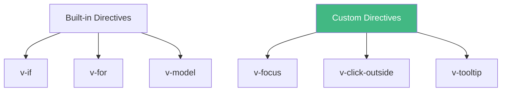
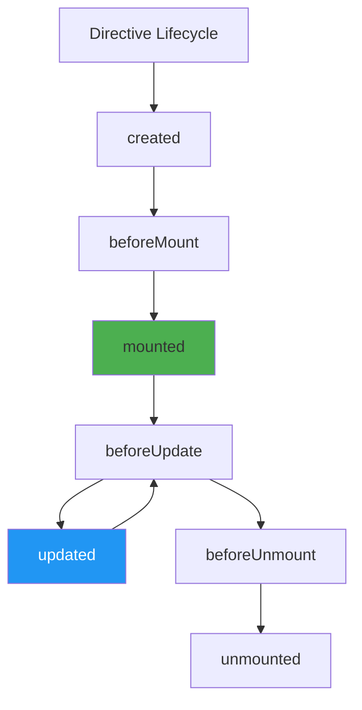
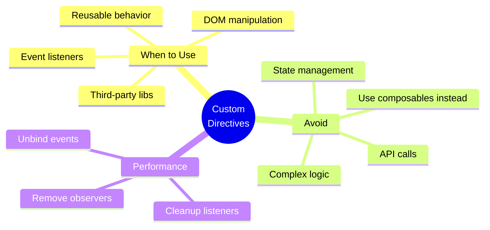

# Day 3 (Day 24): Custom Directives 🎯

**Duration:** 3-4 hours | **Difficulty:** ⭐⭐⭐ Hard

---

## 📖 Learning Objectives

- Understand custom directives
- Create reusable directives
- Use directive hooks
- Build practical directives
- Master directive arguments

---

## 🎯 What are Custom Directives?



**Custom directives = Reusable DOM manipulation logic**

---

## 📝 Basic Directive Structure

```typescript
// directives/focus.ts
import type { Directive } from 'vue'

export const vFocus: Directive = {
  mounted(el) {
    el.focus()
  }
}

// Usage in component
<template>
  <input v-focus />
</template>

<script setup lang="ts">
import { vFocus } from '@/directives/focus'
</script>
```

---

## 🔄 Directive Hooks



```typescript
const myDirective: Directive = {
  created(el, binding, vnode) {
    // Before element's attributes or event listeners are applied
  },
  
  beforeMount(el, binding, vnode) {
    // Before element is inserted into DOM
  },
  
  mounted(el, binding, vnode) {
    // Element inserted into DOM
  },
  
  beforeUpdate(el, binding, vnode, prevVnode) {
    // Before element updates
  },
  
  updated(el, binding, vnode, prevVnode) {
    // After element and children updated
  },
  
  beforeUnmount(el, binding, vnode) {
    // Before element is removed
  },
  
  unmounted(el, binding, vnode) {
    // Element removed from DOM
  }
}
```

---

## 🎨 Practical Directives

### **1. v-focus - Auto Focus**
```typescript
// directives/focus.ts
import type { Directive } from 'vue'

export const vFocus: Directive = {
  mounted(el: HTMLElement) {
    el.focus()
  }
}

// Usage
<input v-focus placeholder="Auto focused" />
```

---

### **2. v-click-outside - Detect Outside Clicks**
```typescript
// directives/clickOutside.ts
import type { Directive } from 'vue'

export const vClickOutside: Directive = {
  mounted(el: HTMLElement, binding) {
    el.clickOutsideEvent = (event: MouseEvent) => {
      if (!(el === event.target || el.contains(event.target as Node))) {
        binding.value(event)
      }
    }
    document.addEventListener('click', el.clickOutsideEvent)
  },
  
  unmounted(el: HTMLElement) {
    document.removeEventListener('click', el.clickOutsideEvent)
  }
}

// Usage
<template>
  <div v-click-outside="closeDropdown" class="dropdown">
    <button @click="isOpen = !isOpen">Toggle</button>
    <ul v-if="isOpen">
      <li>Item 1</li>
      <li>Item 2</li>
    </ul>
  </div>
</template>

<script setup lang="ts">
import { ref } from 'vue'
import { vClickOutside } from '@/directives/clickOutside'

const isOpen = ref(false)

function closeDropdown() {
  isOpen.value = false
}
</script>
```

---

### **3. v-tooltip - Hover Tooltip**
```typescript
// directives/tooltip.ts
import type { Directive } from 'vue'

export const vTooltip: Directive = {
  mounted(el: HTMLElement, binding) {
    const tooltip = document.createElement('div')
    tooltip.className = 'tooltip'
    tooltip.textContent = binding.value
    tooltip.style.cssText = `
      position: absolute;
      background: #333;
      color: white;
      padding: 0.5rem 1rem;
      border-radius: 4px;
      font-size: 0.875rem;
      white-space: nowrap;
      z-index: 10000;
      pointer-events: none;
      opacity: 0;
      transition: opacity 0.3s;
    `
    
    document.body.appendChild(tooltip)
    
    el.addEventListener('mouseenter', () => {
      const rect = el.getBoundingClientRect()
      tooltip.style.top = `${rect.bottom + 8}px`
      tooltip.style.left = `${rect.left + rect.width / 2}px`
      tooltip.style.transform = 'translateX(-50%)'
      tooltip.style.opacity = '1'
    })
    
    el.addEventListener('mouseleave', () => {
      tooltip.style.opacity = '0'
    })
    
    el._tooltip = tooltip
  },
  
  updated(el: HTMLElement, binding) {
    if (el._tooltip) {
      el._tooltip.textContent = binding.value
    }
  },
  
  unmounted(el: HTMLElement) {
    if (el._tooltip) {
      el._tooltip.remove()
    }
  }
}

// Usage
<button v-tooltip="'This is a helpful tooltip'">Hover me</button>
```

---

### **4. v-lazy - Lazy Load Images**
```typescript
// directives/lazy.ts
import type { Directive } from 'vue'

export const vLazy: Directive = {
  mounted(el: HTMLImageElement, binding) {
    const loadImage = () => {
      el.src = binding.value
    }
    
    const observer = new IntersectionObserver((entries) => {
      entries.forEach((entry) => {
        if (entry.isIntersecting) {
          loadImage()
          observer.unobserve(el)
        }
      })
    })
    
    observer.observe(el)
    el._observer = observer
  },
  
  unmounted(el: HTMLImageElement) {
    if (el._observer) {
      el._observer.disconnect()
    }
  }
}

// Usage

```

---

### **5. v-debounce - Debounce Input**
```typescript
// directives/debounce.ts
import type { Directive } from 'vue'

export const vDebounce: Directive = {
  mounted(el: HTMLInputElement, binding) {
    let timeout: number
    
    el.addEventListener('input', () => {
      clearTimeout(timeout)
      timeout = setTimeout(() => {
        binding.value(el.value)
      }, binding.arg ? parseInt(binding.arg) : 300)
    })
  }
}

// Usage
<input v-debounce:500="handleSearch" placeholder="Search..." />

<script setup lang="ts">
function handleSearch(value: string) {
  console.log('Searching for:', value)
}
</script>
```

---

## 🎯 Directive Arguments & Modifiers

```vue
<!-- Directive with argument -->
<div v-color:background="'red'"></div>

<!-- Directive with modifiers -->
<div v-scroll.lazy.debounce="handleScroll"></div>

<!-- Access in directive -->
const vColor: Directive = {
  mounted(el, binding) {
    console.log(binding.arg) // 'background'
    console.log(binding.modifiers) // { lazy: true, debounce: true }
    console.log(binding.value) // 'red'
    
    if (binding.arg === 'background') {
      el.style.background = binding.value
    }
  }
}
```

---

## 🎨 Complete Example Collection

```typescript
// directives/index.ts
import type { App } from 'vue'
import { vFocus } from './focus'
import { vClickOutside } from './clickOutside'
import { vTooltip } from './tooltip'
import { vLazy } from './lazy'
import { vDebounce } from './debounce'

export function registerDirectives(app: App) {
  app.directive('focus', vFocus)
  app.directive('click-outside', vClickOutside)
  app.directive('tooltip', vTooltip)
  app.directive('lazy', vLazy)
  app.directive('debounce', vDebounce)
}

// In main.ts
import { registerDirectives } from './directives'

const app = createApp(App)
registerDirectives(app)
```

---

## 📊 Directive Best Practices



---

## ✅ Practice Exercise

Create these custom directives:
1. **v-copy** - Copy text to clipboard on click
2. **v-scroll-spy** - Highlight nav on scroll
3. **v-resize** - Detect element resize
4. **v-drag** - Make element draggable
5. **v-ripple** - Material ripple effect
6. **v-long-press** - Detect long press

---

**Tomorrow:** Performance Optimization! ⚡
