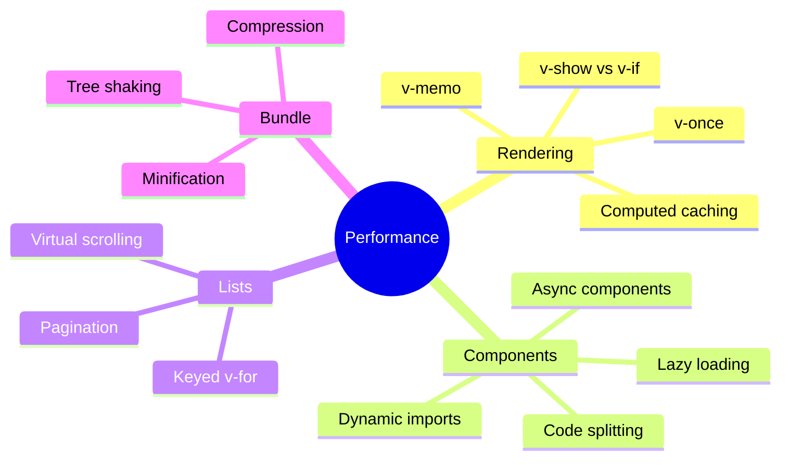
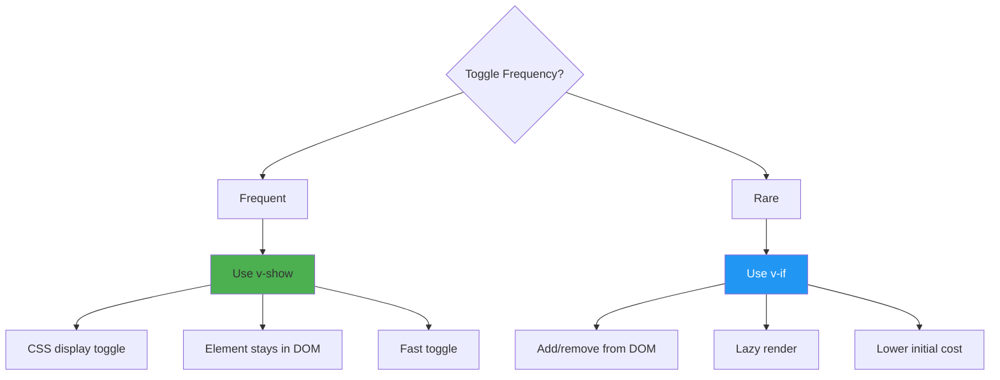
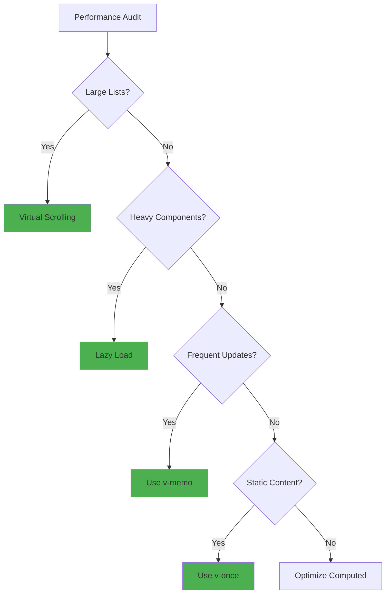

# Day 4 (Day 25): Performance Optimization ⚡

**Duration:** 3-4 hours | **Difficulty:** ⭐⭐⭐ Hard

---

## 📖 Learning Objectives

- Optimize Vue applications
- Use v-once and v-memo
- Lazy load components
- Virtual scrolling
- Bundle optimization

---

## ⚡ Performance Optimization Overview



---

## 🎯 1. v-once - Render Once

```vue
<template>
  <!-- Renders once, never updates -->
  <div v-once>
    <h1>{{ title }}</h1>
    <p>{{ staticContent }}</p>
  </div>
</template>
```

**Use when:** Content never changes after initial render

---

## 🎯 2. v-memo - Conditional Memoization

```vue
<template>
  <!-- Only re-render if selected or item changes -->
  <div
    v-for="item in list"
    :key="item.id"
    v-memo="[item === selected, item.someValue]"
  >
    {{ item.name }}
  </div>
</template>
```

**Use when:** Expensive renders with conditional updates

---

## 🎯 3. v-show vs v-if



```vue
<!-- Frequent toggling - use v-show -->
<div v-show="isVisible">Toggled frequently</div>

<!-- Rare toggling - use v-if -->
<HeavyComponent v-if="shouldLoad" />
```

---

## 🎯 4. Computed Caching

```vue
<script setup lang="ts">
import { ref, computed } from 'vue'

const items = ref([/* large array */])

// ❌ BAD: Runs on every render
const filteredItems = items.value.filter(item => item.active)

// ✅ GOOD: Cached, only runs when items change
const filteredItems = computed(() => {
  return items.value.filter(item => item.active)
})
</script>
```

---

## 🎯 5. Lazy Load Components

```typescript
// router/index.ts
const routes = [
  {
    path: '/dashboard',
    // Lazy load - code splitting
    component: () => import('@/views/DashboardView.vue')
  }
]
```

```vue
<script setup lang="ts">
import { defineAsyncComponent } from 'vue'

// Lazy load component
const HeavyComponent = defineAsyncComponent(() =>
  import('./HeavyComponent.vue')
)

// With loading and error states
const HeavyComponent = defineAsyncComponent({
  loader: () => import('./HeavyComponent.vue'),
  loadingComponent: LoadingSpinner,
  errorComponent: ErrorDisplay,
  delay: 200,
  timeout: 3000
})
</script>
```

---

## 🎯 6. Virtual Scrolling

```vue
<template>
  <div class="virtual-scroll" @scroll="onScroll" ref="container">
    <div :style="{ height: totalHeight + 'px' }">
      <div
        v-for="item in visibleItems"
        :key="item.id"
        :style="{ transform: `translateY(${item.offset}px)` }"
        class="item"
      >
        {{ item.text }}
      </div>
    </div>
  </div>
</template>

<script setup lang="ts">
import { ref, computed } from 'vue'

interface Item {
  id: number
  text: string
}

const items = ref<Item[]>(
  Array.from({ length: 10000 }, (_, i) => ({
    id: i,
    text: `Item ${i}`
  }))
)

const container = ref<HTMLElement>()
const scrollTop = ref(0)
const itemHeight = 50
const visibleCount = 20

const totalHeight = computed(() => items.value.length * itemHeight)

const visibleItems = computed(() => {
  const start = Math.floor(scrollTop.value / itemHeight)
  const end = start + visibleCount
  
  return items.value.slice(start, end).map((item, index) => ({
    ...item,
    offset: (start + index) * itemHeight
  }))
})

function onScroll(e: Event) {
  scrollTop.value = (e.target as HTMLElement).scrollTop
}
</script>

<style scoped>
.virtual-scroll {
  height: 500px;
  overflow-y: auto;
  position: relative;
}

.item {
  height: 50px;
  position: absolute;
  width: 100%;
}
</style>
```

---

## 🎯 7. Keyed v-for

```vue
<!-- ❌ BAD: No key -->
<div v-for="item in items">
  {{ item.name }}
</div>

<!-- ❌ BAD: Index as key -->
<div v-for="(item, index) in items" :key="index">
  {{ item.name }}
</div>

<!-- ✅ GOOD: Unique stable key -->
<div v-for="item in items" :key="item.id">
  {{ item.name }}
</div>
```

---

## 🎯 8. Debounce & Throttle

```vue
<script setup lang="ts">
import { ref } from 'vue'
import { useDebounceFn, useThrottleFn } from '@vueuse/core'

const searchQuery = ref('')

// Debounce - wait for user to stop typing
const debouncedSearch = useDebounceFn((value: string) => {
  console.log('Searching for:', value)
  // Make API call
}, 500)

// Throttle - limit execution rate
const throttledScroll = useThrottleFn(() => {
  console.log('Scroll position:', window.scrollY)
}, 200)
</script>

<template>
  <input
    v-model="searchQuery"
    @input="debouncedSearch(searchQuery)"
    placeholder="Search..."
  />
</template>
```

---

## 🎯 9. Bundle Optimization

```javascript
// vite.config.ts
export default defineConfig({
  build: {
    rollupOptions: {
      output: {
        manualChunks: {
          // Separate vendor chunks
          vendor: ['vue', 'vue-router', 'pinia'],
          // Separate UI library
          ui: ['@headlessui/vue', 'lucide-vue-next']
        }
      }
    },
    // Minify
    minify: 'terser',
    terserOptions: {
      compress: {
        drop_console: true // Remove console.log in production
      }
    }
  }
})
```

---

## 📊 Performance Checklist



---

## 🎯 10. Image Optimization

```vue
<template>
  <!-- Lazy load images -->
  
  
  <!-- Responsive images -->
  
</template>
```

---

## ✅ Practice Exercise

Optimize a slow application:
1. Profile with Vue DevTools
2. Implement virtual scrolling for long lists
3. Lazy load heavy components
4. Add v-memo to expensive renders
5. Optimize images
6. Split code bundles
7. Measure improvements

---

**Tomorrow:** Testing Basics! 🧪
