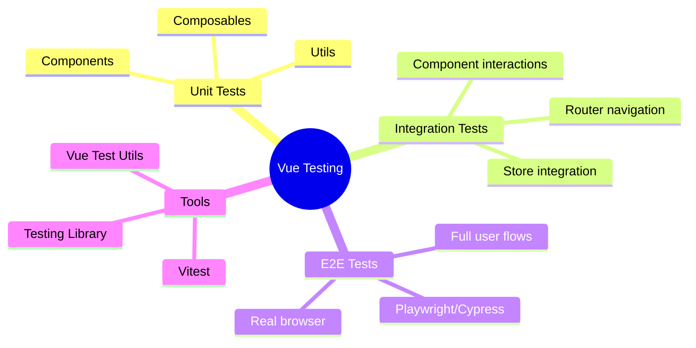
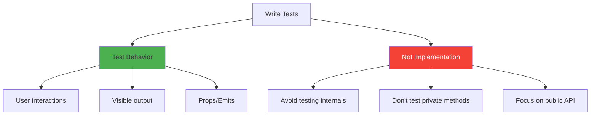

# Day 5 (Day 26): Testing Basics 🧪

**Duration:** 3-4 hours | **Difficulty:** ⭐⭐⭐ Hard

---

## 📖 Learning Objectives

- Understand Vue testing
- Write component tests
- Test user interactions
- Mock dependencies
- Test composables & stores

---

## 🧪 Testing Overview



---

## 🚀 Setup

```bash
npm install -D vitest @vue/test-utils @testing-library/vue
```

```typescript
// vitest.config.ts
import { defineConfig } from 'vitest/config'
import vue from '@vitejs/plugin-vue'

export default defineConfig({
  plugins: [vue()],
  test: {
    environment: 'jsdom',
    globals: true
  }
})
```

---

## 📝 Basic Component Test

```vue
<!-- Counter.vue -->
<template>
  <div>
    <p>Count: {{ count }}</p>
    <button @click="increment">Increment</button>
    <button @click="decrement">Decrement</button>
  </div>
</template>

<script setup lang="ts">
import { ref } from 'vue'

const count = ref(0)
const increment = () => count.value++
const decrement = () => count.value--
</script>
```

```typescript
// Counter.spec.ts
import { describe, it, expect } from 'vitest'
import { mount } from '@vue/test-utils'
import Counter from './Counter.vue'

describe('Counter', () => {
  it('renders initial count', () => {
    const wrapper = mount(Counter)
    expect(wrapper.text()).toContain('Count: 0')
  })
  
  it('increments count when button clicked', async () => {
    const wrapper = mount(Counter)
    await wrapper.find('button').trigger('click')
    expect(wrapper.text()).toContain('Count: 1')
  })
  
  it('decrements count', async () => {
    const wrapper = mount(Counter)
    const buttons = wrapper.findAll('button')
    await buttons[1].trigger('click')
    expect(wrapper.text()).toContain('Count: -1')
  })
})
```

---

## 🎯 Testing Props & Emits

```vue
<!-- UserCard.vue -->
<template>
  <div class="user-card">
    <h3>{{ user.name }}</h3>
    <p>{{ user.email }}</p>
    <button @click="$emit('delete', user.id)">Delete</button>
  </div>
</template>

<script setup lang="ts">
interface User {
  id: number
  name: string
  email: string
}

defineProps<{ user: User }>()
defineEmits<{ delete: [id: number] }>()
</script>
```

```typescript
// UserCard.spec.ts
import { mount } from '@vue/test-utils'
import UserCard from './UserCard.vue'

describe('UserCard', () => {
  const user = {
    id: 1,
    name: 'John Doe',
    email: 'john@example.com'
  }
  
  it('renders user data', () => {
    const wrapper = mount(UserCard, {
      props: { user }
    })
    
    expect(wrapper.text()).toContain('John Doe')
    expect(wrapper.text()).toContain('john@example.com')
  })
  
  it('emits delete event with user id', async () => {
    const wrapper = mount(UserCard, {
      props: { user }
    })
    
    await wrapper.find('button').trigger('click')
    
    expect(wrapper.emitted('delete')).toBeTruthy()
    expect(wrapper.emitted('delete')?.[0]).toEqual([1])
  })
})
```

---

## 🎨 Testing Composables

```typescript
// useCounter.ts
import { ref } from 'vue'

export function useCounter(initial = 0) {
  const count = ref(initial)
  
  const increment = () => count.value++
  const decrement = () => count.value--
  const reset = () => count.value = initial
  
  return { count, increment, decrement, reset }
}
```

```typescript
// useCounter.spec.ts
import { describe, it, expect } from 'vitest'
import { useCounter } from './useCounter'

describe('useCounter', () => {
  it('initializes with default value', () => {
    const { count } = useCounter()
    expect(count.value).toBe(0)
  })
  
  it('initializes with custom value', () => {
    const { count } = useCounter(10)
    expect(count.value).toBe(10)
  })
  
  it('increments count', () => {
    const { count, increment } = useCounter()
    increment()
    expect(count.value).toBe(1)
  })
  
  it('resets to initial value', () => {
    const { count, increment, reset } = useCounter(5)
    increment()
    increment()
    reset()
    expect(count.value).toBe(5)
  })
})
```

---

## 🗃️ Testing Pinia Stores

```typescript
// stores/counter.ts
import { defineStore } from 'pinia'
import { ref } from 'vue'

export const useCounterStore = defineStore('counter', () => {
  const count = ref(0)
  
  function increment() {
    count.value++
  }
  
  return { count, increment }
})
```

```typescript
// stores/counter.spec.ts
import { setActivePinia, createPinia } from 'pinia'
import { describe, beforeEach, it, expect } from 'vitest'
import { useCounterStore } from './counter'

describe('Counter Store', () => {
  beforeEach(() => {
    setActivePinia(createPinia())
  })
  
  it('initializes with count 0', () => {
    const store = useCounterStore()
    expect(store.count).toBe(0)
  })
  
  it('increments count', () => {
    const store = useCounterStore()
    store.increment()
    expect(store.count).toBe(1)
  })
})
```

---

## 🎯 Testing Async Operations

```vue
<!-- UserList.vue -->
<template>
  <div>
    <div v-if="loading">Loading...</div>
    <div v-else-if="error">{{ error }}</div>
    <ul v-else>
      <li v-for="user in users" :key="user.id">
        {{ user.name }}
      </li>
    </ul>
  </div>
</template>

<script setup lang="ts">
import { ref, onMounted } from 'vue'

const users = ref([])
const loading = ref(false)
const error = ref(null)

onMounted(async () => {
  loading.value = true
  try {
    const response = await fetch('/api/users')
    users.value = await response.json()
  } catch (e) {
    error.value = 'Failed to load users'
  } finally {
    loading.value = false
  }
})
</script>
```

```typescript
// UserList.spec.ts
import { mount } from '@vue/test-utils'
import { vi } from 'vitest'
import UserList from './UserList.vue'

describe('UserList', () => {
  it('shows loading state', () => {
    const wrapper = mount(UserList)
    expect(wrapper.text()).toContain('Loading...')
  })
  
  it('displays users after loading', async () => {
    global.fetch = vi.fn(() =>
      Promise.resolve({
        json: () => Promise.resolve([
          { id: 1, name: 'Alice' },
          { id: 2, name: 'Bob' }
        ])
      })
    ) as any
    
    const wrapper = mount(UserList)
    
    // Wait for async operations
    await wrapper.vm.$nextTick()
    await new Promise(resolve => setTimeout(resolve, 0))
    
    expect(wrapper.text()).toContain('Alice')
    expect(wrapper.text()).toContain('Bob')
  })
  
  it('shows error on fetch failure', async () => {
    global.fetch = vi.fn(() =>
      Promise.reject(new Error('Network error'))
    )
    
    const wrapper = mount(UserList)
    await wrapper.vm.$nextTick()
    await new Promise(resolve => setTimeout(resolve, 0))
    
    expect(wrapper.text()).toContain('Failed to load users')
  })
})
```

---

## 🎨 Testing with Vue Router

```typescript
import { mount } from '@vue/test-utils'
import { createRouter, createMemoryHistory } from 'vue-router'
import App from './App.vue'

describe('App with Router', () => {
  it('navigates to about page', async () => {
    const router = createRouter({
      history: createMemoryHistory(),
      routes: [
        { path: '/', component: { template: '<div>Home</div>' } },
        { path: '/about', component: { template: '<div>About</div>' } }
      ]
    })
    
    const wrapper = mount(App, {
      global: {
        plugins: [router]
      }
    })
    
    await router.push('/about')
    await router.isReady()
    
    expect(wrapper.text()).toContain('About')
  })
})
```

---

## ✅ Testing Best Practices



---

## ✅ Practice Exercise

Write tests for:
1. Todo component (add, toggle, delete)
2. Login form (validation, submission)
3. useAuth composable
4. Products store
5. Async data fetching
6. Router navigation
7. Form validation

---

**Tomorrow:** Advanced Patterns! 🎨
