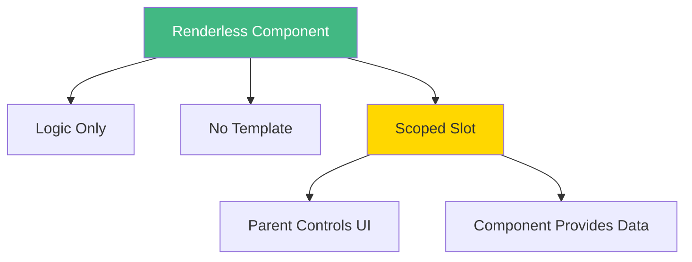

# Day 6 (Day 27): Advanced Patterns 🎨

**Duration:** 2-3 hours | **Difficulty:** ⭐⭐ Medium

---

## 📖 Learning Objectives

- Master renderless components
- Use scoped slots effectively
- Implement compound components
- Create HOCs (Higher-Order Components)
- Build headless UI patterns

---

## 🎯 Renderless Components



**Renderless = Logic without UI**

---

## 📝 Example: Mouse Tracker

```vue
<!-- Mouse.vue - Renderless Component -->
<template>
  <slot :x="x" :y="y" />
</template>

<script setup lang="ts">
import { ref, onMounted, onUnmounted } from 'vue'

const x = ref(0)
const y = ref(0)

function update(e: MouseEvent) {
  x.value = e.clientX
  y.value = e.clientY
}

onMounted(() => {
  window.addEventListener('mousemove', update)
})

onUnmounted(() => {
  window.removeEventListener('mousemove', update)
})
</script>
```

**Usage:**
```vue
<template>
  <Mouse v-slot="{ x, y }">
    <p>Mouse position: {{ x }}, {{ y }}</p>
  </Mouse>
  
  <Mouse v-slot="{ x, y }">
    <div :style="{ transform: `translate(${x}px, ${y}px)` }">
      Follows mouse
    </div>
  </Mouse>
</template>
```

---

## 🎨 Compound Components

```vue
<!-- Tabs.vue - Parent -->
<template>
  <div class="tabs">
    <div class="tab-list">
      <slot name="tabs" :active-tab="activeTab" :select-tab="selectTab" />
    </div>
    <div class="tab-panels">
      <slot name="panels" :active-tab="activeTab" />
    </div>
  </div>
</template>

<script setup lang="ts">
import { ref, provide } from 'vue'

const activeTab = ref(0)

function selectTab(index: number) {
  activeTab.value = index
}

provide('activeTab', activeTab)
provide('selectTab', selectTab)
</script>
```

```vue
<!-- TabButton.vue - Child -->
<template>
  <button
    @click="select"
    :class="{ active: isActive }"
    class="tab-button"
  >
    <slot />
  </button>
</template>

<script setup lang="ts">
import { inject, computed } from 'vue'

const props = defineProps<{ index: number }>()

const activeTab = inject<Ref<number>>('activeTab')!
const selectTab = inject<(index: number) => void>('selectTab')!

const isActive = computed(() => activeTab.value === props.index)

function select() {
  selectTab(props.index)
}
</script>
```

**Usage:**
```vue
<template>
  <Tabs>
    <template #tabs="{ activeTab, selectTab }">
      <TabButton :index="0">Tab 1</TabButton>
      <TabButton :index="1">Tab 2</TabButton>
      <TabButton :index="2">Tab 3</TabButton>
    </template>
    
    <template #panels="{ activeTab }">
      <div v-if="activeTab === 0">Panel 1</div>
      <div v-if="activeTab === 1">Panel 2</div>
      <div v-if="activeTab === 2">Panel 3</div>
    </template>
  </Tabs>
</template>
```

---

## 🎯 Headless UI Pattern

```vue
<!-- Dropdown.vue - Headless -->
<template>
  <slot
    :is-open="isOpen"
    :toggle="toggle"
    :close="close"
    :open="open"
  />
</template>

<script setup lang="ts">
import { ref } from 'vue'

const isOpen = ref(false)

function toggle() {
  isOpen.value = !isOpen.value
}

function open() {
  isOpen.value = true
}

function close() {
  isOpen.value = false
}
</script>
```

**Usage with custom UI:**
```vue
<template>
  <Dropdown v-slot="{ isOpen, toggle, close }">
    <div class="dropdown">
      <button @click="toggle">Menu</button>
      
      <div v-if="isOpen" class="dropdown-menu">
        <a href="#" @click="close">Item 1</a>
        <a href="#" @click="close">Item 2</a>
        <a href="#" @click="close">Item 3</a>
      </div>
    </div>
  </Dropdown>
</template>
```

---

## 🎯 Toggle Component Pattern

```vue
<!-- Toggle.vue -->
<template>
  <slot
    :is-on="isOn"
    :toggle="toggle"
    :set-on="setOn"
    :set-off="setOff"
  />
</template>

<script setup lang="ts">
import { ref } from 'vue'

const props = withDefaults(
  defineProps<{ initialValue?: boolean }>(),
  { initialValue: false }
)

const isOn = ref(props.initialValue)

function toggle() {
  isOn.value = !isOn.value
}

function setOn() {
  isOn.value = true
}

function setOff() {
  isOn.value = false
}
</script>
```

**Usage:**
```vue
<Toggle v-slot="{ isOn, toggle }">
  <button @click="toggle">
    {{ isOn ? 'ON' : 'OFF' }}
  </button>
</Toggle>

<Toggle v-slot="{ isOn, toggle }">
  <div class="switch" :class="{ active: isOn }" @click="toggle">
    <div class="thumb" />
  </div>
</Toggle>
```

---

## 🎯 Form Field Pattern

```vue
<!-- FormField.vue -->
<template>
  <div class="form-field">
    <label v-if="label" :for="id">{{ label }}</label>
    
    <slot
      :id="id"
      :value="modelValue"
      :update="update"
      :error="error"
      :is-valid="isValid"
    />
    
    <span v-if="error" class="error">{{ error }}</span>
  </div>
</template>

<script setup lang="ts">
import { computed } from 'vue'

const props = defineProps<{
  id: string
  label?: string
  modelValue: string
  rules?: Array<(value: string) => string | boolean>
}>()

const emit = defineEmits<{
  'update:modelValue': [value: string]
}>()

function update(value: string) {
  emit('update:modelValue', value)
}

const error = computed(() => {
  if (!props.rules) return null
  
  for (const rule of props.rules) {
    const result = rule(props.modelValue)
    if (typeof result === 'string') return result
  }
  
  return null
})

const isValid = computed(() => !error.value)
</script>
```

**Usage:**
```vue
<template>
  <FormField
    id="email"
    label="Email"
    v-model="email"
    :rules="[required, isEmail]"
    v-slot="{ id, value, update, error, isValid }"
  >
    <input
      :id="id"
      :value="value"
      @input="update($event.target.value)"
      :class="{ error, valid: isValid }"
      type="email"
    />
  </FormField>
</template>

<script setup lang="ts">
import { ref } from 'vue'

const email = ref('')

const required = (value: string) => {
  return value ? true : 'This field is required'
}

const isEmail = (value: string) => {
  return /\S+@\S+\.\S+/.test(value) ? true : 'Invalid email'
}
</script>
```

---

## 🎯 Infinite Scroll Pattern

```vue
<!-- InfiniteScroll.vue -->
<template>
  <div ref="container">
    <slot :items="items" :loading="loading" />
    <div ref="sentinel" />
  </div>
</template>

<script setup lang="ts">
import { ref, onMounted, onUnmounted } from 'vue'

const props = defineProps<{
  loadMore: () => Promise<any[]>
}>()

const container = ref<HTMLElement>()
const sentinel = ref<HTMLElement>()
const items = ref<any[]>([])
const loading = ref(false)

let observer: IntersectionObserver

async function load() {
  if (loading.value) return
  
  loading.value = true
  try {
    const newItems = await props.loadMore()
    items.value.push(...newItems)
  } finally {
    loading.value = false
  }
}

onMounted(() => {
  observer = new IntersectionObserver((entries) => {
    if (entries[0].isIntersecting) {
      load()
    }
  })
  
  if (sentinel.value) {
    observer.observe(sentinel.value)
  }
})

onUnmounted(() => {
  observer?.disconnect()
})
</script>
```

---

## ✅ Practice Exercise

Build these patterns:
1. **Renderless pagination** - Logic only
2. **Headless modal** - Custom UI
3. **Toggle switch** - Multiple styles
4. **Form builder** - Compound components
5. **Data table** - With sorting/filtering
6. **Accordion** - Compound pattern

---

**Tomorrow:** Final Project! 🎉
