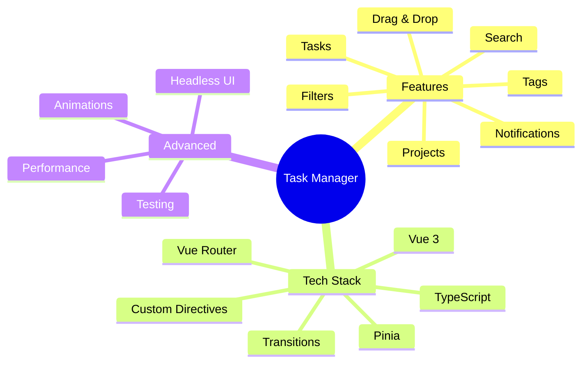
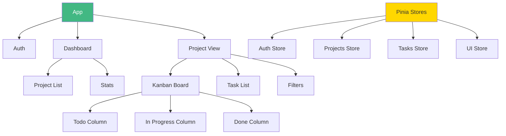
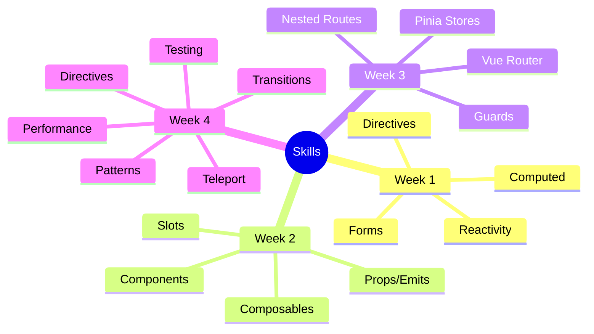

# Day 7 (Day 28): Final Project - Task Management App 📋

**Duration:** 6-8 hours | **Difficulty:** ⭐⭐⭐ Project

---

## 🎯 Project Overview

Build a complete **Task Management Application** using ALL concepts from Weeks 1-4!



---

## 📋 Requirements

### **Must Have:**
1. ✅ Multiple projects/boards
2. ✅ Create/edit/delete tasks
3. ✅ Task statuses (Todo, In Progress, Done)
4. ✅ Drag & drop tasks
5. ✅ Task priorities & tags
6. ✅ Search & filter
7. ✅ User authentication
8. ✅ Persistent storage
9. ✅ Responsive design
10. ✅ Smooth animations

---

## 🏗️ Architecture



---

## 📊 Data Structures

```typescript
interface User {
  id: string
  name: string
  email: string
  avatar?: string
}

interface Project {
  id: string
  name: string
  description: string
  color: string
  createdAt: Date
  userId: string
}

interface Task {
  id: string
  title: string
  description: string
  projectId: string
  status: 'todo' | 'in-progress' | 'done'
  priority: 'low' | 'medium' | 'high'
  tags: string[]
  dueDate?: Date
  createdAt: Date
  updatedAt: Date
}

interface Tag {
  id: string
  name: string
  color: string
}
```

---

## 🗺️ Routes

```typescript
const routes = [
  { path: '/', redirect: '/dashboard' },
  { path: '/login', component: LoginView, meta: { guest: true } },
  {
    path: '/dashboard',
    component: DashboardLayout,
    meta: { requiresAuth: true },
    children: [
      { path: '', component: DashboardHome },
      { path: 'projects', component: ProjectsList },
      { path: 'projects/:id', component: ProjectView }
    ]
  }
]
```

---

## 🗃️ Required Stores

### **1. Auth Store**
```typescript
export const useAuthStore = defineStore('auth', () => {
  const user = ref<User | null>(null)
  const isAuthenticated = computed(() => !!user.value)
  
  async function login(email: string, password: string) {
    // Implementation
  }
  
  function logout() {
    // Implementation
  }
  
  return { user, isAuthenticated, login, logout }
})
```

### **2. Projects Store**
```typescript
export const useProjectsStore = defineStore('projects', () => {
  const projects = ref<Project[]>([])
  const currentProject = ref<Project | null>(null)
  
  function createProject(project: Omit<Project, 'id'>) {
    // Implementation
  }
  
  function updateProject(id: string, updates: Partial<Project>) {
    // Implementation
  }
  
  function deleteProject(id: string) {
    // Implementation
  }
  
  return { projects, currentProject, createProject, updateProject, deleteProject }
})
```

### **3. Tasks Store**
```typescript
export const useTasksStore = defineStore('tasks', () => {
  const tasks = ref<Task[]>([])
  
  const tasksByStatus = computed(() => {
    return {
      todo: tasks.value.filter(t => t.status === 'todo'),
      'in-progress': tasks.value.filter(t => t.status === 'in-progress'),
      done: tasks.value.filter(t => t.status === 'done')
    }
  })
  
  function createTask(task: Omit<Task, 'id'>) {
    // Implementation
  }
  
  function updateTask(id: string, updates: Partial<Task>) {
    // Implementation
  }
  
  function moveTask(taskId: string, newStatus: Task['status']) {
    // Implementation
  }
  
  return { tasks, tasksByStatus, createTask, updateTask, moveTask }
})
```

---

## 🎨 Key Components

### **KanbanBoard.vue**
- Three columns (Todo, In Progress, Done)
- Drag & drop between columns
- Smooth animations
- Virtual scrolling for large lists

### **TaskCard.vue**
- Task details display
- Priority indicator
- Tags
- Due date
- Quick actions

### **TaskModal.vue**
- Create/edit task
- Form validation
- Rich text editor
- Tag selection

### **ProjectCard.vue**
- Project overview
- Task count
- Progress bar
- Quick actions

---

## 🎯 Features to Implement

### **Phase 1: Core (4 hours)**
1. Authentication system
2. Project CRUD
3. Task CRUD
4. Basic routing

### **Phase 2: Advanced (3 hours)**
5. Drag & drop
6. Filters & search
7. Tags system
8. Animations

### **Phase 3: Polish (1 hour)**
9. Notifications
10. Dark mode
11. Keyboard shortcuts
12. Performance optimization

---

## 🎨 UI/UX Features

### **Transitions:**
- Page transitions
- Modal animations
- List animations
- Drag feedback

### **Custom Directives:**
- `v-focus` - Auto focus inputs
- `v-click-outside` - Close dropdowns
- `v-tooltip` - Helpful tooltips
- `v-lazy` - Lazy load images

### **Performance:**
- Virtual scrolling for long lists
- Lazy load routes
- Debounced search
- Memoized computed

---

## 🎯 Bonus Features

1. **Subtasks** - Nested tasks
2. **Comments** - Task discussions
3. **Attachments** - File uploads
4. **Activity Log** - Track changes
5. **Notifications** - Real-time updates
6. **Collaboration** - Share projects
7. **Export** - Download as JSON/CSV
8. **Templates** - Project templates
9. **Calendar View** - Timeline view
10. **Dark Mode** - Theme toggle

---

## ✅ Testing Requirements

Write tests for:
- [ ] Auth flow
- [ ] Task CRUD operations
- [ ] Drag & drop
- [ ] Search & filters
- [ ] Composables
- [ ] Store actions
- [ ] Router navigation

---

## 📁 File Structure

```
src/
├── views/
│   ├── LoginView.vue
│   ├── DashboardHome.vue
│   ├── ProjectsList.vue
│   └── ProjectView.vue
├── components/
│   ├── KanbanBoard.vue
│   ├── TaskCard.vue
│   ├── TaskModal.vue
│   ├── ProjectCard.vue
│   ├── TaskList.vue
│   └── FilterBar.vue
├── stores/
│   ├── auth.ts
│   ├── projects.ts
│   ├── tasks.ts
│   └── ui.ts
├── composables/
│   ├── useDragDrop.ts
│   ├── useFilters.ts
│   └── useNotifications.ts
├── directives/
│   ├── focus.ts
│   ├── clickOutside.ts
│   └── tooltip.ts
└── router/
    └── index.ts
```

---

## 🎓 What You'll Demonstrate



---

## ✅ Implementation Checklist

**Setup:**
- [ ] Initialize project
- [ ] Setup Pinia & Router
- [ ] Create folder structure
- [ ] Setup Tailwind/styles

**Authentication:**
- [ ] Login page
- [ ] Auth store
- [ ] Route guards
- [ ] Session persistence

**Projects:**
- [ ] Project list
- [ ] Create project
- [ ] Edit/delete project
- [ ] Project view

**Tasks:**
- [ ] Task list
- [ ] Kanban board
- [ ] Create task
- [ ] Edit/delete task
- [ ] Drag & drop

**Features:**
- [ ] Search tasks
- [ ] Filter by status/priority
- [ ] Tags system
- [ ] Due dates

**Polish:**
- [ ] Animations
- [ ] Notifications
- [ ] Dark mode
- [ ] Responsive design

**Testing:**
- [ ] Component tests
- [ ] Store tests
- [ ] E2E tests

---

## 🎉 Completion Criteria

Your app should:
- ✅ Have clean, organized code
- ✅ Follow Vue best practices
- ✅ Be fully functional
- ✅ Have smooth animations
- ✅ Be responsive
- ✅ Have test coverage
- ✅ Use TypeScript
- ✅ Be production-ready

---

**Congratulations on completing the Vue Learning Path!** 🎉

**You've mastered:**
- Vue 3 Fundamentals
- Component Architecture
- State Management (Pinia)
- Routing (Vue Router)
- Advanced Patterns
- Performance & Testing

**Next Steps:**
- Build more projects
- Explore Nuxt.js
- Learn SSR/SSG
- Contribute to open source

**You're now a Vue Expert!** 🚀
