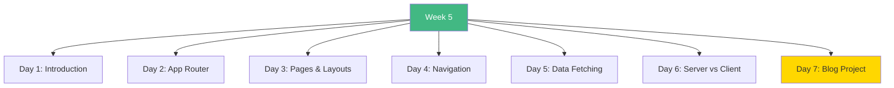

# Week 5: Next.js Fundamentals - Index 📑

**Your complete Week 5 learning guide**

---

## 🗂️ Week Structure

---

## 📅 Daily Breakdown

### **Day 1 (Day 29): Next.js Introduction** ⭐⭐
- 📖 [`day1/README.md`](day1/README.md)
- Next.js overview
- Project setup
- File structure
- Fast Refresh

**Topics:** Framework intro, setup, configuration

---

### **Day 2 (Day 30): App Router Basics** ⭐⭐⭐
- 📖 [`day2/README.md`](day2/README.md)
- File-based routing
- Dynamic routes
- Route groups
- Parallel & intercepting routes

**Topics:** Routing patterns, dynamic segments, advanced routing

---

### **Day 3 (Day 31): Pages & Layouts** ⭐⭐⭐
- 📖 [`day3/README.md`](day3/README.md)
- Layout hierarchy
- Nested layouts
- Templates
- Loading & error states

**Topics:** Page structure, layouts, UI states

---

### **Day 4 (Day 32): Navigation & Links** ⭐⭐
- 📖 [`day4/README.md`](day4/README.md)
- Link component
- useRouter hook
- Active links
- Programmatic navigation

**Topics:** Navigation patterns, routing hooks

---

### **Day 5 (Day 33): Data Fetching** ⭐⭐⭐
- 📖 [`day5/README.md`](day5/README.md)
- Server Components data fetching
- Caching strategies
- Parallel fetching
- Revalidation

**Topics:** Data loading, caching, optimization

---

### **Day 6 (Day 34): Server vs Client Components** ⭐⭐⭐
- 📖 [`day6/README.md`](day6/README.md)
- Server Components
- Client Components
- Composition patterns
- Best practices

**Topics:** Component types, when to use each, optimization

---

### **Day 7 (Day 35): Blog Platform Project** 🎯
- 📖 [`day7/README.md`](day7/README.md)
- Complete blog application
- All Week 5 concepts
- Production-ready patterns

**Build:** Full-featured blog platform

---

## 🎯 Learning Checklist

**Setup & Basics:**
- [ ] Day 1 Complete
- [ ] Create Next.js app
- [ ] Understand structure
- [ ] Configure project

**Routing:**
- [ ] Day 2 Complete
- [ ] File-based routes
- [ ] Dynamic routes
- [ ] Advanced patterns

**UI Structure:**
- [ ] Day 3 Complete
- [ ] Create layouts
- [ ] Handle loading
- [ ] Error boundaries

**Navigation:**
- [ ] Day 4 Complete
- [ ] Use Link component
- [ ] useRouter hook
- [ ] Active states

**Data:**
- [ ] Day 5 Complete
- [ ] Fetch data
- [ ] Implement caching
- [ ] Optimize loading

**Components:**
- [ ] Day 6 Complete
- [ ] Server Components
- [ ] Client Components
- [ ] Composition

**Project:**
- [ ] Day 7 Complete
- [ ] Blog platform built
- [ ] All concepts applied
- [ ] Production ready

---

## 💻 Code Statistics

**Week 5 Totals:**
- 📖 **10 README files**
- 💻 **20+ component examples**
- 📊 **60+ Mermaid diagrams**
- 🎯 **1 complete blog project**

---

## 🚀 Quick Navigation

| Day | Topic | Difficulty | Focus |
|-----|-------|------------|-------|
| 1 | Introduction | ⭐⭐ | Setup |
| 2 | App Router | ⭐⭐⭐ | Routing |
| 3 | Pages & Layouts | ⭐⭐⭐ | Structure |
| 4 | Navigation | ⭐⭐ | Links |
| 5 | Data Fetching | ⭐⭐⭐ | Data |
| 6 | Server vs Client | ⭐⭐⭐ | Components |
| 7 | Project | 🎯 | Integration |

---

## 💡 Key Takeaways

> **"Next.js combines React with powerful server-side features."**

> **"Server Components by default = Better performance."**

> **"File-based routing makes navigation intuitive."**

---

**Continue to:** [`WEEK5_SUMMARY.md`](WEEK5_SUMMARY.md)

**Next Week:** [`../week6/README.md`](../week6/README.md)

**Keep building!** 🚀
