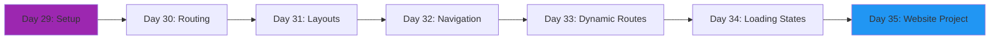
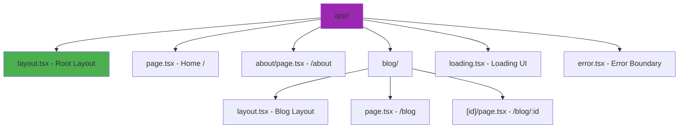
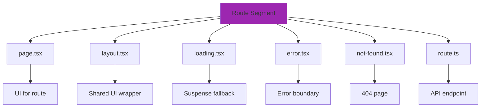

# Week 5: Next.js Fundamentals ⚡

**Focus:** Getting started with Next.js 14 and the App Router

---

## 📊 Weekly Flow

---

## 📚 Daily Topics

| Day | Topic | Key Concepts |
|-----|-------|--------------|
| **Day 29** | Next.js Setup | create-next-app, project structure, App Router |
| **Day 30** | File-based Routing | page.tsx, nested routes, route groups |
| **Day 31** | Layouts & Templates | layout.tsx, template.tsx, root layout |
| **Day 32** | Navigation & Links | Link component, useRouter, usePathname |
| **Day 33** | Static & Dynamic Routes | [id], [...slug], [[...slug]] |
| **Day 34** | Loading & Error States | loading.tsx, error.tsx, not-found.tsx |
| **Day 35** | **Project: Marketing Website** | Multi-page site with layouts |

---

## 🗂️ Next.js App Router Structure

---

## 🔄 Route File Conventions

---

## 📂 Week Project: Marketing Site

Build a professional website with:

- Home page with hero section
- About page
- Services page with cards
- Blog listing + individual post pages
- Contact form
- Shared header/footer layouts
- Loading states and error handling

---

**Start Day 29!** 🚀
