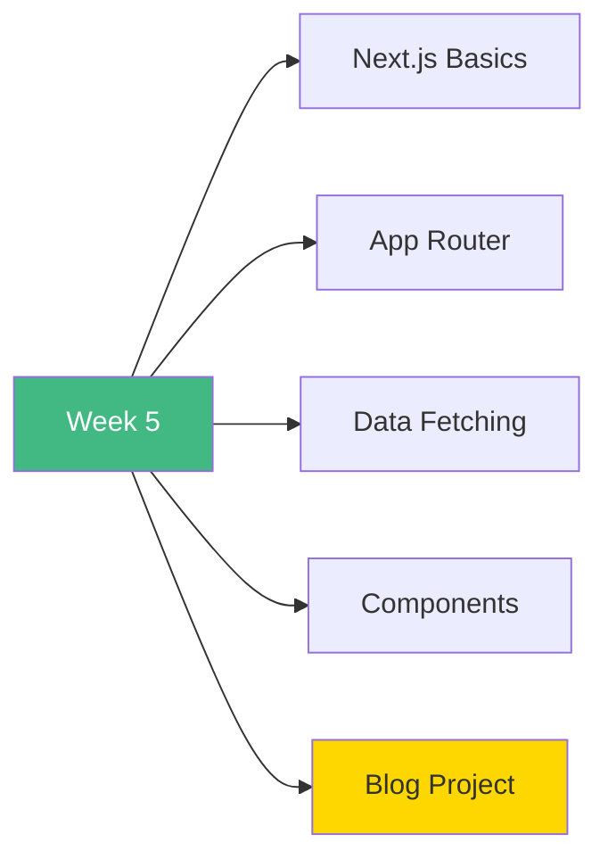

# 🚀 Week 5: Start Here

**Welcome to Week 5 - Next.js Fundamentals!**

---

## 📚 What You'll Learn This Week

---

## 📅 7-Day Plan

| Day | Topic | Time | Difficulty |
|-----|-------|------|------------|
| **Day 1** | Next.js Introduction | 3-4h | ⭐⭐ |
| **Day 2** | App Router Basics | 3-4h | ⭐⭐⭐ |
| **Day 3** | Pages & Layouts | 3-4h | ⭐⭐⭐ |
| **Day 4** | Navigation & Links | 2-3h | ⭐⭐ |
| **Day 5** | Data Fetching | 3-4h | ⭐⭐⭐ |
| **Day 6** | Server vs Client | 3-4h | ⭐⭐⭐ |
| **Day 7** | Blog Platform | 6-8h | 🎯 |

**Total:** 23-30 hours

---

## 🎯 Learning Path

### **Start Here:**

1. Read [`INDEX.md`](INDEX.md)
2. Begin with [`day1/README.md`](day1/README.md)
3. Work through each day
4. Build blog platform on Day 7

---

## 🎓 Learning Outcomes

By the end of Week 5, you will:

✅ Understand Next.js framework  
✅ Master App Router  
✅ Create dynamic routes  
✅ Fetch and cache data  
✅ Use Server & Client Components  
✅ Build navigation systems  
✅ Create production apps  

---

## 🚦 Prerequisites

- ✅ Vue fundamentals (Weeks 1-4)
- ✅ React basics helpful
- ✅ TypeScript knowledge
- ✅ Node.js installed

---

## 💡 Pro Tips

> 💡 **Tip 1:** Next.js builds on React - concepts transfer!
>
> 💡 **Tip 2:** Server Components are the default - embrace them!
>
> 💡 **Tip 3:** File-based routing is intuitive once you get it
>
> 💡 **Tip 4:** Start server, add client only when needed
>
> 💡 **Tip 5:** The blog project ties everything together!

---

## ✅ Success Checklist

- [ ] Setup Next.js project
- [ ] Create file-based routes
- [ ] Build layouts & pages
- [ ] Implement navigation
- [ ] Fetch & cache data
- [ ] Use Server & Client Components
- [ ] Complete blog platform

---

## 🎉 Ready to Begin?

**Start your journey:** [`day1/README.md`](day1/README.md)

**Or review the plan:** [`INDEX.md`](INDEX.md)

---

**Let's master Next.js!** 🚀
