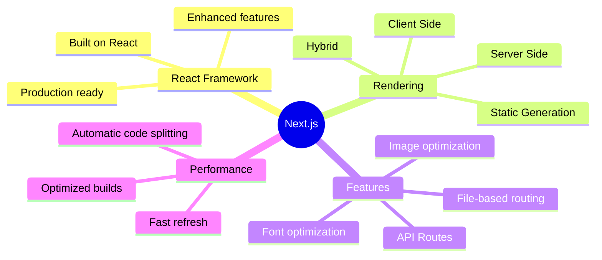
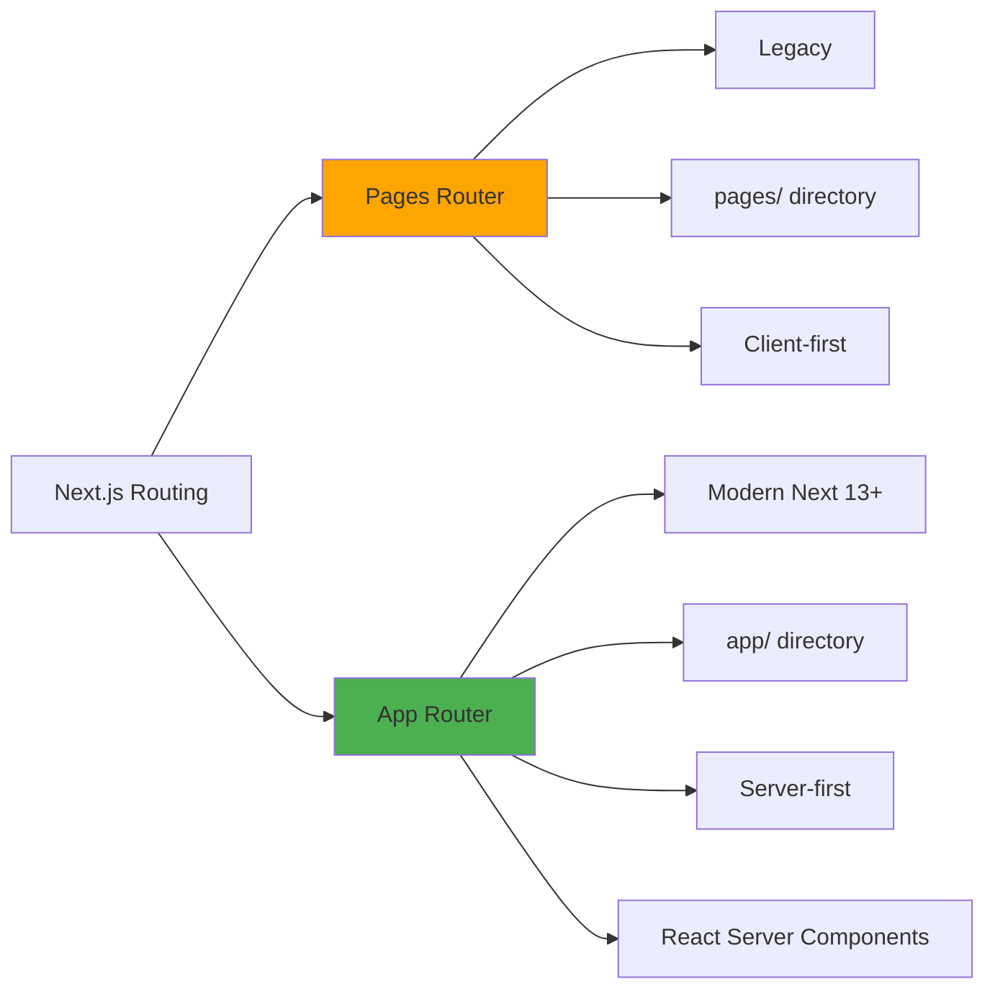
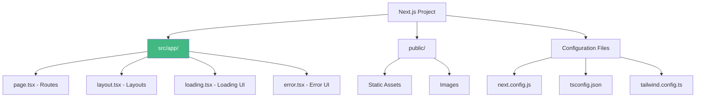
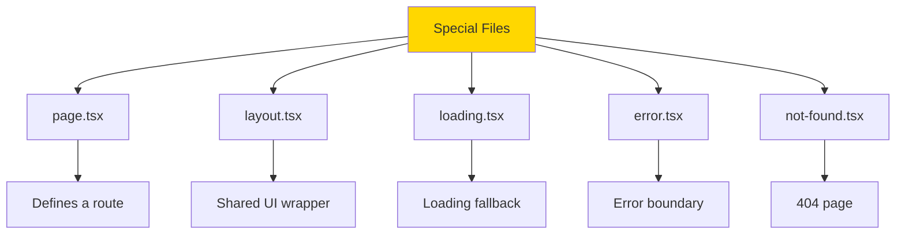
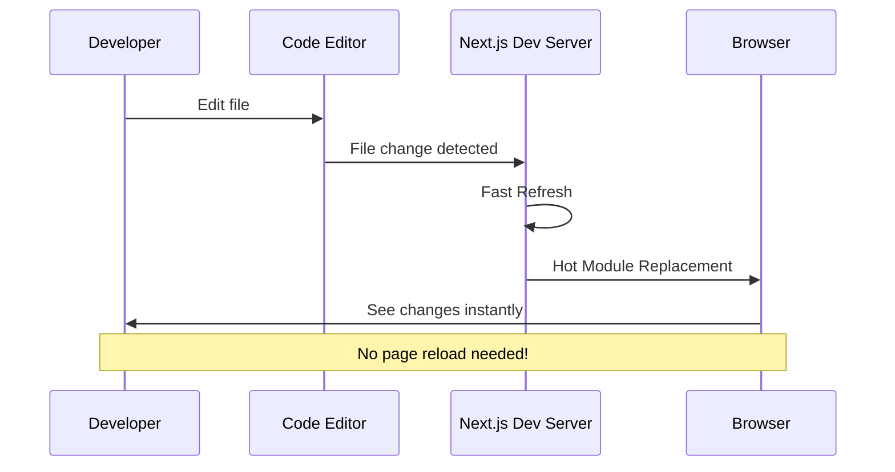

# Day 1 (Day 29): Next.js Introduction & Setup 🚀

**Duration:** 3-4 hours | **Difficulty:** ⭐⭐ Medium

---

## 📖 Learning Objectives

- Understand Next.js framework
- Learn App Router vs Pages Router
- Setup Next.js 14+ project
- Understand project structure
- Create first application

---

## 🎯 What is Next.js?



**Next.js = React + Server-Side Rendering + File-based Routing + More!**

---

## 🆚 App Router vs Pages Router



**We'll use App Router (Next.js 14+)** - The modern approach!

---

## 🚀 Creating Your First Next.js App

```bash
# Create new Next.js app
npx create-next-app@latest my-next-app

# Navigate to project
cd my-next-app

# Start development server
npm run dev
```

### **Setup Options:**
```
✔ Would you like to use TypeScript? … Yes
✔ Would you like to use ESLint? … Yes
✔ Would you like to use Tailwind CSS? … Yes
✔ Would you like to use `src/` directory? … Yes
✔ Would you like to use App Router? … Yes
✔ Would you like to customize the default import alias? … No
```

---

## 📁 Project Structure



### **Key Files:**

```
my-next-app/
├── src/
│   └── app/
│       ├── layout.tsx      ← Root layout
│       ├── page.tsx        ← Home page
│       └── globals.css     ← Global styles
├── public/
│   └── (static assets)
├── next.config.js          ← Next.js config
├── package.json
├── tsconfig.json
└── tailwind.config.ts
```

---

## 🎨 Understanding File Conventions



---

## 💻 Root Layout (Required)

```tsx
// src/app/layout.tsx
import type { Metadata } from 'next'
import { Inter } from 'next/font/google'
import './globals.css'

const inter = Inter({ subsets: ['latin'] })

export const metadata: Metadata = {
  title: 'My Next.js App',
  description: 'Learning Next.js 14',
}

export default function RootLayout({
  children,
}: {
  children: React.ReactNode
}) {
  return (
    <html lang="en">
      <body className={inter.className}>
        <header className="bg-gray-800 text-white p-4">
          <h1 className="text-2xl font-bold">My App</h1>
        </header>
        <main className="container mx-auto p-4">
          {children}
        </main>
        <footer className="bg-gray-800 text-white p-4 mt-8 text-center">
          <p>&copy; 2024 My App</p>
        </footer>
      </body>
    </html>
  )
}
```

---

## 🏠 Home Page

```tsx
// src/app/page.tsx
export default function Home() {
  return (
    <div className="space-y-6">
      <h1 className="text-4xl font-bold">
        Welcome to Next.js! 🚀
      </h1>
      
      <p className="text-xl text-gray-600">
        This is your first Next.js application using the App Router.
      </p>
      
      <div className="grid grid-cols-1 md:grid-cols-3 gap-4">
        <div className="border rounded-lg p-6 hover:shadow-lg transition">
          <h2 className="text-2xl font-semibold mb-2">Fast Refresh ⚡</h2>
          <p>Edit and see changes instantly</p>
        </div>
        
        <div className="border rounded-lg p-6 hover:shadow-lg transition">
          <h2 className="text-2xl font-semibold mb-2">File-based Routing 📁</h2>
          <p>Create routes by adding files</p>
        </div>
        
        <div className="border rounded-lg p-6 hover:shadow-lg transition">
          <h2 className="text-2xl font-semibold mb-2">Server Components 🖥️</h2>
          <p>React Server Components by default</p>
        </div>
      </div>
    </div>
  )
}
```

---

## 🎨 Styling with Tailwind

```css
/* src/app/globals.css */
@tailwind base;
@tailwind components;
@tailwind utilities;

@layer base {
  body {
    @apply bg-gray-50 text-gray-900;
  }
}

@layer components {
  .btn {
    @apply px-4 py-2 rounded-lg font-semibold transition;
  }
  
  .btn-primary {
    @apply bg-blue-600 text-white hover:bg-blue-700;
  }
}
```

---

## 🔧 Configuration

### **next.config.js**
```javascript
/** @type {import('next').NextConfig} */
const nextConfig = {
  // Enable React strict mode
  reactStrictMode: true,
  
  // Image domains
  images: {
    domains: ['images.unsplash.com', 'via.placeholder.com'],
  },
}

module.exports = nextConfig
```

### **tsconfig.json** (Auto-generated)
```json
{
  "compilerOptions": {
    "target": "ES2017",
    "lib": ["dom", "dom.iterable", "esnext"],
    "allowJs": true,
    "skipLibCheck": true,
    "strict": true,
    "noEmit": true,
    "esModuleInterop": true,
    "module": "esnext",
    "moduleResolution": "bundler",
    "resolveJsonModule": true,
    "isolatedModules": true,
    "jsx": "preserve",
    "incremental": true,
    "plugins": [
      {
        "name": "next"
      }
    ],
    "paths": {
      "@/*": ["./src/*"]
    }
  },
  "include": ["next-env.d.ts", "**/*.ts", "**/*.tsx", ".next/types/**/*.ts"],
  "exclude": ["node_modules"]
}
```

---

## 📊 Development Workflow



---

## ⚡ Fast Refresh

**What is Fast Refresh?**
- Instant feedback when editing React components
- Preserves component state
- Only updates what changed
- Automatic in Next.js!

```tsx
// Try editing this component
export default function Counter() {
  const [count, setCount] = useState(0)
  
  return (
    <div>
      <p>Count: {count}</p>
      <button onClick={() => setCount(count + 1)}>
        Increment
      </button>
    </div>
  )
}

// Edit the button text - state is preserved!
```

---

## 🎯 Key Concepts

### **1. Server Components (Default)**
```tsx
// This runs on the SERVER by default
export default function ServerComponent() {
  const data = await fetchData() // Can use async/await!
  return <div>{data}</div>
}
```

### **2. Client Components**
```tsx
'use client' // Opt-in to client rendering

import { useState } from 'react'

export default function ClientComponent() {
  const [count, setCount] = useState(0)
  return <button onClick={() => setCount(count + 1)}>{count}</button>
}
```

---

## 🚀 Running Your App

```bash
# Development mode (with Fast Refresh)
npm run dev

# Production build
npm run build

# Start production server
npm start

# Lint code
npm run lint
```

**Development URL:** http://localhost:3000

---

## ✅ Practice Exercise

Create your first Next.js app with:
1. Custom root layout with navigation
2. Home page with welcome message
3. About page
4. Styled with Tailwind CSS
5. Custom 404 page
6. Loading states

---

**Tomorrow:** App Router Deep Dive! 🗺️
