# Day 2 (Day 30): App Router Basics 🗺️

**Duration:** 3-4 hours | **Difficulty:** ⭐⭐⭐ Hard

---

## 📖 Learning Objectives

- Master file-based routing
- Create dynamic routes
- Understand route groups
- Use parallel routes
- Implement intercepting routes

---

## 🗺️ File-Based Routing

```mermaid
graph TD
    A[app/] --> B[page.tsx → /]
    A --> C[about/]
    C --> D[page.tsx → /about]
    A --> E[blog/]
    E --> F[page.tsx → /blog]
    E --> G[slug/]
    G --> H[page.tsx → /blog/:slug]
    
    style A fill:#42b883,color:#fff
    style B fill:#4CAF50
    style D fill:#4CAF50
    style F fill:#4CAF50
    style H fill:#FFD700
```



**Every folder with `page.tsx` = Route!**

---

## 📁 Basic Routes

```
app/
├── page.tsx           → /
├── about/
│   └── page.tsx      → /about
├── blog/
│   └── page.tsx      → /blog
└── contact/
    └── page.tsx      → /contact
```

### **Example Routes:**

```tsx
// app/page.tsx
export default function HomePage() {
  return <h1>Home Page</h1>
}

// app/about/page.tsx
export default function AboutPage() {
  return <h1>About Page</h1>
}

// app/blog/page.tsx
export default function BlogPage() {
  return <h1>Blog Page</h1>
}
```

---

## 🎯 Dynamic Routes


### **Single Dynamic Segment:**
```tsx
// app/blog/[slug]/page.tsx
export default function BlogPost({
  params
}: {
  params: { slug: string }
}) {
  return (
    <div>
      <h1>Blog Post: {params.slug}</h1>
      <p>Reading post about {params.slug}</p>
    </div>
  )
}

// Routes to:
// /blog/hello-world  → slug = "hello-world"
// /blog/nextjs-intro → slug = "nextjs-intro"
```

### **Multiple Dynamic Segments:**
```tsx
// app/blog/[category]/[slug]/page.tsx
export default function CategoryPost({
  params
}: {
  params: { category: string; slug: string }
}) {
  return (
    <div>
      <h1>Category: {params.category}</h1>
      <h2>Post: {params.slug}</h2>
    </div>
  )
}

// Routes to:
// /blog/tech/nextjs → category="tech", slug="nextjs"
// /blog/news/update → category="news", slug="update"
```

---

## 🎨 Catch-All Routes

```tsx
// app/docs/[...slug]/page.tsx
export default function DocsPage({
  params
}: {
  params: { slug: string[] }
}) {
  return (
    <div>
      <h1>Documentation</h1>
      <p>Path: {params.slug.join(' / ')}</p>
    </div>
  )
}

// Routes to:
// /docs/a         → slug = ["a"]
// /docs/a/b       → slug = ["a", "b"]
// /docs/a/b/c/d   → slug = ["a", "b", "c", "d"]
```

### **Optional Catch-All:**
```tsx
// app/shop/[[...slug]]/page.tsx
export default function ShopPage({
  params
}: {
  params: { slug?: string[] }
}) {
  if (!params.slug) {
    return <h1>Shop Home</h1>
  }
  
  return <h1>Shop: {params.slug.join(' / ')}</h1>
}

// Routes to:
// /shop           → slug = undefined
// /shop/category  → slug = ["category"]
// /shop/a/b/c     → slug = ["a", "b", "c"]
```

---

## 📊 Route Groups


**Route groups organize routes without affecting URL!**

```
app/
├── (marketing)/
│   ├── layout.tsx       ← Marketing layout
│   ├── about/page.tsx   → /about
│   └── contact/page.tsx → /contact
└── (shop)/
    ├── layout.tsx       ← Shop layout
    ├── products/page.tsx → /products
    └── cart/page.tsx    → /cart
```

```tsx
// app/(marketing)/layout.tsx
export default function MarketingLayout({
  children
}: {
  children: React.ReactNode
}) {
  return (
    <div>
      <nav className="bg-blue-600 text-white p-4">
        Marketing Navigation
      </nav>
      {children}
    </div>
  )
}

// app/(shop)/layout.tsx
export default function ShopLayout({
  children
}: {
  children: React.ReactNode
}) {
  return (
    <div>
      <nav className="bg-green-600 text-white p-4">
        Shop Navigation
      </nav>
      {children}
    </div>
  )
}
```

---

## 🔄 Parallel Routes

```mermaid
graph TD
    A[dashboard/] --> B[page.tsx]
    A --> C[@analytics/]
    A --> D[@team/]
    
    C --> C1[page.tsx]
    D --> D1[page.tsx]
    
    B --> E[Main Content]
    C1 --> F[Analytics Slot]
    D1 --> G[Team Slot]
    
    style A fill:#42b883,color:#fff
    style C fill:#FFD700
    style D fill:#FFD700
```

**Parallel routes render multiple pages in the same layout!**

```
app/
└── dashboard/
    ├── layout.tsx
    ├── page.tsx
    ├── @analytics/
    │   └── page.tsx
    └── @team/
        └── page.tsx
```

```tsx
// app/dashboard/layout.tsx
export default function DashboardLayout({
  children,
  analytics,
  team
}: {
  children: React.ReactNode
  analytics: React.ReactNode
  team: React.ReactNode
}) {
  return (
    <div className="grid grid-cols-2 gap-4">
      <div className="col-span-2">{children}</div>
      <div>{analytics}</div>
      <div>{team}</div>
    </div>
  )
}

// app/dashboard/page.tsx
export default function DashboardPage() {
  return <h1>Dashboard Overview</h1>
}

// app/dashboard/@analytics/page.tsx
export default function AnalyticsSlot() {
  return <div>Analytics Data</div>
}

// app/dashboard/@team/page.tsx
export default function TeamSlot() {
  return <div>Team Members</div>
}
```

---

## 🎪 Intercepting Routes


**Intercepting routes allow modal-like navigation!**

```
app/
├── photos/
│   ├── page.tsx              → /photos
│   ├── [id]/
│   │   └── page.tsx         → /photos/123
│   └── (..)photos/
│       └── [id]/
│           └── page.tsx     → Intercepts /photos/123
```

```tsx
// app/photos/page.tsx
import Link from 'next/link'

export default function PhotosPage() {
  return (
    <div className="grid grid-cols-3 gap-4">
      {[1, 2, 3].map(id => (
        <Link key={id} href={`/photos/${id}`}>
          
        </Link>
      ))}
    </div>
  )
}

// app/photos/[id]/page.tsx (Full page)
export default function PhotoPage({
  params
}: {
  params: { id: string }
}) {
  return (
    <div>
      <h1>Photo {params.id}</h1>
      
    </div>
  )
}

// app/photos/(..)photos/[id]/page.tsx (Modal)
import Modal from '@/components/Modal'

export default function PhotoModal({
  params
}: {
  params: { id: string }
}) {
  return (
    <Modal>
      
    </Modal>
  )
}
```

---

## 📋 Route Handlers (API Routes)

```tsx
// app/api/users/route.ts
import { NextResponse } from 'next/server'

export async function GET() {
  const users = [
    { id: 1, name: 'Alice' },
    { id: 2, name: 'Bob' }
  ]
  
  return NextResponse.json(users)
}

export async function POST(request: Request) {
  const body = await request.json()
  
  return NextResponse.json({
    message: 'User created',
    user: body
  })
}

// Access at: /api/users
```

### **Dynamic API Routes:**
```tsx
// app/api/users/[id]/route.ts
export async function GET(
  request: Request,
  { params }: { params: { id: string } }
) {
  return NextResponse.json({
    id: params.id,
    name: 'User ' + params.id
  })
}

// Access at: /api/users/123
```

---

## 🎯 Route Segments Config

```tsx
// app/dashboard/page.tsx
export const dynamic = 'force-dynamic' // Always dynamic
export const revalidate = 3600 // Revalidate every hour

export default function DashboardPage() {
  return <h1>Dashboard</h1>
}
```

**Options:**
- `dynamic`: 'auto' | 'force-dynamic' | 'force-static'
- `revalidate`: false | number (seconds)
- `runtime`: 'nodejs' | 'edge'

---

## ✅ Practice Exercise

Create a blog with:
1. Home page (`/`)
2. Blog list (`/blog`)
3. Blog post (`/blog/[slug]`)
4. Category posts (`/blog/[category]/[slug]`)
5. API route (`/api/posts`)
6. Route group for admin pages
7. Parallel routes for dashboard

---

**Tomorrow:** Pages & Layouts Deep Dive! 📄
