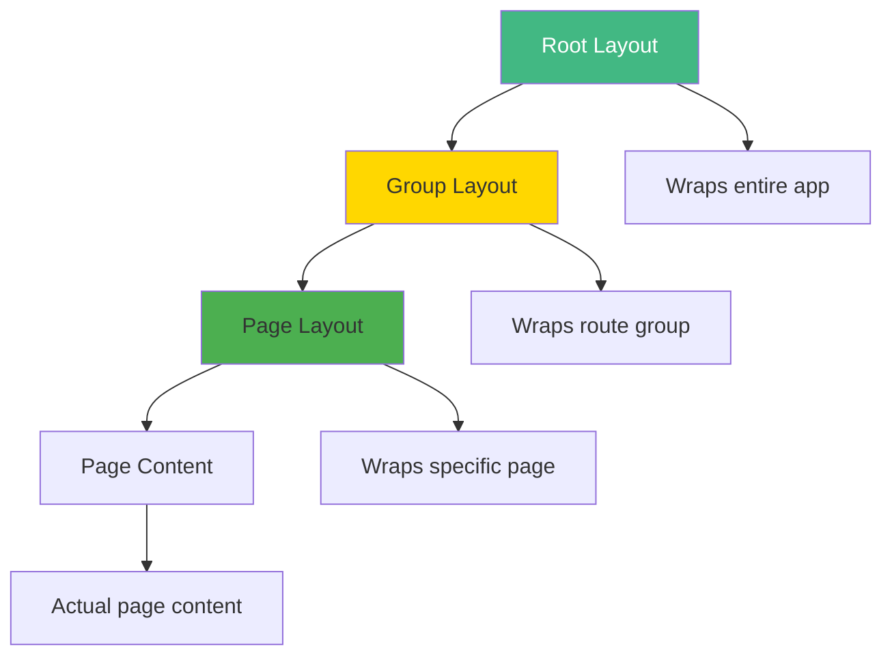
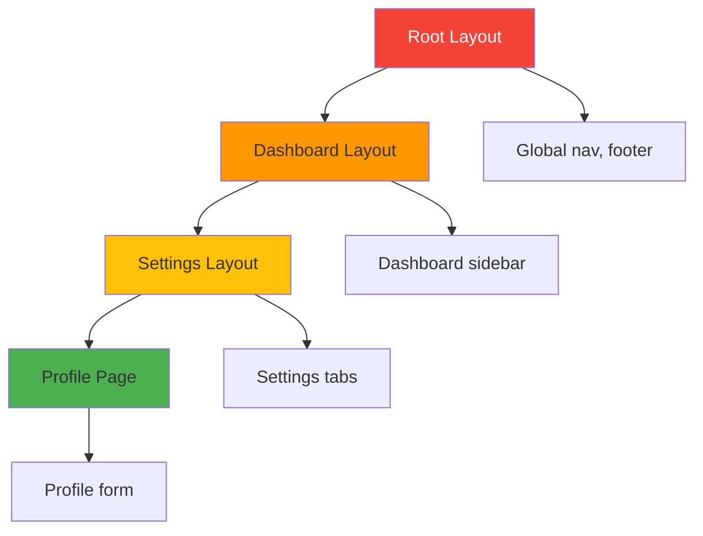
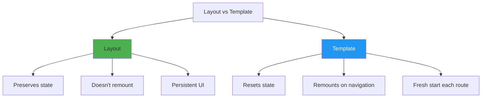
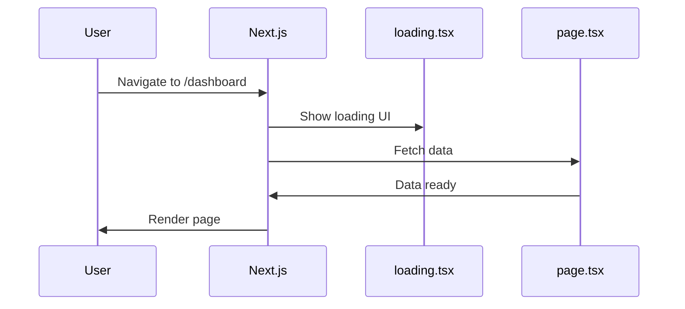

# Day 3 (Day 31): Pages & Layouts 📄

**Duration:** 3-4 hours | **Difficulty:** ⭐⭐⭐ Hard

---

## 📖 Learning Objectives

- Master layout hierarchy
- Create nested layouts
- Understand templates vs layouts
- Build reusable page components
- Implement loading & error states

---

## 🎨 Layout Hierarchy



---

## 🏗️ Root Layout (Required)

```tsx
// app/layout.tsx
import { Inter } from 'next/font/google'
import './globals.css'

const inter = Inter({ subsets: ['latin'] })

export const metadata = {
  title: 'My App',
  description: 'Built with Next.js',
}

export default function RootLayout({
  children,
}: {
  children: React.ReactNode
}) {
  return (
    <html lang="en">
      <body className={inter.className}>
        <div className="min-h-screen flex flex-col">
          <header className="bg-gray-800 text-white p-4">
            <h1 className="text-2xl font-bold">My App</h1>
          </header>
          <main className="flex-1 container mx-auto p-4">
            {children}
          </main>
          <footer className="bg-gray-800 text-white p-4 text-center">
            <p>&copy; 2024 My App</p>
          </footer>
        </div>
      </body>
    </html>
  )
}
```

---

## 📦 Nested Layouts



```
app/
├── layout.tsx              (Root)
├── page.tsx
└── dashboard/
    ├── layout.tsx          (Dashboard)
    ├── page.tsx
    └── settings/
        ├── layout.tsx      (Settings)
        ├── page.tsx
        └── profile/
            └── page.tsx    (Uses all 3 layouts)
```

### **Dashboard Layout:**
```tsx
// app/dashboard/layout.tsx
import Link from 'next/link'

export default function DashboardLayout({
  children
}: {
  children: React.ReactNode
}) {
  return (
    <div className="flex gap-4">
      {/* Sidebar */}
      <aside className="w-64 bg-gray-100 p-4">
        <nav className="space-y-2">
          <Link 
            href="/dashboard" 
            className="block p-2 rounded hover:bg-gray-200"
          >
            Overview
          </Link>
          <Link 
            href="/dashboard/analytics" 
            className="block p-2 rounded hover:bg-gray-200"
          >
            Analytics
          </Link>
          <Link 
            href="/dashboard/settings" 
            className="block p-2 rounded hover:bg-gray-200"
          >
            Settings
          </Link>
        </nav>
      </aside>
      
      {/* Main content */}
      <div className="flex-1">
        {children}
      </div>
    </div>
  )
}
```

### **Settings Layout:**
```tsx
// app/dashboard/settings/layout.tsx
import Link from 'next/link'

export default function SettingsLayout({
  children
}: {
  children: React.ReactNode
}) {
  return (
    <div>
      <h1 className="text-3xl font-bold mb-4">Settings</h1>
      
      {/* Settings tabs */}
      <div className="flex gap-2 border-b mb-4">
        <Link 
          href="/dashboard/settings" 
          className="px-4 py-2 hover:bg-gray-100"
        >
          General
        </Link>
        <Link 
          href="/dashboard/settings/profile" 
          className="px-4 py-2 hover:bg-gray-100"
        >
          Profile
        </Link>
        <Link 
          href="/dashboard/settings/security" 
          className="px-4 py-2 hover:bg-gray-100"
        >
          Security
        </Link>
      </div>
      
      {children}
    </div>
  )
}
```

---

## 🎭 Templates vs Layouts



### **Layout (Persistent):**
```tsx
// app/dashboard/layout.tsx
'use client'

import { useState } from 'react'

export default function DashboardLayout({
  children
}: {
  children: React.ReactNode
}) {
  const [sidebarOpen, setSidebarOpen] = useState(true)
  
  // State persists across route changes!
  
  return (
    <div>
      <button onClick={() => setSidebarOpen(!sidebarOpen)}>
        Toggle Sidebar
      </button>
      {sidebarOpen && <Sidebar />}
      {children}
    </div>
  )
}
```

### **Template (Resets):**
```tsx
// app/dashboard/template.tsx
'use client'

import { useEffect } from 'react'

export default function DashboardTemplate({
  children
}: {
  children: React.ReactNode
}) {
  useEffect(() => {
    console.log('Template mounted!')
    // Runs on every route change
  }, [])
  
  return <div>{children}</div>
}
```

---

## ⏳ Loading States

```tsx
// app/dashboard/loading.tsx
export default function DashboardLoading() {
  return (
    <div className="flex items-center justify-center h-64">
      <div className="animate-spin rounded-full h-12 w-12 border-b-2 border-gray-900" />
    </div>
  )
}
```

**Automatic Suspense boundary!**



---

## ❌ Error States

```tsx
// app/dashboard/error.tsx
'use client'

export default function DashboardError({
  error,
  reset
}: {
  error: Error & { digest?: string }
  reset: () => void
}) {
  return (
    <div className="text-center py-12">
      <h2 className="text-2xl font-bold text-red-600 mb-4">
        Something went wrong!
      </h2>
      <p className="text-gray-600 mb-4">
        {error.message}
      </p>
      <button
        onClick={reset}
        className="bg-blue-600 text-white px-6 py-2 rounded-lg"
      >
        Try Again
      </button>
    </div>
  )
}
```

---

## 🔍 Not Found Pages

```tsx
// app/not-found.tsx (Global)
import Link from 'next/link'

export default function NotFound() {
  return (
    <div className="text-center py-12">
      <h1 className="text-6xl font-bold">404</h1>
      <p className="text-xl text-gray-600 mt-4">
        Page not found
      </p>
      <Link 
        href="/" 
        className="mt-6 inline-block bg-blue-600 text-white px-6 py-2 rounded-lg"
      >
        Go Home
      </Link>
    </div>
  )
}

// app/dashboard/not-found.tsx (Scoped)
export default function DashboardNotFound() {
  return <div>Dashboard page not found</div>
}
```

**Trigger programmatically:**
```tsx
import { notFound } from 'next/navigation'

export default async function UserPage({
  params
}: {
  params: { id: string }
}) {
  const user = await fetchUser(params.id)
  
  if (!user) {
    notFound() // Shows not-found.tsx
  }
  
  return <div>{user.name}</div>
}
```

---

## 🎨 Complete Example: Blog

```
app/
├── layout.tsx                 (Root)
├── page.tsx                   (Home)
├── blog/
│   ├── layout.tsx            (Blog layout)
│   ├── loading.tsx           (Blog loading)
│   ├── error.tsx             (Blog errors)
│   ├── page.tsx              (Blog list)
│   └── [slug]/
│       ├── loading.tsx       (Post loading)
│       ├── error.tsx         (Post errors)
│       ├── not-found.tsx     (Post 404)
│       └── page.tsx          (Post detail)
```

```tsx
// app/blog/layout.tsx
export default function BlogLayout({
  children
}: {
  children: React.ReactNode
}) {
  return (
    <div className="max-w-4xl mx-auto">
      <header className="mb-8">
        <h1 className="text-4xl font-bold">Our Blog</h1>
        <p className="text-gray-600">Insights and updates</p>
      </header>
      {children}
    </div>
  )
}

// app/blog/loading.tsx
export default function BlogLoading() {
  return (
    <div className="space-y-4">
      {[1, 2, 3].map(i => (
        <div key={i} className="animate-pulse">
          <div className="h-6 bg-gray-200 rounded w-3/4 mb-2" />
          <div className="h-4 bg-gray-200 rounded w-full" />
        </div>
      ))}
    </div>
  )
}

// app/blog/page.tsx
export default async function BlogPage() {
  const posts = await fetchPosts()
  
  return (
    <div className="space-y-6">
      {posts.map(post => (
        <article key={post.id} className="border-b pb-6">
          <h2 className="text-2xl font-bold">{post.title}</h2>
          <p className="text-gray-600">{post.excerpt}</p>
        </article>
      ))}
    </div>
  )
}
```

---

## ✅ Practice Exercise

Build a dashboard with:
1. Root layout with header/footer
2. Dashboard layout with sidebar
3. Settings nested layout with tabs
4. Loading states for each page
5. Error boundaries
6. Custom 404 pages
7. Template for animation effects

---

**Tomorrow:** Navigation & Links! 🔗
