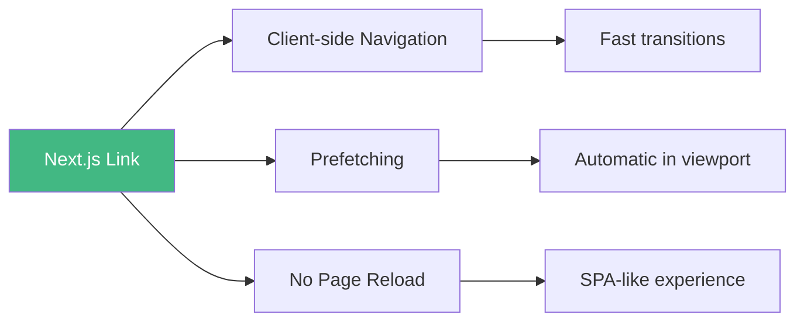

# Day 4 (Day 32): Navigation & Links 🔗

**Duration:** 2-3 hours | **Difficulty:** ⭐⭐ Medium

---

## 📖 Learning Objectives

- Master Next.js Link component
- Implement navigation patterns
- Use useRouter & usePathname
- Handle query parameters
- Create navigation menus

---

## 🔗 Link Component



---

## 📝 Basic Link Usage

```tsx
import Link from 'next/link'

export default function Navigation() {
  return (
    <nav>
      {/* Basic link */}
      <Link href="/">Home</Link>
      
      {/* Link to about */}
      <Link href="/about">About</Link>
      
      {/* Dynamic link */}
      <Link href="/blog/hello-world">Blog Post</Link>
      
      {/* Link with styling */}
      <Link 
        href="/contact" 
        className="text-blue-600 hover:underline"
      >
        Contact
      </Link>
    </nav>
  )
}
```

---

## 🎯 Dynamic Links

```tsx
// Link with dynamic slug
const posts = [
  { id: 1, slug: 'hello-world', title: 'Hello World' },
  { id: 2, slug: 'nextjs-intro', title: 'Next.js Intro' }
]

export default function BlogList() {
  return (
    <div>
      {posts.map(post => (
        <Link key={post.id} href={`/blog/${post.slug}`}>
          {post.title}
        </Link>
      ))}
    </div>
  )
}

// Link with query params
<Link href={{ pathname: '/search', query: { q: 'nextjs' } }}>
  Search Next.js
</Link>
```

---

## 🎨 Active Link Styling

```tsx
'use client'

import Link from 'next/link'
import { usePathname } from 'next/navigation'

export default function NavLink({
  href,
  children
}: {
  href: string
  children: React.ReactNode
}) {
  const pathname = usePathname()
  const isActive = pathname === href
  
  return (
    <Link
      href={href}
      className={`
        px-4 py-2 rounded-lg transition
        ${isActive 
          ? 'bg-blue-600 text-white' 
          : 'text-gray-700 hover:bg-gray-100'
        }
      `}
    >
      {children}
    </Link>
  )
}

// Usage
<nav className="flex gap-2">
  <NavLink href="/">Home</NavLink>
  <NavLink href="/about">About</NavLink>
  <NavLink href="/blog">Blog</NavLink>
</nav>
```

---

## 🚀 Prefetching

```mermaid
sequenceDiagram
    participant User
    participant Link as Link Component
    participant Next as Next.js
    participant Page as Target Page
    
    User->>Link: Hover/Viewport
    Link->>Next: Trigger prefetch
    Next->>Page: Load in background
    User->>Link: Click
    Link->>Page: Instant navigation
    
    Note over Link,Page: Already loaded!
```

```tsx
// Prefetch enabled by default
<Link href="/about">About</Link>

// Disable prefetch
<Link href="/about" prefetch={false}>
  About
</Link>

// Prefetch on hover only (default in production)
<Link href="/about" prefetch={true}>
  About
</Link>
```

---

## 🧭 useRouter Hook

```tsx
'use client'

import { useRouter } from 'next/navigation'

export default function LoginForm() {
  const router = useRouter()
  
  async function handleSubmit(e: React.FormEvent) {
    e.preventDefault()
    
    // Perform login
    await login()
    
    // Programmatic navigation
    router.push('/dashboard')
  }
  
  return (
    <form onSubmit={handleSubmit}>
      <input type="email" placeholder="Email" />
      <input type="password" placeholder="Password" />
      <button type="submit">Login</button>
    </form>
  )
}
```

### **Router Methods:**
```tsx
'use client'

import { useRouter } from 'next/navigation'

export default function NavigationExample() {
  const router = useRouter()
  
  // Navigate forward
  const goToAbout = () => {
    router.push('/about')
  }
  
  // Navigate and replace history
  const replaceWithHome = () => {
    router.replace('/')
  }
  
  // Go back
  const goBack = () => {
    router.back()
  }
  
  // Go forward
  const goForward = () => {
    router.forward()
  }
  
  // Refresh current route
  const refresh = () => {
    router.refresh()
  }
  
  return (
    <div className="space-x-2">
      <button onClick={goToAbout}>Go to About</button>
      <button onClick={replaceWithHome}>Replace with Home</button>
      <button onClick={goBack}>Back</button>
      <button onClick={goForward}>Forward</button>
      <button onClick={refresh}>Refresh</button>
    </div>
  )
}
```

---

## 📍 usePathname & useSearchParams

```tsx
'use client'

import { usePathname, useSearchParams } from 'next/navigation'

export default function CurrentInfo() {
  const pathname = usePathname()
  const searchParams = useSearchParams()
  
  const query = searchParams.get('q')
  const page = searchParams.get('page')
  
  return (
    <div>
      <p>Current path: {pathname}</p>
      <p>Query: {query}</p>
      <p>Page: {page || 1}</p>
    </div>
  )
}

// URL: /search?q=nextjs&page=2
// pathname = "/search"
// query = "nextjs"
// page = "2"
```

---

## 🎨 Navigation Menu Component

```tsx
'use client'

import Link from 'next/link'
import { usePathname } from 'next/navigation'

const navItems = [
  { href: '/', label: 'Home' },
  { href: '/about', label: 'About' },
  { href: '/blog', label: 'Blog' },
  { href: '/contact', label: 'Contact' }
]

export default function Navigation() {
  const pathname = usePathname()
  
  return (
    <nav className="bg-white shadow-lg">
      <div className="container mx-auto px-4">
        <div className="flex items-center justify-between h-16">
          <Link href="/" className="text-xl font-bold">
            My App
          </Link>
          
          <div className="flex gap-4">
            {navItems.map(item => {
              const isActive = pathname === item.href
              
              return (
                <Link
                  key={item.href}
                  href={item.href}
                  className={`
                    px-3 py-2 rounded-md text-sm font-medium transition
                    ${isActive
                      ? 'bg-blue-600 text-white'
                      : 'text-gray-700 hover:bg-gray-100'
                    }
                  `}
                >
                  {item.label}
                </Link>
              )
            })}
          </div>
        </div>
      </div>
    </nav>
  )
}
```

---

## 🔄 Breadcrumbs Component

```tsx
'use client'

import Link from 'next/link'
import { usePathname } from 'next/navigation'

export default function Breadcrumbs() {
  const pathname = usePathname()
  const paths = pathname.split('/').filter(Boolean)
  
  return (
    <nav className="flex items-center space-x-2 text-sm">
      <Link href="/" className="text-blue-600 hover:underline">
        Home
      </Link>
      
      {paths.map((path, index) => {
        const href = '/' + paths.slice(0, index + 1).join('/')
        const isLast = index === paths.length - 1
        
        return (
          <div key={href} className="flex items-center space-x-2">
            <span className="text-gray-400">/</span>
            {isLast ? (
              <span className="text-gray-600 capitalize">{path}</span>
            ) : (
              <Link href={href} className="text-blue-600 hover:underline capitalize">
                {path}
              </Link>
            )}
          </div>
        )
      })}
    </nav>
  )
}

// URL: /blog/tech/nextjs
// Renders: Home / blog / tech / nextjs
```

---

## 🎯 Scroll Behavior

```tsx
// Scroll to top on navigation (default)
<Link href="/about">About</Link>

// Prevent scroll reset
<Link href="/about" scroll={false}>
  About (no scroll)
</Link>

// Programmatic scroll control
'use client'

import { useRouter } from 'next/navigation'

export default function Example() {
  const router = useRouter()
  
  const navigate = () => {
    router.push('/about', { scroll: false })
  }
  
  return <button onClick={navigate}>Navigate</button>
}
```

---

## 📱 Mobile Navigation

```tsx
'use client'

import { useState } from 'react'
import Link from 'next/link'
import { usePathname } from 'next/navigation'

export default function MobileNav() {
  const [isOpen, setIsOpen] = useState(false)
  const pathname = usePathname()
  
  const navItems = [
    { href: '/', label: 'Home' },
    { href: '/about', label: 'About' },
    { href: '/blog', label: 'Blog' }
  ]
  
  return (
    <nav className="bg-white shadow">
      <div className="container mx-auto px-4">
        {/* Mobile menu button */}
        <div className="flex justify-between items-center h-16">
          <Link href="/" className="font-bold">Logo</Link>
          
          <button
            onClick={() => setIsOpen(!isOpen)}
            className="md:hidden"
          >
            <svg className="w-6 h-6" fill="none" stroke="currentColor" viewBox="0 0 24 24">
              <path strokeLinecap="round" strokeLinejoin="round" strokeWidth={2} d="M4 6h16M4 12h16M4 18h16" />
            </svg>
          </button>
          
          {/* Desktop menu */}
          <div className="hidden md:flex gap-4">
            {navItems.map(item => (
              <Link
                key={item.href}
                href={item.href}
                className={pathname === item.href ? 'font-bold' : ''}
              >
                {item.label}
              </Link>
            ))}
          </div>
        </div>
        
        {/* Mobile menu */}
        {isOpen && (
          <div className="md:hidden pb-4">
            {navItems.map(item => (
              <Link
                key={item.href}
                href={item.href}
                className="block py-2"
                onClick={() => setIsOpen(false)}
              >
                {item.label}
              </Link>
            ))}
          </div>
        )}
      </div>
    </nav>
  )
}
```

---

## ✅ Practice Exercise

Build navigation components:
1. Main navigation with active states
2. Breadcrumbs for nested routes
3. Mobile-responsive menu
4. Search with query params
5. Pagination with URL params
6. Tab navigation
7. Sidebar navigation

---

**Tomorrow:** Data Fetching! 📊
