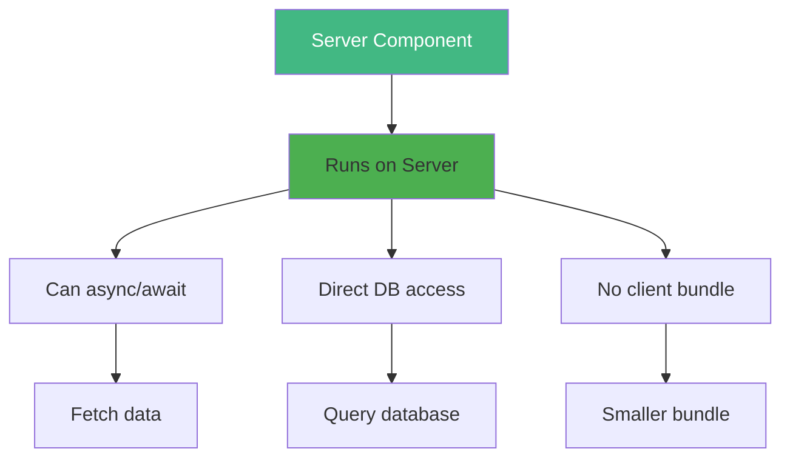
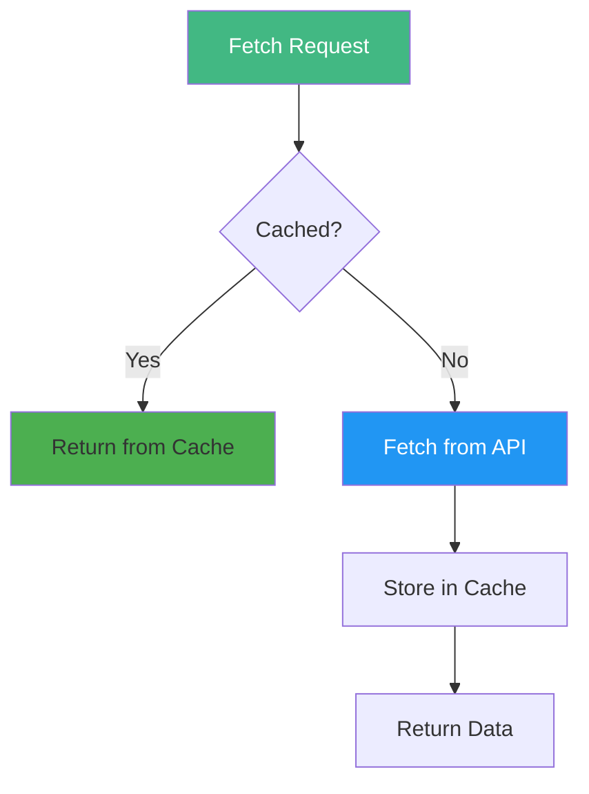
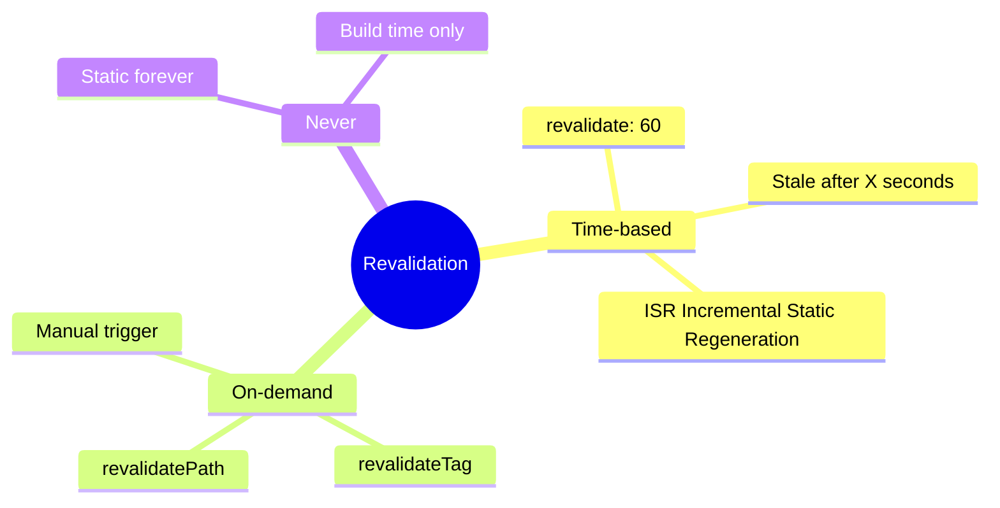
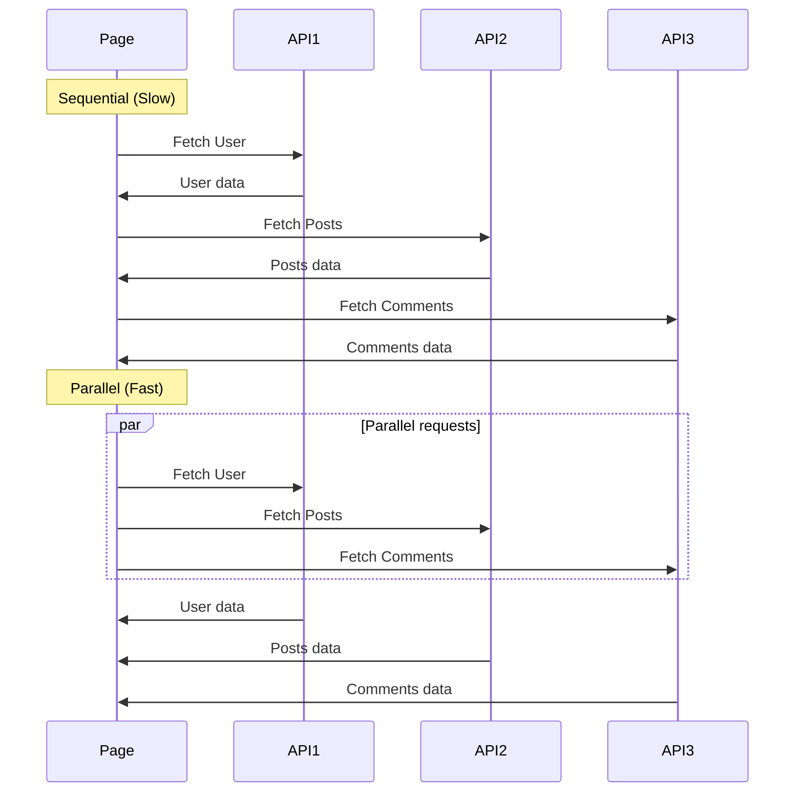

# Day 5 (Day 33): Data Fetching 📊

**Duration:** 3-4 hours | **Difficulty:** ⭐⭐⭐ Hard

---

## 📖 Learning Objectives

- Master Server Components data fetching
- Use fetch with caching
- Implement parallel data fetching
- Handle loading states
- Understand revalidation

---

## 🎯 Server Components (Default)



**Server Components can be async!**

---

## 📝 Basic Data Fetching

```tsx
// app/posts/page.tsx
interface Post {
  id: number
  title: string
  body: string
}

async function getPosts(): Promise<Post[]> {
  const res = await fetch('https://jsonplaceholder.typicode.com/posts')
  
  if (!res.ok) {
    throw new Error('Failed to fetch posts')
  }
  
  return res.json()
}

export default async function PostsPage() {
  const posts = await getPosts()
  
  return (
    <div>
      <h1 className="text-3xl font-bold mb-6">Blog Posts</h1>
      <div className="space-y-4">
        {posts.map(post => (
          <article key={post.id} className="border p-4 rounded">
            <h2 className="text-xl font-semibold">{post.title}</h2>
            <p className="text-gray-600">{post.body}</p>
          </article>
        ))}
      </div>
    </div>
  )
}
```

---

## 🚀 Fetch with Caching



### **Cache Options:**

```tsx
// 1. Default: Cache forever
fetch('https://api.example.com/data')

// 2. Revalidate every 60 seconds
fetch('https://api.example.com/data', {
  next: { revalidate: 60 }
})

// 3. No cache (always fetch fresh)
fetch('https://api.example.com/data', {
  cache: 'no-store'
})

// 4. Force cache
fetch('https://api.example.com/data', {
  cache: 'force-cache'
})
```

---

## 🎯 Revalidation Strategies



### **Time-based Revalidation:**
```tsx
// app/posts/page.tsx
async function getPosts() {
  const res = await fetch('https://api.example.com/posts', {
    next: { revalidate: 3600 } // Revalidate every hour
  })
  return res.json()
}

export default async function PostsPage() {
  const posts = await getPosts()
  return <PostList posts={posts} />
}
```

### **Route Segment Config:**
```tsx
// app/posts/page.tsx
export const revalidate = 3600 // Revalidate every hour

export default async function PostsPage() {
  // All fetches in this page use this revalidate
  const posts = await fetch('https://api.example.com/posts').then(r => r.json())
  return <PostList posts={posts} />
}
```

---

## 🔄 Parallel Data Fetching

```tsx
// ❌ BAD: Sequential (slow)
async function Page() {
  const user = await fetchUser()
  const posts = await fetchPosts()
  const comments = await fetchComments()
  
  return <div>{/* ... */}</div>
}

// ✅ GOOD: Parallel (fast)
async function Page() {
  const [user, posts, comments] = await Promise.all([
    fetchUser(),
    fetchPosts(),
    fetchComments()
  ])
  
  return <div>{/* ... */}</div>
}
```



---

## 🎨 Loading States with Suspense

```tsx
// app/posts/page.tsx
import { Suspense } from 'react'

async function Posts() {
  const posts = await fetchPosts()
  return <PostList posts={posts} />
}

export default function PostsPage() {
  return (
    <div>
      <h1>Blog Posts</h1>
      <Suspense fallback={<PostsLoading />}>
        <Posts />
      </Suspense>
    </div>
  )
}

function PostsLoading() {
  return (
    <div className="space-y-4">
      {[1, 2, 3].map(i => (
        <div key={i} className="animate-pulse">
          <div className="h-6 bg-gray-200 rounded w-3/4 mb-2" />
          <div className="h-4 bg-gray-200 rounded w-full" />
        </div>
      ))}
    </div>
  )
}
```

---

## 🎯 Streaming with Multiple Suspense

```tsx
// app/dashboard/page.tsx
import { Suspense } from 'react'

async function RecentSales() {
  const sales = await fetchSales()
  return <SalesChart data={sales} />
}

async function Analytics() {
  const analytics = await fetchAnalytics()
  return <AnalyticsPanel data={analytics} />
}

export default function DashboardPage() {
  return (
    <div className="space-y-6">
      <h1>Dashboard</h1>
      
      {/* Stream in as they load */}
      <Suspense fallback={<SkeletonChart />}>
        <RecentSales />
      </Suspense>
      
      <Suspense fallback={<SkeletonPanel />}>
        <Analytics />
      </Suspense>
    </div>
  )
}
```

---

## 📊 Dynamic Data Fetching

```tsx
// app/posts/[id]/page.tsx
interface Post {
  id: number
  title: string
  body: string
}

async function getPost(id: string): Promise<Post> {
  const res = await fetch(`https://api.example.com/posts/${id}`, {
    next: { revalidate: 60 }
  })
  
  if (!res.ok) {
    throw new Error('Post not found')
  }
  
  return res.json()
}

export default async function PostPage({
  params
}: {
  params: { id: string }
}) {
  const post = await getPost(params.id)
  
  return (
    <article>
      <h1 className="text-4xl font-bold mb-4">{post.title}</h1>
      <p className="text-lg">{post.body}</p>
    </article>
  )
}
```

---

## 🏷️ Cache Tags & Revalidation

```tsx
// Fetch with tag
async function getPosts() {
  const res = await fetch('https://api.example.com/posts', {
    next: { tags: ['posts'] }
  })
  return res.json()
}

// Revalidate by tag (Server Action)
'use server'

import { revalidateTag } from 'next/cache'

export async function createPost(data: FormData) {
  // Create post in database
  await db.posts.create(data)
  
  // Revalidate all requests with 'posts' tag
  revalidateTag('posts')
}
```

---

## 🎯 Error Handling

```tsx
// app/posts/page.tsx
async function getPosts() {
  try {
    const res = await fetch('https://api.example.com/posts')
    
    if (!res.ok) {
      throw new Error('Failed to fetch posts')
    }
    
    return res.json()
  } catch (error) {
    console.error('Error fetching posts:', error)
    return []
  }
}

export default async function PostsPage() {
  const posts = await getPosts()
  
  if (posts.length === 0) {
    return (
      <div className="text-center py-12">
        <p className="text-gray-600">No posts found</p>
      </div>
    )
  }
  
  return <PostList posts={posts} />
}
```

---

## 🎨 Complete Example: Blog with Comments

```tsx
// app/blog/[slug]/page.tsx
import { Suspense } from 'react'

interface Post {
  id: number
  title: string
  content: string
}

interface Comment {
  id: number
  text: string
  author: string
}

async function getPost(slug: string): Promise<Post> {
  const res = await fetch(`https://api.example.com/posts/${slug}`, {
    next: { revalidate: 3600 }
  })
  return res.json()
}

async function getComments(postId: number): Promise<Comment[]> {
  const res = await fetch(`https://api.example.com/posts/${postId}/comments`, {
    next: { revalidate: 60 }
  })
  return res.json()
}

async function Comments({ postId }: { postId: number }) {
  const comments = await getComments(postId)
  
  return (
    <div className="space-y-4">
      <h2 className="text-2xl font-bold">Comments</h2>
      {comments.map(comment => (
        <div key={comment.id} className="border p-4 rounded">
          <p>{comment.text}</p>
          <p className="text-sm text-gray-600">— {comment.author}</p>
        </div>
      ))}
    </div>
  )
}

export default async function BlogPostPage({
  params
}: {
  params: { slug: string }
}) {
  const post = await getPost(params.slug)
  
  return (
    <article>
      <h1 className="text-4xl font-bold mb-4">{post.title}</h1>
      <div className="prose max-w-none mb-8">
        {post.content}
      </div>
      
      <Suspense fallback={<div>Loading comments...</div>}>
        <Comments postId={post.id} />
      </Suspense>
    </article>
  )
}
```

---

## ✅ Practice Exercise

Build a data-fetched app with:
1. List page with posts
2. Detail page with async data
3. Parallel data fetching
4. Loading states with Suspense
5. Error handling
6. Revalidation strategies
7. Streaming components

---

**Tomorrow:** Server vs Client Components! 🖥️
