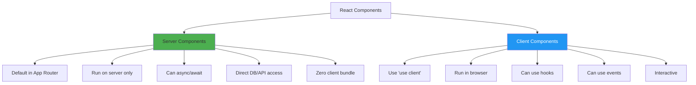
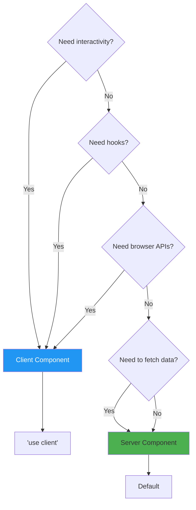
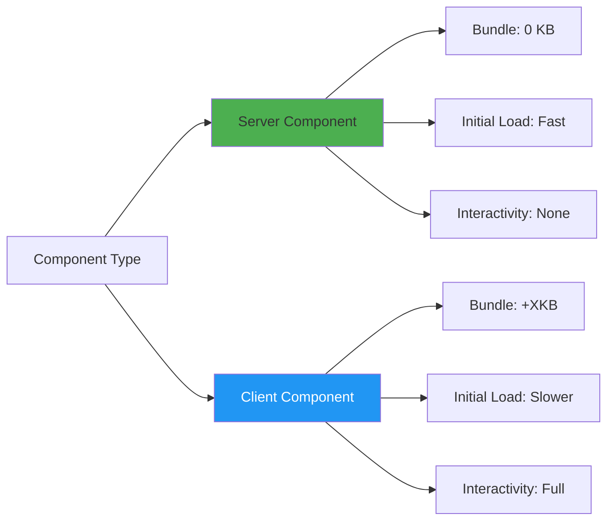

# Day 6 (Day 34): Server vs Client Components 🖥️

**Duration:** 3-4 hours | **Difficulty:** ⭐⭐⭐ Hard

---

## 📖 Learning Objectives

- Understand Server Components
- Master Client Components
- Learn when to use each
- Compose Server & Client
- Optimize component architecture

---

## 🎯 Server vs Client Components



---

## 🖥️ Server Components (Default)

**Benefits:**
- ✅ Direct backend access
- ✅ No JavaScript to client
- ✅ Can be async
- ✅ Better security
- ✅ Smaller bundle size

**Cannot use:**
- ❌ useState, useEffect
- ❌ Event handlers
- ❌ Browser APIs
- ❌ React hooks

```tsx
// app/posts/page.tsx
// Server Component (default)
async function getPosts() {
  const res = await fetch('https://api.example.com/posts')
  return res.json()
}

export default async function PostsPage() {
  const posts = await getPosts()
  
  // Can use async/await!
  // Runs on the server
  // Zero JavaScript to client
  
  return (
    <div>
      <h1>Posts</h1>
      {posts.map(post => (
        <article key={post.id}>
          <h2>{post.title}</h2>
          <p>{post.body}</p>
        </article>
      ))}
    </div>
  )
}
```

---

## 💻 Client Components

**When to use:**
- ✅ Interactivity (onClick, onChange)
- ✅ State management (useState)
- ✅ Effects (useEffect)
- ✅ Browser APIs (localStorage, window)
- ✅ Custom hooks

```tsx
// components/Counter.tsx
'use client' // Mark as Client Component

import { useState } from 'react'

export default function Counter() {
  const [count, setCount] = useState(0)
  
  return (
    <div>
      <p>Count: {count}</p>
      <button onClick={() => setCount(count + 1)}>
        Increment
      </button>
    </div>
  )
}
```

---

## 🎨 Decision Tree



---

## 🔄 Composition Patterns

### **Pattern 1: Server Component with Client Children**

```tsx
// app/page.tsx (Server Component)
import ClientButton from '@/components/ClientButton'

export default async function HomePage() {
  const data = await fetchData()
  
  return (
    <div>
      <h1>Server-rendered heading</h1>
      <p>{data.message}</p>
      
      {/* Client component for interactivity */}
      <ClientButton />
    </div>
  )
}

// components/ClientButton.tsx (Client Component)
'use client'

export default function ClientButton() {
  return (
    <button onClick={() => alert('Clicked!')}>
      Click me
    </button>
  )
}
```

---

### **Pattern 2: Client Component with Server Children**

```tsx
// components/ClientWrapper.tsx (Client Component)
'use client'

import { useState } from 'react'

export default function ClientWrapper({
  children
}: {
  children: React.ReactNode
}) {
  const [isOpen, setIsOpen] = useState(false)
  
  return (
    <div>
      <button onClick={() => setIsOpen(!isOpen)}>
        Toggle
      </button>
      {isOpen && children}
    </div>
  )
}

// app/page.tsx (Server Component)
import ClientWrapper from '@/components/ClientWrapper'

async function ServerContent() {
  const data = await fetchData()
  return <div>{data.content}</div>
}

export default function Page() {
  return (
    <ClientWrapper>
      <ServerContent />
    </ClientWrapper>
  )
}
```

---

## 🎯 Passing Props: Server → Client

```tsx
// app/page.tsx (Server Component)
import ClientComponent from '@/components/ClientComponent'

export default async function Page() {
  const data = await fetchData()
  
  // ✅ Pass serializable props
  return (
    <ClientComponent
      title={data.title}
      count={data.count}
      items={data.items}
    />
  )
}

// components/ClientComponent.tsx
'use client'

interface Props {
  title: string
  count: number
  items: string[]
}

export default function ClientComponent({ title, count, items }: Props) {
  return <div>{title}: {count}</div>
}
```

**Important:** Props must be serializable (no functions, Date objects, etc.)

---

## ⚠️ Common Mistakes

### **❌ Mistake 1: Using hooks in Server Component**
```tsx
// app/page.tsx
import { useState } from 'react' // ❌ Error!

export default function Page() {
  const [count, setCount] = useState(0) // ❌ Can't use hooks
  return <div>{count}</div>
}
```

**✅ Fix:** Add `'use client'`
```tsx
'use client'

import { useState } from 'react'

export default function Page() {
  const [count, setCount] = useState(0)
  return <div>{count}</div>
}
```

---

### **❌ Mistake 2: Making entire page client-side**
```tsx
'use client' // ❌ Don't do this unless needed!

export default async function Page() {
  const data = await fetchData()
  return <div>{data}</div>
}
```

**✅ Fix:** Extract interactive parts
```tsx
// app/page.tsx (Server)
import InteractiveSection from '@/components/InteractiveSection'

export default async function Page() {
  const data = await fetchData()
  
  return (
    <div>
      <h1>{data.title}</h1>
      <InteractiveSection />
    </div>
  )
}

// components/InteractiveSection.tsx (Client)
'use client'
export default function InteractiveSection() {
  // Interactive code here
}
```

---

## 🎨 Real-World Example: Blog Post

```tsx
// app/blog/[slug]/page.tsx (Server Component)
import { Suspense } from 'react'
import LikeButton from '@/components/LikeButton'
import Comments from '@/components/Comments'

async function getPost(slug: string) {
  const res = await fetch(`https://api.example.com/posts/${slug}`)
  return res.json()
}

export default async function BlogPost({
  params
}: {
  params: { slug: string }
}) {
  const post = await getPost(params.slug)
  
  return (
    <article>
      {/* Server-rendered content */}
      <h1 className="text-4xl font-bold">{post.title}</h1>
      <time className="text-gray-600">{post.date}</time>
      
      <div className="prose">
        {post.content}
      </div>
      
      {/* Client component for interactivity */}
      <LikeButton postId={post.id} initialLikes={post.likes} />
      
      {/* Client component with server children */}
      <Suspense fallback={<div>Loading comments...</div>}>
        <Comments postId={post.id} />
      </Suspense>
    </article>
  )
}

// components/LikeButton.tsx (Client Component)
'use client'

import { useState } from 'react'

export default function LikeButton({
  postId,
  initialLikes
}: {
  postId: number
  initialLikes: number
}) {
  const [likes, setLikes] = useState(initialLikes)
  const [isLiked, setIsLiked] = useState(false)
  
  const handleLike = async () => {
    setIsLiked(!isLiked)
    setLikes(isLiked ? likes - 1 : likes + 1)
    
    await fetch(`/api/posts/${postId}/like`, {
      method: 'POST'
    })
  }
  
  return (
    <button
      onClick={handleLike}
      className={`px-4 py-2 rounded ${
        isLiked ? 'bg-red-500 text-white' : 'bg-gray-200'
      }`}
    >
      ❤️ {likes}
    </button>
  )
}
```

---

## 📊 Performance Comparison



---

## 🎯 Best Practices

### **1. Start with Server Components**
```tsx
// Default to server components
export default async function Page() {
  const data = await fetchData()
  return <div>{data}</div>
}
```

### **2. Move Client Components to Leaves**
```tsx
// ✅ Good: Client component at the leaf
<ServerComponent>
  <ServerComponent>
    <ClientComponent /> {/* Only this is client-side */}
  </ServerComponent>
</ServerComponent>

// ❌ Bad: Client component at the root
<ClientComponent>
  <ServerComponent /> {/* This becomes client-side too! */}
</ClientComponent>
```

### **3. Pass Server Components as Children**
```tsx
// components/Tabs.tsx
'use client'

export default function Tabs({ children }: { children: React.ReactNode }) {
  const [tab, setTab] = useState(0)
  return <div>{children}</div>
}

// app/page.tsx
<Tabs>
  <ServerComponentTab /> {/* Stays server-rendered! */}
</Tabs>
```

---

## 🎨 Context Providers Pattern

```tsx
// app/providers.tsx
'use client'

import { ThemeProvider } from 'next-themes'

export function Providers({ children }: { children: React.ReactNode }) {
  return (
    <ThemeProvider attribute="class">
      {children}
    </ThemeProvider>
  )
}

// app/layout.tsx (Server Component)
import { Providers } from './providers'

export default function RootLayout({ children }: { children: React.ReactNode }) {
  return (
    <html>
      <body>
        <Providers>
          {children}
        </Providers>
      </body>
    </html>
  )
}
```

---

## ✅ Practice Exercise

Build an application demonstrating:
1. Server component with async data
2. Client component with state
3. Mixed composition
4. Context provider pattern
5. Optimal component boundaries
6. Performance comparison
7. Error boundary handling

---

**Tomorrow:** First Next.js Project! 🎉
