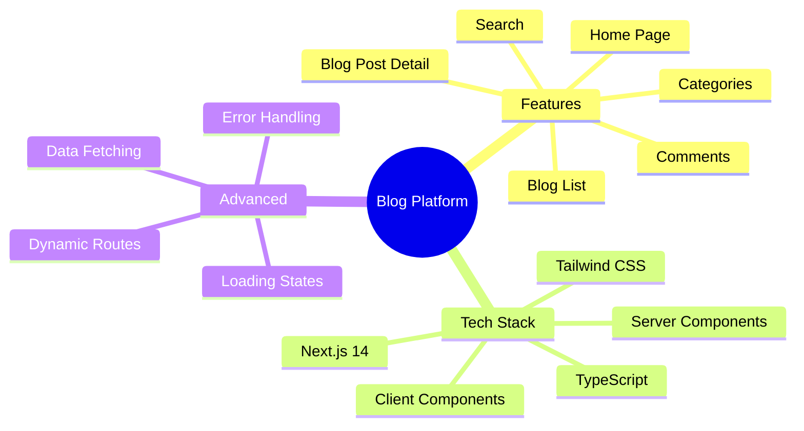
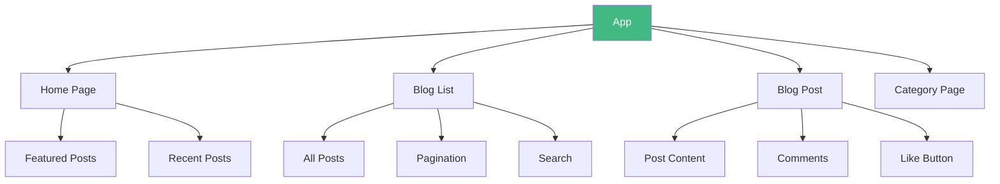

# Day 7 (Day 35): First Next.js Project - Blog Platform 📝

**Duration:** 6-8 hours | **Difficulty:** ⭐⭐⭐ Project

---

## 🎯 Project Overview

Build a complete **Blog Platform** using Next.js 14+ with App Router!



---

## 📋 Requirements

### **Must Have:**
1. ✅ Home page with featured posts
2. ✅ Blog list with pagination
3. ✅ Individual blog post pages
4. ✅ Category filtering
5. ✅ Search functionality
6. ✅ Comments section
7. ✅ Loading states
8. ✅ Error handling
9. ✅ Responsive design
10. ✅ SEO optimization

---

## 🏗️ Architecture



---

## 📊 Data Structures

```typescript
interface Post {
  id: number
  title: string
  slug: string
  excerpt: string
  content: string
  author: {
    name: string
    avatar: string
  }
  category: string
  tags: string[]
  publishedAt: string
  readTime: number
  likes: number
  views: number
}

interface Comment {
  id: number
  postId: number
  author: string
  content: string
  createdAt: string
}

interface Category {
  id: number
  name: string
  slug: string
  count: number
}
```

---

## 🗺️ File Structure

```
src/
├── app/
│   ├── layout.tsx              (Root layout)
│   ├── page.tsx                (Home)
│   ├── blog/
│   │   ├── page.tsx           (Blog list)
│   │   ├── loading.tsx        (Loading state)
│   │   ├── [slug]/
│   │   │   ├── page.tsx       (Post detail)
│   │   │   ├── loading.tsx
│   │   │   └── not-found.tsx
│   │   └── category/
│   │       └── [slug]/
│   │           └── page.tsx   (Category posts)
│   ├── search/
│   │   └── page.tsx           (Search results)
│   └── api/
│       ├── posts/route.ts
│       └── comments/route.ts
├── components/
│   ├── PostCard.tsx
│   ├── CommentSection.tsx
│   ├── LikeButton.tsx
│   ├── SearchBar.tsx
│   ├── Pagination.tsx
│   └── Navigation.tsx
├── lib/
│   ├── posts.ts               (Data fetching)
│   └── utils.ts
└── types/
    └── index.ts
```

---

## 🎨 Implementation Steps

### **Phase 1: Setup (1 hour)**

```bash
# Create Next.js app
npx create-next-app@latest blog-platform
cd blog-platform
npm run dev
```

### **Root Layout:**
```tsx
// src/app/layout.tsx
import type { Metadata } from 'next'
import { Inter } from 'next/font/google'
import './globals.css'
import Navigation from '@/components/Navigation'

const inter = Inter({ subsets: ['latin'] })

export const metadata: Metadata = {
  title: 'My Blog Platform',
  description: 'A modern blog built with Next.js 14',
}

export default function RootLayout({
  children,
}: {
  children: React.ReactNode
}) {
  return (
    <html lang="en">
      <body className={inter.className}>
        <Navigation />
        <main className="container mx-auto px-4 py-8">
          {children}
        </main>
        <footer className="bg-gray-800 text-white p-4 mt-12 text-center">
          <p>&copy; 2024 Blog Platform</p>
        </footer>
      </body>
    </html>
  )
}
```

---

### **Phase 2: Home Page (2 hours)**

```tsx
// src/app/page.tsx
import Link from 'next/link'
import PostCard from '@/components/PostCard'
import { getFeaturedPosts, getRecentPosts } from '@/lib/posts'

export default async function HomePage() {
  const [featured, recent] = await Promise.all([
    getFeaturedPosts(),
    getRecentPosts()
  ])
  
  return (
    <div className="space-y-12">
      {/* Hero Section */}
      <section className="text-center py-12 bg-gradient-to-r from-blue-600 to-purple-600 text-white rounded-lg">
        <h1 className="text-5xl font-bold mb-4">
          Welcome to My Blog
        </h1>
        <p className="text-xl mb-6">
          Discover amazing content and insights
        </p>
        <Link 
          href="/blog"
          className="bg-white text-blue-600 px-8 py-3 rounded-lg font-semibold hover:bg-gray-100 transition"
        >
          Explore Articles
        </Link>
      </section>
      
      {/* Featured Posts */}
      <section>
        <h2 className="text-3xl font-bold mb-6">Featured Posts</h2>
        <div className="grid grid-cols-1 md:grid-cols-2 lg:grid-cols-3 gap-6">
          {featured.map(post => (
            <PostCard key={post.id} post={post} />
          ))}
        </div>
      </section>
      
      {/* Recent Posts */}
      <section>
        <h2 className="text-3xl font-bold mb-6">Recent Posts</h2>
        <div className="space-y-4">
          {recent.map(post => (
            <PostCard key={post.id} post={post} variant="list" />
          ))}
        </div>
      </section>
    </div>
  )
}
```

---

### **Phase 3: Blog List (2 hours)**

```tsx
// src/app/blog/page.tsx
import { Suspense } from 'react'
import PostCard from '@/components/PostCard'
import SearchBar from '@/components/SearchBar'
import Pagination from '@/components/Pagination'
import { getPosts } from '@/lib/posts'

export default async function BlogPage({
  searchParams
}: {
  searchParams: { page?: string; q?: string }
}) {
  const page = Number(searchParams.page) || 1
  const query = searchParams.q || ''
  
  const { posts, totalPages } = await getPosts({ page, query })
  
  return (
    <div>
      <div className="mb-8">
        <h1 className="text-4xl font-bold mb-4">All Posts</h1>
        <SearchBar />
      </div>
      
      <div className="grid grid-cols-1 md:grid-cols-2 lg:grid-cols-3 gap-6 mb-8">
        {posts.map(post => (
          <PostCard key={post.id} post={post} />
        ))}
      </div>
      
      <Pagination currentPage={page} totalPages={totalPages} />
    </div>
  )
}

// src/app/blog/loading.tsx
export default function BlogLoading() {
  return (
    <div className="grid grid-cols-1 md:grid-cols-2 lg:grid-cols-3 gap-6">
      {[1, 2, 3, 4, 5, 6].map(i => (
        <div key={i} className="animate-pulse">
          <div className="bg-gray-200 h-48 rounded-lg mb-4" />
          <div className="bg-gray-200 h-6 rounded w-3/4 mb-2" />
          <div className="bg-gray-200 h-4 rounded w-full" />
        </div>
      ))}
    </div>
  )
}
```

---

### **Phase 4: Blog Post Detail (2 hours)**

```tsx
// src/app/blog/[slug]/page.tsx
import { Suspense } from 'react'
import { notFound } from 'next/navigation'
import Image from 'next/image'
import LikeButton from '@/components/LikeButton'
import CommentSection from '@/components/CommentSection'
import { getPost, getRelatedPosts } from '@/lib/posts'

export async function generateMetadata({
  params
}: {
  params: { slug: string }
}) {
  const post = await getPost(params.slug)
  
  if (!post) return {}
  
  return {
    title: post.title,
    description: post.excerpt,
  }
}

export default async function BlogPostPage({
  params
}: {
  params: { slug: string }
}) {
  const post = await getPost(params.slug)
  
  if (!post) {
    notFound()
  }
  
  const relatedPosts = await getRelatedPosts(post.id)
  
  return (
    <article className="max-w-4xl mx-auto">
      {/* Header */}
      <header className="mb-8">
        <h1 className="text-5xl font-bold mb-4">{post.title}</h1>
        
        <div className="flex items-center gap-4 text-gray-600">
          <Image
            src={post.author.avatar}
            alt={post.author.name}
            width={40}
            height={40}
            className="rounded-full"
          />
          <div>
            <p className="font-semibold">{post.author.name}</p>
            <p className="text-sm">
              {post.publishedAt} · {post.readTime} min read
            </p>
          </div>
        </div>
      </header>
      
      {/* Content */}
      <div className="prose prose-lg max-w-none mb-8">
        {post.content}
      </div>
      
      {/* Actions */}
      <div className="flex gap-4 mb-8">
        <LikeButton postId={post.id} initialLikes={post.likes} />
      </div>
      
      {/* Comments */}
      <Suspense fallback={<div>Loading comments...</div>}>
        <CommentSection postId={post.id} />
      </Suspense>
      
      {/* Related Posts */}
      {relatedPosts.length > 0 && (
        <section className="mt-12">
          <h2 className="text-3xl font-bold mb-6">Related Posts</h2>
          <div className="grid grid-cols-1 md:grid-cols-3 gap-6">
            {relatedPosts.map(post => (
              <PostCard key={post.id} post={post} />
            ))}
          </div>
        </section>
      )}
    </article>
  )
}
```

---

### **Phase 5: Components (2 hours)**

```tsx
// src/components/PostCard.tsx
import Link from 'next/link'
import Image from 'next/image'

interface PostCardProps {
  post: Post
  variant?: 'grid' | 'list'
}

export default function PostCard({ post, variant = 'grid' }: PostCardProps) {
  return (
    <Link 
      href={`/blog/${post.slug}`}
      className={`block hover:shadow-lg transition ${
        variant === 'list' ? 'flex gap-4' : ''
      }`}
    >
      <div className={variant === 'list' ? 'w-1/3' : 'w-full'}>
        <Image
          src={post.image}
          alt={post.title}
          width={400}
          height={300}
          className="rounded-lg object-cover w-full"
        />
      </div>
      
      <div className={variant === 'list' ? 'w-2/3' : 'p-4'}>
        <span className="text-sm text-blue-600 font-semibold">
          {post.category}
        </span>
        <h3 className="text-xl font-bold mb-2">{post.title}</h3>
        <p className="text-gray-600 mb-2">{post.excerpt}</p>
        <div className="flex items-center gap-2 text-sm text-gray-500">
          <span>{post.publishedAt}</span>
          <span>·</span>
          <span>{post.readTime} min read</span>
        </div>
      </div>
    </Link>
  )
}

// src/components/LikeButton.tsx
'use client'

import { useState } from 'react'

export default function LikeButton({
  postId,
  initialLikes
}: {
  postId: number
  initialLikes: number
}) {
  const [likes, setLikes] = useState(initialLikes)
  const [isLiked, setIsLiked] = useState(false)
  
  const handleLike = async () => {
    setIsLiked(!isLiked)
    setLikes(isLiked ? likes - 1 : likes + 1)
    
    await fetch(`/api/posts/${postId}/like`, {
      method: 'POST'
    })
  }
  
  return (
    <button
      onClick={handleLike}
      className={`flex items-center gap-2 px-4 py-2 rounded-lg transition ${
        isLiked ? 'bg-red-500 text-white' : 'bg-gray-200 hover:bg-gray-300'
      }`}
    >
      <span>❤️</span>
      <span>{likes}</span>
    </button>
  )
}
```

---

## ✅ Features Checklist

**Pages:**
- [ ] Home page with hero
- [ ] Blog list with pagination
- [ ] Blog post detail
- [ ] Category pages
- [ ] Search results
- [ ] 404 page

**Components:**
- [ ] Navigation
- [ ] PostCard (grid & list)
- [ ] SearchBar
- [ ] Pagination
- [ ] LikeButton
- [ ] CommentSection

**Features:**
- [ ] Server Components
- [ ] Client Components
- [ ] Data fetching
- [ ] Loading states
- [ ] Error handling
- [ ] SEO metadata
- [ ] Responsive design

---

## 🎉 Bonus Features

1. **Dark mode** toggle
2. **Reading progress** indicator
3. **Share buttons** (social media)
4. **Newsletter** signup
5. **Related posts** algorithm
6. **Table of contents** for long posts
7. **Code syntax** highlighting
8. **Markdown** support

---

**Congratulations on completing Week 5!** 🎉

**Next Week:** Next.js Advanced Topics! 🚀
