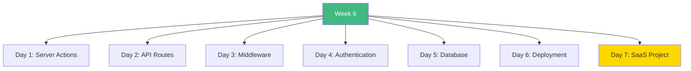

# Week 6: Next.js Advanced Topics - Index 📑

**Your complete Week 6 learning guide**

---

## 🗂️ Week Structure

---

## 📅 Daily Breakdown

### **Day 1 (Day 36): Server Actions & Forms** ⭐⭐⭐
- 📖 [`day1/README.md`](day1/README.md)
- Server Actions basics
- Form handling
- Validation
- Optimistic updates

**Topics:** Server-side mutations, progressive enhancement

---

### **Day 2 (Day 37): API Routes** ⭐⭐⭐
- 📖 [`day2/README.md`](day2/README.md)
- RESTful APIs
- HTTP methods
- Error handling
- File uploads

**Topics:** REST API design, CRUD operations

---

### **Day 3 (Day 38): Middleware** ⭐⭐
- 📖 [`day3/README.md`](day3/README.md)
- Middleware patterns
- Auth guards
- Rate limiting
- Headers & cookies

**Topics:** Request interception, security

---

### **Day 4 (Day 39): Authentication** ⭐⭐⭐
- 📖 [`day4/README.md`](day4/README.md)
- NextAuth.js setup
- OAuth providers
- Session management
- Protected routes

**Topics:** Authentication, authorization, security

---

### **Day 5 (Day 40): Database Integration** ⭐⭐⭐
- 📖 [`day5/README.md`](day5/README.md)
- Prisma ORM
- Schema design
- CRUD operations
- Relations

**Topics:** Database operations, ORM, data modeling

---

### **Day 6 (Day 41): Deployment & Optimization** ⭐⭐
- 📖 [`day6/README.md`](day6/README.md)
- Vercel deployment
- Performance optimization
- Caching strategies
- Monitoring

**Topics:** Production deployment, optimization

---

### **Day 7 (Day 42): SaaS Dashboard Project** 🎯
- 📖 [`day7/README.md`](day7/README.md)
- Complete SaaS application
- All Week 6 concepts
- Production-ready

**Build:** Full-stack SaaS dashboard

---

## 🎯 Learning Checklist

**Server-Side:**
- [ ] Day 1 Complete
- [ ] Server Actions
- [ ] Form handling
- [ ] Mutations

**APIs:**
- [ ] Day 2 Complete
- [ ] REST APIs
- [ ] CRUD operations
- [ ] Error handling

**Security:**
- [ ] Day 3 Complete
- [ ] Middleware
- [ ] Auth guards
- [ ] Rate limiting

**Authentication:**
- [ ] Day 4 Complete
- [ ] NextAuth setup
- [ ] OAuth
- [ ] Sessions

**Database:**
- [ ] Day 5 Complete
- [ ] Prisma setup
- [ ] Schema design
- [ ] Relations

**Deployment:**
- [ ] Day 6 Complete
- [ ] Vercel deploy
- [ ] Optimization
- [ ] Monitoring

**Project:**
- [ ] Day 7 Complete
- [ ] SaaS built
- [ ] All concepts
- [ ] Production ready

---

## 💻 Code Statistics

**Week 6 Totals:**
- 📖 **10 README files**
- 💻 **30+ code examples**
- 📊 **70+ Mermaid diagrams**
- 🎯 **1 complete SaaS project**

---

## 🚀 Quick Navigation

| Day | Topic | Difficulty | Focus |
|-----|-------|------------|-------|
| 1 | Server Actions | ⭐⭐⭐ | Forms |
| 2 | API Routes | ⭐⭐⭐ | REST |
| 3 | Middleware | ⭐⭐ | Security |
| 4 | Authentication | ⭐⭐⭐ | Auth |
| 5 | Database | ⭐⭐⭐ | Prisma |
| 6 | Deployment | ⭐⭐ | Production |
| 7 | Project | 🎯 | Integration |

---

## 💡 Key Takeaways

> **"Server Actions simplify mutations and form handling."**

> **"NextAuth makes authentication straightforward."**

> **"Prisma provides type-safe database access."**

---

**Continue to:** [`WEEK6_SUMMARY.md`](WEEK6_SUMMARY.md)

**Previous Week:** [`../week5/README.md`](../week5/README.md)

**You've completed advanced Next.js!** 🚀
