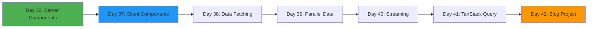
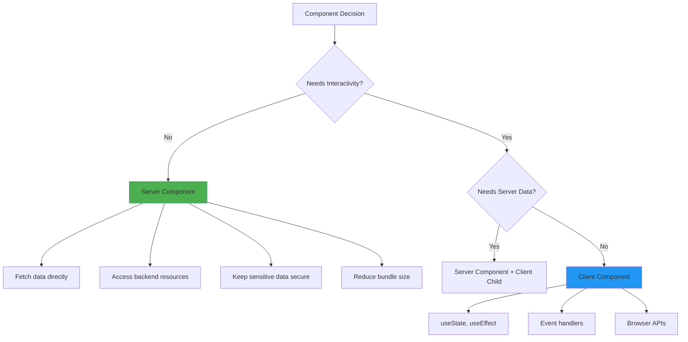
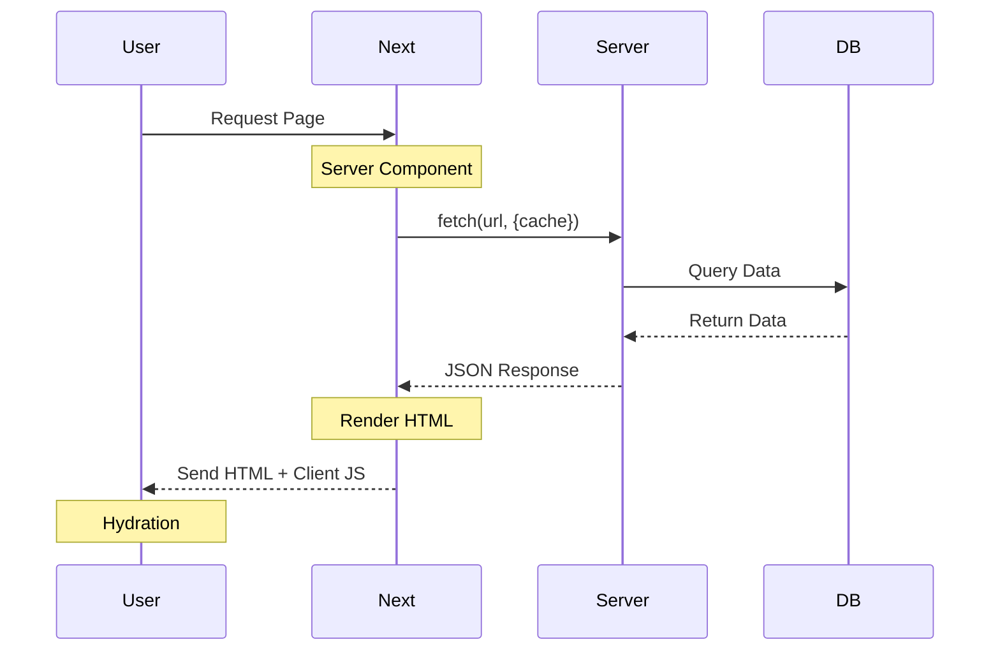
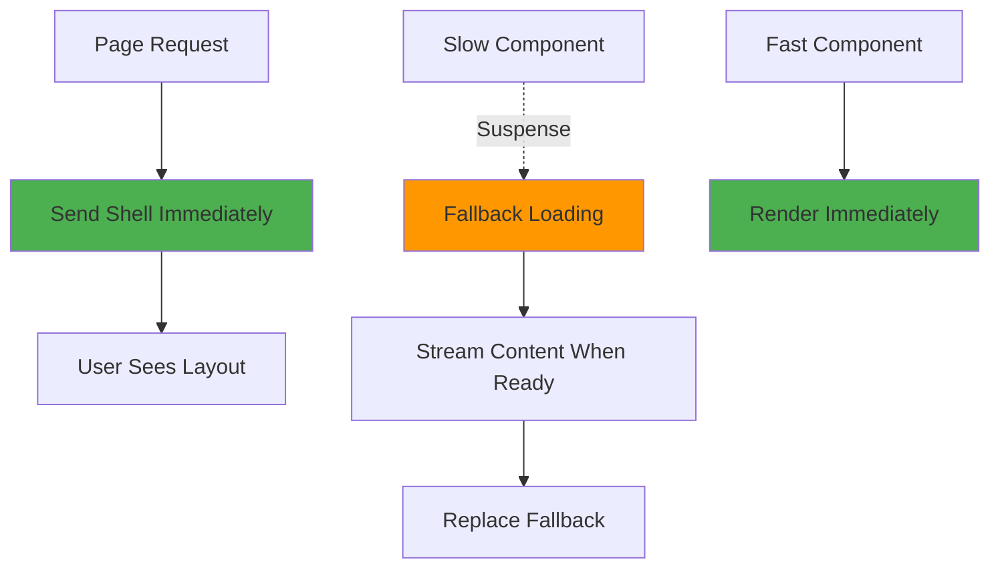

# Week 6: Data Fetching & Server Components 🔄

**Focus:** Mastering Server Components and data fetching patterns

---

## 📊 Weekly Flow

---

## 📚 Daily Topics

| Day | Topic | Key Concepts |
|-----|-------|--------------|
| **Day 36** | Server Components | RSC, benefits, when to use |
| **Day 37** | Client Components | 'use client', interactivity, hydration |
| **Day 38** | Data Fetching Patterns | fetch API, cache, revalidate |
| **Day 39** | Parallel & Sequential | Promise.all, waterfall prevention |
| **Day 40** | Streaming & Suspense | Streaming SSR, Suspense boundaries |
| **Day 41** | TanStack Query | Client-side caching, mutations |
| **Day 42** | **Project: Blog with CMS** | Full data fetching patterns |

---

## 🖥️ Server vs Client Components

---

## 🔄 Data Fetching Patterns

---

## ⚡ Streaming & Suspense

---

## 📂 Week Project: Blog Platform

- Homepage with post list (Server Component)
- Individual post pages (Dynamic routes + SSR)
- Comments section (Client Component)
- Search functionality (Client-side)
- Loading skeletons (Suspense)
- TanStack Query for client mutations

---

**Start Day 36!** 🚀
