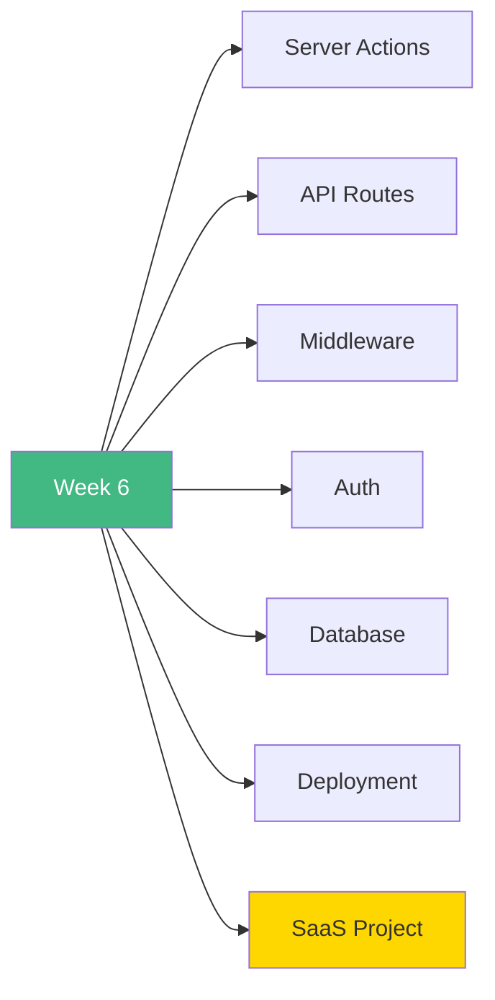

# 🚀 Week 6: Start Here

**Welcome to Week 6 - Next.js Advanced Topics!**

---

## 📚 What You'll Learn This Week

---

## 📅 7-Day Plan

| Day | Topic | Time | Difficulty |
|-----|-------|------|------------|
| **Day 1** | Server Actions & Forms | 3-4h | ⭐⭐⭐ |
| **Day 2** | API Routes | 3-4h | ⭐⭐⭐ |
| **Day 3** | Middleware | 2-3h | ⭐⭐ |
| **Day 4** | Authentication | 3-4h | ⭐⭐⭐ |
| **Day 5** | Database Integration | 3-4h | ⭐⭐⭐ |
| **Day 6** | Deployment & Optimization | 2-3h | ⭐⭐ |
| **Day 7** | SaaS Dashboard | 6-8h | 🎯 |

**Total:** 22-30 hours

---

## 🎯 Learning Path

### **Start Here:**

1. Read [`INDEX.md`](INDEX.md)
2. Begin with [`day1/README.md`](day1/README.md)
3. Work through each day
4. Build SaaS dashboard on Day 7

---

## 🎓 Learning Outcomes

By the end of Week 6, you will:

✅ Master Server Actions  
✅ Build REST APIs  
✅ Implement middleware  
✅ Add authentication  
✅ Integrate databases  
✅ Deploy to production  
✅ Build full-stack apps  

---

## 🚦 Prerequisites

- ✅ Week 5 completed (Next.js basics)
- ✅ Understand Server/Client components
- ✅ TypeScript knowledge
- ✅ Database basics helpful

---

## 💡 Pro Tips

> 💡 **Tip 1:** Server Actions simplify form handling massively
>
> 💡 **Tip 2:** NextAuth handles most auth complexity
>
> 💡 **Tip 3:** Prisma makes database work enjoyable
>
> 💡 **Tip 4:** Middleware is powerful but keep it simple
>
> 💡 **Tip 5:** The SaaS project ties everything together!

---

## ✅ Success Checklist

- [ ] Implement Server Actions
- [ ] Build REST APIs
- [ ] Setup middleware
- [ ] Add authentication
- [ ] Integrate database
- [ ] Deploy to Vercel
- [ ] Complete SaaS dashboard

---

## 🎉 Ready to Begin?

**Start your journey:** [`day1/README.md`](day1/README.md)

**Or review the plan:** [`INDEX.md`](INDEX.md)

---

**Let's build production apps!** 🚀
