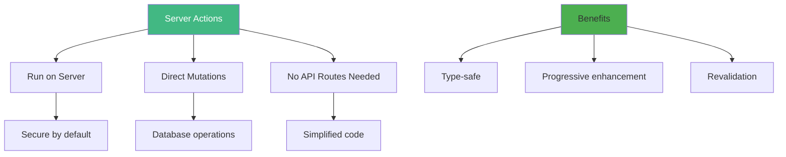
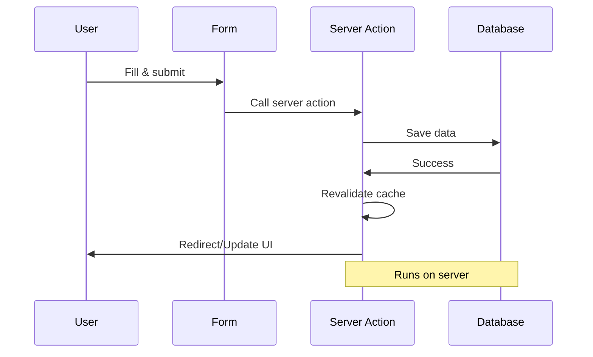
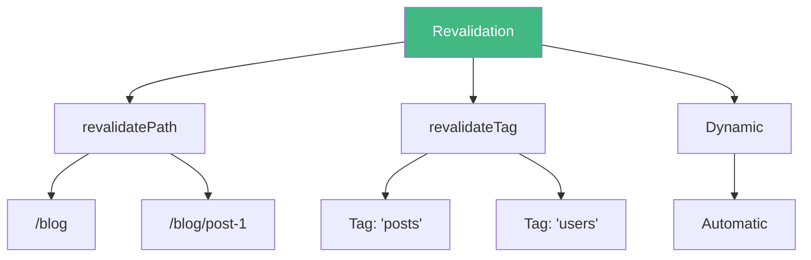

# Day 1 (Day 36): Server Actions & Forms 📝

**Duration:** 3-4 hours | **Difficulty:** ⭐⭐⭐ Hard

---

## 📖 Learning Objectives

- Understand Server Actions
- Handle form submissions
- Implement mutations
- Use progressive enhancement
- Validate form data

---

## 🎯 What are Server Actions?



**Server Actions = Functions that run on the server, called from client or server components!**

---

## 📝 Basic Server Action

```tsx
// app/actions.ts
'use server'

export async function createPost(formData: FormData) {
  const title = formData.get('title') as string
  const content = formData.get('content') as string
  
  // Perform server-side operations
  await db.posts.create({
    title,
    content
  })
  
  // Revalidate cache
  revalidatePath('/blog')
}
```

```tsx
// app/blog/new/page.tsx
import { createPost } from '@/app/actions'

export default function NewPostPage() {
  return (
    <form action={createPost}>
      <input type="text" name="title" required />
      <textarea name="content" required />
      <button type="submit">Create Post</button>
    </form>
  )
}
```

---

## 🎨 Form Handling Patterns



---

## 🎯 Server Action in Client Component

```tsx
// app/actions.ts
'use server'

export async function incrementLikes(postId: number) {
  await db.posts.update({
    where: { id: postId },
    data: { likes: { increment: 1 } }
  })
  
  revalidatePath(`/blog/${postId}`)
  return { success: true }
}
```

```tsx
// components/LikeButton.tsx
'use client'

import { incrementLikes } from '@/app/actions'
import { useState, useTransition } from 'react'

export default function LikeButton({ postId }: { postId: number }) {
  const [isPending, startTransition] = useTransition()
  const [optimisticLikes, setOptimisticLikes] = useState(0)
  
  const handleLike = () => {
    startTransition(async () => {
      setOptimisticLikes(prev => prev + 1)
      await incrementLikes(postId)
    })
  }
  
  return (
    <button 
      onClick={handleLike}
      disabled={isPending}
    >
      ❤️ Like {isPending && '...'}
    </button>
  )
}
```

---

## ✅ Form Validation with Zod

```tsx
// lib/validations.ts
import { z } from 'zod'

export const postSchema = z.object({
  title: z.string().min(3, 'Title must be at least 3 characters'),
  content: z.string().min(10, 'Content must be at least 10 characters'),
  published: z.boolean().default(false)
})

export type PostInput = z.infer<typeof postSchema>
```

```tsx
// app/actions.ts
'use server'

import { postSchema } from '@/lib/validations'
import { revalidatePath } from 'next/cache'

export async function createPost(formData: FormData) {
  // Validate data
  const validatedFields = postSchema.safeParse({
    title: formData.get('title'),
    content: formData.get('content'),
    published: formData.get('published') === 'on'
  })
  
  if (!validatedFields.success) {
    return {
      errors: validatedFields.error.flatten().fieldErrors,
    }
  }
  
  // Create post
  await db.posts.create({
    data: validatedFields.data
  })
  
  revalidatePath('/blog')
  redirect('/blog')
}
```

---

## 🎨 Form with Error Handling

```tsx
// components/CreatePostForm.tsx
'use client'

import { useFormState, useFormStatus } from 'react-dom'
import { createPost } from '@/app/actions'

function SubmitButton() {
  const { pending } = useFormStatus()
  
  return (
    <button type="submit" disabled={pending}>
      {pending ? 'Creating...' : 'Create Post'}
    </button>
  )
}

export default function CreatePostForm() {
  const [state, formAction] = useFormState(createPost, {
    errors: {}
  })
  
  return (
    <form action={formAction} className="space-y-4">
      <div>
        <label htmlFor="title">Title</label>
        <input
          type="text"
          id="title"
          name="title"
          required
          className={state.errors?.title ? 'border-red-500' : ''}
        />
        {state.errors?.title && (
          <p className="text-red-500 text-sm">{state.errors.title[0]}</p>
        )}
      </div>
      
      <div>
        <label htmlFor="content">Content</label>
        <textarea
          id="content"
          name="content"
          rows={5}
          required
          className={state.errors?.content ? 'border-red-500' : ''}
        />
        {state.errors?.content && (
          <p className="text-red-500 text-sm">{state.errors.content[0]}</p>
        )}
      </div>
      
      <div>
        <label>
          <input type="checkbox" name="published" />
          Published
        </label>
      </div>
      
      <SubmitButton />
    </form>
  )
}
```

---

## 🔄 Optimistic Updates

```tsx
'use client'

import { experimental_useOptimistic as useOptimistic } from 'react'
import { addTodo } from './actions'

export default function TodoList({ todos }: { todos: Todo[] }) {
  const [optimisticTodos, addOptimisticTodo] = useOptimistic(
    todos,
    (state, newTodo: string) => [
      ...state,
      { id: Math.random(), text: newTodo, completed: false }
    ]
  )
  
  return (
    <div>
      {optimisticTodos.map(todo => (
        <div key={todo.id}>{todo.text}</div>
      ))}
      
      <form
        action={async (formData) => {
          const text = formData.get('text') as string
          addOptimisticTodo(text)
          await addTodo(text)
        }}
      >
        <input type="text" name="text" required />
        <button type="submit">Add</button>
      </form>
    </div>
  )
}
```

---

## 📊 Revalidation Strategies



```tsx
'use server'

import { revalidatePath, revalidateTag } from 'next/cache'

export async function createPost(data: PostData) {
  await db.posts.create({ data })
  
  // Revalidate specific path
  revalidatePath('/blog')
  
  // Revalidate all posts with tag
  revalidateTag('posts')
}

export async function updatePost(id: number, data: Partial<PostData>) {
  await db.posts.update({ where: { id }, data })
  
  // Revalidate specific post
  revalidatePath(`/blog/${id}`)
}
```

---

## 🎯 File Upload with Server Actions

```tsx
'use server'

import { writeFile } from 'fs/promises'
import { join } from 'path'

export async function uploadImage(formData: FormData) {
  const file = formData.get('image') as File
  
  if (!file) {
    return { error: 'No file uploaded' }
  }
  
  const bytes = await file.arrayBuffer()
  const buffer = Buffer.from(bytes)
  
  const path = join(process.cwd(), 'public', 'uploads', file.name)
  await writeFile(path, buffer)
  
  return { success: true, path: `/uploads/${file.name}` }
}
```

```tsx
// components/ImageUpload.tsx
'use client'

import { uploadImage } from '@/app/actions'
import { useState } from 'react'

export default function ImageUpload() {
  const [preview, setPreview] = useState<string>()
  
  return (
    <form action={uploadImage}>
      <input
        type="file"
        name="image"
        accept="image/*"
        onChange={(e) => {
          const file = e.target.files?.[0]
          if (file) {
            setPreview(URL.createObjectURL(file))
          }
        }}
      />
      
      {preview && (
        
      )}
      
      <button type="submit">Upload</button>
    </form>
  )
}
```

---

## 🎨 Complete CRUD Example

```tsx
// app/actions.ts
'use server'

import { db } from '@/lib/db'
import { revalidatePath } from 'next/cache'
import { redirect } from 'next/navigation'

// Create
export async function createTodo(formData: FormData) {
  const text = formData.get('text') as string
  
  await db.todo.create({
    data: { text, completed: false }
  })
  
  revalidatePath('/todos')
}

// Update
export async function toggleTodo(id: number) {
  const todo = await db.todo.findUnique({ where: { id } })
  
  await db.todo.update({
    where: { id },
    data: { completed: !todo?.completed }
  })
  
  revalidatePath('/todos')
}

// Delete
export async function deleteTodo(id: number) {
  await db.todo.delete({ where: { id } })
  revalidatePath('/todos')
}
```

```tsx
// app/todos/page.tsx
import { createTodo, toggleTodo, deleteTodo } from '@/app/actions'
import { db } from '@/lib/db'

export default async function TodosPage() {
  const todos = await db.todo.findMany()
  
  return (
    <div>
      <h1>Todos</h1>
      
      <form action={createTodo} className="mb-4">
        <input type="text" name="text" required />
        <button type="submit">Add Todo</button>
      </form>
      
      <ul>
        {todos.map(todo => (
          <li key={todo.id} className="flex gap-2">
            <form action={toggleTodo.bind(null, todo.id)}>
              <button type="submit">
                {todo.completed ? '✓' : '○'}
              </button>
            </form>
            
            <span className={todo.completed ? 'line-through' : ''}>
              {todo.text}
            </span>
            
            <form action={deleteTodo.bind(null, todo.id)}>
              <button type="submit">Delete</button>
            </form>
          </li>
        ))}
      </ul>
    </div>
  )
}
```

---

## ✅ Practice Exercise

Build forms with Server Actions:
1. Contact form with validation
2. User profile update form
3. File upload form
4. Todo list with CRUD
5. Comment system
6. Search form with filters
7. Multi-step form

---

**Tomorrow:** API Routes! 🌐
