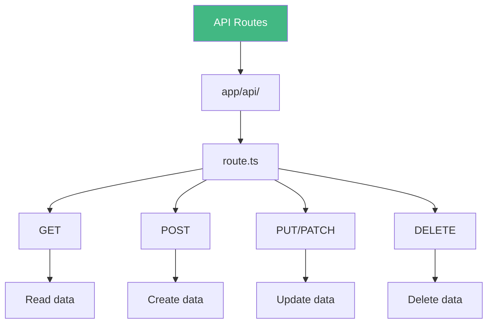

# Day 2 (Day 37): API Routes & RESTful APIs 🌐

**Duration:** 3-4 hours | **Difficulty:** ⭐⭐⭐ Hard

---

## 📖 Learning Objectives

- Create API routes
- Handle HTTP methods
- Build RESTful APIs
- Handle errors & validation
- Implement CORS

---

## 🌐 API Routes Overview



---

## 📝 Basic API Route

```tsx
// app/api/hello/route.ts
import { NextResponse } from 'next/server'

export async function GET() {
  return NextResponse.json({ 
    message: 'Hello from API!' 
  })
}

// Access at: http://localhost:3000/api/hello
```

---

## 🎯 HTTP Methods

```tsx
// app/api/posts/route.ts
import { NextRequest, NextResponse } from 'next/server'

// GET /api/posts - List all posts
export async function GET(request: NextRequest) {
  const searchParams = request.nextUrl.searchParams
  const page = searchParams.get('page') || '1'
  
  const posts = await db.posts.findMany({
    skip: (Number(page) - 1) * 10,
    take: 10
  })
  
  return NextResponse.json(posts)
}

// POST /api/posts - Create new post
export async function POST(request: NextRequest) {
  const body = await request.json()
  
  const post = await db.posts.create({
    data: {
      title: body.title,
      content: body.content
    }
  })
  
  return NextResponse.json(post, { status: 201 })
}
```

---

## 🎨 Dynamic API Routes

```tsx
// app/api/posts/[id]/route.ts
import { NextRequest, NextResponse } from 'next/server'

// GET /api/posts/123
export async function GET(
  request: NextRequest,
  { params }: { params: { id: string } }
) {
  const post = await db.posts.findUnique({
    where: { id: Number(params.id) }
  })
  
  if (!post) {
    return NextResponse.json(
      { error: 'Post not found' },
      { status: 404 }
    )
  }
  
  return NextResponse.json(post)
}

// PATCH /api/posts/123
export async function PATCH(
  request: NextRequest,
  { params }: { params: { id: string } }
) {
  const body = await request.json()
  
  const post = await db.posts.update({
    where: { id: Number(params.id) },
    data: body
  })
  
  return NextResponse.json(post)
}

// DELETE /api/posts/123
export async function DELETE(
  request: NextRequest,
  { params }: { params: { id: string } }
) {
  await db.posts.delete({
    where: { id: Number(params.id) }
  })
  
  return NextResponse.json({ success: true })
}
```

---

## ✅ Request Validation

```tsx
// app/api/posts/route.ts
import { NextRequest, NextResponse } from 'next/server'
import { z } from 'zod'

const postSchema = z.object({
  title: z.string().min(3).max(100),
  content: z.string().min(10),
  published: z.boolean().optional()
})

export async function POST(request: NextRequest) {
  try {
    const body = await request.json()
    
    // Validate
    const validatedData = postSchema.parse(body)
    
    // Create post
    const post = await db.posts.create({
      data: validatedData
    })
    
    return NextResponse.json(post, { status: 201 })
  } catch (error) {
    if (error instanceof z.ZodError) {
      return NextResponse.json(
        { errors: error.errors },
        { status: 400 }
      )
    }
    
    return NextResponse.json(
      { error: 'Internal server error' },
      { status: 500 }
    )
  }
}
```

---

## 🔐 Authentication Check

```tsx
// app/api/posts/route.ts
import { NextRequest, NextResponse } from 'next/server'
import { getServerSession } from 'next-auth'
import { authOptions } from '@/lib/auth'

export async function POST(request: NextRequest) {
  // Check authentication
  const session = await getServerSession(authOptions)
  
  if (!session) {
    return NextResponse.json(
      { error: 'Unauthorized' },
      { status: 401 }
    )
  }
  
  const body = await request.json()
  
  const post = await db.posts.create({
    data: {
      ...body,
      authorId: session.user.id
    }
  })
  
  return NextResponse.json(post)
}
```

---

## 📊 Complete CRUD API

```tsx
// app/api/users/route.ts
import { NextRequest, NextResponse } from 'next/server'
import { z } from 'zod'

const userSchema = z.object({
  name: z.string().min(2),
  email: z.string().email(),
  age: z.number().min(18).optional()
})

// GET /api/users
export async function GET(request: NextRequest) {
  const searchParams = request.nextUrl.searchParams
  const search = searchParams.get('search')
  
  const users = await db.users.findMany({
    where: search ? {
      name: { contains: search, mode: 'insensitive' }
    } : undefined,
    select: {
      id: true,
      name: true,
      email: true,
      createdAt: true
    }
  })
  
  return NextResponse.json({ users, count: users.length })
}

// POST /api/users
export async function POST(request: NextRequest) {
  try {
    const body = await request.json()
    const validatedData = userSchema.parse(body)
    
    // Check if email exists
    const existing = await db.users.findUnique({
      where: { email: validatedData.email }
    })
    
    if (existing) {
      return NextResponse.json(
        { error: 'Email already exists' },
        { status: 409 }
      )
    }
    
    const user = await db.users.create({
      data: validatedData
    })
    
    return NextResponse.json(user, { status: 201 })
  } catch (error) {
    if (error instanceof z.ZodError) {
      return NextResponse.json(
        { errors: error.errors },
        { status: 400 }
      )
    }
    
    return NextResponse.json(
      { error: 'Internal server error' },
      { status: 500 }
    )
  }
}
```

```tsx
// app/api/users/[id]/route.ts
import { NextRequest, NextResponse } from 'next/server'

// GET /api/users/123
export async function GET(
  request: NextRequest,
  { params }: { params: { id: string } }
) {
  const user = await db.users.findUnique({
    where: { id: Number(params.id) }
  })
  
  if (!user) {
    return NextResponse.json(
      { error: 'User not found' },
      { status: 404 }
    )
  }
  
  return NextResponse.json(user)
}

// PUT /api/users/123
export async function PUT(
  request: NextRequest,
  { params }: { params: { id: string } }
) {
  const body = await request.json()
  
  try {
    const user = await db.users.update({
      where: { id: Number(params.id) },
      data: body
    })
    
    return NextResponse.json(user)
  } catch (error) {
    return NextResponse.json(
      { error: 'User not found' },
      { status: 404 }
    )
  }
}

// DELETE /api/users/123
export async function DELETE(
  request: NextRequest,
  { params }: { params: { id: string } }
) {
  try {
    await db.users.delete({
      where: { id: Number(params.id) }
    })
    
    return NextResponse.json({ success: true })
  } catch (error) {
    return NextResponse.json(
      { error: 'User not found' },
      { status: 404 }
    )
  }
}
```

---

## 🌐 CORS Configuration

```tsx
// app/api/public/route.ts
import { NextRequest, NextResponse } from 'next/server'

export async function GET(request: NextRequest) {
  const response = NextResponse.json({ message: 'Public API' })
  
  // Add CORS headers
  response.headers.set('Access-Control-Allow-Origin', '*')
  response.headers.set('Access-Control-Allow-Methods', 'GET, POST, PUT, DELETE')
  response.headers.set('Access-Control-Allow-Headers', 'Content-Type, Authorization')
  
  return response
}

export async function OPTIONS(request: NextRequest) {
  return new NextResponse(null, {
    status: 200,
    headers: {
      'Access-Control-Allow-Origin': '*',
      'Access-Control-Allow-Methods': 'GET, POST, PUT, DELETE',
      'Access-Control-Allow-Headers': 'Content-Type, Authorization',
    },
  })
}
```

---

## 📁 File Upload API

```tsx
// app/api/upload/route.ts
import { NextRequest, NextResponse } from 'next/server'
import { writeFile } from 'fs/promises'
import { join } from 'path'

export async function POST(request: NextRequest) {
  try {
    const formData = await request.formData()
    const file = formData.get('file') as File
    
    if (!file) {
      return NextResponse.json(
        { error: 'No file provided' },
        { status: 400 }
      )
    }
    
    // Validate file type
    const allowedTypes = ['image/jpeg', 'image/png', 'image/gif']
    if (!allowedTypes.includes(file.type)) {
      return NextResponse.json(
        { error: 'Invalid file type' },
        { status: 400 }
      )
    }
    
    // Validate file size (5MB max)
    if (file.size > 5 * 1024 * 1024) {
      return NextResponse.json(
        { error: 'File too large' },
        { status: 400 }
      )
    }
    
    const bytes = await file.arrayBuffer()
    const buffer = Buffer.from(bytes)
    
    const filename = `${Date.now()}-${file.name}`
    const path = join(process.cwd(), 'public', 'uploads', filename)
    
    await writeFile(path, buffer)
    
    return NextResponse.json({
      success: true,
      url: `/uploads/${filename}`
    })
  } catch (error) {
    return NextResponse.json(
      { error: 'Upload failed' },
      { status: 500 }
    )
  }
}
```

---

## 🔄 Pagination & Filtering

```tsx
// app/api/products/route.ts
import { NextRequest, NextResponse } from 'next/server'

export async function GET(request: NextRequest) {
  const searchParams = request.nextUrl.searchParams
  
  // Pagination
  const page = Number(searchParams.get('page')) || 1
  const limit = Number(searchParams.get('limit')) || 10
  
  // Filtering
  const category = searchParams.get('category')
  const minPrice = searchParams.get('minPrice')
  const maxPrice = searchParams.get('maxPrice')
  
  // Sorting
  const sortBy = searchParams.get('sortBy') || 'createdAt'
  const order = searchParams.get('order') || 'desc'
  
  const where: any = {}
  
  if (category) {
    where.category = category
  }
  
  if (minPrice || maxPrice) {
    where.price = {}
    if (minPrice) where.price.gte = Number(minPrice)
    if (maxPrice) where.price.lte = Number(maxPrice)
  }
  
  const [products, total] = await Promise.all([
    db.products.findMany({
      where,
      skip: (page - 1) * limit,
      take: limit,
      orderBy: { [sortBy]: order }
    }),
    db.products.count({ where })
  ])
  
  return NextResponse.json({
    products,
    pagination: {
      page,
      limit,
      total,
      totalPages: Math.ceil(total / limit)
    }
  })
}
```

---

## 🎯 Error Handling Helper

```tsx
// lib/api-response.ts
import { NextResponse } from 'next/server'

export function successResponse(data: any, status = 200) {
  return NextResponse.json(data, { status })
}

export function errorResponse(message: string, status = 500) {
  return NextResponse.json({ error: message }, { status })
}

export function validationErrorResponse(errors: any) {
  return NextResponse.json({ errors }, { status: 400 })
}

// Usage
import { successResponse, errorResponse } from '@/lib/api-response'

export async function GET() {
  try {
    const data = await fetchData()
    return successResponse(data)
  } catch (error) {
    return errorResponse('Failed to fetch data')
  }
}
```

---

## ✅ Practice Exercise

Build a complete REST API:
1. Users CRUD endpoints
2. Posts with pagination
3. Comments system
4. File upload endpoint
5. Search & filter
6. Authentication checks
7. Error handling

---

**Tomorrow:** Middleware! 🛡️
