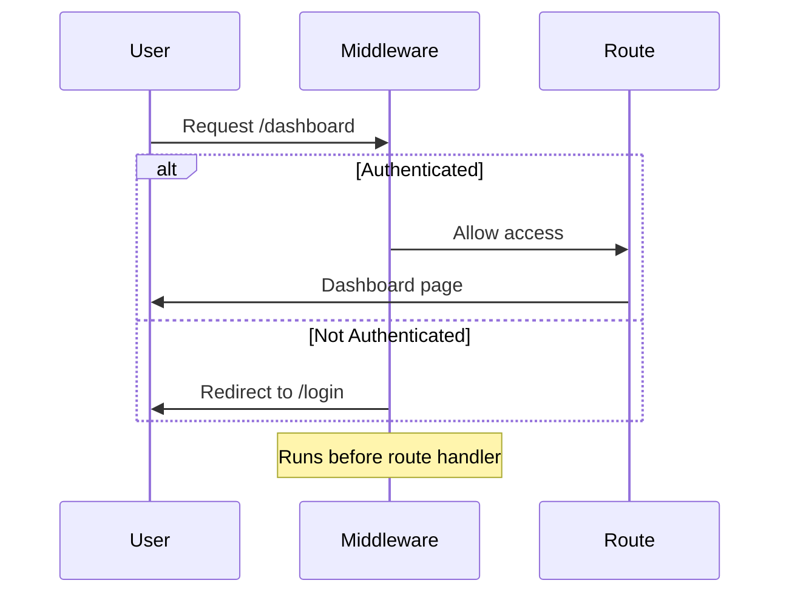

# Day 3 (Day 38): Middleware 🛡️

**Duration:** 2-3 hours | **Difficulty:** ⭐⭐ Medium

---

## 📖 Learning Objectives

- Understand middleware
- Implement auth middleware
- Handle redirects
- Set headers & cookies
- Build rate limiting

---

## 🛡️ What is Middleware?



**Middleware = Code that runs before requests are completed!**

---

## 📝 Basic Middleware

```tsx
// middleware.ts (root of project)
import { NextResponse } from 'next/server'
import type { NextRequest } from 'next/server'

export function middleware(request: NextRequest) {
  console.log('Middleware running for:', request.nextUrl.pathname)
  
  return NextResponse.next()
}

// Configure which routes use middleware
export const config = {
  matcher: [
    '/dashboard/:path*',
    '/api/:path*'
  ]
}
```

---

## 🔐 Authentication Middleware

```tsx
// middleware.ts
import { NextResponse } from 'next/server'
import type { NextRequest } from 'next/server'

export function middleware(request: NextRequest) {
  const token = request.cookies.get('token')?.value
  const isAuthPage = request.nextUrl.pathname.startsWith('/auth')
  const isProtectedRoute = request.nextUrl.pathname.startsWith('/dashboard')
  
  // Redirect to login if accessing protected route without token
  if (isProtectedRoute && !token) {
    const loginUrl = new URL('/auth/login', request.url)
    loginUrl.searchParams.set('from', request.nextUrl.pathname)
    return NextResponse.redirect(loginUrl)
  }
  
  // Redirect to dashboard if accessing auth pages with token
  if (isAuthPage && token) {
    return NextResponse.redirect(new URL('/dashboard', request.url))
  }
  
  return NextResponse.next()
}

export const config = {
  matcher: ['/dashboard/:path*', '/auth/:path*']
}
```

---

## 🎯 Role-Based Access

```tsx
// middleware.ts
import { NextResponse } from 'next/server'
import type { NextRequest } from 'next/server'
import { verifyToken } from '@/lib/auth'

export async function middleware(request: NextRequest) {
  const token = request.cookies.get('token')?.value
  
  if (!token) {
    return NextResponse.redirect(new URL('/login', request.url))
  }
  
  try {
    const payload = await verifyToken(token)
    
    // Check if accessing admin routes
    if (request.nextUrl.pathname.startsWith('/admin')) {
      if (payload.role !== 'admin') {
        return NextResponse.redirect(new URL('/unauthorized', request.url))
      }
    }
    
    // Add user info to headers for downstream use
    const requestHeaders = new Headers(request.headers)
    requestHeaders.set('x-user-id', payload.userId)
    requestHeaders.set('x-user-role', payload.role)
    
    return NextResponse.next({
      request: {
        headers: requestHeaders
      }
    })
  } catch (error) {
    return NextResponse.redirect(new URL('/login', request.url))
  }
}

export const config = {
  matcher: ['/dashboard/:path*', '/admin/:path*']
}
```

---

## 🌐 Custom Headers

```tsx
// middleware.ts
import { NextResponse } from 'next/server'
import type { NextRequest } from 'next/server'

export function middleware(request: NextRequest) {
  const response = NextResponse.next()
  
  // Add custom headers
  response.headers.set('X-Frame-Options', 'DENY')
  response.headers.set('X-Content-Type-Options', 'nosniff')
  response.headers.set('X-XSS-Protection', '1; mode=block')
  response.headers.set('Referrer-Policy', 'strict-origin-when-cross-origin')
  
  // Add CORS headers
  response.headers.set('Access-Control-Allow-Origin', '*')
  response.headers.set('Access-Control-Allow-Methods', 'GET, POST, PUT, DELETE')
  
  return response
}
```

---

## 🍪 Cookie Management

```tsx
// middleware.ts
import { NextResponse } from 'next/server'
import type { NextRequest } from 'next/server'

export function middleware(request: NextRequest) {
  const response = NextResponse.next()
  
  // Set cookie
  response.cookies.set('visited', 'true', {
    maxAge: 60 * 60 * 24 * 30, // 30 days
    httpOnly: true,
    secure: process.env.NODE_ENV === 'production',
    sameSite: 'lax'
  })
  
  // Read cookie
  const hasVisited = request.cookies.get('visited')
  
  if (!hasVisited) {
    // First-time visitor
    console.log('New visitor!')
  }
  
  return response
}
```

---

## 📊 Request Logging

```tsx
// middleware.ts
import { NextResponse } from 'next/server'
import type { NextRequest } from 'next/server'

export function middleware(request: NextRequest) {
  const start = Date.now()
  
  const response = NextResponse.next()
  
  // Log request details
  const duration = Date.now() - start
  
  console.log({
    method: request.method,
    path: request.nextUrl.pathname,
    duration: `${duration}ms`,
    userAgent: request.headers.get('user-agent'),
    ip: request.ip || request.headers.get('x-forwarded-for')
  })
  
  return response
}
```

---

## ⚡ Rate Limiting

```tsx
// lib/rate-limit.ts
const rateLimit = new Map<string, { count: number; resetTime: number }>()

export function checkRateLimit(ip: string, limit = 100, window = 60000) {
  const now = Date.now()
  const record = rateLimit.get(ip)
  
  if (!record || now > record.resetTime) {
    rateLimit.set(ip, { count: 1, resetTime: now + window })
    return { allowed: true, remaining: limit - 1 }
  }
  
  if (record.count >= limit) {
    return { 
      allowed: false, 
      remaining: 0,
      resetTime: record.resetTime
    }
  }
  
  record.count++
  return { allowed: true, remaining: limit - record.count }
}

// middleware.ts
import { NextResponse } from 'next/server'
import type { NextRequest } from 'next/server'
import { checkRateLimit } from '@/lib/rate-limit'

export function middleware(request: NextRequest) {
  const ip = request.ip || request.headers.get('x-forwarded-for') || 'unknown'
  
  const { allowed, remaining, resetTime } = checkRateLimit(ip)
  
  const response = allowed 
    ? NextResponse.next()
    : NextResponse.json(
        { error: 'Too many requests' },
        { status: 429 }
      )
  
  response.headers.set('X-RateLimit-Remaining', remaining.toString())
  
  if (!allowed && resetTime) {
    response.headers.set('X-RateLimit-Reset', resetTime.toString())
  }
  
  return response
}

export const config = {
  matcher: '/api/:path*'
}
```

---

## 🌍 Internationalization (i18n)

```tsx
// middleware.ts
import { NextResponse } from 'next/server'
import type { NextRequest } from 'next/server'

const locales = ['en', 'es', 'fr', 'de']
const defaultLocale = 'en'

export function middleware(request: NextRequest) {
  // Check if locale is in pathname
  const pathname = request.nextUrl.pathname
  const pathnameHasLocale = locales.some(
    locale => pathname.startsWith(`/${locale}/`) || pathname === `/${locale}`
  )
  
  if (pathnameHasLocale) return NextResponse.next()
  
  // Get locale from cookie or header
  const locale = 
    request.cookies.get('locale')?.value ||
    request.headers.get('accept-language')?.split(',')[0].split('-')[0] ||
    defaultLocale
  
  // Redirect to locale path
  const validLocale = locales.includes(locale) ? locale : defaultLocale
  request.nextUrl.pathname = `/${validLocale}${pathname}`
  
  return NextResponse.redirect(request.nextUrl)
}

export const config = {
  matcher: ['/((?!api|_next/static|_next/image|favicon.ico).*)']
}
```

---

## 🎯 A/B Testing

```tsx
// middleware.ts
import { NextResponse } from 'next/server'
import type { NextRequest } from 'next/server'

export function middleware(request: NextRequest) {
  // Get or assign variant
  let variant = request.cookies.get('ab-test-variant')?.value
  
  if (!variant) {
    // Random assignment: A or B
    variant = Math.random() < 0.5 ? 'A' : 'B'
  }
  
  const response = NextResponse.next()
  
  // Set cookie to persist variant
  response.cookies.set('ab-test-variant', variant, {
    maxAge: 60 * 60 * 24 * 30 // 30 days
  })
  
  // Add header for components to read
  response.headers.set('x-ab-test-variant', variant)
  
  // Optionally rewrite to different page
  if (variant === 'B' && request.nextUrl.pathname === '/landing') {
    return NextResponse.rewrite(new URL('/landing-b', request.url))
  }
  
  return response
}
```

---

## 🎨 Matcher Patterns

```tsx
// middleware.ts
export const config = {
  matcher: [
    // Match all paths except
    '/((?!api|_next/static|_next/image|favicon.ico).*)',
    
    // Or specific patterns
    '/dashboard/:path*',
    '/admin/:path*',
    
    // Multiple matchers
    ['/dashboard/:path*', '/admin/:path*'],
  ]
}
```

---

## ✅ Practice Exercise

Build middleware for:
1. Authentication protection
2. Role-based access control
3. Rate limiting for API
4. Request logging
5. Custom security headers
6. Cookie-based features
7. Redirect patterns

---

**Tomorrow:** Authentication Systems! 🔐
