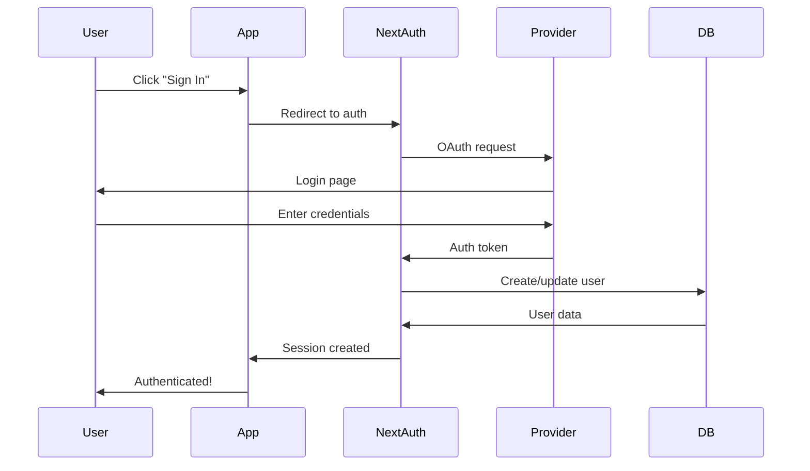

# Day 4 (Day 39): Authentication with NextAuth.js 🔐

**Duration:** 3-4 hours | **Difficulty:** ⭐⭐⭐ Hard

---

## 📖 Learning Objectives

- Setup NextAuth.js
- Implement authentication
- Use multiple providers
- Protect routes
- Manage sessions

---

## 🔐 Authentication Flow



---

## 🚀 Setup NextAuth.js

```bash
npm install next-auth
```

```tsx
// app/api/auth/[...nextauth]/route.ts
import NextAuth from 'next-auth'
import type { NextAuthOptions } from 'next-auth'
import GithubProvider from 'next-auth/providers/github'
import GoogleProvider from 'next-auth/providers/google'
import CredentialsProvider from 'next-auth/providers/credentials'

export const authOptions: NextAuthOptions = {
  providers: [
    GithubProvider({
      clientId: process.env.GITHUB_ID!,
      clientSecret: process.env.GITHUB_SECRET!,
    }),
    GoogleProvider({
      clientId: process.env.GOOGLE_ID!,
      clientSecret: process.env.GOOGLE_SECRET!,
    }),
    CredentialsProvider({
      name: 'Credentials',
      credentials: {
        email: { label: "Email", type: "email" },
        password: { label: "Password", type: "password" }
      },
      async authorize(credentials) {
        // Validate credentials
        const user = await db.user.findUnique({
          where: { email: credentials?.email }
        })
        
        if (user && await bcrypt.compare(credentials?.password || '', user.password)) {
          return {
            id: user.id,
            email: user.email,
            name: user.name
          }
        }
        
        return null
      }
    })
  ],
  pages: {
    signIn: '/auth/signin',
    signOut: '/auth/signout',
    error: '/auth/error',
  },
  callbacks: {
    async jwt({ token, user }) {
      if (user) {
        token.id = user.id
      }
      return token
    },
    async session({ session, token }) {
      if (session.user) {
        session.user.id = token.id as string
      }
      return session
    }
  },
  session: {
    strategy: 'jwt'
  },
  secret: process.env.NEXTAUTH_SECRET,
}

const handler = NextAuth(authOptions)

export { handler as GET, handler as POST }
```

---

## 🎨 Session Provider

```tsx
// app/providers.tsx
'use client'

import { SessionProvider } from 'next-auth/react'

export function Providers({ children }: { children: React.ReactNode }) {
  return (
    <SessionProvider>
      {children}
    </SessionProvider>
  )
}
```

```tsx
// app/layout.tsx
import { Providers } from './providers'

export default function RootLayout({ children }: { children: React.ReactNode }) {
  return (
    <html lang="en">
      <body>
        <Providers>
          {children}
        </Providers>
      </body>
    </html>
  )
}
```

---

## 🔑 Sign In Page

```tsx
// app/auth/signin/page.tsx
'use client'

import { signIn } from 'next-auth/react'
import { useState } from 'react'

export default function SignInPage() {
  const [email, setEmail] = useState('')
  const [password, setPassword] = useState('')
  const [isLoading, setIsLoading] = useState(false)
  
  const handleSubmit = async (e: React.FormEvent) => {
    e.preventDefault()
    setIsLoading(true)
    
    try {
      const result = await signIn('credentials', {
        email,
        password,
        redirect: false
      })
      
      if (result?.error) {
        alert('Invalid credentials')
      } else {
        window.location.href = '/dashboard'
      }
    } finally {
      setIsLoading(false)
    }
  }
  
  return (
    <div className="max-w-md mx-auto mt-12">
      <h1 className="text-3xl font-bold mb-6">Sign In</h1>
      
      <form onSubmit={handleSubmit} className="space-y-4">
        <div>
          <label htmlFor="email">Email</label>
          <input
            type="email"
            id="email"
            value={email}
            onChange={(e) => setEmail(e.target.value)}
            required
            className="w-full border p-2 rounded"
          />
        </div>
        
        <div>
          <label htmlFor="password">Password</label>
          <input
            type="password"
            id="password"
            value={password}
            onChange={(e) => setPassword(e.target.value)}
            required
            className="w-full border p-2 rounded"
          />
        </div>
        
        <button
          type="submit"
          disabled={isLoading}
          className="w-full bg-blue-600 text-white p-2 rounded"
        >
          {isLoading ? 'Signing in...' : 'Sign In'}
        </button>
      </form>
      
      <div className="mt-6 space-y-2">
        <button
          onClick={() => signIn('github', { callbackUrl: '/dashboard' })}
          className="w-full bg-gray-800 text-white p-2 rounded"
        >
          Sign in with GitHub
        </button>
        
        <button
          onClick={() => signIn('google', { callbackUrl: '/dashboard' })}
          className="w-full bg-red-600 text-white p-2 rounded"
        >
          Sign in with Google
        </button>
      </div>
    </div>
  )
}
```

---

## 👤 Use Session in Client Components

```tsx
// components/UserMenu.tsx
'use client'

import { useSession, signOut } from 'next-auth/react'
import Image from 'next/image'

export default function UserMenu() {
  const { data: session, status } = useSession()
  
  if (status === 'loading') {
    return <div>Loading...</div>
  }
  
  if (!session) {
    return (
      <a href="/auth/signin" className="text-blue-600">
        Sign In
      </a>
    )
  }
  
  return (
    <div className="flex items-center gap-4">
      <Image
        src={session.user?.image || '/default-avatar.png'}
        alt={session.user?.name || 'User'}
        width={40}
        height={40}
        className="rounded-full"
      />
      <span>{session.user?.name}</span>
      <button
        onClick={() => signOut()}
        className="text-red-600"
      >
        Sign Out
      </button>
    </div>
  )
}
```

---

## 🖥️ Use Session in Server Components

```tsx
// app/dashboard/page.tsx
import { getServerSession } from 'next-auth'
import { authOptions } from '@/app/api/auth/[...nextauth]/route'
import { redirect } from 'next/navigation'

export default async function DashboardPage() {
  const session = await getServerSession(authOptions)
  
  if (!session) {
    redirect('/auth/signin')
  }
  
  return (
    <div>
      <h1>Welcome, {session.user?.name}!</h1>
      <p>Email: {session.user?.email}</p>
    </div>
  )
}
```

---

## 🛡️ Protected API Routes

```tsx
// app/api/protected/route.ts
import { NextRequest, NextResponse } from 'next/server'
import { getServerSession } from 'next-auth'
import { authOptions } from '@/app/api/auth/[...nextauth]/route'

export async function GET(request: NextRequest) {
  const session = await getServerSession(authOptions)
  
  if (!session) {
    return NextResponse.json(
      { error: 'Unauthorized' },
      { status: 401 }
    )
  }
  
  return NextResponse.json({
    message: 'Protected data',
    userId: session.user.id
  })
}
```

---

## 🎯 Role-Based Access

```tsx
// lib/auth.ts
import { getServerSession } from 'next-auth'
import { authOptions } from '@/app/api/auth/[...nextauth]/route'

export async function getCurrentUser() {
  const session = await getServerSession(authOptions)
  return session?.user
}

export async function requireAuth() {
  const user = await getCurrentUser()
  
  if (!user) {
    redirect('/auth/signin')
  }
  
  return user
}

export async function requireRole(role: string) {
  const user = await requireAuth()
  
  if (user.role !== role) {
    redirect('/unauthorized')
  }
  
  return user
}
```

```tsx
// app/admin/page.tsx
import { requireRole } from '@/lib/auth'

export default async function AdminPage() {
  await requireRole('admin')
  
  return <h1>Admin Dashboard</h1>
}
```

---

## 🎨 Complete Auth Example

```tsx
// types/next-auth.d.ts
import 'next-auth'

declare module 'next-auth' {
  interface Session {
    user: {
      id: string
      email: string
      name: string
      role: string
      image?: string
    }
  }
  
  interface User {
    id: string
    email: string
    name: string
    role: string
  }
}

declare module 'next-auth/jwt' {
  interface JWT {
    id: string
    role: string
  }
}
```

```tsx
// app/api/auth/[...nextauth]/route.ts
import NextAuth from 'next-auth'
import type { NextAuthOptions } from 'next-auth'
import CredentialsProvider from 'next-auth/providers/credentials'
import { db } from '@/lib/db'
import bcrypt from 'bcryptjs'

export const authOptions: NextAuthOptions = {
  providers: [
    CredentialsProvider({
      name: 'Credentials',
      credentials: {
        email: { label: "Email", type: "email" },
        password: { label: "Password", type: "password" }
      },
      async authorize(credentials) {
        if (!credentials?.email || !credentials?.password) {
          return null
        }
        
        const user = await db.user.findUnique({
          where: { email: credentials.email }
        })
        
        if (!user || !user.hashedPassword) {
          return null
        }
        
        const isValid = await bcrypt.compare(
          credentials.password,
          user.hashedPassword
        )
        
        if (!isValid) {
          return null
        }
        
        return {
          id: user.id,
          email: user.email,
          name: user.name,
          role: user.role
        }
      }
    })
  ],
  callbacks: {
    async jwt({ token, user }) {
      if (user) {
        token.id = user.id
        token.role = user.role
      }
      return token
    },
    async session({ session, token }) {
      if (session.user) {
        session.user.id = token.id as string
        session.user.role = token.role as string
      }
      return session
    }
  },
  pages: {
    signIn: '/auth/signin',
  },
  session: {
    strategy: 'jwt'
  },
  secret: process.env.NEXTAUTH_SECRET,
}

const handler = NextAuth(authOptions)
export { handler as GET, handler as POST }
```

---

## 📧 Email/Password Registration

```tsx
// app/api/auth/register/route.ts
import { NextRequest, NextResponse } from 'next/server'
import bcrypt from 'bcryptjs'
import { db } from '@/lib/db'
import { z } from 'zod'

const registerSchema = z.object({
  name: z.string().min(2),
  email: z.string().email(),
  password: z.string().min(8)
})

export async function POST(request: NextRequest) {
  try {
    const body = await request.json()
    const { name, email, password } = registerSchema.parse(body)
    
    // Check if user exists
    const existingUser = await db.user.findUnique({
      where: { email }
    })
    
    if (existingUser) {
      return NextResponse.json(
        { error: 'Email already in use' },
        { status: 409 }
      )
    }
    
    // Hash password
    const hashedPassword = await bcrypt.hash(password, 10)
    
    // Create user
    const user = await db.user.create({
      data: {
        name,
        email,
        hashedPassword,
        role: 'user'
      }
    })
    
    return NextResponse.json({
      user: {
        id: user.id,
        email: user.email,
        name: user.name
      }
    }, { status: 201 })
  } catch (error) {
    if (error instanceof z.ZodError) {
      return NextResponse.json(
        { errors: error.errors },
        { status: 400 }
      )
    }
    
    return NextResponse.json(
      { error: 'Internal server error' },
      { status: 500 }
    )
  }
}
```

---

## ✅ Practice Exercise

Build complete authentication:
1. Sign up with email/password
2. Sign in with credentials
3. OAuth with GitHub/Google
4. Protected dashboard
5. Role-based admin panel
6. User profile page
7. Password reset flow

---

**Tomorrow:** Database Integration! 🗄️
