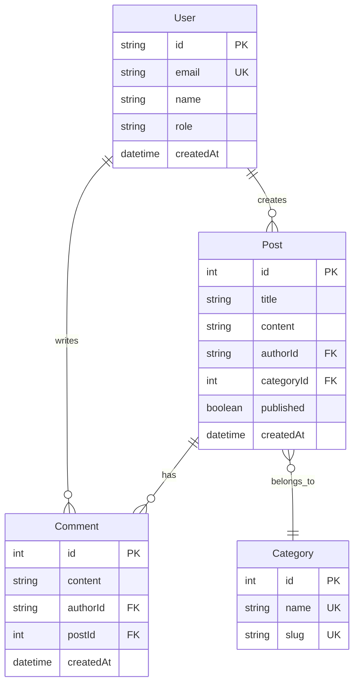

# Day 5 (Day 40): Database Integration with Prisma 🗄️

**Duration:** 3-4 hours | **Difficulty:** ⭐⭐⭐ Hard

---

## 📖 Learning Objectives

- Setup Prisma ORM
- Design database schemas
- Perform CRUD operations
- Use relations
- Implement migrations

---

## 🗄️ Database Architecture



---

## 🚀 Setup Prisma

```bash
npm install prisma @prisma/client
npx prisma init
```

```prisma
// prisma/schema.prisma
generator client {
  provider = "prisma-client-js"
}

datasource db {
  provider = "postgresql"
  url      = env("DATABASE_URL")
}

model User {
  id            String    @id @default(cuid())
  email         String    @unique
  name          String?
  hashedPassword String?
  role          String    @default("user")
  image         String?
  createdAt     DateTime  @default(now())
  updatedAt     DateTime  @updatedAt
  
  posts         Post[]
  comments      Comment[]
}

model Post {
  id          Int       @id @default(autoincrement())
  title       String
  slug        String    @unique
  content     String
  excerpt     String?
  published   Boolean   @default(false)
  authorId    String
  categoryId  Int?
  views       Int       @default(0)
  likes       Int       @default(0)
  createdAt   DateTime  @default(now())
  updatedAt   DateTime  @updatedAt
  
  author      User      @relation(fields: [authorId], references: [id], onDelete: Cascade)
  category    Category? @relation(fields: [categoryId], references: [id])
  comments    Comment[]
  
  @@index([authorId])
  @@index([categoryId])
}

model Category {
  id        Int      @id @default(autoincrement())
  name      String   @unique
  slug      String   @unique
  createdAt DateTime @default(now())
  
  posts     Post[]
}

model Comment {
  id        Int      @id @default(autoincrement())
  content   String
  authorId  String
  postId    Int
  createdAt DateTime @default(now())
  updatedAt DateTime @updatedAt
  
  author    User     @relation(fields: [authorId], references: [id], onDelete: Cascade)
  post      Post     @relation(fields: [postId], references: [id], onDelete: Cascade)
  
  @@index([authorId])
  @@index([postId])
}
```

---

## 🎯 Prisma Client Setup

```tsx
// lib/db.ts
import { PrismaClient } from '@prisma/client'

const globalForPrisma = globalThis as unknown as {
  prisma: PrismaClient | undefined
}

export const db = globalForPrisma.prisma ?? new PrismaClient({
  log: process.env.NODE_ENV === 'development' ? ['query', 'error', 'warn'] : ['error'],
})

if (process.env.NODE_ENV !== 'production') {
  globalForPrisma.prisma = db
}
```

---

## 📝 Run Migrations

```bash
# Create migration
npx prisma migrate dev --name init

# Generate Prisma Client
npx prisma generate

# Open Prisma Studio
npx prisma studio
```

---

## 🎨 CRUD Operations

### **Create**
```tsx
// app/actions.ts
'use server'

import { db } from '@/lib/db'
import { revalidatePath } from 'next/cache'

export async function createPost(formData: FormData) {
  const title = formData.get('title') as string
  const content = formData.get('content') as string
  const authorId = formData.get('authorId') as string
  
  const slug = title.toLowerCase().replace(/\s+/g, '-')
  
  await db.post.create({
    data: {
      title,
      slug,
      content,
      authorId,
      published: false
    }
  })
  
  revalidatePath('/blog')
}
```

### **Read**
```tsx
// app/blog/page.tsx
import { db } from '@/lib/db'

export default async function BlogPage() {
  // Get all published posts with author
  const posts = await db.post.findMany({
    where: { published: true },
    include: {
      author: {
        select: {
          name: true,
          image: true
        }
      },
      category: true,
      _count: {
        select: { comments: true }
      }
    },
    orderBy: { createdAt: 'desc' }
  })
  
  return (
    <div>
      {posts.map(post => (
        <article key={post.id}>
          <h2>{post.title}</h2>
          <p>By {post.author.name}</p>
          <p>{post._count.comments} comments</p>
        </article>
      ))}
    </div>
  )
}
```

### **Update**
```tsx
'use server'

export async function updatePost(id: number, data: Partial<Post>) {
  await db.post.update({
    where: { id },
    data: {
      ...data,
      updatedAt: new Date()
    }
  })
  
  revalidatePath(`/blog/${id}`)
}
```

### **Delete**
```tsx
'use server'

export async function deletePost(id: number) {
  await db.post.delete({
    where: { id }
  })
  
  revalidatePath('/blog')
}
```

---

## 🔍 Advanced Queries

### **Filtering & Sorting**
```tsx
const posts = await db.post.findMany({
  where: {
    published: true,
    title: {
      contains: 'Next.js',
      mode: 'insensitive'
    },
    author: {
      role: 'admin'
    }
  },
  orderBy: [
    { views: 'desc' },
    { createdAt: 'desc' }
  ],
  take: 10,
  skip: 0
})
```

### **Pagination**
```tsx
async function getPaginatedPosts(page: number, limit: number) {
  const [posts, total] = await Promise.all([
    db.post.findMany({
      skip: (page - 1) * limit,
      take: limit,
      orderBy: { createdAt: 'desc' }
    }),
    db.post.count()
  ])
  
  return {
    posts,
    totalPages: Math.ceil(total / limit),
    currentPage: page
  }
}
```

### **Aggregations**
```tsx
const stats = await db.post.aggregate({
  _count: true,
  _avg: {
    views: true,
    likes: true
  },
  _sum: {
    views: true
  },
  where: {
    published: true
  }
})
```

---

## 🔗 Relations

### **Create with Relations**
```tsx
await db.post.create({
  data: {
    title: 'My Post',
    content: 'Content here',
    author: {
      connect: { id: userId }
    },
    category: {
      connectOrCreate: {
        where: { slug: 'tech' },
        create: {
          name: 'Technology',
          slug: 'tech'
        }
      }
    },
    comments: {
      create: [
        {
          content: 'Great post!',
          authorId: commentAuthorId
        }
      ]
    }
  }
})
```

### **Query with Relations**
```tsx
const post = await db.post.findUnique({
  where: { id: 1 },
  include: {
    author: true,
    category: true,
    comments: {
      include: {
        author: {
          select: {
            name: true,
            image: true
          }
        }
      },
      orderBy: { createdAt: 'desc' }
    }
  }
})
```

---

## 🔄 Transactions

```tsx
await db.$transaction(async (tx) => {
  // Create post
  const post = await tx.post.create({
    data: {
      title: 'New Post',
      content: 'Content',
      authorId: userId
    }
  })
  
  // Increment user's post count
  await tx.user.update({
    where: { id: userId },
    data: {
      postCount: { increment: 1 }
    }
  })
  
  // Create notification
  await tx.notification.create({
    data: {
      userId,
      message: 'Post created successfully'
    }
  })
})
```

---

## 🎯 Complete Example: Blog System

```tsx
// lib/blog.ts
import { db } from '@/lib/db'

export async function createBlogPost({
  title,
  content,
  excerpt,
  categorySlug,
  authorId
}: {
  title: string
  content: string
  excerpt: string
  categorySlug: string
  authorId: string
}) {
  const slug = title.toLowerCase().replace(/\s+/g, '-').slice(0, 100)
  
  return await db.post.create({
    data: {
      title,
      slug,
      content,
      excerpt,
      published: false,
      author: {
        connect: { id: authorId }
      },
      category: {
        connectOrCreate: {
          where: { slug: categorySlug },
          create: {
            name: categorySlug,
            slug: categorySlug
          }
        }
      }
    },
    include: {
      author: {
        select: {
          name: true,
          email: true
        }
      },
      category: true
    }
  })
}

export async function getPublishedPosts({
  page = 1,
  limit = 10,
  categorySlug,
  search
}: {
  page?: number
  limit?: number
  categorySlug?: string
  search?: string
}) {
  const where = {
    published: true,
    ...(categorySlug && {
      category: {
        slug: categorySlug
      }
    }),
    ...(search && {
      OR: [
        { title: { contains: search, mode: 'insensitive' as const } },
        { content: { contains: search, mode: 'insensitive' as const } }
      ]
    })
  }
  
  const [posts, total] = await Promise.all([
    db.post.findMany({
      where,
      include: {
        author: {
          select: {
            name: true,
            image: true
          }
        },
        category: true,
        _count: {
          select: { comments: true }
        }
      },
      orderBy: { createdAt: 'desc' },
      skip: (page - 1) * limit,
      take: limit
    }),
    db.post.count({ where })
  ])
  
  return {
    posts,
    pagination: {
      page,
      limit,
      total,
      totalPages: Math.ceil(total / limit)
    }
  }
}

export async function getPostBySlug(slug: string) {
  const post = await db.post.findUnique({
    where: { slug },
    include: {
      author: {
        select: {
          name: true,
          image: true,
          email: true
        }
      },
      category: true,
      comments: {
        include: {
          author: {
            select: {
              name: true,
              image: true
            }
          }
        },
        orderBy: { createdAt: 'desc' }
      }
    }
  })
  
  // Increment view count
  if (post) {
    await db.post.update({
      where: { id: post.id },
      data: { views: { increment: 1 } }
    })
  }
  
  return post
}

export async function addComment({
  postId,
  content,
  authorId
}: {
  postId: number
  content: string
  authorId: string
}) {
  return await db.comment.create({
    data: {
      content,
      post: {
        connect: { id: postId }
      },
      author: {
        connect: { id: authorId }
      }
    },
    include: {
      author: {
        select: {
          name: true,
          image: true
        }
      }
    }
  })
}
```

---

## ✅ Practice Exercise

Build database operations:
1. Design schema for your app
2. Implement CRUD operations
3. Add pagination & filtering
4. Use transactions
5. Create relations
6. Add aggregations
7. Build complete blog system

---

**Tomorrow:** Deployment & Optimization! 🚀
