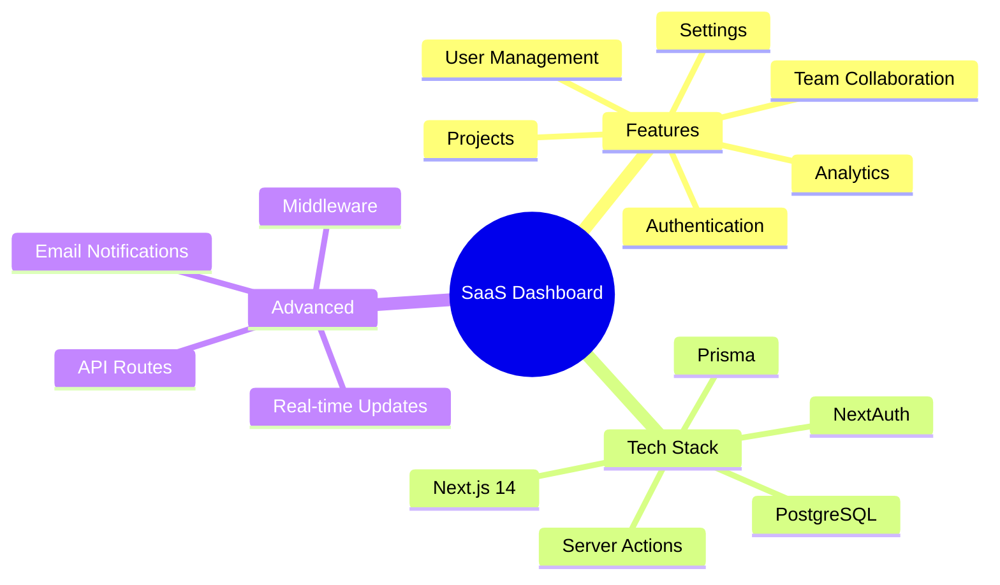
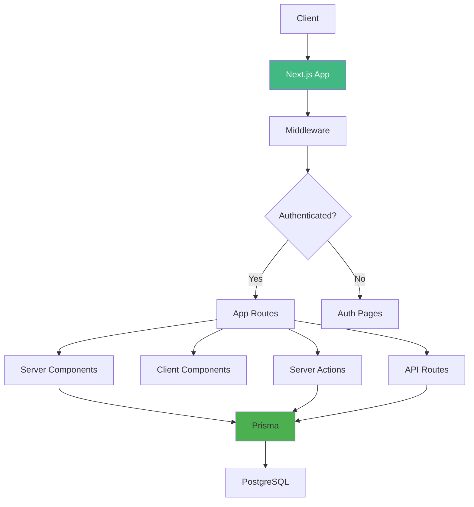

# Day 7 (Day 42): Advanced Project - Full-Stack SaaS App 🎉

**Duration:** 6-8 hours | **Difficulty:** ⭐⭐⭐ Project

---

## 🎯 Project Overview

Build a complete **SaaS Dashboard** using all Week 6 concepts!



---

## 📋 Requirements

### **Must Have:**
1. ✅ User authentication (email & OAuth)
2. ✅ User dashboard
3. ✅ Project management
4. ✅ Team collaboration
5. ✅ Role-based access
6. ✅ API endpoints
7. ✅ Server actions for mutations
8. ✅ Middleware protection
9. ✅ Database with Prisma
10. ✅ Deployment ready

---

## 🏗️ Architecture



---

## 📊 Database Schema

```prisma
// prisma/schema.prisma
model User {
  id            String    @id @default(cuid())
  email         String    @unique
  name          String?
  image         String?
  hashedPassword String?
  role          Role      @default(USER)
  createdAt     DateTime  @default(now())
  updatedAt     DateTime  @updatedAt
  
  accounts      Account[]
  sessions      Session[]
  ownedTeams    Team[]    @relation("TeamOwner")
  teamMembers   TeamMember[]
  projects      Project[]
  tasks         Task[]
}

enum Role {
  USER
  ADMIN
}

model Account {
  id                String  @id @default(cuid())
  userId            String
  type              String
  provider          String
  providerAccountId String
  refresh_token     String?
  access_token      String?
  expires_at        Int?
  token_type        String?
  scope             String?
  id_token          String?
  session_state     String?
  
  user User @relation(fields: [userId], references: [id], onDelete: Cascade)
  
  @@unique([provider, providerAccountId])
}

model Session {
  id           String   @id @default(cuid())
  sessionToken String   @unique
  userId       String
  expires      DateTime
  user         User     @relation(fields: [userId], references: [id], onDelete: Cascade)
}

model Team {
  id          String       @id @default(cuid())
  name        String
  slug        String       @unique
  ownerId     String
  createdAt   DateTime     @default(now())
  
  owner       User         @relation("TeamOwner", fields: [ownerId], references: [id])
  members     TeamMember[]
  projects    Project[]
}

model TeamMember {
  id        String   @id @default(cuid())
  teamId    String
  userId    String
  role      MemberRole @default(MEMBER)
  joinedAt  DateTime @default(now())
  
  team      Team     @relation(fields: [teamId], references: [id], onDelete: Cascade)
  user      User     @relation(fields: [userId], references: [id], onDelete: Cascade)
  
  @@unique([teamId, userId])
}

enum MemberRole {
  OWNER
  ADMIN
  MEMBER
}

model Project {
  id          String   @id @default(cuid())
  name        String
  description String?
  teamId      String
  ownerId     String
  status      ProjectStatus @default(ACTIVE)
  createdAt   DateTime @default(now())
  updatedAt   DateTime @updatedAt
  
  team        Team     @relation(fields: [teamId], references: [id], onDelete: Cascade)
  owner       User     @relation(fields: [ownerId], references: [id])
  tasks       Task[]
}

enum ProjectStatus {
  ACTIVE
  ARCHIVED
  COMPLETED
}

model Task {
  id          String     @id @default(cuid())
  title       String
  description String?
  projectId   String
  assigneeId  String?
  status      TaskStatus @default(TODO)
  priority    Priority   @default(MEDIUM)
  dueDate     DateTime?
  createdAt   DateTime   @default(now())
  updatedAt   DateTime   @updatedAt
  
  project     Project    @relation(fields: [projectId], references: [id], onDelete: Cascade)
  assignee    User?      @relation(fields: [assigneeId], references: [id])
}

enum TaskStatus {
  TODO
  IN_PROGRESS
  REVIEW
  DONE
}

enum Priority {
  LOW
  MEDIUM
  HIGH
  URGENT
}
```

---

## 🗺️ File Structure

```
src/
├── app/
│   ├── (auth)/
│   │   ├── login/page.tsx
│   │   └── register/page.tsx
│   ├── (dashboard)/
│   │   ├── layout.tsx
│   │   ├── dashboard/page.tsx
│   │   ├── projects/
│   │   │   ├── page.tsx
│   │   │   ├── [id]/page.tsx
│   │   │   └── new/page.tsx
│   │   ├── teams/
│   │   │   ├── page.tsx
│   │   │   └── [slug]/page.tsx
│   │   └── settings/
│   │       └── page.tsx
│   ├── api/
│   │   ├── auth/[...nextauth]/route.ts
│   │   ├── projects/route.ts
│   │   ├── tasks/route.ts
│   │   └── teams/route.ts
│   └── actions.ts
├── components/
│   ├── dashboard/
│   │   ├── Sidebar.tsx
│   │   ├── StatsCard.tsx
│   │   └── RecentActivity.tsx
│   ├── projects/
│   │   ├── ProjectCard.tsx
│   │   ├── ProjectForm.tsx
│   │   └── TaskList.tsx
│   └── ui/
│       ├── Button.tsx
│       ├── Input.tsx
│       └── Modal.tsx
├── lib/
│   ├── db.ts
│   ├── auth.ts
│   └── utils.ts
└── middleware.ts
```

---

## 🎨 Key Features Implementation

### **1. Authentication**
```tsx
// app/api/auth/[...nextauth]/route.ts
import NextAuth from 'next-auth'
import { PrismaAdapter } from '@auth/prisma-adapter'
import { db } from '@/lib/db'
import GithubProvider from 'next-auth/providers/github'
import CredentialsProvider from 'next-auth/providers/credentials'

export const authOptions = {
  adapter: PrismaAdapter(db),
  providers: [
    GithubProvider({
      clientId: process.env.GITHUB_ID!,
      clientSecret: process.env.GITHUB_SECRET!,
    }),
    CredentialsProvider({
      // Credentials config
    })
  ],
  callbacks: {
    session: async ({ session, token }) => {
      if (session.user) {
        session.user.id = token.sub!
        session.user.role = token.role as Role
      }
      return session
    },
    jwt: async ({ token, user }) => {
      if (user) {
        token.role = user.role
      }
      return token
    }
  }
}

const handler = NextAuth(authOptions)
export { handler as GET, handler as POST }
```

### **2. Middleware Protection**
```tsx
// middleware.ts
import { withAuth } from 'next-auth/middleware'

export default withAuth({
  callbacks: {
    authorized: ({ token, req }) => {
      const pathname = req.nextUrl.pathname
      
      // Admin routes
      if (pathname.startsWith('/admin')) {
        return token?.role === 'ADMIN'
      }
      
      // Dashboard routes
      if (pathname.startsWith('/dashboard')) {
        return !!token
      }
      
      return true
    }
  }
})

export const config = {
  matcher: ['/dashboard/:path*', '/admin/:path*']
}
```

### **3. Server Actions**
```tsx
// app/actions.ts
'use server'

import { db } from '@/lib/db'
import { revalidatePath } from 'next/cache'
import { getServerSession } from 'next-auth'
import { authOptions } from './api/auth/[...nextauth]/route'

export async function createProject(formData: FormData) {
  const session = await getServerSession(authOptions)
  
  if (!session) {
    throw new Error('Unauthorized')
  }
  
  const name = formData.get('name') as string
  const description = formData.get('description') as string
  const teamId = formData.get('teamId') as string
  
  const project = await db.project.create({
    data: {
      name,
      description,
      teamId,
      ownerId: session.user.id
    }
  })
  
  revalidatePath('/dashboard/projects')
  return project
}

export async function createTask(projectId: string, data: TaskData) {
  const session = await getServerSession(authOptions)
  
  if (!session) {
    throw new Error('Unauthorized')
  }
  
  const task = await db.task.create({
    data: {
      ...data,
      projectId
    }
  })
  
  revalidatePath(`/dashboard/projects/${projectId}`)
  return task
}
```

### **4. Dashboard Page**
```tsx
// app/(dashboard)/dashboard/page.tsx
import { getServerSession } from 'next-auth'
import { authOptions } from '@/app/api/auth/[...nextauth]/route'
import { db } from '@/lib/db'
import StatsCard from '@/components/dashboard/StatsCard'
import RecentProjects from '@/components/dashboard/RecentProjects'

export default async function DashboardPage() {
  const session = await getServerSession(authOptions)
  
  const [projectCount, taskCount, teamCount] = await Promise.all([
    db.project.count({ where: { ownerId: session!.user.id } }),
    db.task.count({ where: { assigneeId: session!.user.id } }),
    db.teamMember.count({ where: { userId: session!.user.id } })
  ])
  
  const recentProjects = await db.project.findMany({
    where: { ownerId: session!.user.id },
    take: 5,
    orderBy: { updatedAt: 'desc' },
    include: {
      _count: { select: { tasks: true } }
    }
  })
  
  return (
    <div>
      <h1>Welcome, {session!.user.name}!</h1>
      
      <div className="grid grid-cols-3 gap-4 my-6">
        <StatsCard title="Projects" value={projectCount} />
        <StatsCard title="Tasks" value={taskCount} />
        <StatsCard title="Teams" value={teamCount} />
      </div>
      
      <RecentProjects projects={recentProjects} />
    </div>
  )
}
```

---

## ✅ Implementation Steps

### **Phase 1: Setup (1 hour)**
1. Initialize Next.js project
2. Setup Prisma & database
3. Configure NextAuth
4. Create base layouts

### **Phase 2: Authentication (2 hours)**
5. Implement login/register
6. OAuth providers
7. Session management
8. Middleware protection

### **Phase 3: Core Features (3 hours)**
9. Dashboard overview
10. Project CRUD
11. Task management
12. Team collaboration

### **Phase 4: Polish (2 hours)**
13. API routes
14. Error handling
15. Loading states
16. Responsive design

---

## 🎯 Features Checklist

**Authentication:**
- [ ] Email/password login
- [ ] OAuth (GitHub/Google)
- [ ] Session management
- [ ] Role-based access

**Dashboard:**
- [ ] Overview with stats
- [ ] Recent activity
- [ ] Quick actions
- [ ] Search functionality

**Projects:**
- [ ] Create/edit/delete
- [ ] Project details
- [ ] Task lists
- [ ] Team members

**Teams:**
- [ ] Create teams
- [ ] Invite members
- [ ] Member management
- [ ] Team settings

**Tasks:**
- [ ] Create/edit/delete tasks
- [ ] Assign to members
- [ ] Status updates
- [ ] Priority levels

---

## 🚀 Bonus Features

1. **Real-time updates** with WebSockets
2. **Email notifications** with Resend
3. **File uploads** with Uploadthing
4. **Analytics dashboard**
5. **Activity feed**
6. **Search** with full-text search
7. **Export** functionality

---

**Congratulations on completing Week 6!** 🎉

**You've mastered:**
- Server Actions & Forms
- API Routes
- Middleware
- Authentication
- Database Integration
- Deployment

**Next:** Build more advanced projects! 🚀
