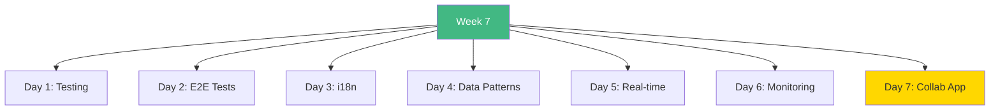

# Week 7: Testing, i18n & Advanced Patterns - Index 📑

**Your complete Week 7 learning guide**

---

## 🗂️ Week Structure

---

## 📅 Daily Breakdown

### **Day 1 (Day 43): Testing with Vitest** ⭐⭐⭐
- 📖 [`day1/README.md`](day1/README.md)
- Vitest setup
- Component testing
- Server Action tests
- Mocking strategies

**Topics:** Unit tests, integration tests, coverage

---

### **Day 2 (Day 44): E2E Testing** ⭐⭐⭐
- 📖 [`day2/README.md`](day2/README.md)
- Playwright setup
- User flow testing
- Visual regression
- Page Object Model

**Topics:** End-to-end testing, fixtures, debugging

---

### **Day 3 (Day 45): Internationalization** ⭐⭐⭐
- 📖 [`day3/README.md`](day3/README.md)
- next-intl setup
- Translation management
- Language switching
- Formatting (dates, numbers)

**Topics:** i18n, locales, translations

---

### **Day 4 (Day 46): Data Patterns** ⭐⭐⭐
- 📖 [`day4/README.md`](day4/README.md)
- Caching strategies
- Query optimization
- Streaming & Suspense
- Revalidation patterns

**Topics:** ISR, parallel fetching, performance

---

### **Day 5 (Day 47): Real-time Features** ⭐⭐⭐
- 📖 [`day5/README.md`](day5/README.md)
- WebSocket setup
- Live updates
- User presence
- Collaborative editing

**Topics:** WebSockets, Socket.io, real-time sync

---

### **Day 6 (Day 48): Monitoring** ⭐⭐
- 📖 [`day6/README.md`](day6/README.md)
- Error boundaries
- Logging systems
- Sentry integration
- Performance tracking

**Topics:** Error tracking, analytics, monitoring

---

### **Day 7 (Day 49): Collaborative App** 🎯
- 📖 [`day7/README.md`](day7/README.md)
- Real-time editor
- All Week 7 concepts
- Production-ready

**Build:** Collaborative document editor

---

## 🎯 Learning Checklist

**Testing:**
- [ ] Day 1 Complete
- [ ] Vitest setup
- [ ] Component tests
- [ ] Mock strategies

**E2E:**
- [ ] Day 2 Complete
- [ ] Playwright
- [ ] User flows
- [ ] Visual tests

**i18n:**
- [ ] Day 3 Complete
- [ ] Multi-language
- [ ] Translations
- [ ] Formatting

**Data:**
- [ ] Day 4 Complete
- [ ] Caching
- [ ] Optimization
- [ ] Streaming

**Real-time:**
- [ ] Day 5 Complete
- [ ] WebSockets
- [ ] Presence
- [ ] Live sync

**Monitoring:**
- [ ] Day 6 Complete
- [ ] Error tracking
- [ ] Logging
- [ ] Analytics

**Project:**
- [ ] Day 7 Complete
- [ ] Collab app built
- [ ] All concepts
- [ ] Production ready

---

## 💻 Code Statistics

**Week 7 Totals:**
- 📖 **10 README files**
- 💻 **40+ code examples**
- 📊 **80+ Mermaid diagrams**
- 🎯 **1 complete real-time app**

---

## 🚀 Quick Navigation

| Day | Topic | Difficulty | Focus |
|-----|-------|------------|-------|
| 1 | Testing | ⭐⭐⭐ | Vitest |
| 2 | E2E | ⭐⭐⭐ | Playwright |
| 3 | i18n | ⭐⭐⭐ | Multi-lang |
| 4 | Data | ⭐⭐⭐ | Caching |
| 5 | Real-time | ⭐⭐⭐ | WebSockets |
| 6 | Monitoring | ⭐⭐ | Errors |
| 7 | Project | 🎯 | Integration |

---

## 💡 Key Takeaways

> **"Tests are documentation that never lies."**

> **"E2E tests give confidence in deployment."**

> **"i18n early saves refactoring later."**

> **"Real-time requires thoughtful architecture."**

---

**Continue to:** [`WEEK7_SUMMARY.md`](WEEK7_SUMMARY.md)

**Previous Week:** [`../week6/README.md`](../week6/README.md)

**You're building production-grade apps!** 🚀
