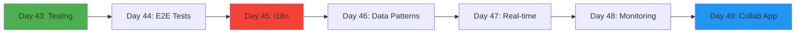
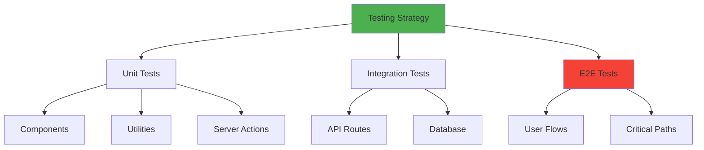
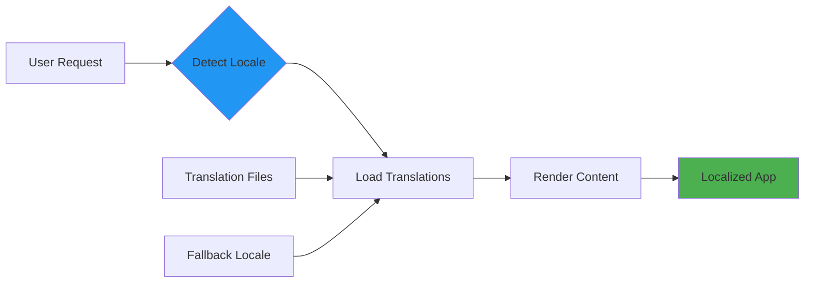
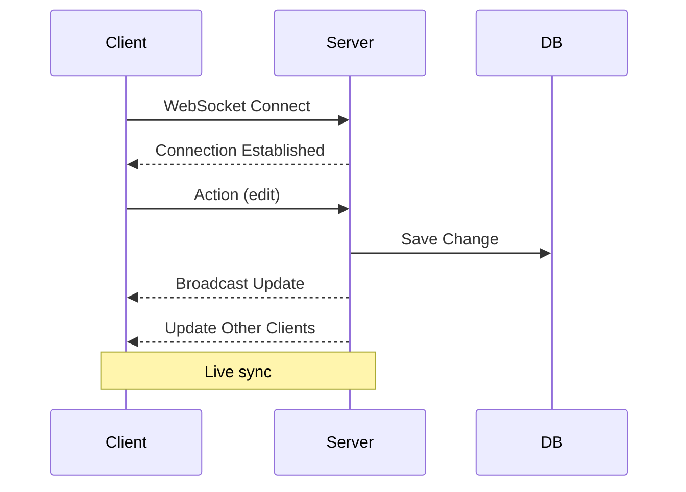

# Week 7: Testing, i18n & Advanced Patterns 🧪

**Focus:** Production-ready features, testing, internationalization, real-time

---

## 📊 Weekly Flow

---

## 📚 Daily Topics

| Day | Topic | Key Concepts |
|-----|-------|--------------|
| **Day 43** | Testing with Vitest | Unit tests, integration tests, mocks |
| **Day 44** | E2E with Playwright | End-to-end testing, fixtures |
| **Day 45** | Internationalization | i18n, translations, locales |
| **Day 46** | Advanced Data Patterns | Query optimization, caching strategies |
| **Day 47** | Real-time Features | WebSockets, SSE, live updates |
| **Day 48** | Monitoring & Errors | Error tracking, logging, analytics |
| **Day 49** | **Project: Real-time Collab App** | Live editing, presence, sync |

---

## 🧪 Testing Pyramid

---

## 🌍 i18n Architecture

---

## ⚡ Real-time Architecture

---

## 📂 Week Project: Real-time Collaboration App

Build collaborative editor with:

- Live document editing
- User presence indicators
- Real-time cursor positions
- WebSocket integration
- Conflict resolution
- Optimistic updates
- Offline support

---

**Start Day 43!** 🚀
