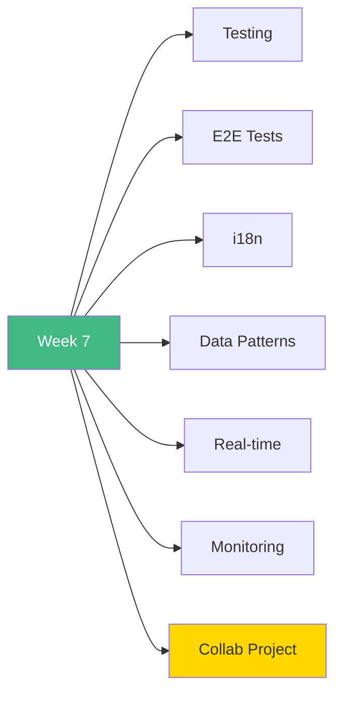

# 🚀 Week 7: Start Here!

**Welcome to Week 7 - Testing, i18n & Advanced Patterns!**

---

## 📚 What You'll Learn This Week

---

## 📅 7-Day Plan

| Day | Topic | Time | Difficulty |
|-----|-------|------|------------|
| **Day 1** | Testing with Vitest | 3-4h | ⭐⭐⭐ |
| **Day 2** | E2E Testing | 3-4h | ⭐⭐⭐ |
| **Day 3** | Internationalization | 3-4h | ⭐⭐⭐ |
| **Day 4** | Data Patterns | 3-4h | ⭐⭐⭐ |
| **Day 5** | Real-time Features | 3-4h | ⭐⭐⭐ |
| **Day 6** | Monitoring | 2-3h | ⭐⭐ |
| **Day 7** | Collab App | 6-8h | 🎯 |

**Total:** 23-30 hours

---

## 🎯 Learning Path

### **Start Here:**
1. Read [`INDEX.md`](INDEX.md)
2. Begin with [`day1/README.md`](day1/README.md)
3. Work through each day
4. Build collab app on Day 7

---

## 🎓 Learning Outcomes

By the end of Week 7, you will:

✅ Master testing strategies  
✅ Write E2E tests  
✅ Implement i18n  
✅ Optimize data patterns  
✅ Build real-time features  
✅ Add monitoring  
✅ Create production apps  

---

## 🚦 Prerequisites

- ✅ Week 6 completed (Next.js advanced)
- ✅ Understand Server Actions
- ✅ Authentication knowledge
- ✅ Database basics
- ✅ WebSocket concepts helpful

---

## 💡 Pro Tips

> 💡 **Tip 1:** Testing saves debugging time later
>
> 💡 **Tip 2:** E2E tests cover critical user flows
>
> 💡 **Tip 3:** i18n from the start is easier
>
> 💡 **Tip 4:** Real-time requires conflict resolution
>
> 💡 **Tip 5:** The collab project is the culmination!

---

## ✅ Success Checklist

- [ ] Write comprehensive tests
- [ ] Setup Playwright E2E
- [ ] Add multi-language support
- [ ] Optimize data fetching
- [ ] Implement WebSockets
- [ ] Add error tracking
- [ ] Complete collab app

---

## 🎉 Ready to Begin?

**Start your journey:** [`day1/README.md`](day1/README.md)

**Or review the plan:** [`INDEX.md`](INDEX.md)

---

**Let's build production-ready apps!** 🚀
