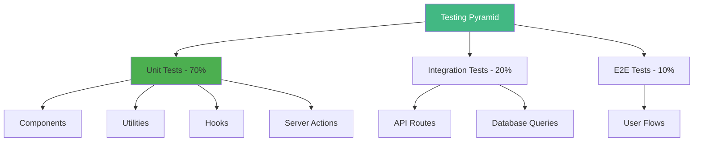
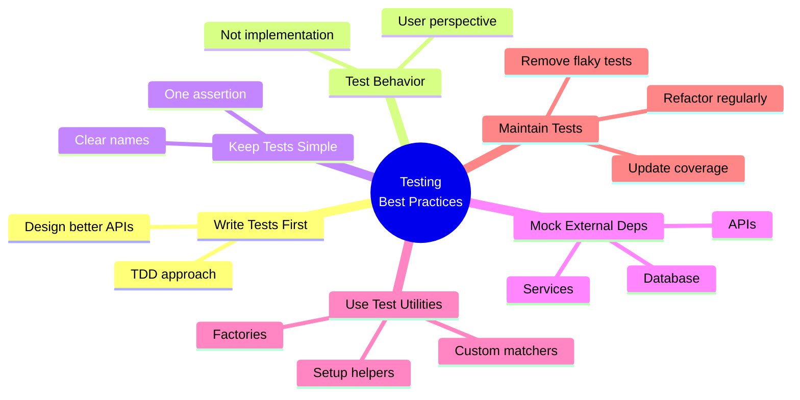

# Day 1 (Day 43): Testing with Vitest & React Testing Library 🧪

**Duration:** 3-4 hours | **Difficulty:** ⭐⭐⭐ Hard

---

## 📖 Learning Objectives

- Setup Vitest for Next.js
- Write unit tests
- Test React components
- Mock dependencies
- Test Server Actions

---

## 🧪 Testing Strategy



---

## 🚀 Setup Vitest

### **Install Dependencies**

```bash
npm install -D vitest @testing-library/react @testing-library/jest-dom @testing-library/user-event jsdom @vitejs/plugin-react
```

### **Configure Vitest**

```typescript
// vitest.config.ts
import { defineConfig } from 'vitest/config'
import react from '@vitejs/plugin-react'
import path from 'path'

export default defineConfig({
  plugins: [react()],
  test: {
    environment: 'jsdom',
    globals: true,
    setupFiles: ['./vitest.setup.ts'],
  },
  resolve: {
    alias: {
      '@': path.resolve(__dirname, './'),
    },
  },
})
```

```typescript
// vitest.setup.ts
import '@testing-library/jest-dom'
import { expect, afterEach } from 'vitest'
import { cleanup } from '@testing-library/react'

// Cleanup after each test
afterEach(() => {
  cleanup()
})
```

```json
// package.json
{
  "scripts": {
    "test": "vitest",
    "test:ui": "vitest --ui",
    "test:coverage": "vitest --coverage"
  }
}
```

---

## 🎯 Testing Components

### **Simple Component Test**

```tsx
// components/Button.tsx
interface ButtonProps {
  children: React.ReactNode
  onClick?: () => void
  variant?: 'primary' | 'secondary'
  disabled?: boolean
}

export function Button({ 
  children, 
  onClick, 
  variant = 'primary',
  disabled = false 
}: ButtonProps) {
  return (
    <button
      onClick={onClick}
      disabled={disabled}
      className={`btn btn-${variant}`}
    >
      {children}
    </button>
  )
}
```

```typescript
// components/Button.test.tsx
import { describe, it, expect, vi } from 'vitest'
import { render, screen } from '@testing-library/react'
import userEvent from '@testing-library/user-event'
import { Button } from './Button'

describe('Button', () => {
  it('renders with correct text', () => {
    render(<Button>Click me</Button>)
    expect(screen.getByRole('button')).toHaveTextContent('Click me')
  })
  
  it('calls onClick when clicked', async () => {
    const handleClick = vi.fn()
    render(<Button onClick={handleClick}>Click me</Button>)
    
    await userEvent.click(screen.getByRole('button'))
    expect(handleClick).toHaveBeenCalledTimes(1)
  })
  
  it('applies variant class', () => {
    render(<Button variant="secondary">Click me</Button>)
    expect(screen.getByRole('button')).toHaveClass('btn-secondary')
  })
  
  it('disables button when disabled prop is true', () => {
    render(<Button disabled>Click me</Button>)
    expect(screen.getByRole('button')).toBeDisabled()
  })
})
```

---

## 📋 Testing Forms

```tsx
// components/LoginForm.tsx
'use client'

import { useState } from 'react'

interface LoginFormProps {
  onSubmit: (email: string, password: string) => Promise<void>
}

export function LoginForm({ onSubmit }: LoginFormProps) {
  const [email, setEmail] = useState('')
  const [password, setPassword] = useState('')
  const [error, setError] = useState('')
  const [isLoading, setIsLoading] = useState(false)
  
  const handleSubmit = async (e: React.FormEvent) => {
    e.preventDefault()
    setError('')
    setIsLoading(true)
    
    try {
      await onSubmit(email, password)
    } catch (err) {
      setError('Login failed')
    } finally {
      setIsLoading(false)
    }
  }
  
  return (
    <form onSubmit={handleSubmit}>
      <div>
        <label htmlFor="email">Email</label>
        <input
          id="email"
          type="email"
          value={email}
          onChange={(e) => setEmail(e.target.value)}
          required
        />
      </div>
      
      <div>
        <label htmlFor="password">Password</label>
        <input
          id="password"
          type="password"
          value={password}
          onChange={(e) => setPassword(e.target.value)}
          required
        />
      </div>
      
      {error && <div role="alert">{error}</div>}
      
      <button type="submit" disabled={isLoading}>
        {isLoading ? 'Loading...' : 'Login'}
      </button>
    </form>
  )
}
```

```typescript
// components/LoginForm.test.tsx
import { describe, it, expect, vi } from 'vitest'
import { render, screen, waitFor } from '@testing-library/react'
import userEvent from '@testing-library/user-event'
import { LoginForm } from './LoginForm'

describe('LoginForm', () => {
  it('renders form fields', () => {
    const onSubmit = vi.fn()
    render(<LoginForm onSubmit={onSubmit} />)
    
    expect(screen.getByLabelText(/email/i)).toBeInTheDocument()
    expect(screen.getByLabelText(/password/i)).toBeInTheDocument()
    expect(screen.getByRole('button', { name: /login/i })).toBeInTheDocument()
  })
  
  it('submits form with correct data', async () => {
    const onSubmit = vi.fn().mockResolvedValue(undefined)
    render(<LoginForm onSubmit={onSubmit} />)
    
    await userEvent.type(screen.getByLabelText(/email/i), 'test@example.com')
    await userEvent.type(screen.getByLabelText(/password/i), 'password123')
    await userEvent.click(screen.getByRole('button', { name: /login/i }))
    
    expect(onSubmit).toHaveBeenCalledWith('test@example.com', 'password123')
  })
  
  it('shows loading state during submission', async () => {
    const onSubmit = vi.fn(() => new Promise(resolve => setTimeout(resolve, 100)))
    render(<LoginForm onSubmit={onSubmit} />)
    
    await userEvent.type(screen.getByLabelText(/email/i), 'test@example.com')
    await userEvent.type(screen.getByLabelText(/password/i), 'password123')
    await userEvent.click(screen.getByRole('button', { name: /login/i }))
    
    expect(screen.getByRole('button')).toHaveTextContent('Loading...')
    expect(screen.getByRole('button')).toBeDisabled()
  })
  
  it('shows error message on failed submission', async () => {
    const onSubmit = vi.fn().mockRejectedValue(new Error('Failed'))
    render(<LoginForm onSubmit={onSubmit} />)
    
    await userEvent.type(screen.getByLabelText(/email/i), 'test@example.com')
    await userEvent.type(screen.getByLabelText(/password/i), 'password123')
    await userEvent.click(screen.getByRole('button', { name: /login/i }))
    
    await waitFor(() => {
      expect(screen.getByRole('alert')).toHaveTextContent('Login failed')
    })
  })
})
```

---

## 🎨 Testing Server Actions

```typescript
// app/actions.ts
'use server'

import { revalidatePath } from 'next/cache'
import { z } from 'zod'
import { db } from '@/lib/db'

const createPostSchema = z.object({
  title: z.string().min(1).max(100),
  content: z.string().min(1),
})

export async function createPost(formData: FormData) {
  const title = formData.get('title') as string
  const content = formData.get('content') as string
  
  const result = createPostSchema.safeParse({ title, content })
  
  if (!result.success) {
    return { error: 'Invalid input' }
  }
  
  const post = await db.post.create({
    data: {
      title: result.data.title,
      content: result.data.content,
    }
  })
  
  revalidatePath('/blog')
  return { success: true, post }
}
```

```typescript
// app/actions.test.ts
import { describe, it, expect, vi, beforeEach } from 'vitest'
import { createPost } from './actions'

// Mock dependencies
vi.mock('next/cache', () => ({
  revalidatePath: vi.fn()
}))

vi.mock('@/lib/db', () => ({
  db: {
    post: {
      create: vi.fn()
    }
  }
}))

import { revalidatePath } from 'next/cache'
import { db } from '@/lib/db'

describe('createPost', () => {
  beforeEach(() => {
    vi.clearAllMocks()
  })
  
  it('creates a post with valid data', async () => {
    const mockPost = { id: 1, title: 'Test', content: 'Content' }
    vi.mocked(db.post.create).mockResolvedValue(mockPost)
    
    const formData = new FormData()
    formData.append('title', 'Test')
    formData.append('content', 'Content')
    
    const result = await createPost(formData)
    
    expect(result).toEqual({ success: true, post: mockPost })
    expect(db.post.create).toHaveBeenCalledWith({
      data: {
        title: 'Test',
        content: 'Content'
      }
    })
    expect(revalidatePath).toHaveBeenCalledWith('/blog')
  })
  
  it('returns error for invalid data', async () => {
    const formData = new FormData()
    formData.append('title', '')
    formData.append('content', 'Content')
    
    const result = await createPost(formData)
    
    expect(result).toEqual({ error: 'Invalid input' })
    expect(db.post.create).not.toHaveBeenCalled()
  })
})
```

---

## 🔧 Testing Utilities

```typescript
// lib/utils.ts
export function formatDate(date: Date): string {
  return new Intl.DateTimeFormat('en-US', {
    year: 'numeric',
    month: 'long',
    day: 'numeric'
  }).format(date)
}

export function slugify(text: string): string {
  return text
    .toLowerCase()
    .replace(/[^\w\s-]/g, '')
    .replace(/\s+/g, '-')
    .replace(/-+/g, '-')
    .trim()
}

export function truncate(text: string, length: number): string {
  if (text.length <= length) return text
  return text.slice(0, length) + '...'
}
```

```typescript
// lib/utils.test.ts
import { describe, it, expect } from 'vitest'
import { formatDate, slugify, truncate } from './utils'

describe('formatDate', () => {
  it('formats date correctly', () => {
    const date = new Date('2024-01-15')
    expect(formatDate(date)).toBe('January 15, 2024')
  })
})

describe('slugify', () => {
  it('converts text to slug', () => {
    expect(slugify('Hello World')).toBe('hello-world')
  })
  
  it('removes special characters', () => {
    expect(slugify('Hello @World!')).toBe('hello-world')
  })
  
  it('handles multiple spaces', () => {
    expect(slugify('Hello   World')).toBe('hello-world')
  })
})

describe('truncate', () => {
  it('truncates long text', () => {
    expect(truncate('Hello World', 5)).toBe('Hello...')
  })
  
  it('does not truncate short text', () => {
    expect(truncate('Hello', 10)).toBe('Hello')
  })
})
```

---

## 🎯 Testing Custom Hooks

```typescript
// hooks/useCounter.ts
import { useState } from 'react'

export function useCounter(initialValue = 0) {
  const [count, setCount] = useState(initialValue)
  
  const increment = () => setCount(c => c + 1)
  const decrement = () => setCount(c => c - 1)
  const reset = () => setCount(initialValue)
  
  return { count, increment, decrement, reset }
}
```

```typescript
// hooks/useCounter.test.ts
import { describe, it, expect } from 'vitest'
import { renderHook, act } from '@testing-library/react'
import { useCounter } from './useCounter'

describe('useCounter', () => {
  it('initializes with default value', () => {
    const { result } = renderHook(() => useCounter())
    expect(result.current.count).toBe(0)
  })
  
  it('initializes with custom value', () => {
    const { result } = renderHook(() => useCounter(10))
    expect(result.current.count).toBe(10)
  })
  
  it('increments count', () => {
    const { result } = renderHook(() => useCounter())
    
    act(() => {
      result.current.increment()
    })
    
    expect(result.current.count).toBe(1)
  })
  
  it('decrements count', () => {
    const { result } = renderHook(() => useCounter(5))
    
    act(() => {
      result.current.decrement()
    })
    
    expect(result.current.count).toBe(4)
  })
  
  it('resets to initial value', () => {
    const { result } = renderHook(() => useCounter(10))
    
    act(() => {
      result.current.increment()
      result.current.increment()
      result.current.reset()
    })
    
    expect(result.current.count).toBe(10)
  })
})
```

---

## 🔄 Testing with Mock Data

```typescript
// __mocks__/data.ts
export const mockPosts = [
  { id: 1, title: 'Post 1', content: 'Content 1', published: true },
  { id: 2, title: 'Post 2', content: 'Content 2', published: true },
  { id: 3, title: 'Post 3', content: 'Content 3', published: false },
]

export const mockUser = {
  id: '1',
  email: 'test@example.com',
  name: 'Test User'
}
```

```typescript
// lib/api.test.ts
import { describe, it, expect, vi } from 'vitest'
import { mockPosts } from '@/__mocks__/data'

// Mock fetch
global.fetch = vi.fn()

describe('API functions', () => {
  it('fetches posts successfully', async () => {
    vi.mocked(fetch).mockResolvedValue({
      ok: true,
      json: async () => mockPosts
    } as Response)
    
    const response = await fetch('/api/posts')
    const data = await response.json()
    
    expect(data).toEqual(mockPosts)
    expect(fetch).toHaveBeenCalledWith('/api/posts')
  })
})
```

---

## 📊 Test Coverage

```bash
# Run tests with coverage
npm run test:coverage

# Coverage report will show:
# - Statements: 90%+
# - Branches: 85%+
# - Functions: 90%+
# - Lines: 90%+
```

---

## ✅ Testing Best Practices



**1. Test Behavior, Not Implementation**
```typescript
// ❌ Bad - testing implementation
it('updates state', () => {
  expect(component.state.value).toBe(5)
})

// ✅ Good - testing behavior
it('displays updated value', () => {
  expect(screen.getByText('5')).toBeInTheDocument()
})
```

**2. Use Descriptive Test Names**
```typescript
// ❌ Bad
it('works', () => { /* ... */ })

// ✅ Good
it('shows error message when email is invalid', () => { /* ... */ })
```

**3. Arrange, Act, Assert Pattern**
```typescript
it('increments counter on button click', async () => {
  // Arrange
  render(<Counter />)
  
  // Act
  await userEvent.click(screen.getByRole('button', { name: /increment/i }))
  
  // Assert
  expect(screen.getByText('Count: 1')).toBeInTheDocument()
})
```

---

## ✅ Practice Exercise

Write tests for:
1. A form component with validation
2. A custom hook for data fetching
3. A utility function for formatting
4. A Server Action
5. Component with loading states
6. Error boundaries
7. Achieve 90%+ coverage

---

**Tomorrow:** E2E Testing with Playwright! 🎭
