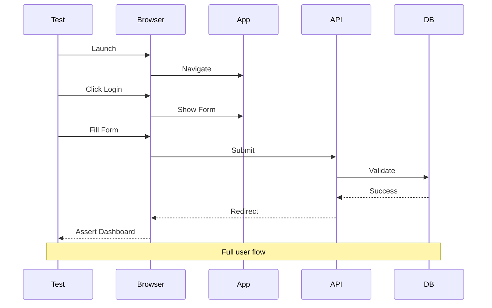
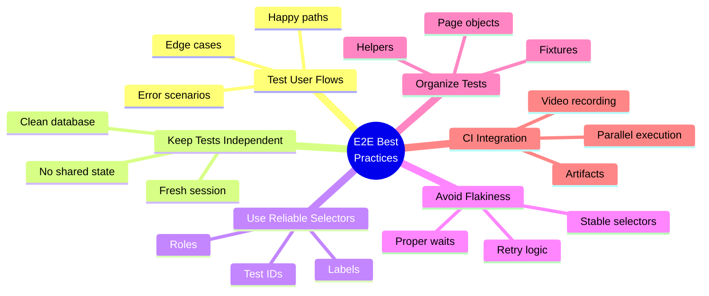

# Day 2 (Day 44): E2E Testing with Playwright 🎭

**Duration:** 3-4 hours | **Difficulty:** ⭐⭐⭐ Hard

---

## 📖 Learning Objectives

- Setup Playwright
- Write E2E tests
- Test user flows
- Use fixtures
- Visual regression testing

---

## 🎭 E2E Testing Flow



---

## 🚀 Setup Playwright

### **Install Playwright**

```bash
npm init playwright@latest

# Installs:
# - Playwright Test
# - Browsers (Chromium, Firefox, WebKit)
# - Example tests
```

### **Configuration**

```typescript
// playwright.config.ts
import { defineConfig, devices } from '@playwright/test'

export default defineConfig({
  testDir: './e2e',
  fullyParallel: true,
  forbidOnly: !!process.env.CI,
  retries: process.env.CI ? 2 : 0,
  workers: process.env.CI ? 1 : undefined,
  reporter: 'html',
  
  use: {
    baseURL: 'http://localhost:3000',
    trace: 'on-first-retry',
    screenshot: 'only-on-failure',
  },
  
  projects: [
    {
      name: 'chromium',
      use: { ...devices['Desktop Chrome'] },
    },
    {
      name: 'firefox',
      use: { ...devices['Desktop Firefox'] },
    },
    {
      name: 'webkit',
      use: { ...devices['Desktop Safari'] },
    },
    {
      name: 'Mobile Chrome',
      use: { ...devices['Pixel 5'] },
    },
  ],
  
  webServer: {
    command: 'npm run dev',
    url: 'http://localhost:3000',
    reuseExistingServer: !process.env.CI,
  },
})
```

---

## 🎯 Basic E2E Tests

### **Homepage Test**

```typescript
// e2e/homepage.spec.ts
import { test, expect } from '@playwright/test'

test.describe('Homepage', () => {
  test('has title and navigation', async ({ page }) => {
    await page.goto('/')
    
    // Check title
    await expect(page).toHaveTitle(/My App/)
    
    // Check navigation
    await expect(page.getByRole('navigation')).toBeVisible()
    await expect(page.getByRole('link', { name: 'Home' })).toBeVisible()
    await expect(page.getByRole('link', { name: 'About' })).toBeVisible()
  })
  
  test('displays hero section', async ({ page }) => {
    await page.goto('/')
    
    const hero = page.getByRole('heading', { level: 1 })
    await expect(hero).toBeVisible()
    await expect(hero).toHaveText(/Welcome/)
  })
  
  test('has working CTA button', async ({ page }) => {
    await page.goto('/')
    
    const ctaButton = page.getByRole('link', { name: /get started/i })
    await expect(ctaButton).toBeVisible()
    
    await ctaButton.click()
    await expect(page).toHaveURL('/signup')
  })
})
```

---

## 🔐 Authentication Flow Test

```typescript
// e2e/auth.spec.ts
import { test, expect } from '@playwright/test'

test.describe('Authentication', () => {
  test('user can sign up', async ({ page }) => {
    await page.goto('/signup')
    
    // Fill registration form
    await page.getByLabel('Name').fill('John Doe')
    await page.getByLabel('Email').fill('john@example.com')
    await page.getByLabel('Password').fill('securePassword123')
    await page.getByLabel('Confirm Password').fill('securePassword123')
    
    // Submit form
    await page.getByRole('button', { name: /sign up/i }).click()
    
    // Should redirect to dashboard
    await expect(page).toHaveURL('/dashboard')
    await expect(page.getByText(/welcome, john/i)).toBeVisible()
  })
  
  test('user can log in', async ({ page }) => {
    await page.goto('/login')
    
    // Fill login form
    await page.getByLabel('Email').fill('john@example.com')
    await page.getByLabel('Password').fill('securePassword123')
    
    // Submit
    await page.getByRole('button', { name: /log in/i }).click()
    
    // Check logged in state
    await expect(page).toHaveURL('/dashboard')
    await expect(page.getByRole('button', { name: /logout/i })).toBeVisible()
  })
  
  test('shows error for invalid credentials', async ({ page }) => {
    await page.goto('/login')
    
    await page.getByLabel('Email').fill('wrong@example.com')
    await page.getByLabel('Password').fill('wrongpassword')
    await page.getByRole('button', { name: /log in/i }).click()
    
    // Should show error
    await expect(page.getByRole('alert')).toContainText(/invalid credentials/i)
    await expect(page).toHaveURL('/login')
  })
  
  test('protected routes redirect to login', async ({ page }) => {
    await page.goto('/dashboard')
    
    // Should redirect
    await expect(page).toHaveURL('/login')
  })
})
```

---

## 📝 Form Testing

```typescript
// e2e/forms.spec.ts
import { test, expect } from '@playwright/test'

test.describe('Contact Form', () => {
  test.beforeEach(async ({ page }) => {
    await page.goto('/contact')
  })
  
  test('submits form successfully', async ({ page }) => {
    await page.getByLabel('Name').fill('Jane Doe')
    await page.getByLabel('Email').fill('jane@example.com')
    await page.getByLabel('Message').fill('This is a test message')
    
    // Listen for API call
    const responsePromise = page.waitForResponse('/api/contact')
    await page.getByRole('button', { name: /send/i }).click()
    const response = await responsePromise
    
    expect(response.status()).toBe(200)
    
    // Check success message
    await expect(page.getByText(/message sent successfully/i)).toBeVisible()
  })
  
  test('validates required fields', async ({ page }) => {
    await page.getByRole('button', { name: /send/i }).click()
    
    // Should show validation errors
    await expect(page.getByText(/name is required/i)).toBeVisible()
    await expect(page.getByText(/email is required/i)).toBeVisible()
    await expect(page.getByText(/message is required/i)).toBeVisible()
  })
  
  test('validates email format', async ({ page }) => {
    await page.getByLabel('Email').fill('invalid-email')
    await page.getByRole('button', { name: /send/i }).click()
    
    await expect(page.getByText(/invalid email/i)).toBeVisible()
  })
})
```

---

## 🛒 E-commerce Flow Test

```typescript
// e2e/shopping.spec.ts
import { test, expect } from '@playwright/test'

test.describe('Shopping Flow', () => {
  test('complete purchase flow', async ({ page }) => {
    // 1. Browse products
    await page.goto('/products')
    await expect(page.getByRole('heading', { name: /products/i })).toBeVisible()
    
    // 2. View product details
    await page.getByRole('link', { name: /product 1/i }).click()
    await expect(page).toHaveURL(/\/products\/\d+/)
    
    // 3. Add to cart
    await page.getByRole('button', { name: /add to cart/i }).click()
    await expect(page.getByText(/added to cart/i)).toBeVisible()
    
    // 4. Go to cart
    await page.getByRole('link', { name: /cart/i }).click()
    await expect(page).toHaveURL('/cart')
    await expect(page.getByText(/product 1/i)).toBeVisible()
    
    // 5. Update quantity
    await page.getByLabel(/quantity/i).fill('2')
    await expect(page.getByText(/\$200/)).toBeVisible() // Updated total
    
    // 6. Proceed to checkout
    await page.getByRole('button', { name: /checkout/i }).click()
    await expect(page).toHaveURL('/checkout')
    
    // 7. Fill shipping info
    await page.getByLabel('Full Name').fill('John Doe')
    await page.getByLabel('Address').fill('123 Main St')
    await page.getByLabel('City').fill('New York')
    await page.getByLabel('ZIP Code').fill('10001')
    
    // 8. Fill payment info
    await page.getByLabel('Card Number').fill('4242424242424242')
    await page.getByLabel('Expiry').fill('12/25')
    await page.getByLabel('CVC').fill('123')
    
    // 9. Place order
    await page.getByRole('button', { name: /place order/i }).click()
    
    // 10. Verify success
    await expect(page).toHaveURL(/\/orders\/\d+/)
    await expect(page.getByText(/order confirmed/i)).toBeVisible()
  })
})
```

---

## 🎨 Using Fixtures

```typescript
// e2e/fixtures.ts
import { test as base } from '@playwright/test'
import { db } from '@/lib/db'

// Create authenticated user
export const test = base.extend({
  authenticatedPage: async ({ page }, use) => {
    // Create user
    const user = await db.user.create({
      data: {
        email: 'test@example.com',
        name: 'Test User',
        hashedPassword: 'hashed'
      }
    })
    
    // Set session cookie
    await page.goto('/login')
    await page.evaluate((userId) => {
      document.cookie = `session=${userId}; path=/`
    }, user.id)
    
    await use(page)
    
    // Cleanup
    await db.user.delete({ where: { id: user.id } })
  }
})

export { expect } from '@playwright/test'
```

```typescript
// e2e/dashboard.spec.ts
import { test, expect } from './fixtures'

test('authenticated user can access dashboard', async ({ authenticatedPage }) => {
  await authenticatedPage.goto('/dashboard')
  
  await expect(authenticatedPage).toHaveURL('/dashboard')
  await expect(authenticatedPage.getByText(/test user/i)).toBeVisible()
})
```

---

## 📸 Visual Regression Testing

```typescript
// e2e/visual.spec.ts
import { test, expect } from '@playwright/test'

test.describe('Visual Regression', () => {
  test('homepage looks correct', async ({ page }) => {
    await page.goto('/')
    
    // Take screenshot and compare
    await expect(page).toHaveScreenshot('homepage.png', {
      fullPage: true,
      maxDiffPixels: 100
    })
  })
  
  test('product card matches design', async ({ page }) => {
    await page.goto('/products')
    
    const productCard = page.locator('[data-testid="product-card"]').first()
    await expect(productCard).toHaveScreenshot('product-card.png')
  })
  
  test('dark mode renders correctly', async ({ page }) => {
    await page.goto('/')
    
    // Enable dark mode
    await page.getByRole('button', { name: /theme/i }).click()
    await page.getByRole('menuitem', { name: /dark/i }).click()
    
    await expect(page).toHaveScreenshot('homepage-dark.png', {
      fullPage: true
    })
  })
})
```

---

## 🔄 Testing API Responses

```typescript
// e2e/api.spec.ts
import { test, expect } from '@playwright/test'

test.describe('API Tests', () => {
  test('fetches user data', async ({ request }) => {
    const response = await request.get('/api/users/1')
    
    expect(response.ok()).toBeTruthy()
    expect(response.status()).toBe(200)
    
    const data = await response.json()
    expect(data).toHaveProperty('id')
    expect(data).toHaveProperty('name')
  })
  
  test('creates new post', async ({ request }) => {
    const response = await request.post('/api/posts', {
      data: {
        title: 'Test Post',
        content: 'Test content'
      }
    })
    
    expect(response.ok()).toBeTruthy()
    
    const post = await response.json()
    expect(post.title).toBe('Test Post')
  })
  
  test('handles auth errors', async ({ request }) => {
    const response = await request.get('/api/protected')
    
    expect(response.status()).toBe(401)
  })
})
```

---

## 🎯 Page Object Model

```typescript
// e2e/pages/LoginPage.ts
import { Page, Locator } from '@playwright/test'

export class LoginPage {
  readonly page: Page
  readonly emailInput: Locator
  readonly passwordInput: Locator
  readonly submitButton: Locator
  readonly errorMessage: Locator
  
  constructor(page: Page) {
    this.page = page
    this.emailInput = page.getByLabel('Email')
    this.passwordInput = page.getByLabel('Password')
    this.submitButton = page.getByRole('button', { name: /log in/i })
    this.errorMessage = page.getByRole('alert')
  }
  
  async goto() {
    await this.page.goto('/login')
  }
  
  async login(email: string, password: string) {
    await this.emailInput.fill(email)
    await this.passwordInput.fill(password)
    await this.submitButton.click()
  }
  
  async getErrorMessage() {
    return await this.errorMessage.textContent()
  }
}
```

```typescript
// e2e/auth-pom.spec.ts
import { test, expect } from '@playwright/test'
import { LoginPage } from './pages/LoginPage'

test('login with POM', async ({ page }) => {
  const loginPage = new LoginPage(page)
  
  await loginPage.goto()
  await loginPage.login('test@example.com', 'password')
  
  await expect(page).toHaveURL('/dashboard')
})
```

---

## 📱 Mobile Testing

```typescript
// e2e/mobile.spec.ts
import { test, expect, devices } from '@playwright/test'

test.use({
  ...devices['iPhone 13'],
})

test.describe('Mobile Tests', () => {
  test('mobile navigation works', async ({ page }) => {
    await page.goto('/')
    
    // Open mobile menu
    await page.getByRole('button', { name: /menu/i }).click()
    
    // Check menu items
    await expect(page.getByRole('link', { name: /home/i })).toBeVisible()
    await expect(page.getByRole('link', { name: /about/i })).toBeVisible()
  })
  
  test('responsive layout', async ({ page }) => {
    await page.goto('/products')
    
    // Products should stack vertically on mobile
    const products = page.locator('[data-testid="product-card"]')
    const count = await products.count()
    
    for (let i = 0; i < count; i++) {
      const product = products.nth(i)
      const box = await product.boundingBox()
      
      // Should be full width (minus padding)
      expect(box?.width).toBeGreaterThan(300)
    }
  })
})
```

---

## 🔍 Debugging Tests

```typescript
// e2e/debug.spec.ts
import { test, expect } from '@playwright/test'

test('debug example', async ({ page }) => {
  await page.goto('/')
  
  // Pause execution for debugging
  // await page.pause()
  
  // Take screenshot
  await page.screenshot({ path: 'debug.png' })
  
  // Console logs
  page.on('console', msg => console.log('PAGE LOG:', msg.text()))
  
  // Network logs
  page.on('response', response => {
    console.log('RESPONSE:', response.url(), response.status())
  })
  
  // Slow down execution
  await page.waitForTimeout(1000)
})
```

**Run with UI:**
```bash
npx playwright test --ui
```

**Run with debug:**
```bash
npx playwright test --debug
```

**View trace:**
```bash
npx playwright show-trace trace.zip
```

---

## ✅ E2E Testing Best Practices



---

## ✅ Practice Exercise

Write E2E tests for:
1. Complete user registration flow
2. Shopping cart functionality
3. Search feature
4. Form submissions
5. Mobile responsive navigation
6. Visual regression
7. API endpoints

---

**Tomorrow:** Internationalization (i18n)! 🌍
