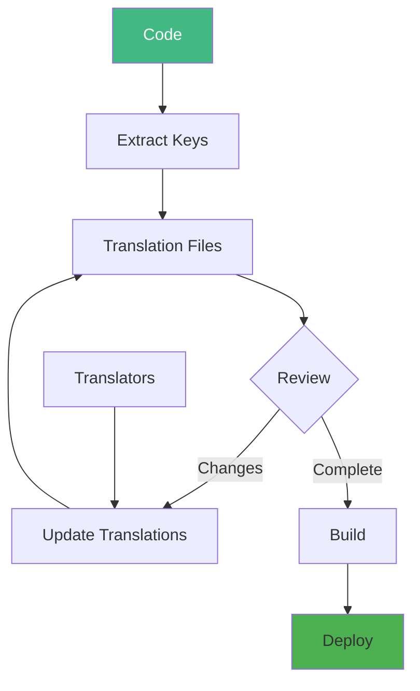
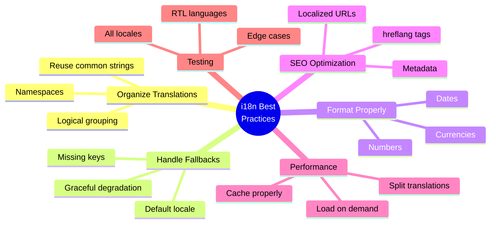

# Day 3 (Day 45): Internationalization (i18n) 🌍

**Duration:** 3-4 hours | **Difficulty:** ⭐⭐⭐ Hard

---

## 📖 Learning Objectives

- Setup i18n in Next.js
- Manage translations
- Handle multiple locales
- URL-based routing
- Dynamic language switching

---

## 🌍 i18n Architecture

```mermaid
flowchart TD
    A[User Request] --> B{Detect Locale}
    B -->|URL| C[/en/about]
    B -->|Cookie| D[locale=fr]
    B -->|Header| E[Accept-Language]
    
    C --> F[Load Translations]
    D --> F
    E --> F
    
    F --> G{Translation Exists?}
    G -->|Yes| H[Use Translation]
    G -->|No| I[Use Fallback]
    
    H --> J[Render Page]
    I --> J
    
    style B fill:#2196F3
    style F fill:#4CAF50
```

---

## 🚀 Setup next-intl

### **Install Dependencies**

```bash
npm install next-intl
```

### **Project Structure**

```
app/
├── [locale]/
│   ├── layout.tsx
│   ├── page.tsx
│   ├── about/
│   │   └── page.tsx
│   └── blog/
│       └── page.tsx
├── api/
└── ...
messages/
├── en.json
├── fr.json
├── es.json
└── de.json
```

---

## 🎯 Configuration

### **i18n Config**

```typescript
// i18n.ts
import { getRequestConfig } from 'next-intl/server'

export const locales = ['en', 'fr', 'es', 'de'] as const
export type Locale = (typeof locales)[number]

export const defaultLocale: Locale = 'en'

export default getRequestConfig(async ({ locale }) => {
  return {
    messages: (await import(`./messages/${locale}.json`)).default
  }
})
```

### **Middleware**

```typescript
// middleware.ts
import createMiddleware from 'next-intl/middleware'
import { locales, defaultLocale } from './i18n'

export default createMiddleware({
  locales,
  defaultLocale,
  localePrefix: 'always' // /en/about, /fr/about
})

export const config = {
  matcher: ['/', '/(de|en|fr|es)/:path*']
}
```

### **Root Layout**

```typescript
// app/[locale]/layout.tsx
import { NextIntlClientProvider } from 'next-intl'
import { notFound } from 'next/navigation'
import { locales } from '@/i18n'

export function generateStaticParams() {
  return locales.map(locale => ({ locale }))
}

export default async function LocaleLayout({
  children,
  params: { locale }
}: {
  children: React.ReactNode
  params: { locale: string }
}) {
  if (!locales.includes(locale as any)) {
    notFound()
  }
  
  let messages
  try {
    messages = (await import(`@/messages/${locale}.json`)).default
  } catch (error) {
    notFound()
  }
  
  return (
    <html lang={locale}>
      <body>
        <NextIntlClientProvider locale={locale} messages={messages}>
          {children}
        </NextIntlClientProvider>
      </body>
    </html>
  )
}
```

---

## 📝 Translation Files

### **English (en.json)**

```json
{
  "HomePage": {
    "title": "Welcome to Our App",
    "description": "The best solution for your needs",
    "cta": "Get Started"
  },
  "Navigation": {
    "home": "Home",
    "about": "About",
    "blog": "Blog",
    "contact": "Contact"
  },
  "Auth": {
    "login": "Log In",
    "logout": "Log Out",
    "signup": "Sign Up",
    "email": "Email Address",
    "password": "Password",
    "forgotPassword": "Forgot Password?"
  },
  "Products": {
    "title": "Our Products",
    "addToCart": "Add to Cart",
    "price": "${price}",
    "inStock": "In Stock",
    "outOfStock": "Out of Stock"
  },
  "Common": {
    "loading": "Loading...",
    "error": "An error occurred",
    "success": "Success!",
    "cancel": "Cancel",
    "save": "Save",
    "delete": "Delete",
    "edit": "Edit"
  }
}
```

### **French (fr.json)**

```json
{
  "HomePage": {
    "title": "Bienvenue dans notre application",
    "description": "La meilleure solution pour vos besoins",
    "cta": "Commencer"
  },
  "Navigation": {
    "home": "Accueil",
    "about": "À propos",
    "blog": "Blog",
    "contact": "Contact"
  },
  "Auth": {
    "login": "Se connecter",
    "logout": "Se déconnecter",
    "signup": "S'inscrire",
    "email": "Adresse e-mail",
    "password": "Mot de passe",
    "forgotPassword": "Mot de passe oublié ?"
  },
  "Products": {
    "title": "Nos produits",
    "addToCart": "Ajouter au panier",
    "price": "{price} €",
    "inStock": "En stock",
    "outOfStock": "Rupture de stock"
  },
  "Common": {
    "loading": "Chargement...",
    "error": "Une erreur s'est produite",
    "success": "Succès !",
    "cancel": "Annuler",
    "save": "Enregistrer",
    "delete": "Supprimer",
    "edit": "Modifier"
  }
}
```

---

## 🎨 Using Translations

### **Server Components**

```typescript
// app/[locale]/page.tsx
import { useTranslations } from 'next-intl'

export default function HomePage() {
  const t = useTranslations('HomePage')
  
  return (
    <div>
      <h1>{t('title')}</h1>
      <p>{t('description')}</p>
      <button>{t('cta')}</button>
    </div>
  )
}
```

### **Client Components**

```typescript
// components/Navigation.tsx
'use client'

import { useTranslations } from 'next-intl'
import { Link } from '@/navigation'

export function Navigation() {
  const t = useTranslations('Navigation')
  
  return (
    <nav>
      <Link href="/">{t('home')}</Link>
      <Link href="/about">{t('about')}</Link>
      <Link href="/blog">{t('blog')}</Link>
      <Link href="/contact">{t('contact')}</Link>
    </nav>
  )
}
```

---

## 🔄 Language Switcher

```typescript
// components/LanguageSwitcher.tsx
'use client'

import { useLocale } from 'next-intl'
import { useRouter, usePathname } from 'next/navigation'
import { locales } from '@/i18n'

const languageNames: Record<string, string> = {
  en: 'English',
  fr: 'Français',
  es: 'Español',
  de: 'Deutsch'
}

export function LanguageSwitcher() {
  const locale = useLocale()
  const router = useRouter()
  const pathname = usePathname()
  
  const switchLocale = (newLocale: string) => {
    // Remove current locale from pathname
    const pathnameWithoutLocale = pathname.replace(`/${locale}`, '')
    
    // Navigate to new locale
    router.push(`/${newLocale}${pathnameWithoutLocale}`)
  }
  
  return (
    <select 
      value={locale} 
      onChange={(e) => switchLocale(e.target.value)}
      className="px-3 py-2 border rounded"
    >
      {locales.map((loc) => (
        <option key={loc} value={loc}>
          {languageNames[loc]}
        </option>
      ))}
    </select>
  )
}
```

---

## 🌐 Localized Navigation

```typescript
// navigation.ts
import { createSharedPathnamesNavigation } from 'next-intl/navigation'
import { locales } from './i18n'

export const { Link, redirect, usePathname, useRouter } = 
  createSharedPathnamesNavigation({ locales })
```

```typescript
// components/LocaleLink.tsx
'use client'

import { Link } from '@/navigation'

export function LocaleLink({ 
  href, 
  children 
}: { 
  href: string
  children: React.ReactNode 
}) {
  // Automatically includes current locale in URL
  return <Link href={href}>{children}</Link>
}
```

---

## 📅 Date & Number Formatting

```typescript
// lib/formatters.ts
import { useFormatter, useLocale } from 'next-intl'

export function useDateFormat() {
  const format = useFormatter()
  const locale = useLocale()
  
  return {
    formatDate: (date: Date) => {
      return format.dateTime(date, {
        year: 'numeric',
        month: 'long',
        day: 'numeric'
      })
    },
    formatRelative: (date: Date) => {
      return format.relativeTime(date)
    }
  }
}

export function useNumberFormat() {
  const format = useFormatter()
  
  return {
    formatNumber: (num: number) => {
      return format.number(num, { maximumFractionDigits: 2 })
    },
    formatCurrency: (amount: number, currency: string = 'USD') => {
      return format.number(amount, {
        style: 'currency',
        currency
      })
    },
    formatPercent: (value: number) => {
      return format.number(value, { style: 'percent' })
    }
  }
}
```

```typescript
// app/[locale]/blog/[id]/page.tsx
import { useTranslations } from 'next-intl'
import { useDateFormat, useNumberFormat } from '@/lib/formatters'

export default function BlogPost({ post }: { post: Post }) {
  const t = useTranslations('Blog')
  const { formatDate } = useDateFormat()
  const { formatNumber } = useNumberFormat()
  
  return (
    <article>
      <h1>{post.title}</h1>
      <p>{formatDate(post.createdAt)}</p>
      <p>{formatNumber(post.views)} {t('views')}</p>
    </article>
  )
}
```

---

## 🔤 Pluralization

```json
// messages/en.json
{
  "Cart": {
    "itemCount": "{count, plural, =0 {No items} =1 {1 item} other {# items}}"
  }
}
```

```typescript
// components/CartBadge.tsx
import { useTranslations } from 'next-intl'

export function CartBadge({ count }: { count: number }) {
  const t = useTranslations('Cart')
  
  return (
    <div>
      {t('itemCount', { count })}
    </div>
  )
}

// Renders:
// count = 0: "No items"
// count = 1: "1 item"
// count = 5: "5 items"
```

---

## 💬 Rich Text Translations

```json
{
  "About": {
    "description": "Visit our <link>website</link> for more information."
  }
}
```

```typescript
import { useTranslations } from 'next-intl'
import Link from 'next/link'

export default function About() {
  const t = useTranslations('About')
  
  return (
    <p>
      {t.rich('description', {
        link: (chunks) => <Link href="/website">{chunks}</Link>
      })}
    </p>
  )
}
```

---

## 🎯 SEO with i18n

```typescript
// app/[locale]/layout.tsx
import { Metadata } from 'next'
import { useTranslations } from 'next-intl/server'

export async function generateMetadata({
  params: { locale }
}: {
  params: { locale: string }
}): Promise<Metadata> {
  const t = await useTranslations({ locale, namespace: 'Metadata' })
  
  return {
    title: t('title'),
    description: t('description'),
    alternates: {
      languages: {
        'en-US': '/en',
        'fr-FR': '/fr',
        'es-ES': '/es',
        'de-DE': '/de'
      }
    }
  }
}
```

---

## 🗂️ Namespaced Translations

```json
// messages/en.json
{
  "Forms": {
    "Login": {
      "title": "Log In",
      "submit": "Sign In",
      "errors": {
        "invalid": "Invalid credentials",
        "required": "This field is required"
      }
    },
    "Register": {
      "title": "Create Account",
      "submit": "Sign Up"
    }
  }
}
```

```typescript
// components/LoginForm.tsx
import { useTranslations } from 'next-intl'

export function LoginForm() {
  const t = useTranslations('Forms.Login')
  
  return (
    <form>
      <h2>{t('title')}</h2>
      {/* ... */}
      <button>{t('submit')}</button>
    </form>
  )
}
```

---

## 🎨 Complete Example

```typescript
// app/[locale]/products/page.tsx
import { useTranslations } from 'next-intl'
import { useNumberFormat } from '@/lib/formatters'
import { getProducts } from '@/lib/api'

export default async function ProductsPage({
  params: { locale }
}: {
  params: { locale: string }
}) {
  const t = useTranslations('Products')
  const products = await getProducts(locale)
  
  return (
    <div>
      <h1>{t('title')}</h1>
      
      <div className="grid grid-cols-3 gap-4">
        {products.map(product => (
          <ProductCard key={product.id} product={product} />
        ))}
      </div>
    </div>
  )
}

function ProductCard({ product }: { product: Product }) {
  const t = useTranslations('Products')
  const { formatCurrency } = useNumberFormat()
  
  return (
    <div className="border rounded p-4">
      <h3>{product.name}</h3>
      <p>{formatCurrency(product.price)}</p>
      <p className={product.inStock ? 'text-green-600' : 'text-red-600'}>
        {product.inStock ? t('inStock') : t('outOfStock')}
      </p>
      <button>{t('addToCart')}</button>
    </div>
  )
}
```

---

## 🔧 TypeScript Support

```typescript
// types/translations.ts
type Messages = typeof import('../messages/en.json')
type IntlMessages = Messages

declare global {
  interface IntlMessages extends Messages {}
}
```

```typescript
// Now you get autocomplete!
const t = useTranslations('HomePage')
t('title') // ✅ Autocomplete works
t('invalid') // ❌ TypeScript error
```

---

## 📊 Translation Management Flow



---

## ✅ i18n Best Practices



---

## ✅ Practice Exercise

Implement i18n for:
1. Multi-language website
2. Language switcher component
3. Localized routing
4. Date & currency formatting
5. Pluralization rules
6. SEO metadata
7. RTL support (Arabic)

---

**Tomorrow:** Advanced Data Patterns! 📊
