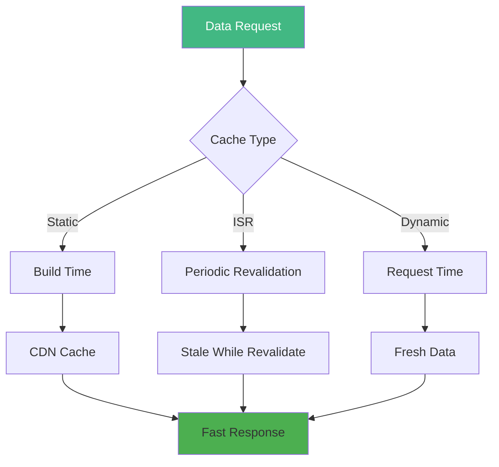
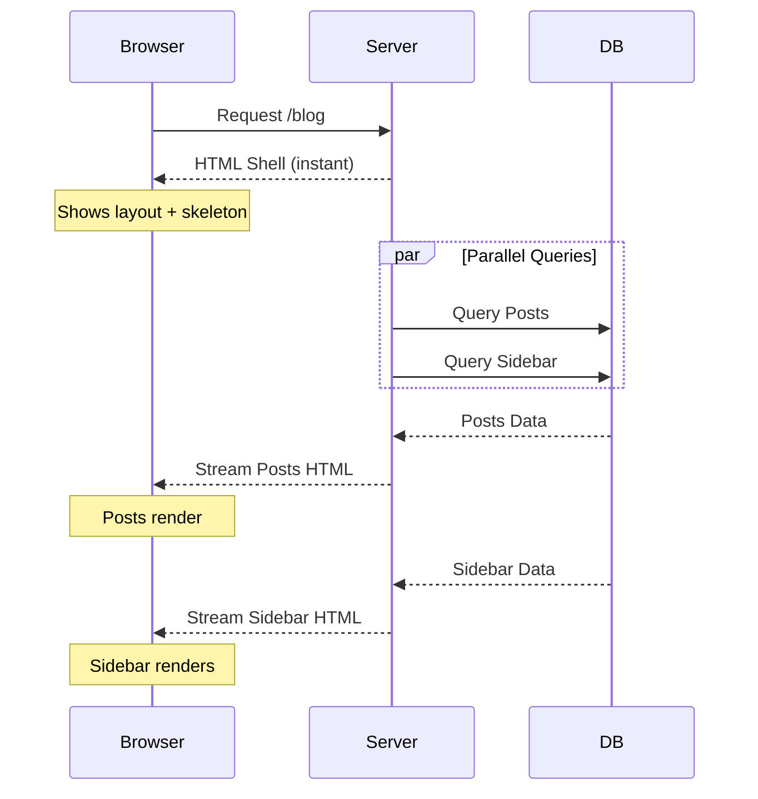
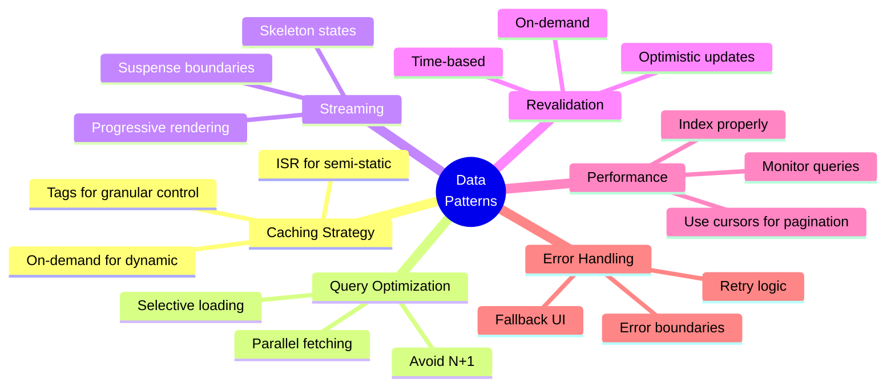

# Day 4 (Day 46): Advanced Data Patterns & Caching 📊

**Duration:** 3-4 hours | **Difficulty:** ⭐⭐⭐ Hard

---

## 📖 Learning Objectives

- Advanced caching strategies
- Query optimization
- Data revalidation patterns
- Parallel data fetching
- Streaming & Suspense

---

## 🎯 Caching Strategy



---

## 🚀 Revalidation Strategies

### **Time-based Revalidation (ISR)**

```typescript
// app/blog/page.tsx
export const revalidate = 3600 // Revalidate every hour

export default async function BlogPage() {
  const posts = await fetch('https://api.example.com/posts', {
    next: { revalidate: 3600 }
  }).then(r => r.json())
  
  return <PostList posts={posts} />
}
```

### **On-Demand Revalidation**

```typescript
// app/api/revalidate/route.ts
import { revalidatePath, revalidateTag } from 'next/cache'
import { NextRequest, NextResponse } from 'next/server'

export async function POST(request: NextRequest) {
  const body = await request.json()
  
  // Revalidate by path
  if (body.path) {
    revalidatePath(body.path)
    return NextResponse.json({ revalidated: true, path: body.path })
  }
  
  // Revalidate by tag
  if (body.tag) {
    revalidateTag(body.tag)
    return NextResponse.json({ revalidated: true, tag: body.tag })
  }
  
  return NextResponse.json({ error: 'Missing path or tag' }, { status: 400 })
}
```

### **Tagged Caching**

```typescript
// lib/api.ts
export async function getPosts() {
  const posts = await fetch('https://api.example.com/posts', {
    next: {
      tags: ['posts'],
      revalidate: 60
    }
  }).then(r => r.json())
  
  return posts
}

export async function getPost(id: string) {
  const post = await fetch(`https://api.example.com/posts/${id}`, {
    next: {
      tags: ['posts', `post-${id}`]
    }
  }).then(r => r.json())
  
  return post
}
```

```typescript
// app/actions.ts
'use server'

import { revalidateTag } from 'next/cache'

export async function updatePost(id: string, data: PostData) {
  await db.post.update({
    where: { id },
    data
  })
  
  // Revalidate specific post
  revalidateTag(`post-${id}`)
  
  // Revalidate all posts
  revalidateTag('posts')
}
```

---

## 📊 Query Optimization

### **Parallel Data Fetching**

```typescript
// app/dashboard/page.tsx
export default async function DashboardPage() {
  // ❌ Sequential (slow)
  // const user = await getUser()
  // const posts = await getPosts()
  // const stats = await getStats()
  
  // ✅ Parallel (fast)
  const [user, posts, stats] = await Promise.all([
    getUser(),
    getPosts(),
    getStats()
  ])
  
  return (
    <div>
      <UserProfile user={user} />
      <PostList posts={posts} />
      <StatsWidget stats={stats} />
    </div>
  )
}
```

### **Selective Data Loading**

```typescript
// lib/queries.ts
import { db } from './db'

export async function getPostsWithMinimalData() {
  return await db.post.findMany({
    select: {
      id: true,
      title: true,
      excerpt: true,
      createdAt: true,
      author: {
        select: {
          name: true,
          image: true
        }
      }
    },
    take: 10,
    orderBy: { createdAt: 'desc' }
  })
}

export async function getPostWithFullData(id: string) {
  return await db.post.findUnique({
    where: { id },
    include: {
      author: true,
      comments: {
        include: {
          author: {
            select: {
              name: true,
              image: true
            }
          }
        }
      },
      category: true,
      tags: true
    }
  })
}
```

---

## ⚡ Streaming & Suspense

```typescript
// app/blog/page.tsx
import { Suspense } from 'react'

export default function BlogPage() {
  return (
    <div>
      <h1>Blog</h1>
      
      {/* This loads immediately */}
      <FeaturedPost />
      
      {/* This streams in */}
      <Suspense fallback={<PostListSkeleton />}>
        <PostList />
      </Suspense>
      
      {/* This also streams in independently */}
      <Suspense fallback={<SidebarSkeleton />}>
        <Sidebar />
      </Suspense>
    </div>
  )
}

async function PostList() {
  // This is an async component
  const posts = await getPosts()
  
  return (
    <div>
      {posts.map(post => (
        <PostCard key={post.id} post={post} />
      ))}
    </div>
  )
}
```

### **Streaming Architecture**



---

## 🎨 Optimistic Updates

```typescript
// components/LikeButton.tsx
'use client'

import { useOptimistic } from 'react'
import { likePost } from '@/app/actions'

export function LikeButton({ 
  postId, 
  initialLikes 
}: { 
  postId: string
  initialLikes: number 
}) {
  const [optimisticLikes, addOptimisticLike] = useOptimistic(
    initialLikes,
    (state, amount: number) => state + amount
  )
  
  const handleLike = async () => {
    // Update UI optimistically
    addOptimisticLike(1)
    
    // Update server
    await likePost(postId)
  }
  
  return (
    <button onClick={handleLike}>
      ❤️ {optimisticLikes}
    </button>
  )
}
```

---

## 🔄 Infinite Scroll with Server Actions

```typescript
// components/InfinitePostList.tsx
'use client'

import { useState } from 'react'
import { loadMorePosts } from '@/app/actions'
import { useInView } from 'react-intersection-observer'

export function InfinitePostList({ 
  initialPosts 
}: { 
  initialPosts: Post[] 
}) {
  const [posts, setPosts] = useState(initialPosts)
  const [page, setPage] = useState(1)
  const [hasMore, setHasMore] = useState(true)
  
  const { ref, inView } = useInView()
  
  useEffect(() => {
    if (inView && hasMore) {
      loadMore()
    }
  }, [inView])
  
  const loadMore = async () => {
    const newPosts = await loadMorePosts(page + 1)
    
    if (newPosts.length === 0) {
      setHasMore(false)
    } else {
      setPosts(prev => [...prev, ...newPosts])
      setPage(prev => prev + 1)
    }
  }
  
  return (
    <div>
      {posts.map(post => (
        <PostCard key={post.id} post={post} />
      ))}
      
      {hasMore && (
        <div ref={ref} className="loading">
          Loading more...
        </div>
      )}
    </div>
  )
}
```

```typescript
// app/actions.ts
'use server'

export async function loadMorePosts(page: number) {
  const posts = await db.post.findMany({
    take: 10,
    skip: (page - 1) * 10,
    orderBy: { createdAt: 'desc' }
  })
  
  return posts
}
```

---

## 📦 Data Prefetching

```typescript
// app/blog/page.tsx
import { prefetch } from '@/lib/cache'

export default async function BlogPage() {
  const posts = await getPosts()
  
  // Prefetch first post detail page
  if (posts[0]) {
    prefetch(`/blog/${posts[0].id}`)
  }
  
  return <PostList posts={posts} />
}
```

```typescript
// components/PostCard.tsx
'use client'

import Link from 'next/link'
import { useRouter } from 'next/navigation'

export function PostCard({ post }: { post: Post }) {
  const router = useRouter()
  
  const handleMouseEnter = () => {
    // Prefetch on hover
    router.prefetch(`/blog/${post.id}`)
  }
  
  return (
    <Link 
      href={`/blog/${post.id}`}
      onMouseEnter={handleMouseEnter}
    >
      <h3>{post.title}</h3>
      <p>{post.excerpt}</p>
    </Link>
  )
}
```

---

## 🎯 Database Query Patterns

### **N+1 Query Problem**

```typescript
// ❌ Bad - N+1 queries
export async function getPosts() {
  const posts = await db.post.findMany()
  
  // This creates N additional queries!
  for (const post of posts) {
    post.author = await db.user.findUnique({
      where: { id: post.authorId }
    })
  }
  
  return posts
}

// ✅ Good - Single query with include
export async function getPosts() {
  return await db.post.findMany({
    include: {
      author: true
    }
  })
}
```

### **Pagination Patterns**

```typescript
// Offset-based pagination
export async function getPostsOffset(page: number, limit: number) {
  const [posts, total] = await Promise.all([
    db.post.findMany({
      skip: (page - 1) * limit,
      take: limit,
      orderBy: { createdAt: 'desc' }
    }),
    db.post.count()
  ])
  
  return {
    posts,
    total,
    pages: Math.ceil(total / limit),
    currentPage: page
  }
}

// Cursor-based pagination (more efficient)
export async function getPostsCursor(cursor?: string, limit: number = 10) {
  const posts = await db.post.findMany({
    take: limit + 1, // Fetch one extra to check if there's more
    ...(cursor && {
      cursor: { id: cursor },
      skip: 1 // Skip the cursor
    }),
    orderBy: { createdAt: 'desc' }
  })
  
  const hasMore = posts.length > limit
  const items = hasMore ? posts.slice(0, -1) : posts
  
  return {
    items,
    nextCursor: hasMore ? items[items.length - 1].id : null
  }
}
```

---

## 🔍 Search Optimization

```typescript
// lib/search.ts
export async function searchPosts(query: string) {
  // Full-text search with Prisma
  const posts = await db.post.findMany({
    where: {
      OR: [
        {
          title: {
            contains: query,
            mode: 'insensitive'
          }
        },
        {
          content: {
            contains: query,
            mode: 'insensitive'
          }
        }
      ]
    },
    take: 20
  })
  
  return posts
}

// With relevance scoring
export async function searchPostsRelevant(query: string) {
  const posts = await db.$queryRaw`
    SELECT *, 
      ts_rank(to_tsvector('english', title || ' ' || content), 
              plainto_tsquery('english', ${query})) as rank
    FROM "Post"
    WHERE to_tsvector('english', title || ' ' || content) @@ 
          plainto_tsquery('english', ${query})
    ORDER BY rank DESC
    LIMIT 20
  `
  
  return posts
}
```

---

## 💾 Client-Side Caching

```typescript
// hooks/usePost.ts
'use client'

import useSWR from 'swr'

const fetcher = (url: string) => fetch(url).then(r => r.json())

export function usePost(id: string) {
  const { data, error, isLoading, mutate } = useSWR(
    `/api/posts/${id}`,
    fetcher,
    {
      revalidateOnFocus: false,
      revalidateOnReconnect: false,
      dedupingInterval: 60000 // 1 minute
    }
  )
  
  return {
    post: data,
    isLoading,
    isError: error,
    refresh: mutate
  }
}
```

---

## 📊 Performance Monitoring

```typescript
// lib/monitoring.ts
export async function measureQuery<T>(
  name: string,
  fn: () => Promise<T>
): Promise<T> {
  const start = performance.now()
  
  try {
    const result = await fn()
    const duration = performance.now() - start
    
    console.log(`[Query: ${name}] ${duration.toFixed(2)}ms`)
    
    // Send to monitoring service
    if (duration > 1000) {
      console.warn(`Slow query detected: ${name}`)
    }
    
    return result
  } catch (error) {
    console.error(`[Query Error: ${name}]`, error)
    throw error
  }
}

// Usage
const posts = await measureQuery('getPosts', () => 
  db.post.findMany()
)
```

---

## ✅ Data Pattern Best Practices



---

## ✅ Practice Exercise

Implement advanced patterns for:
1. ISR with tag-based revalidation
2. Parallel data fetching dashboard
3. Infinite scroll with cursor pagination
4. Optimistic UI updates
5. Full-text search
6. Query performance monitoring
7. Streaming with Suspense

---

**Tomorrow:** Real-time Features! ⚡
