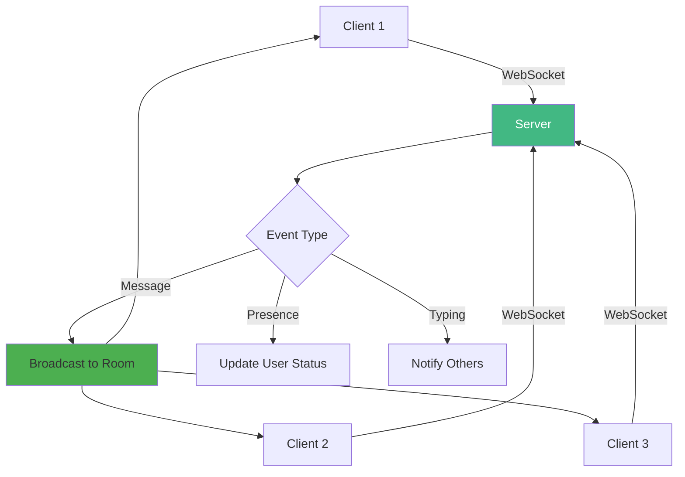
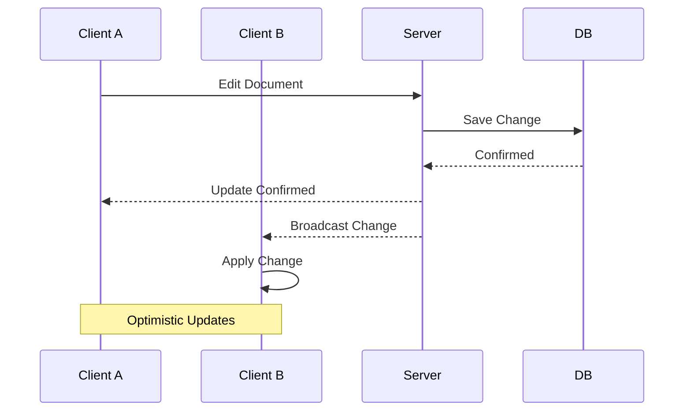
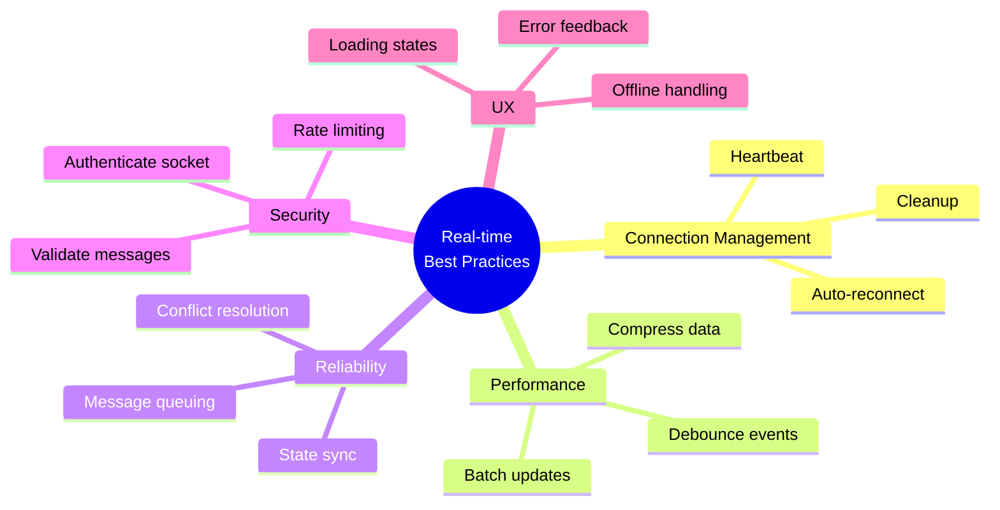

# Day 5 (Day 47): Real-time Features with WebSockets ⚡

**Duration:** 3-4 hours | **Difficulty:** ⭐⭐⭐ Hard

---

## 📖 Learning Objectives

- Setup WebSocket server
- Real-time updates
- Presence indicators
- Live notifications
- Collaborative features

---

## ⚡ Real-time Architecture



---

## 🚀 Setup WebSocket Server

### **Install Dependencies**

```bash
npm install ws socket.io socket.io-client
npm install -D @types/ws
```

### **WebSocket Server (Route Handler)**

```typescript
// app/api/socket/route.ts
import { Server } from 'socket.io'
import { NextRequest } from 'next/server'

export const dynamic = 'force-dynamic'

const io = new Server({
  cors: {
    origin: process.env.NEXT_PUBLIC_APP_URL,
    methods: ['GET', 'POST']
  }
})

const userRooms = new Map<string, Set<string>>()

io.on('connection', (socket) => {
  console.log('Client connected:', socket.id)
  
  // Join room
  socket.on('join-room', (roomId: string, userId: string) => {
    socket.join(roomId)
    
    if (!userRooms.has(roomId)) {
      userRooms.set(roomId, new Set())
    }
    userRooms.get(roomId)!.add(userId)
    
    // Notify others
    socket.to(roomId).emit('user-joined', {
      userId,
      users: Array.from(userRooms.get(roomId)!)
    })
  })
  
  // Leave room
  socket.on('leave-room', (roomId: string, userId: string) => {
    socket.leave(roomId)
    userRooms.get(roomId)?.delete(userId)
    
    socket.to(roomId).emit('user-left', {
      userId,
      users: Array.from(userRooms.get(roomId) || [])
    })
  })
  
  // Send message
  socket.on('send-message', (roomId: string, message: any) => {
    io.to(roomId).emit('receive-message', message)
  })
  
  // Typing indicator
  socket.on('typing', (roomId: string, userId: string) => {
    socket.to(roomId).emit('user-typing', userId)
  })
  
  // Disconnect
  socket.on('disconnect', () => {
    console.log('Client disconnected:', socket.id)
  })
})

export async function GET(req: NextRequest) {
  return new Response('WebSocket server running', { status: 200 })
}
```

---

## 🎯 Client-Side Connection

### **WebSocket Hook**

```typescript
// hooks/useWebSocket.ts
'use client'

import { useEffect, useState, useRef } from 'react'
import { io, Socket } from 'socket.io-client'

export function useWebSocket(url: string) {
  const [isConnected, setIsConnected] = useState(false)
  const socketRef = useRef<Socket | null>(null)
  
  useEffect(() => {
    // Create connection
    socketRef.current = io(url, {
      transports: ['websocket']
    })
    
    // Connection events
    socketRef.current.on('connect', () => {
      console.log('Connected to WebSocket')
      setIsConnected(true)
    })
    
    socketRef.current.on('disconnect', () => {
      console.log('Disconnected from WebSocket')
      setIsConnected(false)
    })
    
    // Cleanup
    return () => {
      socketRef.current?.disconnect()
    }
  }, [url])
  
  const emit = (event: string, ...args: any[]) => {
    socketRef.current?.emit(event, ...args)
  }
  
  const on = (event: string, callback: (...args: any[]) => void) => {
    socketRef.current?.on(event, callback)
  }
  
  const off = (event: string, callback?: (...args: any[]) => void) => {
    socketRef.current?.off(event, callback)
  }
  
  return {
    socket: socketRef.current,
    isConnected,
    emit,
    on,
    off
  }
}
```

---

## 💬 Chat Application

```typescript
// components/ChatRoom.tsx
'use client'

import { useState, useEffect, useRef } from 'react'
import { useWebSocket } from '@/hooks/useWebSocket'
import { useSession } from 'next-auth/react'

interface Message {
  id: string
  userId: string
  userName: string
  text: string
  timestamp: Date
}

export function ChatRoom({ roomId }: { roomId: string }) {
  const { data: session } = useSession()
  const { isConnected, emit, on, off } = useWebSocket('/api/socket')
  const [messages, setMessages] = useState<Message[]>([])
  const [inputValue, setInputValue] = useState('')
  const [typingUsers, setTypingUsers] = useState<string[]>([])
  const messagesEndRef = useRef<HTMLDivElement>(null)
  
  useEffect(() => {
    if (!isConnected || !session) return
    
    // Join room
    emit('join-room', roomId, session.user.id)
    
    // Listen for messages
    const handleMessage = (message: Message) => {
      setMessages(prev => [...prev, message])
    }
    
    // Listen for typing
    const handleTyping = (userId: string) => {
      setTypingUsers(prev => {
        if (!prev.includes(userId)) {
          return [...prev, userId]
        }
        return prev
      })
      
      // Remove after 3 seconds
      setTimeout(() => {
        setTypingUsers(prev => prev.filter(id => id !== userId))
      }, 3000)
    }
    
    on('receive-message', handleMessage)
    on('user-typing', handleTyping)
    
    return () => {
      off('receive-message', handleMessage)
      off('user-typing', handleTyping)
      emit('leave-room', roomId, session.user.id)
    }
  }, [isConnected, session, roomId])
  
  useEffect(() => {
    // Scroll to bottom
    messagesEndRef.current?.scrollIntoView({ behavior: 'smooth' })
  }, [messages])
  
  const sendMessage = () => {
    if (!inputValue.trim() || !session) return
    
    const message: Message = {
      id: Date.now().toString(),
      userId: session.user.id,
      userName: session.user.name!,
      text: inputValue,
      timestamp: new Date()
    }
    
    emit('send-message', roomId, message)
    setInputValue('')
  }
  
  const handleTyping = () => {
    if (!session) return
    emit('typing', roomId, session.user.id)
  }
  
  return (
    <div className="flex flex-col h-screen">
      {/* Header */}
      <div className="bg-gray-800 text-white p-4">
        <h2>Chat Room</h2>
        <div className="text-sm">
          {isConnected ? '🟢 Connected' : '🔴 Disconnected'}
        </div>
      </div>
      
      {/* Messages */}
      <div className="flex-1 overflow-y-auto p-4 space-y-4">
        {messages.map(message => (
          <div
            key={message.id}
            className={`flex ${
              message.userId === session?.user.id 
                ? 'justify-end' 
                : 'justify-start'
            }`}
          >
            <div
              className={`max-w-xs rounded-lg p-3 ${
                message.userId === session?.user.id
                  ? 'bg-blue-500 text-white'
                  : 'bg-gray-200'
              }`}
            >
              <div className="font-semibold text-sm">
                {message.userName}
              </div>
              <div>{message.text}</div>
              <div className="text-xs opacity-70 mt-1">
                {new Date(message.timestamp).toLocaleTimeString()}
              </div>
            </div>
          </div>
        ))}
        
        {/* Typing indicator */}
        {typingUsers.length > 0 && (
          <div className="text-sm text-gray-500 italic">
            {typingUsers.length} {typingUsers.length === 1 ? 'person is' : 'people are'} typing...
          </div>
        )}
        
        <div ref={messagesEndRef} />
      </div>
      
      {/* Input */}
      <div className="border-t p-4">
        <div className="flex gap-2">
          <input
            type="text"
            value={inputValue}
            onChange={(e) => {
              setInputValue(e.target.value)
              handleTyping()
            }}
            onKeyPress={(e) => e.key === 'Enter' && sendMessage()}
            placeholder="Type a message..."
            className="flex-1 border rounded px-4 py-2"
          />
          <button
            onClick={sendMessage}
            className="bg-blue-500 text-white px-6 py-2 rounded"
          >
            Send
          </button>
        </div>
      </div>
    </div>
  )
}
```

---

## 👥 User Presence

```typescript
// components/UserPresence.tsx
'use client'

import { useState, useEffect } from 'react'
import { useWebSocket } from '@/hooks/useWebSocket'
import { useSession } from 'next-auth/react'

interface User {
  id: string
  name: string
  status: 'online' | 'away' | 'offline'
  lastSeen?: Date
}

export function UserPresence({ roomId }: { roomId: string }) {
  const { data: session } = useSession()
  const { isConnected, emit, on, off } = useWebSocket('/api/socket')
  const [users, setUsers] = useState<User[]>([])
  
  useEffect(() => {
    if (!isConnected || !session) return
    
    // Update presence
    const updatePresence = (status: 'online' | 'away') => {
      emit('presence-update', {
        roomId,
        userId: session.user.id,
        status
      })
    }
    
    // Set online
    updatePresence('online')
    
    // Handle visibility change
    const handleVisibilityChange = () => {
      if (document.hidden) {
        updatePresence('away')
      } else {
        updatePresence('online')
      }
    }
    
    document.addEventListener('visibilitychange', handleVisibilityChange)
    
    // Listen for user updates
    const handleUserJoined = (data: { userId: string; users: User[] }) => {
      setUsers(data.users)
    }
    
    const handleUserLeft = (data: { userId: string; users: User[] }) => {
      setUsers(data.users)
    }
    
    on('user-joined', handleUserJoined)
    on('user-left', handleUserLeft)
    
    return () => {
      updatePresence('offline')
      off('user-joined', handleUserJoined)
      off('user-left', handleUserLeft)
      document.removeEventListener('visibilitychange', handleVisibilityChange)
    }
  }, [isConnected, session, roomId])
  
  return (
    <div className="bg-white rounded-lg shadow p-4">
      <h3 className="font-semibold mb-4">Online Users ({users.length})</h3>
      
      <div className="space-y-2">
        {users.map(user => (
          <div key={user.id} className="flex items-center gap-2">
            <div className={`w-3 h-3 rounded-full ${
              user.status === 'online' ? 'bg-green-500' :
              user.status === 'away' ? 'bg-yellow-500' :
              'bg-gray-500'
            }`} />
            <span>{user.name}</span>
            {user.status === 'away' && (
              <span className="text-xs text-gray-500">(Away)</span>
            )}
          </div>
        ))}
      </div>
    </div>
  )
}
```

---

## 📢 Live Notifications

```typescript
// components/LiveNotifications.tsx
'use client'

import { useState, useEffect } from 'react'
import { useWebSocket } from '@/hooks/useWebSocket'
import { useSession } from 'next-auth/react'
import { toast } from 'sonner'

interface Notification {
  id: string
  type: 'info' | 'success' | 'warning' | 'error'
  title: string
  message: string
  timestamp: Date
}

export function LiveNotifications() {
  const { data: session } = useSession()
  const { isConnected, on, off } = useWebSocket('/api/socket')
  const [notifications, setNotifications] = useState<Notification[]>([])
  
  useEffect(() => {
    if (!isConnected || !session) return
    
    const handleNotification = (notification: Notification) => {
      setNotifications(prev => [notification, ...prev].slice(0, 50))
      
      // Show toast
      const toastFn = {
        info: toast.info,
        success: toast.success,
        warning: toast.warning,
        error: toast.error
      }[notification.type]
      
      toastFn(notification.title, {
        description: notification.message
      })
    }
    
    on('notification', handleNotification)
    
    return () => {
      off('notification', handleNotification)
    }
  }, [isConnected, session])
  
  return (
    <div className="fixed bottom-4 right-4 w-96 max-h-96 overflow-y-auto">
      {notifications.map(notification => (
        <div
          key={notification.id}
          className="bg-white rounded-lg shadow-lg p-4 mb-2"
        >
          <h4 className="font-semibold">{notification.title}</h4>
          <p className="text-sm text-gray-600">{notification.message}</p>
          <span className="text-xs text-gray-400">
            {new Date(notification.timestamp).toLocaleTimeString()}
          </span>
        </div>
      ))}
    </div>
  )
}
```

---

## 🎯 Collaborative Editing

```typescript
// components/CollaborativeEditor.tsx
'use client'

import { useState, useEffect, useCallback } from 'react'
import { useWebSocket } from '@/hooks/useWebSocket'
import { useSession } from 'next-auth/react'
import { debounce } from 'lodash'

interface Change {
  userId: string
  position: number
  insert?: string
  delete?: number
}

export function CollaborativeEditor({ 
  documentId 
}: { 
  documentId: string 
}) {
  const { data: session } = useSession()
  const { isConnected, emit, on, off } = useWebSocket('/api/socket')
  const [content, setContent] = useState('')
  const [cursors, setCursors] = useState<Map<string, number>>(new Map())
  
  useEffect(() => {
    if (!isConnected || !session) return
    
    // Join document
    emit('join-document', documentId, session.user.id)
    
    // Listen for changes
    const handleChange = (change: Change) => {
      if (change.userId === session.user.id) return
      
      setContent(prev => {
        let newContent = prev
        
        if (change.delete) {
          newContent = 
            prev.slice(0, change.position) + 
            prev.slice(change.position + change.delete)
        }
        
        if (change.insert) {
          newContent = 
            newContent.slice(0, change.position) + 
            change.insert + 
            newContent.slice(change.position)
        }
        
        return newContent
      })
    }
    
    // Listen for cursor updates
    const handleCursor = (data: { userId: string; position: number }) => {
      setCursors(prev => new Map(prev).set(data.userId, data.position))
    }
    
    on('document-change', handleChange)
    on('cursor-update', handleCursor)
    
    return () => {
      emit('leave-document', documentId, session.user.id)
      off('document-change', handleChange)
      off('cursor-update', handleCursor)
    }
  }, [isConnected, session, documentId])
  
  const emitChange = useCallback(
    debounce((change: Change) => {
      emit('document-change', documentId, change)
    }, 100),
    [documentId]
  )
  
  const handleChange = (e: React.ChangeEvent<HTMLTextAreaElement>) => {
    const newValue = e.target.value
    const cursorPosition = e.target.selectionStart
    
    // Determine change type
    if (newValue.length > content.length) {
      // Insert
      const insert = newValue.slice(
        cursorPosition - (newValue.length - content.length),
        cursorPosition
      )
      
      emitChange({
        userId: session!.user.id,
        position: cursorPosition - insert.length,
        insert
      })
    } else if (newValue.length < content.length) {
      // Delete
      emitChange({
        userId: session!.user.id,
        position: cursorPosition,
        delete: content.length - newValue.length
      })
    }
    
    setContent(newValue)
    
    // Update cursor position
    emit('cursor-update', documentId, {
      userId: session!.user.id,
      position: cursorPosition
    })
  }
  
  return (
    <div className="relative">
      <textarea
        value={content}
        onChange={handleChange}
        className="w-full h-96 p-4 border rounded font-mono"
        placeholder="Start typing..."
      />
      
      {/* Other users' cursors */}
      {Array.from(cursors.entries()).map(([userId, position]) => (
        <div
          key={userId}
          className="absolute w-0.5 h-5 bg-blue-500"
          style={{
            left: `${position * 8}px`, // Approximate character width
            top: '1rem'
          }}
        >
          <span className="text-xs bg-blue-500 text-white px-1 rounded">
            {userId}
          </span>
        </div>
      ))}
    </div>
  )
}
```

---

## 🔄 Real-time Data Sync



---

## ✅ Real-time Best Practices



---

## ✅ Practice Exercise

Build real-time features:
1. Chat application with typing indicators
2. Live user presence
3. Collaborative document editor
4. Real-time notifications
5. Live dashboard updates
6. Multiplayer game state
7. WebRTC video chat

---

**Tomorrow:** Error Handling & Monitoring! 🔍
