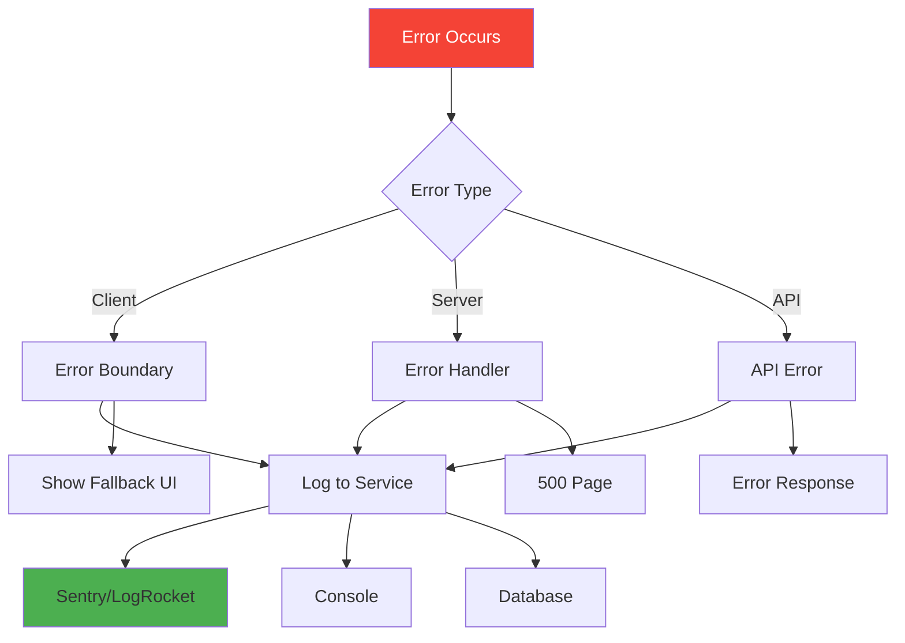
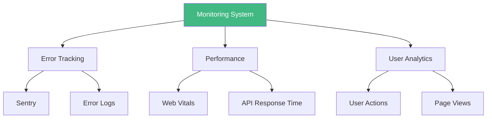
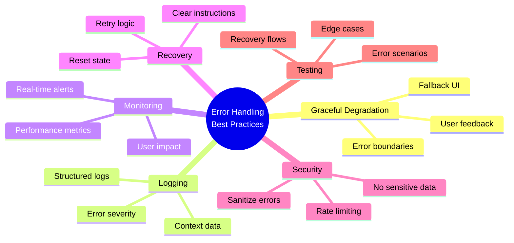

# Day 6 (Day 48): Error Handling, Logging & Monitoring 🔍

**Duration:** 2-3 hours | **Difficulty:** ⭐⭐ Medium

---

## 📖 Learning Objectives

- Error boundaries
- Logging strategies
- Performance monitoring
- Error tracking services
- Analytics integration

---

## 🔍 Error Handling Architecture



---

## 🚀 Error Boundaries

### **Global Error Boundary**

```typescript
// app/error.tsx
'use client'

import { useEffect } from 'react'

export default function Error({
  error,
  reset,
}: {
  error: Error & { digest?: string }
  reset: () => void
}) {
  useEffect(() => {
    // Log error to service
    console.error('Application error:', error)
    
    // Send to Sentry
    if (typeof window !== 'undefined') {
      // Sentry.captureException(error)
    }
  }, [error])
  
  return (
    <div className="min-h-screen flex items-center justify-center bg-gray-50">
      <div className="max-w-md w-full bg-white p-8 rounded-lg shadow">
        <h2 className="text-2xl font-bold text-red-600 mb-4">
          Something went wrong!
        </h2>
        
        <p className="text-gray-600 mb-4">
          We're sorry, but something unexpected happened.
        </p>
        
        {process.env.NODE_ENV === 'development' && (
          <details className="mb-4">
            <summary className="cursor-pointer text-sm text-gray-500">
              Error details
            </summary>
            <pre className="mt-2 text-xs bg-gray-100 p-2 rounded overflow-auto">
              {error.message}
            </pre>
          </details>
        )}
        
        <button
          onClick={reset}
          className="w-full bg-blue-600 text-white py-2 rounded hover:bg-blue-700"
        >
          Try again
        </button>
      </div>
    </div>
  )
}
```

### **Route-Specific Error Boundary**

```typescript
// app/dashboard/error.tsx
'use client'

export default function DashboardError({
  error,
  reset,
}: {
  error: Error
  reset: () => void
}) {
  return (
    <div className="p-4 bg-red-50 border border-red-200 rounded">
      <h3 className="text-red-800 font-semibold">
        Failed to load dashboard
      </h3>
      <p className="text-red-600 text-sm mt-2">
        {error.message}
      </p>
      <button 
        onClick={reset}
        className="mt-4 px-4 py-2 bg-red-600 text-white rounded"
      >
        Retry
      </button>
    </div>
  )
}
```

### **Global Error Page (unrecoverable)**

```typescript
// app/global-error.tsx
'use client'

export default function GlobalError({
  error,
  reset,
}: {
  error: Error & { digest?: string }
  reset: () => void
}) {
  return (
    <html>
      <body>
        <div className="min-h-screen flex items-center justify-center">
          <div className="text-center">
            <h2 className="text-4xl font-bold mb-4">Critical Error</h2>
            <p className="mb-4">The application encountered a critical error.</p>
            <button
              onClick={reset}
              className="px-6 py-3 bg-blue-600 text-white rounded"
            >
              Reset Application
            </button>
          </div>
        </div>
      </body>
    </html>
  )
}
```

---

## 📝 Logging System

### **Logger Utility**

```typescript
// lib/logger.ts
type LogLevel = 'debug' | 'info' | 'warn' | 'error'

interface LogEntry {
  timestamp: Date
  level: LogLevel
  message: string
  context?: Record<string, any>
  error?: Error
}

class Logger {
  private isDevelopment = process.env.NODE_ENV === 'development'
  
  private log(level: LogLevel, message: string, context?: Record<string, any>, error?: Error) {
    const entry: LogEntry = {
      timestamp: new Date(),
      level,
      message,
      context,
      error
    }
    
    // Console logging
    if (this.isDevelopment) {
      const style = {
        debug: 'color: gray',
        info: 'color: blue',
        warn: 'color: orange',
        error: 'color: red'
      }[level]
      
      console.log(`%c[${level.toUpperCase()}] ${message}`, style, context || '')
      if (error) console.error(error)
    }
    
    // Send to logging service
    this.sendToService(entry)
  }
  
  private sendToService(entry: LogEntry) {
    // Send to external logging service
    if (typeof window !== 'undefined') {
      // fetch('/api/logs', {
      //   method: 'POST',
      //   body: JSON.stringify(entry)
      // })
    }
  }
  
  debug(message: string, context?: Record<string, any>) {
    this.log('debug', message, context)
  }
  
  info(message: string, context?: Record<string, any>) {
    this.log('info', message, context)
  }
  
  warn(message: string, context?: Record<string, any>) {
    this.log('warn', message, context)
  }
  
  error(message: string, error?: Error, context?: Record<string, any>) {
    this.log('error', message, context, error)
  }
}

export const logger = new Logger()
```

### **Usage**

```typescript
// app/actions.ts
'use server'

import { logger } from '@/lib/logger'

export async function createPost(data: PostData) {
  logger.info('Creating post', { userId: data.userId })
  
  try {
    const post = await db.post.create({ data })
    logger.info('Post created successfully', { postId: post.id })
    return post
  } catch (error) {
    logger.error('Failed to create post', error as Error, { data })
    throw error
  }
}
```

---

## 🔧 Sentry Integration

### **Setup Sentry**

```bash
npm install @sentry/nextjs
npx @sentry/wizard@latest -i nextjs
```

### **Configuration**

```typescript
// sentry.client.config.ts
import * as Sentry from '@sentry/nextjs'

Sentry.init({
  dsn: process.env.NEXT_PUBLIC_SENTRY_DSN,
  
  tracesSampleRate: 1.0,
  
  debug: false,
  
  replaysOnErrorSampleRate: 1.0,
  replaysSessionSampleRate: 0.1,
  
  integrations: [
    new Sentry.Replay({
      maskAllText: true,
      blockAllMedia: true,
    }),
  ],
})
```

```typescript
// sentry.server.config.ts
import * as Sentry from '@sentry/nextjs'

Sentry.init({
  dsn: process.env.NEXT_PUBLIC_SENTRY_DSN,
  
  tracesSampleRate: 1.0,
  
  debug: false,
})
```

### **Custom Error Tracking**

```typescript
// lib/error-tracking.ts
import * as Sentry from '@sentry/nextjs'

export function captureError(error: Error, context?: Record<string, any>) {
  Sentry.captureException(error, {
    extra: context,
    tags: {
      component: context?.component || 'unknown'
    }
  })
}

export function captureMessage(message: string, level: 'info' | 'warning' | 'error' = 'info') {
  Sentry.captureMessage(message, level)
}

export function setUser(user: { id: string; email: string; name: string }) {
  Sentry.setUser(user)
}

export function clearUser() {
  Sentry.setUser(null)
}
```

---

## 📊 Performance Monitoring

### **Web Vitals**

```typescript
// app/layout.tsx
import { Analytics } from '@vercel/analytics/react'
import { SpeedInsights } from '@vercel/speed-insights/next'

export default function RootLayout({ children }: { children: React.ReactNode }) {
  return (
    <html>
      <body>
        {children}
        <Analytics />
        <SpeedInsights />
      </body>
    </html>
  )
}
```

### **Custom Performance Tracking**

```typescript
// lib/performance.ts
export class PerformanceMonitor {
  private marks = new Map<string, number>()
  
  start(name: string) {
    this.marks.set(name, performance.now())
  }
  
  end(name: string): number {
    const start = this.marks.get(name)
    if (!start) {
      console.warn(`No start mark found for: ${name}`)
      return 0
    }
    
    const duration = performance.now() - start
    this.marks.delete(name)
    
    // Log performance
    if (duration > 1000) {
      console.warn(`Slow operation: ${name} took ${duration.toFixed(2)}ms`)
    }
    
    // Send to analytics
    this.sendMetric(name, duration)
    
    return duration
  }
  
  private sendMetric(name: string, duration: number) {
    // Send to analytics service
    if (typeof window !== 'undefined') {
      // analytics.track('performance', { name, duration })
    }
  }
}

export const performanceMonitor = new PerformanceMonitor()
```

```typescript
// Usage
import { performanceMonitor } from '@/lib/performance'

export async function getData() {
  performanceMonitor.start('fetch-data')
  
  const data = await fetch('/api/data').then(r => r.json())
  
  performanceMonitor.end('fetch-data')
  
  return data
}
```

---

## 📈 API Error Handling

```typescript
// lib/api-error.ts
export class APIError extends Error {
  constructor(
    public statusCode: number,
    message: string,
    public code?: string
  ) {
    super(message)
    this.name = 'APIError'
  }
}

export function isAPIError(error: unknown): error is APIError {
  return error instanceof APIError
}
```

```typescript
// app/api/posts/route.ts
import { NextRequest, NextResponse } from 'next/server'
import { APIError } from '@/lib/api-error'
import { logger } from '@/lib/logger'

export async function GET(request: NextRequest) {
  try {
    const posts = await db.post.findMany()
    return NextResponse.json(posts)
  } catch (error) {
    logger.error('Failed to fetch posts', error as Error)
    
    if (isAPIError(error)) {
      return NextResponse.json(
        { error: error.message, code: error.code },
        { status: error.statusCode }
      )
    }
    
    return NextResponse.json(
      { error: 'Internal server error' },
      { status: 500 }
    )
  }
}
```

---

## 🎯 Rate Limiting & Security

```typescript
// lib/rate-limit.ts
import { LRUCache } from 'lru-cache'

const rateLimit = new LRUCache({
  max: 500,
  ttl: 60000, // 1 minute
})

export function checkRateLimit(identifier: string, limit: number = 10): boolean {
  const count = (rateLimit.get(identifier) as number) || 0
  
  if (count >= limit) {
    return false
  }
  
  rateLimit.set(identifier, count + 1)
  return true
}
```

```typescript
// middleware.ts
import { NextResponse } from 'next/server'
import type { NextRequest } from 'next/server'
import { checkRateLimit } from '@/lib/rate-limit'

export function middleware(request: NextRequest) {
  const ip = request.ip || 'unknown'
  
  // Check rate limit
  if (!checkRateLimit(ip, 100)) {
    return NextResponse.json(
      { error: 'Too many requests' },
      { status: 429 }
    )
  }
  
  return NextResponse.next()
}
```

---

## 📱 Client-Side Error Tracking

```typescript
// components/ErrorBoundary.tsx
'use client'

import React, { Component, ReactNode } from 'react'
import { captureError } from '@/lib/error-tracking'

interface Props {
  children: ReactNode
  fallback?: ReactNode
}

interface State {
  hasError: boolean
  error?: Error
}

export class ErrorBoundary extends Component<Props, State> {
  constructor(props: Props) {
    super(props)
    this.state = { hasError: false }
  }
  
  static getDerivedStateFromError(error: Error): State {
    return { hasError: true, error }
  }
  
  componentDidCatch(error: Error, errorInfo: React.ErrorInfo) {
    captureError(error, {
      component: 'ErrorBoundary',
      errorInfo: errorInfo.componentStack
    })
  }
  
  render() {
    if (this.state.hasError) {
      return this.props.fallback || (
        <div className="p-4 bg-red-50 border border-red-200 rounded">
          <h3 className="text-red-800 font-semibold">Something went wrong</h3>
          <button
            onClick={() => this.setState({ hasError: false })}
            className="mt-2 px-4 py-2 bg-red-600 text-white rounded"
          >
            Try again
          </button>
        </div>
      )
    }
    
    return this.props.children
  }
}
```

---

## 🔔 Error Notification System

```typescript
// components/ErrorToast.tsx
'use client'

import { useEffect } from 'react'
import { toast } from 'sonner'

export function useErrorToast(error?: Error) {
  useEffect(() => {
    if (error) {
      toast.error(error.message, {
        description: 'Please try again or contact support',
        action: {
          label: 'Report',
          onClick: () => {
            // Report error
            window.open('/support')
          }
        }
      })
    }
  }, [error])
}
```

---

## 📊 Monitoring Dashboard



---

## ✅ Error Handling Best Practices



---

## ✅ Practice Exercise

Implement monitoring for:
1. Global error boundaries
2. Sentry integration
3. Performance tracking
4. API error handling
5. Rate limiting
6. Custom logging system
7. Error notification UI

---

**Tomorrow:** Advanced Project - Collaborative App! 🎉
