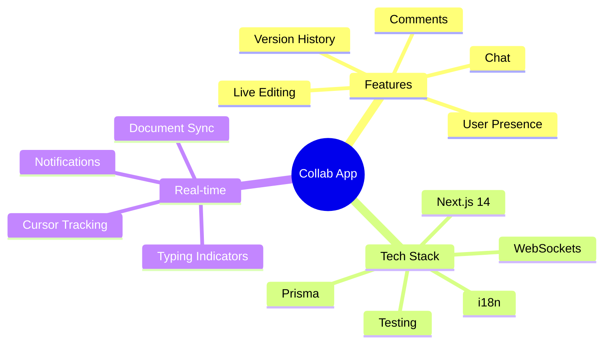
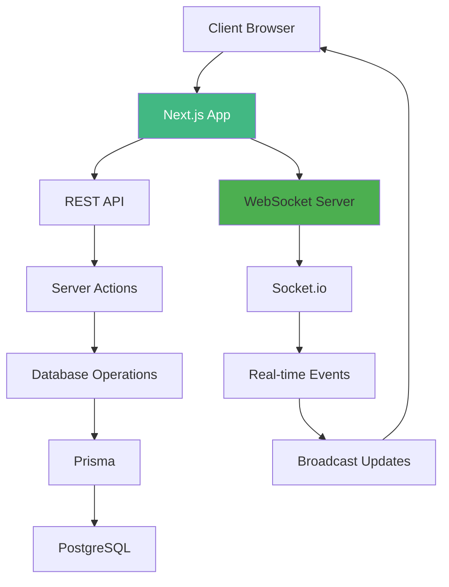

# Day 7 (Day 49): Advanced Project - Real-time Collaboration App 🎉

**Duration:** 6-8 hours | **Difficulty:** ⭐⭐⭐ Project

---

## 🎯 Project Overview

Build a **Real-time Collaborative Document Editor** using all Week 7 concepts!



---

## 📋 Requirements

### **Must Have:**
1. ✅ Real-time document editing
2. ✅ User presence indicators
3. ✅ Live chat in document
4. ✅ Collaborative cursors
5. ✅ WebSocket integration
6. ✅ Document permissions
7. ✅ Version history
8. ✅ Comments system
9. ✅ Multi-language support (i18n)
10. ✅ Comprehensive tests

---

## 🏗️ Architecture



---

## 📊 Database Schema

```prisma
// prisma/schema.prisma
model User {
  id            String    @id @default(cuid())
  email         String    @unique
  name          String
  image         String?
  createdAt     DateTime  @default(now())
  updatedAt     DateTime  @updatedAt
  
  documents     Document[]
  collaborators DocumentCollaborator[]
  comments      Comment[]
  sessions      UserSession[]
}

model Document {
  id          String   @id @default(cuid())
  title       String
  content     String   @db.Text
  ownerId     String
  createdAt   DateTime @default(now())
  updatedAt   DateTime @updatedAt
  
  owner       User     @relation(fields: [ownerId], references: [id], onDelete: Cascade)
  collaborators DocumentCollaborator[]
  versions    DocumentVersion[]
  comments    Comment[]
}

model DocumentCollaborator {
  id          String   @id @default(cuid())
  documentId  String
  userId      String
  role        Role     @default(EDITOR)
  joinedAt    DateTime @default(now())
  
  document    Document @relation(fields: [documentId], references: [id], onDelete: Cascade)
  user        User     @relation(fields: [userId], references: [id], onDelete: Cascade)
  
  @@unique([documentId, userId])
}

enum Role {
  VIEWER
  EDITOR
  ADMIN
}

model DocumentVersion {
  id          String   @id @default(cuid())
  documentId  String
  content     String   @db.Text
  createdAt   DateTime @default(now())
  createdBy   String
  
  document    Document @relation(fields: [documentId], references: [id], onDelete: Cascade)
}

model Comment {
  id          String   @id @default(cuid())
  documentId  String
  userId      String
  content     String
  position    Int?
  resolved    Boolean  @default(false)
  createdAt   DateTime @default(now())
  updatedAt   DateTime @updatedAt
  
  document    Document @relation(fields: [documentId], references: [id], onDelete: Cascade)
  user        User     @relation(fields: [userId], references: [id], onDelete: Cascade)
}

model UserSession {
  id          String   @id @default(cuid())
  userId      String
  documentId  String
  status      SessionStatus @default(ACTIVE)
  cursor      Int?
  lastSeen    DateTime @default(now())
  
  user        User     @relation(fields: [userId], references: [id], onDelete: Cascade)
}

enum SessionStatus {
  ACTIVE
  AWAY
  OFFLINE
}
```

---

## 🗺️ File Structure

```
src/
├── app/
│   ├── (auth)/
│   │   ├── login/page.tsx
│   │   └── register/page.tsx
│   ├── (dashboard)/
│   │   ├── documents/
│   │   │   ├── page.tsx
│   │   │   ├── [id]/page.tsx
│   │   │   └── new/page.tsx
│   │   └── layout.tsx
│   ├── api/
│   │   ├── socket/route.ts
│   │   ├── documents/route.ts
│   │   └── comments/route.ts
│   └── actions.ts
├── components/
│   ├── editor/
│   │   ├── CollaborativeEditor.tsx
│   │   ├── Toolbar.tsx
│   │   └── Cursors.tsx
│   ├── presence/
│   │   ├── UserPresence.tsx
│   │   └── ActiveUsers.tsx
│   ├── chat/
│   │   ├── DocumentChat.tsx
│   │   └── ChatMessage.tsx
│   └── comments/
│       ├── CommentThread.tsx
│       └── CommentForm.tsx
├── hooks/
│   ├── useWebSocket.ts
│   ├── useCollaboration.ts
│   └── usePresence.ts
├── lib/
│   ├── socket-server.ts
│   ├── collaboration.ts
│   └── db.ts
└── __tests__/
    ├── editor.test.tsx
    ├── presence.test.tsx
    └── e2e/
        └── collaboration.spec.ts
```

---

## 🎨 Key Features Implementation

### **1. Real-time Editor**

```typescript
// components/editor/CollaborativeEditor.tsx
'use client'

import { useState, useEffect, useCallback, useRef } from 'react'
import { useWebSocket } from '@/hooks/useWebSocket'
import { useSession } from 'next-auth/react'
import { debounce } from 'lodash'

interface EditorProps {
  documentId: string
  initialContent: string
}

export function CollaborativeEditor({ documentId, initialContent }: EditorProps) {
  const { data: session } = useSession()
  const { isConnected, emit, on, off } = useWebSocket()
  const [content, setContent] = useState(initialContent)
  const [cursors, setCursors] = useState<Map<string, CursorPosition>>(new Map())
  const [isTyping, setIsTyping] = useState(false)
  const editorRef = useRef<HTMLTextAreaElement>(null)
  
  useEffect(() => {
    if (!isConnected || !session) return
    
    // Join document
    emit('document:join', { documentId, userId: session.user.id })
    
    // Handle remote changes
    const handleChange = (change: DocumentChange) => {
      if (change.userId === session.user.id) return
      
      applyChange(change)
    }
    
    // Handle cursor updates
    const handleCursorUpdate = (data: CursorUpdate) => {
      if (data.userId === session.user.id) return
      
      setCursors(prev => {
        const updated = new Map(prev)
        updated.set(data.userId, data.position)
        return updated
      })
    }
    
    on('document:change', handleChange)
    on('cursor:update', handleCursorUpdate)
    
    return () => {
      off('document:change', handleChange)
      off('cursor:update', handleCursorUpdate)
      emit('document:leave', { documentId, userId: session.user.id })
    }
  }, [isConnected, session, documentId])
  
  const applyChange = (change: DocumentChange) => {
    setContent(prev => {
      const { type, position, data } = change
      
      if (type === 'insert') {
        return prev.slice(0, position) + data + prev.slice(position)
      } else if (type === 'delete') {
        return prev.slice(0, position) + prev.slice(position + data.length)
      }
      
      return prev
    })
  }
  
  const emitChange = useCallback(
    debounce((change: DocumentChange) => {
      emit('document:change', { documentId, change })
      
      // Save to database periodically
      saveDocument(documentId, content)
    }, 300),
    [documentId, content]
  )
  
  const handleContentChange = (e: React.ChangeEvent<HTMLTextAreaElement>) => {
    const newContent = e.target.value
    const cursorPos = e.target.selectionStart
    
    // Calculate change
    const change = calculateChange(content, newContent, cursorPos)
    
    if (change) {
      setContent(newContent)
      emitChange({
        ...change,
        userId: session!.user.id,
        timestamp: Date.now()
      })
    }
  }
  
  const handleCursorChange = useCallback(
    debounce((position: CursorPosition) => {
      emit('cursor:update', {
        documentId,
        userId: session!.user.id,
        position
      })
    }, 100),
    [documentId]
  )
  
  const handleSelection = () => {
    if (!editorRef.current) return
    
    handleCursorChange({
      line: getCurrentLine(editorRef.current),
      column: editorRef.current.selectionStart
    })
  }
  
  return (
    <div className="relative h-full">
      <textarea
        ref={editorRef}
        value={content}
        onChange={handleContentChange}
        onSelect={handleSelection}
        className="w-full h-full p-6 font-mono text-lg resize-none focus:outline-none"
        placeholder="Start typing..."
      />
      
      {/* Remote cursors */}
      <RemoteCursors cursors={cursors} editorRef={editorRef} />
    </div>
  )
}

function calculateChange(
  oldContent: string,
  newContent: string,
  cursorPos: number
): DocumentChange | null {
  if (newContent.length > oldContent.length) {
    // Insert
    const insertPos = cursorPos - (newContent.length - oldContent.length)
    return {
      type: 'insert',
      position: insertPos,
      data: newContent.slice(insertPos, cursorPos)
    }
  } else if (newContent.length < oldContent.length) {
    // Delete
    return {
      type: 'delete',
      position: cursorPos,
      data: oldContent.slice(cursorPos, cursorPos + (oldContent.length - newContent.length))
    }
  }
  
  return null
}
```

### **2. User Presence**

```typescript
// components/presence/ActiveUsers.tsx
'use client'

import { useState, useEffect } from 'react'
import { useWebSocket } from '@/hooks/useWebSocket'
import Image from 'next/image'

interface ActiveUser {
  id: string
  name: string
  image?: string
  status: 'active' | 'away'
  cursor?: CursorPosition
}

export function ActiveUsers({ documentId }: { documentId: string }) {
  const { isConnected, on, off } = useWebSocket()
  const [users, setUsers] = useState<ActiveUser[]>([])
  
  useEffect(() => {
    if (!isConnected) return
    
    const handleUserJoined = (user: ActiveUser) => {
      setUsers(prev => {
        const exists = prev.find(u => u.id === user.id)
        if (exists) return prev
        return [...prev, user]
      })
    }
    
    const handleUserLeft = (userId: string) => {
      setUsers(prev => prev.filter(u => u.id !== userId))
    }
    
    const handleStatusChange = (data: { userId: string; status: 'active' | 'away' }) => {
      setUsers(prev => prev.map(u => 
        u.id === data.userId ? { ...u, status: data.status } : u
      ))
    }
    
    on('user:joined', handleUserJoined)
    on('user:left', handleUserLeft)
    on('user:status', handleStatusChange)
    
    return () => {
      off('user:joined', handleUserJoined)
      off('user:left', handleUserLeft)
      off('user:status', handleStatusChange)
    }
  }, [isConnected])
  
  return (
    <div className="flex items-center gap-2 px-4 py-2 bg-white border-b">
      <span className="text-sm text-gray-600">
        {users.length} {users.length === 1 ? 'person' : 'people'} editing
      </span>
      
      <div className="flex -space-x-2">
        {users.map(user => (
          <div
            key={user.id}
            className="relative"
            title={user.name}
          >
            <Image
              src={user.image || '/default-avatar.png'}
              alt={user.name}
              width={32}
              height={32}
              className="rounded-full border-2 border-white"
            />
            <div className={`absolute bottom-0 right-0 w-3 h-3 rounded-full border-2 border-white ${
              user.status === 'active' ? 'bg-green-500' : 'bg-yellow-500'
            }`} />
          </div>
        ))}
      </div>
    </div>
  )
}
```

### **3. Comments System**

```typescript
// components/comments/CommentThread.tsx
'use client'

import { useState } from 'react'
import { addComment, resolveComment } from '@/app/actions'
import { useSession } from 'next-auth/react'

interface Comment {
  id: string
  userId: string
  userName: string
  content: string
  position?: number
  resolved: boolean
  createdAt: Date
}

export function CommentThread({ 
  documentId, 
  comments: initialComments 
}: { 
  documentId: string
  comments: Comment[] 
}) {
  const { data: session } = useSession()
  const [comments, setComments] = useState(initialComments)
  const [newComment, setNewComment] = useState('')
  
  const handleAddComment = async () => {
    if (!newComment.trim() || !session) return
    
    const comment = await addComment(documentId, newComment)
    setComments(prev => [...prev, comment])
    setNewComment('')
  }
  
  const handleResolve = async (commentId: string) => {
    await resolveComment(commentId)
    setComments(prev => prev.map(c => 
      c.id === commentId ? { ...c, resolved: true } : c
    ))
  }
  
  return (
    <div className="w-80 h-full bg-white border-l flex flex-col">
      <div className="p-4 border-b">
        <h3 className="font-semibold">Comments</h3>
      </div>
      
      <div className="flex-1 overflow-y-auto p-4 space-y-4">
        {comments.map(comment => (
          <div
            key={comment.id}
            className={`p-3 rounded ${
              comment.resolved ? 'bg-gray-50' : 'bg-blue-50'
            }`}
          >
            <div className="flex items-start justify-between mb-2">
              <span className="font-semibold text-sm">
                {comment.userName}
              </span>
              {!comment.resolved && (
                <button
                  onClick={() => handleResolve(comment.id)}
                  className="text-xs text-blue-600 hover:underline"
                >
                  Resolve
                </button>
              )}
            </div>
            
            <p className="text-sm">{comment.content}</p>
            
            <span className="text-xs text-gray-500 mt-2 block">
              {new Date(comment.createdAt).toLocaleString()}
            </span>
          </div>
        ))}
      </div>
      
      <div className="p-4 border-t">
        <textarea
          value={newComment}
          onChange={(e) => setNewComment(e.target.value)}
          placeholder="Add a comment..."
          className="w-full p-2 border rounded resize-none"
          rows={3}
        />
        <button
          onClick={handleAddComment}
          className="mt-2 w-full bg-blue-600 text-white py-2 rounded"
        >
          Add Comment
        </button>
      </div>
    </div>
  )
}
```

### **4. Version History**

```typescript
// components/versions/VersionHistory.tsx
'use client'

import { useState } from 'react'
import { getVersions, restoreVersion } from '@/app/actions'

interface Version {
  id: string
  content: string
  createdAt: Date
  createdBy: string
}

export function VersionHistory({ documentId }: { documentId: string }) {
  const [versions, setVersions] = useState<Version[]>([])
  const [isOpen, setIsOpen] = useState(false)
  const [selectedVersion, setSelectedVersion] = useState<Version | null>(null)
  
  const loadVersions = async () => {
    const data = await getVersions(documentId)
    setVersions(data)
    setIsOpen(true)
  }
  
  const handleRestore = async (versionId: string) => {
    await restoreVersion(documentId, versionId)
    setIsOpen(false)
    window.location.reload()
  }
  
  return (
    <>
      <button
        onClick={loadVersions}
        className="px-4 py-2 text-sm text-gray-700 hover:bg-gray-100 rounded"
      >
        Version History
      </button>
      
      {isOpen && (
        <div className="fixed inset-0 bg-black/50 flex items-center justify-center z-50">
          <div className="bg-white rounded-lg w-full max-w-4xl max-h-[80vh] flex">
            <div className="w-1/3 border-r overflow-y-auto p-4">
              <h3 className="font-semibold mb-4">Versions</h3>
              
              {versions.map(version => (
                <div
                  key={version.id}
                  onClick={() => setSelectedVersion(version)}
                  className={`p-3 rounded cursor-pointer mb-2 ${
                    selectedVersion?.id === version.id
                      ? 'bg-blue-50 border-blue-200'
                      : 'hover:bg-gray-50'
                  }`}
                >
                  <div className="text-sm font-medium">
                    {new Date(version.createdAt).toLocaleString()}
                  </div>
                  <div className="text-xs text-gray-600">
                    By {version.createdBy}
                  </div>
                </div>
              ))}
            </div>
            
            <div className="flex-1 flex flex-col">
              {selectedVersion ? (
                <>
                  <div className="p-4 border-b flex justify-between items-center">
                    <h3 className="font-semibold">Preview</h3>
                    <button
                      onClick={() => handleRestore(selectedVersion.id)}
                      className="px-4 py-2 bg-blue-600 text-white rounded"
                    >
                      Restore This Version
                    </button>
                  </div>
                  
                  <div className="flex-1 p-6 overflow-auto">
                    <pre className="whitespace-pre-wrap font-mono text-sm">
                      {selectedVersion.content}
                    </pre>
                  </div>
                </>
              ) : (
                <div className="flex-1 flex items-center justify-center text-gray-500">
                  Select a version to preview
                </div>
              )}
            </div>
          </div>
          
          <button
            onClick={() => setIsOpen(false)}
            className="absolute top-4 right-4 text-white"
          >
            ✕
          </button>
        </div>
      )}
    </>
  )
}
```

---

## 🧪 Testing

### **Unit Tests**

```typescript
// __tests__/collaboration.test.ts
import { describe, it, expect, vi } from 'vitest'
import { calculateChange, applyChange } from '@/lib/collaboration'

describe('Collaboration Logic', () => {
  it('calculates insert change', () => {
    const change = calculateChange('Hello', 'Hello World', 11)
    
    expect(change).toEqual({
      type: 'insert',
      position: 5,
      data: ' World'
    })
  })
  
  it('calculates delete change', () => {
    const change = calculateChange('Hello World', 'Hello', 5)
    
    expect(change).toEqual({
      type: 'delete',
      position: 5,
      data: ' World'
    })
  })
  
  it('applies insert change', () => {
    const result = applyChange('Hello', {
      type: 'insert',
      position: 5,
      data: ' World'
    })
    
    expect(result).toBe('Hello World')
  })
})
```

### **E2E Tests**

```typescript
// __tests__/e2e/collaboration.spec.ts
import { test, expect } from '@playwright/test'

test.describe('Real-time Collaboration', () => {
  test('multiple users can edit simultaneously', async ({ browser }) => {
    // Create two browser contexts (two users)
    const context1 = await browser.newContext()
    const context2 = await browser.newContext()
    
    const page1 = await context1.newPage()
    const page2 = await context2.newPage()
    
    // User 1 creates document
    await page1.goto('/documents/new')
    await page1.fill('[data-testid="document-title"]', 'Collab Test')
    await page1.click('[data-testid="create-button"]')
    
    const url = page1.url()
    
    // User 2 joins document
    await page2.goto(url)
    
    // User 1 types
    await page1.fill('[data-testid="editor"]', 'Hello from User 1')
    
    // User 2 should see the update
    await expect(page2.locator('[data-testid="editor"]')).toHaveValue('Hello from User 1')
    
    // User 2 adds content
    await page2.fill('[data-testid="editor"]', 'Hello from User 1\nHello from User 2')
    
    // User 1 should see the update
    await expect(page1.locator('[data-testid="editor"]')).toContainText('Hello from User 2')
  })
})
```

---

## ✅ Implementation Checklist

**Core Features:**
- [ ] Real-time document editing
- [ ] WebSocket server setup
- [ ] User authentication
- [ ] Document permissions

**Collaboration:**
- [ ] Cursor tracking
- [ ] Presence indicators
- [ ] Typing notifications
- [ ] Conflict resolution

**Communication:**
- [ ] In-document chat
- [ ] Comments system
- [ ] Notifications

**History & Recovery:**
- [ ] Version history
- [ ] Auto-save
- [ ] Restore versions

**Polish:**
- [ ] Multi-language (i18n)
- [ ] Error handling
- [ ] Loading states
- [ ] Responsive design

**Testing:**
- [ ] Unit tests (80%+ coverage)
- [ ] Integration tests
- [ ] E2E tests
- [ ] Performance tests

---

## 🎯 Bonus Features

1. **Rich Text Editing** with formatting
2. **File attachments** in comments
3. **@mentions** in comments
4. **Export** to PDF/Markdown
5. **Templates** for new documents
6. **Folders** for organization
7. **Search** across documents

---

**Congratulations on completing Week 7!** 🎉

**You've mastered:**
- Testing strategies
- E2E with Playwright
- Internationalization
- Advanced data patterns
- Real-time features
- Error handling
- Production-ready apps

**Next:** Continue building amazing projects! 🚀
