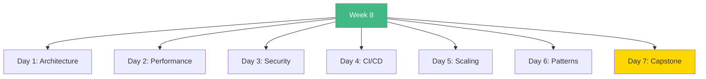

# Week 8: Advanced Architecture & Production - Index 📑

**Your complete Week 8 learning guide**

---

## 🗂️ Week Structure

---

## 📅 Daily Breakdown

### **Day 1 (Day 50): Advanced Architecture** ⭐⭐⭐

- 📖 [`day1/README.md`](day1/README.md)
- Layered architecture
- SOLID principles
- Repository pattern
- DDD concepts

**Topics:** Clean architecture, design patterns, dependency injection

---

### **Day 2 (Day 51): Performance Optimization** ⭐⭐⭐

- 📖 [`day2/README.md`](day2/README.md)
- Bundle analysis
- Code splitting
- Image optimization
- Core Web Vitals

**Topics:** Performance metrics, optimization, monitoring

---

### **Day 3 (Day 52): Security Best Practices** ⭐⭐⭐

- 📖 [`day3/README.md`](day3/README.md)
- OWASP Top 10
- Authentication security
- Data encryption
- Input validation

**Topics:** Security architecture, RBAC, CSRF, XSS prevention

---

### **Day 4 (Day 53): CI/CD & DevOps** ⭐⭐⭐

- 📖 [`day4/README.md`](day4/README.md)
- GitHub Actions
- Automated testing
- Docker deployment
- Environment management

**Topics:** CI/CD pipelines, automation, monitoring

---

### **Day 5 (Day 54): Scaling & Infrastructure** ⭐⭐⭐

- 📖 [`day5/README.md`](day5/README.md)
- Load balancing
- Redis caching
- Database replicas
- CDN integration

**Topics:** Horizontal scaling, caching strategies, infrastructure

---

### **Day 6 (Day 55): Advanced Patterns** ⭐⭐⭐

- 📖 [`day6/README.md`](day6/README.md)
- Micro-frontends
- CQRS pattern
- Event sourcing
- Feature flags

**Topics:** Enterprise patterns, DDD, hexagonal architecture

---

### **Day 7 (Day 56): Enterprise SaaS Platform** 🎯

- 📖 [`day7/README.md`](day7/README.md)
- Multi-tenant architecture
- All Week 8 concepts
- Production deployment

**Build:** Complete enterprise SaaS platform

---

## 🎯 Learning Checklist

**Architecture:**

- [ ] Day 1 Complete
- [ ] Layered design
- [ ] Design patterns
- [ ] Clean code

**Performance:**

- [ ] Day 2 Complete
- [ ] Bundle optimization
- [ ] Image/font optimization
- [ ] Web Vitals

**Security:**

- [ ] Day 3 Complete
- [ ] OWASP defenses
- [ ] Authentication
- [ ] Encryption

**DevOps:**

- [ ] Day 4 Complete
- [ ] CI/CD pipeline
- [ ] Automated testing
- [ ] Docker

**Scaling:**

- [ ] Day 5 Complete
- [ ] Load balancing
- [ ] Caching
- [ ] Database optimization

**Patterns:**

- [ ] Day 6 Complete
- [ ] Micro-frontends
- [ ] CQRS
- [ ] Feature flags

**Project:**

- [ ] Day 7 Complete
- [ ] Enterprise SaaS built
- [ ] All concepts applied
- [ ] Production ready

---

## 💻 Code Statistics

**Week 8 Totals:**

- 📖 **10 README files**
- 💻 **50+ code examples**
- 📊 **90+ Mermaid diagrams**
- 🎯 **1 enterprise application**

---

## 🚀 Quick Navigation

| Day | Topic | Difficulty | Focus |
|-----|-------|------------|-------|
| 1 | Architecture | ⭐⭐⭐ | Design |
| 2 | Performance | ⭐⭐⭐ | Optimization |
| 3 | Security | ⭐⭐⭐ | OWASP |
| 4 | CI/CD | ⭐⭐⭐ | Automation |
| 5 | Scaling | ⭐⭐⭐ | Infrastructure |
| 6 | Patterns | ⭐⭐⭐ | Advanced |
| 7 | Project | 🎯 | Integration |

---

## 💡 Key Takeaways

> **"Good architecture allows for easy change."**

> **"Security is not optional—it's essential."**

> **"Premature optimization is the root of evil."**

> **"Scale when you need to, not before."**

---

**Continue to:** [`WEEK8_SUMMARY.md`](WEEK8_SUMMARY.md)

**Previous Week:** [`../week7/README.md`](../week7/README.md)

**You're building production systems!** 🚀
