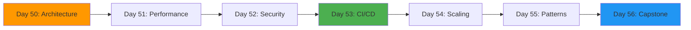
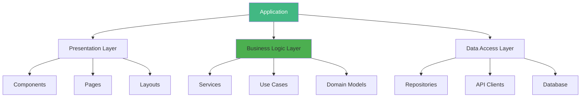
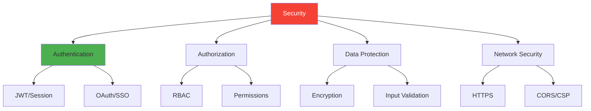
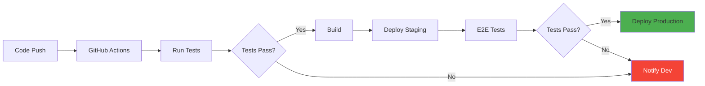
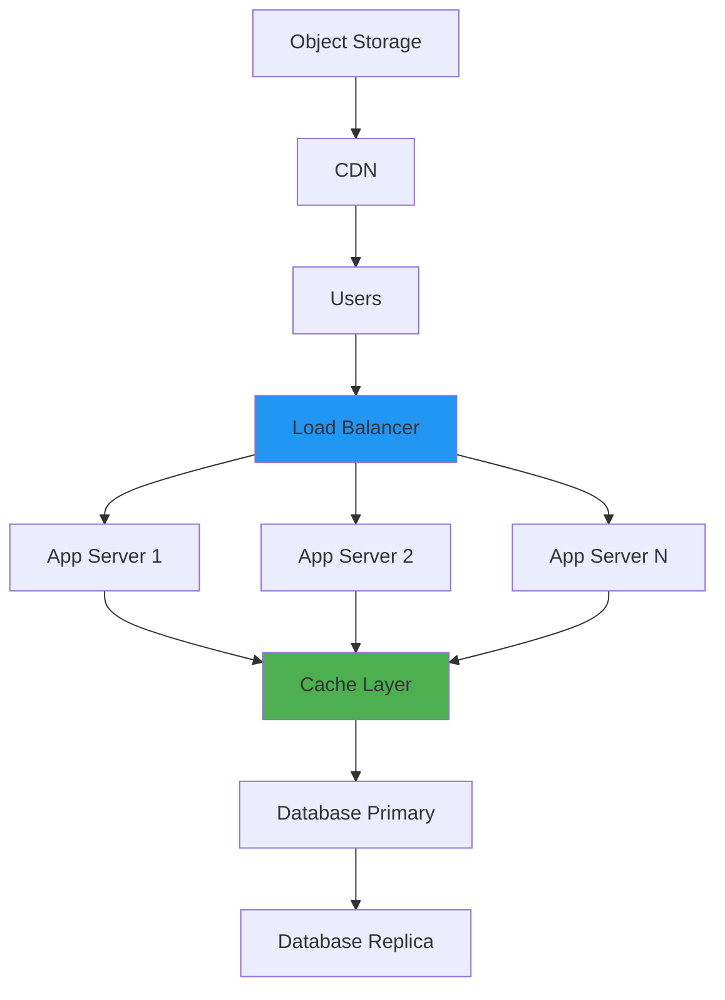

# Week 8: Advanced Architecture & Production 🏗️

**Focus:** Architecture, performance, security, CI/CD, scaling

---

## 📊 Weekly Flow

---

## 📚 Daily Topics

| Day | Topic | Key Concepts |
|-----|-------|--------------|
| **Day 50** | Advanced Architecture | Design patterns, modularity, clean code |
| **Day 51** | Performance Optimization | Bundle analysis, code splitting, metrics |
| **Day 52** | Security Best Practices | Authentication, authorization, OWASP |
| **Day 53** | CI/CD & DevOps | GitHub Actions, testing pipelines |
| **Day 54** | Scaling & Infrastructure | Load balancing, caching, CDN |
| **Day 55** | Advanced Patterns | Micro-frontends, DDD, CQRS |
| **Day 56** | **Capstone: Enterprise SaaS** | Full-stack production app |

---

## 🏗️ Architecture Patterns

---

## 🔒 Security Layers

---

## 🚀 CI/CD Pipeline

---

## 📊 Scaling Architecture

---

## 📂 Week Project: Enterprise SaaS Platform

Build a production-grade SaaS with:

- Advanced architecture (layered)
- Multi-tenancy support
- CI/CD pipeline
- Comprehensive security
- Horizontal scaling
- Monitoring & logging
- 99.9% uptime design

---

**Start Day 50!** 🚀
