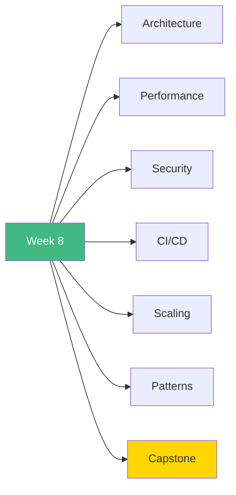

# 🚀 Week 8: Start Here

**Welcome to Week 8 - Advanced Architecture & Production!**

---

## 📚 What You'll Learn This Week

---

## 📅 7-Day Plan

| Day | Topic | Time | Difficulty |
|-----|-------|------|------------|
| **Day 1** | Advanced Architecture | 4-5h | ⭐⭐⭐ |
| **Day 2** | Performance Optimization | 4-5h | ⭐⭐⭐ |
| **Day 3** | Security Best Practices | 4-5h | ⭐⭐⭐ |
| **Day 4** | CI/CD & DevOps | 3-4h | ⭐⭐⭐ |
| **Day 5** | Scaling & Infrastructure | 3-4h | ⭐⭐⭐ |
| **Day 6** | Advanced Patterns | 3-4h | ⭐⭐⭐ |
| **Day 7** | Enterprise SaaS | 8-10h | 🎯 |

**Total:** 29-39 hours

---

## 🎯 Learning Path

### **Start Here:**

1. Read [`INDEX.md`](INDEX.md)
2. Begin with [`day1/README.md`](day1/README.md)
3. Work through each day
4. Build enterprise SaaS on Day 7

---

## 🎓 Learning Outcomes

By the end of Week 8, you will:

✅ Design enterprise architectures  
✅ Optimize for production  
✅ Implement comprehensive security  
✅ Setup CI/CD pipelines  
✅ Scale applications horizontally  
✅ Apply advanced patterns  
✅ Deploy production systems  

---

## 🚦 Prerequisites

- ✅ Week 7 completed (Testing & patterns)
- ✅ All Next.js concepts mastered
- ✅ Understanding of deployment
- ✅ Database knowledge
- ✅ DevOps basics helpful

---

## 💡 Pro Tips

> 💡 **Tip 1:** Architecture decisions are trade-offs
>
> 💡 **Tip 2:** Premature optimization is the root of evil
>
> 💡 **Tip 3:** Security must be designed in, not bolted on
>
> 💡 **Tip 4:** CI/CD saves time in the long run
>
> 💡 **Tip 5:** The capstone brings everything together!

---

## ✅ Success Checklist

- [ ] Implement layered architecture
- [ ] Optimize bundle and performance
- [ ] Add comprehensive security
- [ ] Setup CI/CD pipeline
- [ ] Implement caching strategy
- [ ] Apply advanced patterns
- [ ] Complete enterprise SaaS

---

## 🎉 Ready to Begin?

**Start your journey:** [`day1/README.md`](day1/README.md)

**Or review the plan:** [`INDEX.md`](INDEX.md)

---

**Let's build enterprise-grade applications!** 🚀
