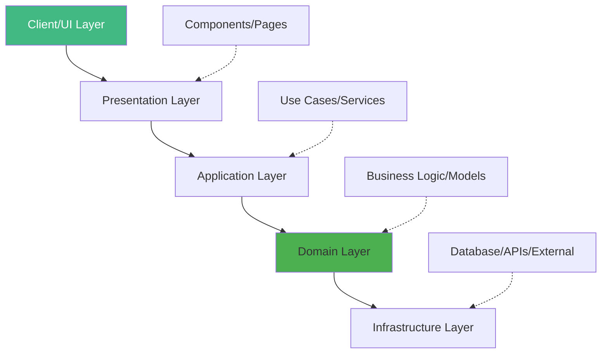
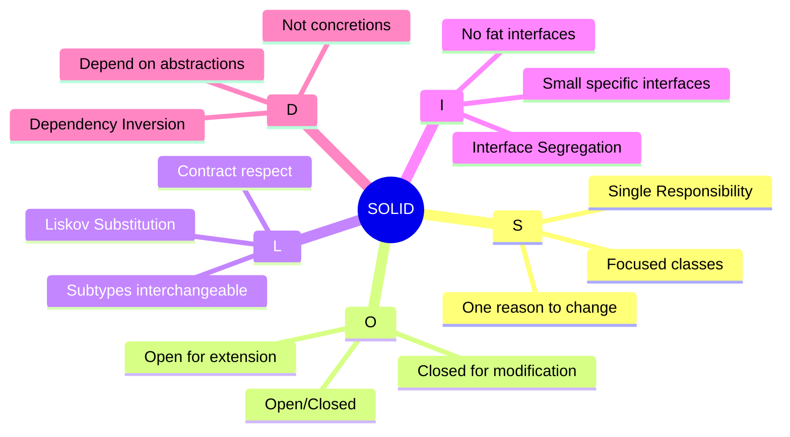
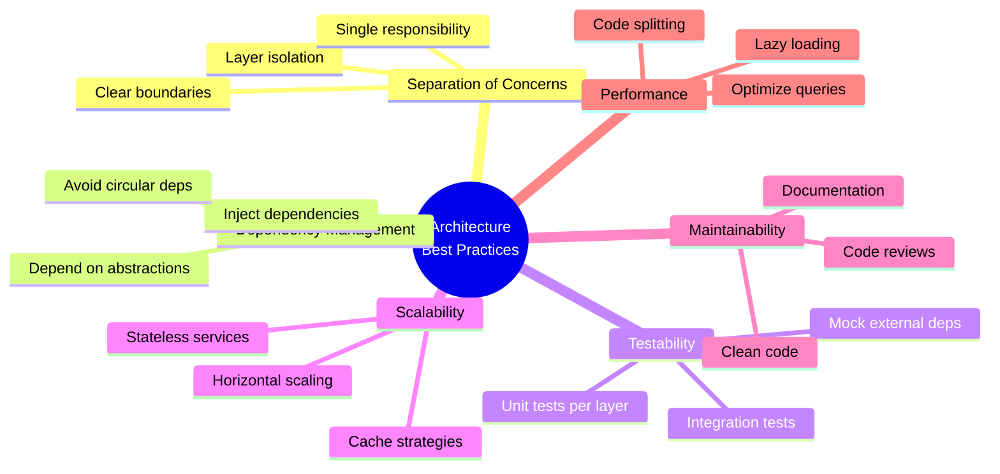

# Day 1 (Day 50): Advanced Architecture Patterns 🏗️

**Duration:** 4-5 hours | **Difficulty:** ⭐⭐⭐ Hard

---

## 📖 Learning Objectives

- Understand layered architecture
- Implement design patterns
- Apply SOLID principles
- Structure enterprise applications
- Clean code principles

---

## 🏗️ Layered Architecture



---

## 🎯 Clean Architecture

### **Project Structure**

```
src/
├── app/                    # Next.js App Router (Presentation)
│   ├── (auth)/
│   ├── (dashboard)/
│   └── api/
├── features/               # Feature-based modules
│   ├── auth/
│   │   ├── components/
│   │   ├── hooks/
│   │   ├── services/
│   │   └── types/
│   ├── products/
│   └── orders/
├── core/                   # Core business logic
│   ├── domain/            # Domain models
│   ├── use-cases/         # Application use cases
│   └── ports/             # Interfaces/contracts
├── infrastructure/         # External concerns
│   ├── database/
│   ├── api-clients/
│   ├── cache/
│   └── storage/
├── shared/                 # Shared utilities
│   ├── lib/
│   ├── types/
│   ├── constants/
│   └── utils/
└── config/                 # Configuration
```

---

## 💡 SOLID Principles



---

## 🎨 Design Patterns

### **1. Repository Pattern**

```typescript
// core/ports/IUserRepository.ts
export interface IUserRepository {
  findById(id: string): Promise<User | null>
  findByEmail(email: string): Promise<User | null>
  create(data: CreateUserDTO): Promise<User>
  update(id: string, data: UpdateUserDTO): Promise<User>
  delete(id: string): Promise<void>
  findAll(filters?: UserFilters): Promise<User[]>
}
```

```typescript
// infrastructure/database/repositories/UserRepository.ts
import { IUserRepository } from '@/core/ports/IUserRepository'
import { db } from '@/infrastructure/database/client'
import { User, CreateUserDTO, UpdateUserDTO } from '@/core/domain/User'

export class UserRepository implements IUserRepository {
  async findById(id: string): Promise<User | null> {
    const user = await db.user.findUnique({
      where: { id }
    })
    
    return user ? this.toDomain(user) : null
  }
  
  async findByEmail(email: string): Promise<User | null> {
    const user = await db.user.findUnique({
      where: { email }
    })
    
    return user ? this.toDomain(user) : null
  }
  
  async create(data: CreateUserDTO): Promise<User> {
    const user = await db.user.create({
      data: this.toDatabase(data)
    })
    
    return this.toDomain(user)
  }
  
  async update(id: string, data: UpdateUserDTO): Promise<User> {
    const user = await db.user.update({
      where: { id },
      data: this.toDatabase(data)
    })
    
    return this.toDomain(user)
  }
  
  async delete(id: string): Promise<void> {
    await db.user.delete({
      where: { id }
    })
  }
  
  async findAll(filters?: UserFilters): Promise<User[]> {
    const users = await db.user.findMany({
      where: this.buildFilters(filters)
    })
    
    return users.map(user => this.toDomain(user))
  }
  
  // Mapping methods
  private toDomain(dbUser: any): User {
    return new User({
      id: dbUser.id,
      email: dbUser.email,
      name: dbUser.name,
      role: dbUser.role,
      createdAt: dbUser.createdAt,
      updatedAt: dbUser.updatedAt
    })
  }
  
  private toDatabase(user: Partial<User>): any {
    return {
      email: user.email,
      name: user.name,
      role: user.role
    }
  }
  
  private buildFilters(filters?: UserFilters): any {
    if (!filters) return {}
    
    return {
      ...(filters.role && { role: filters.role }),
      ...(filters.search && {
        OR: [
          { name: { contains: filters.search, mode: 'insensitive' } },
          { email: { contains: filters.search, mode: 'insensitive' } }
        ]
      })
    }
  }
}
```

---

### **2. Service Layer Pattern**

```typescript
// core/use-cases/CreateUser.ts
import { IUserRepository } from '@/core/ports/IUserRepository'
import { IHashService } from '@/core/ports/IHashService'
import { User } from '@/core/domain/User'
import { CreateUserDTO } from '@/core/domain/DTOs'
import { ValidationError, ConflictError } from '@/shared/errors'

export class CreateUserUseCase {
  constructor(
    private userRepository: IUserRepository,
    private hashService: IHashService
  ) {}
  
  async execute(data: CreateUserDTO): Promise<User> {
    // Validation
    this.validate(data)
    
    // Business rule: Check if email already exists
    const existingUser = await this.userRepository.findByEmail(data.email)
    if (existingUser) {
      throw new ConflictError('Email already in use')
    }
    
    // Hash password
    const hashedPassword = await this.hashService.hash(data.password)
    
    // Create user
    const user = await this.userRepository.create({
      ...data,
      password: hashedPassword
    })
    
    return user
  }
  
  private validate(data: CreateUserDTO): void {
    if (!data.email || !this.isValidEmail(data.email)) {
      throw new ValidationError('Invalid email address')
    }
    
    if (!data.password || data.password.length < 8) {
      throw new ValidationError('Password must be at least 8 characters')
    }
    
    if (!data.name || data.name.trim().length === 0) {
      throw new ValidationError('Name is required')
    }
  }
  
  private isValidEmail(email: string): boolean {
    return /^[^\s@]+@[^\s@]+\.[^\s@]+$/.test(email)
  }
}
```

```typescript
// app/api/users/route.ts
import { NextRequest, NextResponse } from 'next/server'
import { CreateUserUseCase } from '@/core/use-cases/CreateUser'
import { UserRepository } from '@/infrastructure/database/repositories/UserRepository'
import { BcryptHashService } from '@/infrastructure/services/BcryptHashService'

export async function POST(request: NextRequest) {
  try {
    const body = await request.json()
    
    // Dependency injection
    const userRepository = new UserRepository()
    const hashService = new BcryptHashService()
    const createUser = new CreateUserUseCase(userRepository, hashService)
    
    const user = await createUser.execute(body)
    
    return NextResponse.json({ user }, { status: 201 })
  } catch (error) {
    if (error instanceof ValidationError) {
      return NextResponse.json(
        { error: error.message },
        { status: 400 }
      )
    }
    
    if (error instanceof ConflictError) {
      return NextResponse.json(
        { error: error.message },
        { status: 409 }
      )
    }
    
    return NextResponse.json(
      { error: 'Internal server error' },
      { status: 500 }
    )
  }
}
```

---

### **3. Factory Pattern**

```typescript
// infrastructure/factories/RepositoryFactory.ts
import { IUserRepository } from '@/core/ports/IUserRepository'
import { IProductRepository } from '@/core/ports/IProductRepository'
import { UserRepository } from '@/infrastructure/database/repositories/UserRepository'
import { ProductRepository } from '@/infrastructure/database/repositories/ProductRepository'
import { MockUserRepository } from '@/infrastructure/database/repositories/MockUserRepository'

export class RepositoryFactory {
  private static userRepository: IUserRepository
  private static productRepository: IProductRepository
  
  static getUserRepository(): IUserRepository {
    if (!this.userRepository) {
      if (process.env.NODE_ENV === 'test') {
        this.userRepository = new MockUserRepository()
      } else {
        this.userRepository = new UserRepository()
      }
    }
    return this.userRepository
  }
  
  static getProductRepository(): IProductRepository {
    if (!this.productRepository) {
      if (process.env.NODE_ENV === 'test') {
        this.productRepository = new MockProductRepository()
      } else {
        this.productRepository = new ProductRepository()
      }
    }
    return this.productRepository
  }
}
```

---

### **4. Dependency Injection Container**

```typescript
// infrastructure/di/container.ts
import { Container } from 'inversify'
import { IUserRepository } from '@/core/ports/IUserRepository'
import { IHashService } from '@/core/ports/IHashService'
import { UserRepository } from '@/infrastructure/database/repositories/UserRepository'
import { BcryptHashService } from '@/infrastructure/services/BcryptHashService'

const container = new Container()

// Repositories
container.bind<IUserRepository>('IUserRepository').to(UserRepository)

// Services
container.bind<IHashService>('IHashService').to(BcryptHashService)

export { container }
```

```typescript
// Usage
import { container } from '@/infrastructure/di/container'
import { CreateUserUseCase } from '@/core/use-cases/CreateUser'

export async function POST(request: NextRequest) {
  const userRepository = container.get<IUserRepository>('IUserRepository')
  const hashService = container.get<IHashService>('IHashService')
  
  const createUser = new CreateUserUseCase(userRepository, hashService)
  
  // ... rest of the code
}
```

---

## 🎯 Domain-Driven Design (DDD)

### **Domain Model**

```typescript
// core/domain/User.ts
export class User {
  private constructor(
    public readonly id: string,
    public readonly email: string,
    private _name: string,
    private _role: UserRole,
    public readonly createdAt: Date,
    private _updatedAt: Date
  ) {}
  
  // Factory method
  static create(data: CreateUserData): User {
    return new User(
      generateId(),
      data.email.toLowerCase(),
      data.name,
      data.role || UserRole.USER,
      new Date(),
      new Date()
    )
  }
  
  // Getter
  get name(): string {
    return this._name
  }
  
  get role(): UserRole {
    return this._role
  }
  
  // Business logic methods
  updateName(newName: string): void {
    if (!newName || newName.trim().length === 0) {
      throw new Error('Name cannot be empty')
    }
    this._name = newName
    this._updatedAt = new Date()
  }
  
  promote(): void {
    if (this._role === UserRole.ADMIN) {
      throw new Error('User is already an admin')
    }
    this._role = UserRole.ADMIN
    this._updatedAt = new Date()
  }
  
  isAdmin(): boolean {
    return this._role === UserRole.ADMIN
  }
  
  canEdit(resource: Resource): boolean {
    return this.isAdmin() || resource.ownerId === this.id
  }
  
  // Serialization
  toJSON() {
    return {
      id: this.id,
      email: this.email,
      name: this._name,
      role: this._role,
      createdAt: this.createdAt,
      updatedAt: this._updatedAt
    }
  }
}

export enum UserRole {
  USER = 'USER',
  ADMIN = 'ADMIN',
  MODERATOR = 'MODERATOR'
}
```

### **Value Objects**

```typescript
// core/domain/value-objects/Email.ts
export class Email {
  private constructor(private readonly value: string) {
    this.validate(value)
  }
  
  static create(email: string): Email {
    return new Email(email.toLowerCase().trim())
  }
  
  private validate(email: string): void {
    const emailRegex = /^[^\s@]+@[^\s@]+\.[^\s@]+$/
    if (!emailRegex.test(email)) {
      throw new Error('Invalid email format')
    }
  }
  
  getValue(): string {
    return this.value
  }
  
  getDomain(): string {
    return this.value.split('@')[1]
  }
  
  equals(other: Email): boolean {
    return this.value === other.value
  }
}
```

---

## 🔄 Event-Driven Architecture

```typescript
// core/domain/events/UserCreatedEvent.ts
export class UserCreatedEvent {
  constructor(
    public readonly userId: string,
    public readonly email: string,
    public readonly occurredAt: Date = new Date()
  ) {}
}
```

```typescript
// core/use-cases/CreateUser.ts (with events)
import { EventBus } from '@/infrastructure/events/EventBus'
import { UserCreatedEvent } from '@/core/domain/events/UserCreatedEvent'

export class CreateUserUseCase {
  constructor(
    private userRepository: IUserRepository,
    private hashService: IHashService,
    private eventBus: EventBus
  ) {}
  
  async execute(data: CreateUserDTO): Promise<User> {
    // ... user creation logic
    
    // Publish event
    await this.eventBus.publish(
      new UserCreatedEvent(user.id, user.email)
    )
    
    return user
  }
}
```

```typescript
// infrastructure/events/handlers/SendWelcomeEmailHandler.ts
import { IEventHandler } from '@/core/ports/IEventHandler'
import { UserCreatedEvent } from '@/core/domain/events/UserCreatedEvent'
import { IEmailService } from '@/core/ports/IEmailService'

export class SendWelcomeEmailHandler implements IEventHandler<UserCreatedEvent> {
  constructor(private emailService: IEmailService) {}
  
  async handle(event: UserCreatedEvent): Promise<void> {
    await this.emailService.send({
      to: event.email,
      subject: 'Welcome!',
      template: 'welcome',
      data: { userId: event.userId }
    })
  }
}
```

---

## 📊 Architecture Decision Records

```typescript
// docs/adr/001-use-layered-architecture.md
# ADR 001: Use Layered Architecture

## Status
Accepted

## Context
We need a scalable architecture that:
- Separates concerns
- Enables testing
- Allows team scaling
- Supports maintenance

## Decision
Use layered architecture with:
- Presentation layer (UI)
- Application layer (Use cases)
- Domain layer (Business logic)
- Infrastructure layer (External)

## Consequences
Positive:
- Clear separation of concerns
- Testable in isolation
- Easy to understand

Negative:
- More boilerplate
- Learning curve for team
```

---

## ✅ Architecture Best Practices



---

## ✅ Practice Exercise

Implement:
1. Layered architecture for a feature
2. Repository pattern with interface
3. Use case with business logic
4. Domain model with validation
5. Dependency injection
6. Event-driven communication
7. Factory pattern

---

**Tomorrow:** Performance Optimization! ⚡
