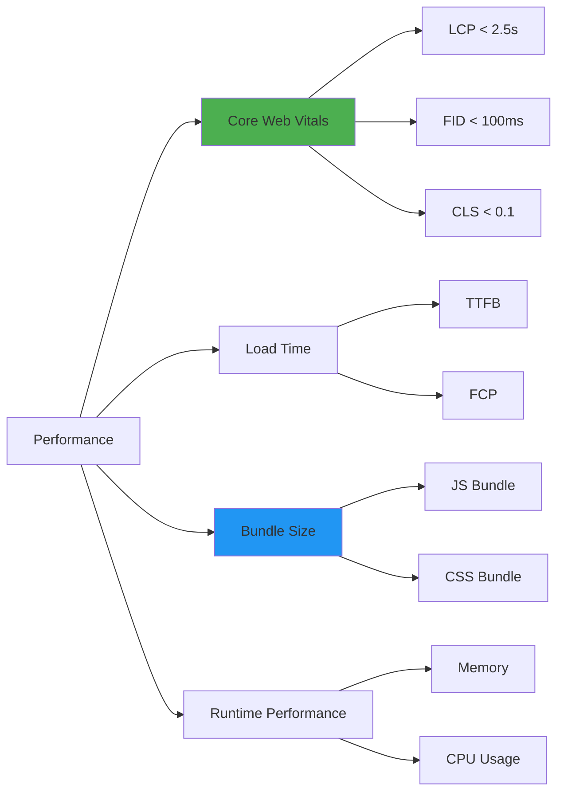
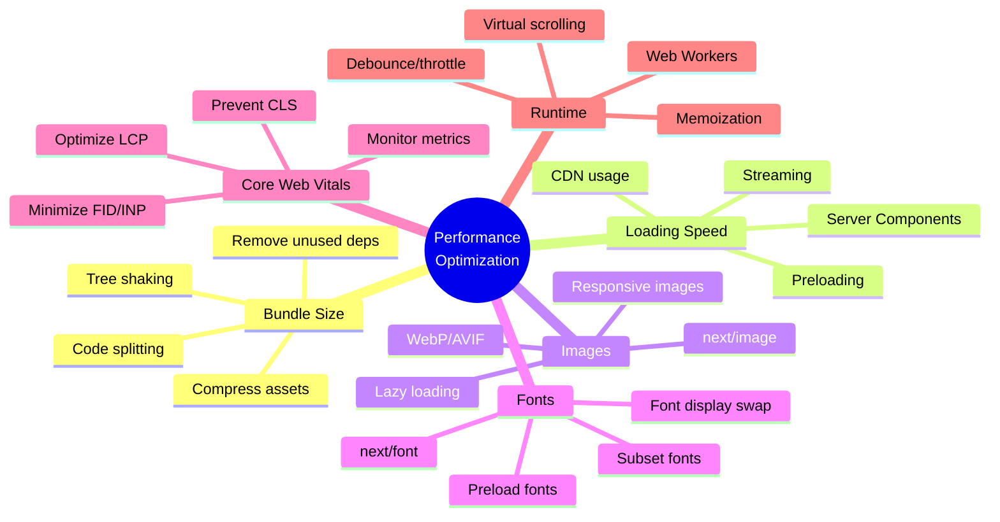

# Day 2 (Day 51): Performance Optimization ⚡

**Duration:** 4-5 hours | **Difficulty:** ⭐⭐⭐ Hard

---

## 📖 Learning Objectives

- Analyze bundle size
- Implement code splitting
- Optimize images and fonts
- Improve Core Web Vitals
- Performance monitoring

---

## 📊 Performance Metrics



---

## 🔍 Bundle Analysis

### **Analyze Bundle Size**

```bash
# Install bundle analyzer
npm install -D @next/bundle-analyzer

# Configure
# next.config.js
const withBundleAnalyzer = require('@next/bundle-analyzer')({
  enabled: process.env.ANALYZE === 'true',
})

module.exports = withBundleAnalyzer({
  // your next config
})

# Run analysis
ANALYZE=true npm run build
```

### **webpack-bundle-analyzer Output**

```typescript
// Check your bundle composition
// Look for:
// 1. Large dependencies
// 2. Duplicate code
// 3. Unused code
// 4. Opportunities for code splitting
```

---

## ✂️ Code Splitting

### **1. Route-based Splitting (Automatic)**

```typescript
// Next.js automatically splits by route
// Each page is a separate chunk

// app/dashboard/page.tsx -> dashboard.js
// app/profile/page.tsx -> profile.js
// app/settings/page.tsx -> settings.js
```

### **2. Component-based Splitting**

```typescript
// components/DynamicComponent.tsx
'use client'

import dynamic from 'next/dynamic'

// Lazy load component
const HeavyChart = dynamic(() => import('./HeavyChart'), {
  loading: () => <div>Loading chart...</div>,
  ssr: false // Don't render on server
})

export function Dashboard() {
  return (
    <div>
      <h1>Dashboard</h1>
      <HeavyChart data={data} />
    </div>
  )
}
```

### **3. Conditional Loading**

```typescript
// components/AdminPanel.tsx
'use client'

import { useState } from 'react'
import dynamic from 'next/dynamic'

const AdminTools = dynamic(() => import('./AdminTools'), {
  loading: () => <div>Loading admin tools...</div>
})

export function AdminPanel({ user }: { user: User }) {
  const [showTools, setShowTools] = useState(false)
  
  if (!user.isAdmin) return null
  
  return (
    <div>
      <button onClick={() => setShowTools(true)}>
        Show Admin Tools
      </button>
      
      {showTools && <AdminTools />}
    </div>
  )
}
```

### **4. Library Code Splitting**

```typescript
// utils/export.ts
export async function exportToPDF(data: any) {
  // Dynamically import heavy PDF library
  const { jsPDF } = await import('jspdf')
  
  const doc = new jsPDF()
  // ... generate PDF
  doc.save('export.pdf')
}

export async function exportToExcel(data: any) {
  // Dynamically import heavy Excel library
  const XLSX = await import('xlsx')
  
  const worksheet = XLSX.utils.json_to_sheet(data)
  // ... generate Excel
}
```

---

## 🖼️ Image Optimization

### **Next.js Image Component**

```typescript
// components/OptimizedImage.tsx
import Image from 'next/image'

export function ProductImage({ product }: { product: Product }) {
  return (
    <div className="relative w-full h-96">
      <Image
        src={product.imageUrl}
        alt={product.name}
        fill
        sizes="(max-width: 768px) 100vw, (max-width: 1200px) 50vw, 33vw"
        quality={85}
        priority={product.featured} // Load immediately if featured
        placeholder="blur"
        blurDataURL={product.blurDataUrl}
        className="object-cover"
      />
    </div>
  )
}
```

### **Generate Blur Placeholders**

```typescript
// lib/image-utils.ts
import sharp from 'sharp'

export async function generateBlurDataUrl(imageUrl: string): Promise<string> {
  const response = await fetch(imageUrl)
  const buffer = await response.arrayBuffer()
  
  const blurredBuffer = await sharp(Buffer.from(buffer))
    .resize(10)
    .blur()
    .toBuffer()
  
  return `data:image/jpeg;base64,${blurredBuffer.toString('base64')}`
}
```

### **Image Optimization Configuration**

```typescript
// next.config.js
module.exports = {
  images: {
    formats: ['image/avif', 'image/webp'],
    deviceSizes: [640, 750, 828, 1080, 1200, 1920, 2048, 3840],
    imageSizes: [16, 32, 48, 64, 96, 128, 256, 384],
    minimumCacheTTL: 60,
    remotePatterns: [
      {
        protocol: 'https',
        hostname: '**.cloudinary.com',
      },
      {
        protocol: 'https',
        hostname: 'images.unsplash.com',
      },
    ],
  },
}
```

---

## 🔤 Font Optimization

### **Using next/font**

```typescript
// app/layout.tsx
import { Inter, Roboto_Mono } from 'next/font/google'

const inter = Inter({
  subsets: ['latin'],
  display: 'swap',
  variable: '--font-inter',
})

const robotoMono = Roboto_Mono({
  subsets: ['latin'],
  display: 'swap',
  variable: '--font-roboto-mono',
})

export default function RootLayout({ children }: { children: React.ReactNode }) {
  return (
    <html lang="en" className={`${inter.variable} ${robotoMono.variable}`}>
      <body className="font-sans">
        {children}
      </body>
    </html>
  )
}
```

### **Local Fonts**

```typescript
// app/layout.tsx
import localFont from 'next/font/local'

const customFont = localFont({
  src: [
    {
      path: '../fonts/CustomFont-Regular.woff2',
      weight: '400',
      style: 'normal',
    },
    {
      path: '../fonts/CustomFont-Bold.woff2',
      weight: '700',
      style: 'normal',
    },
  ],
  variable: '--font-custom',
  display: 'swap',
})
```

---

## 🚀 Core Web Vitals Optimization

### **Largest Contentful Paint (LCP)**

```typescript
// Optimize LCP by:
// 1. Preload critical images
export default function HeroSection() {
  return (
    <>
      <link
        rel="preload"
        as="image"
        href="/hero-image.jpg"
        imageSrcSet="/hero-400.jpg 400w, /hero-800.jpg 800w"
        imageSizes="100vw"
      />
      
      <Image
        src="/hero-image.jpg"
        alt="Hero"
        width={1200}
        height={600}
        priority
      />
    </>
  )
}

// 2. Use Server Components for critical content
export default async function HomePage() {
  const hero = await getHeroContent() // Server-side
  
  return <HeroSection content={hero} />
}
```

### **First Input Delay (FID) / Interaction to Next Paint (INP)**

```typescript
// Optimize FID/INP by:
// 1. Minimize JavaScript execution
// 2. Break up long tasks
// 3. Use Web Workers for heavy computation

// components/DataProcessor.tsx
'use client'

import { useEffect, useState } from 'react'

export function DataProcessor({ data }: { data: any[] }) {
  const [processed, setProcessed] = useState<any[]>([])
  
  useEffect(() => {
    // Use Web Worker for heavy processing
    const worker = new Worker(new URL('../workers/process-data.ts', import.meta.url))
    
    worker.postMessage(data)
    
    worker.onmessage = (e) => {
      setProcessed(e.data)
    }
    
    return () => worker.terminate()
  }, [data])
  
  return <DataTable data={processed} />
}
```

```typescript
// workers/process-data.ts
self.onmessage = (e) => {
  const data = e.data
  
  // Heavy processing
  const processed = data.map(item => {
    // Complex calculations
    return processItem(item)
  })
  
  self.postMessage(processed)
}
```

### **Cumulative Layout Shift (CLS)**

```typescript
// Prevent CLS by:
// 1. Always specify dimensions for images
<Image
  src="/product.jpg"
  alt="Product"
  width={400}
  height={300} // Explicit dimensions prevent layout shift
/>

// 2. Reserve space for dynamic content
<div className="min-h-[200px]">
  {loading ? <Skeleton /> : <Content />}
</div>

// 3. Use CSS aspect ratio
<div className="aspect-video">
  <video src="/video.mp4" />
</div>

// 4. Avoid inserting content above existing content
// Use fixed heights or placeholders
```

---

## 🎯 Performance Monitoring

### **Web Vitals Tracking**

```typescript
// app/layout.tsx
import { Analytics } from '@vercel/analytics/react'
import { SpeedInsights } from '@vercel/speed-insights/next'

export default function RootLayout({ children }: { children: React.ReactNode }) {
  return (
    <html>
      <body>
        {children}
        <Analytics />
        <SpeedInsights />
      </body>
    </html>
  )
}
```

### **Custom Performance Tracking**

```typescript
// lib/performance.ts
export function reportWebVitals(metric: any) {
  // Send to analytics
  if (metric.label === 'web-vital') {
    console.log(metric)
    
    // Send to your analytics service
    fetch('/api/analytics', {
      method: 'POST',
      body: JSON.stringify({
        name: metric.name,
        value: metric.value,
        id: metric.id,
      })
    })
  }
}
```

```typescript
// app/layout.tsx
'use client'

import { useReportWebVitals } from 'next/web-vitals'

export function WebVitals() {
  useReportWebVitals((metric) => {
    switch (metric.name) {
      case 'FCP':
        // First Contentful Paint
        break
      case 'LCP':
        // Largest Contentful Paint
        break
      case 'CLS':
        // Cumulative Layout Shift
        break
      case 'FID':
        // First Input Delay
        break
      case 'TTFB':
        // Time to First Byte
        break
    }
  })
  
  return null
}
```

---

## 📦 Resource Optimization

### **Preloading Critical Resources**

```typescript
// app/layout.tsx
export default function RootLayout({ children }: { children: React.ReactNode }) {
  return (
    <html>
      <head>
        {/* Preload critical CSS */}
        <link rel="preload" href="/styles/critical.css" as="style" />
        
        {/* Preload critical font */}
        <link
          rel="preload"
          href="/fonts/inter-var.woff2"
          as="font"
          type="font/woff2"
          crossOrigin="anonymous"
        />
        
        {/* DNS Prefetch for external domains */}
        <link rel="dns-prefetch" href="https://api.example.com" />
        
        {/* Preconnect for critical origins */}
        <link rel="preconnect" href="https://cdn.example.com" />
      </head>
      <body>{children}</body>
    </html>
  )
}
```

### **Lazy Loading**

```typescript
// components/LazySection.tsx
'use client'

import { useInView } from 'react-intersection-observer'
import dynamic from 'next/dynamic'

const HeavyComponent = dynamic(() => import('./HeavyComponent'))

export function LazySection() {
  const { ref, inView } = useInView({
    triggerOnce: true,
    threshold: 0.1,
  })
  
  return (
    <div ref={ref} className="min-h-[400px]">
      {inView && <HeavyComponent />}
    </div>
  )
}
```

---

## 📊 Performance Budget

```typescript
// next.config.js
module.exports = {
  // Set performance budgets
  webpack: (config, { isServer }) => {
    if (!isServer) {
      config.performance = {
        maxEntrypointSize: 244000, // 244 KB
        maxAssetSize: 244000,
        hints: 'warning',
      }
    }
    
    return config
  },
}
```

---

## 🎯 Performance Checklist



---

## ✅ Practice Exercise

Implement optimizations:
1. Bundle analysis and reduction
2. Code splitting for heavy features
3. Image optimization with blur
4. Font optimization
5. Core Web Vitals monitoring
6. Performance budgets
7. Lazy loading strategies

---

**Tomorrow:** Security Best Practices! 🔒
