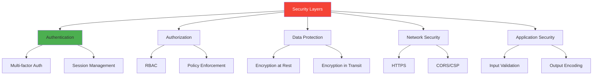
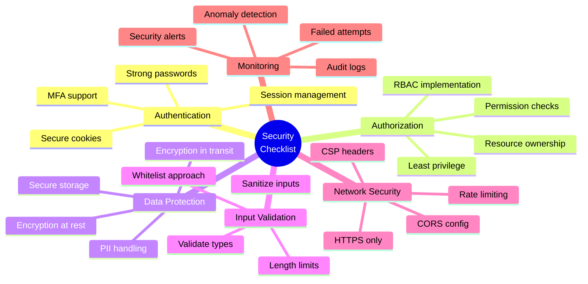

# Day 3 (Day 52): Security Best Practices 🔒

**Duration:** 4-5 hours | **Difficulty:** ⭐⭐⭐ Hard

---

## 📖 Learning Objectives

- Implement authentication security
- Prevent common vulnerabilities
- Apply OWASP Top 10 defenses
- Secure API endpoints
- Data encryption

---

## 🔒 Security Architecture



---

## 🛡️ OWASP Top 10 Defenses

### **1. Injection Prevention**

```typescript
// ❌ BAD - SQL Injection vulnerable
async function getUser(email: string) {
  const query = `SELECT * FROM users WHERE email = '${email}'`
  return await db.query(query)
}

// ✅ GOOD - Using parameterized queries
async function getUser(email: string) {
  return await db.user.findUnique({
    where: { email }
  })
}

// ✅ GOOD - Input validation
import { z } from 'zod'

const UserSchema = z.object({
  email: z.string().email(),
  name: z.string().min(1).max(100),
  age: z.number().int().positive().optional()
})

export async function createUser(data: unknown) {
  // Validate and sanitize input
  const validated = UserSchema.parse(data)
  
  return await db.user.create({
    data: validated
  })
}
```

### **2. Broken Authentication Prevention**

```typescript
// lib/auth/password.ts
import bcrypt from 'bcryptjs'

const SALT_ROUNDS = 12

export async function hashPassword(password: string): Promise<string> {
  // Validate password strength
  if (password.length < 12) {
    throw new Error('Password must be at least 12 characters')
  }
  
  if (!/[A-Z]/.test(password)) {
    throw new Error('Password must contain uppercase letter')
  }
  
  if (!/[a-z]/.test(password)) {
    throw new Error('Password must contain lowercase letter')
  }
  
  if (!/[0-9]/.test(password)) {
    throw new Error('Password must contain number')
  }
  
  if (!/[^A-Za-z0-9]/.test(password)) {
    throw new Error('Password must contain special character')
  }
  
  return await bcrypt.hash(password, SALT_ROUNDS)
}

export async function verifyPassword(
  password: string,
  hashedPassword: string
): Promise<boolean> {
  return await bcrypt.compare(password, hashedPassword)
}
```

```typescript
// lib/auth/session.ts
import { SignJWT, jwtVerify } from 'jose'
import { cookies } from 'next/headers'

const SECRET = new TextEncoder().encode(process.env.JWT_SECRET)
const SESSION_DURATION = 7 * 24 * 60 * 60 // 7 days

export async function createSession(userId: string) {
  const token = await new SignJWT({ userId })
    .setProtectedHeader({ alg: 'HS256' })
    .setIssuedAt()
    .setExpirationTime('7d')
    .sign(SECRET)
  
  cookies().set('session', token, {
    httpOnly: true,
    secure: process.env.NODE_ENV === 'production',
    sameSite: 'lax',
    maxAge: SESSION_DURATION,
    path: '/'
  })
  
  return token
}

export async function verifySession() {
  const token = cookies().get('session')?.value
  
  if (!token) {
    return null
  }
  
  try {
    const verified = await jwtVerify(token, SECRET)
    return verified.payload as { userId: string }
  } catch {
    return null
  }
}

export async function deleteSession() {
  cookies().delete('session')
}
```

### **3. Sensitive Data Exposure Prevention**

```typescript
// lib/encryption.ts
import crypto from 'crypto'

const ALGORITHM = 'aes-256-gcm'
const KEY = Buffer.from(process.env.ENCRYPTION_KEY!, 'hex')

export function encrypt(text: string): string {
  const iv = crypto.randomBytes(16)
  const cipher = crypto.createCipheriv(ALGORITHM, KEY, iv)
  
  let encrypted = cipher.update(text, 'utf8', 'hex')
  encrypted += cipher.final('hex')
  
  const authTag = cipher.getAuthTag()
  
  return `${iv.toString('hex')}:${authTag.toString('hex')}:${encrypted}`
}

export function decrypt(encryptedText: string): string {
  const [ivHex, authTagHex, encrypted] = encryptedText.split(':')
  
  const iv = Buffer.from(ivHex, 'hex')
  const authTag = Buffer.from(authTagHex, 'hex')
  
  const decipher = crypto.createDecipheriv(ALGORITHM, KEY, iv)
  decipher.setAuthTag(authTag)
  
  let decrypted = decipher.update(encrypted, 'hex', 'utf8')
  decrypted += decipher.final('utf8')
  
  return decrypted
}
```

```typescript
// Sensitive data handling
export async function storePaymentMethod(userId: string, cardData: CardData) {
  // Encrypt sensitive data
  const encryptedCardNumber = encrypt(cardData.cardNumber)
  const encryptedCVV = encrypt(cardData.cvv)
  
  await db.paymentMethod.create({
    data: {
      userId,
      cardNumber: encryptedCardNumber, // Never store plain text
      cvv: encryptedCVV,
      expiryMonth: cardData.expiryMonth,
      expiryYear: cardData.expiryYear,
      // Only store last 4 digits in plain text for display
      last4: cardData.cardNumber.slice(-4)
    }
  })
}
```

### **4. XML External Entities (XXE) Prevention**

```typescript
// ❌ BAD - Vulnerable to XXE
import xml2js from 'xml2js'

async function parseXML(xmlString: string) {
  const parser = new xml2js.Parser()
  return await parser.parseStringPromise(xmlString)
}

// ✅ GOOD - Disable external entities
import xml2js from 'xml2js'

async function parseXML(xmlString: string) {
  const parser = new xml2js.Parser({
    // Disable external entities
    explicitCharkey: false,
    trim: false,
    normalize: false,
    normalizeTags: false,
    attrkey: 'attributes',
    charkey: 'value',
    explicitArray: false,
    // Security options
    xmlns: false,
    explicitChildren: false
  })
  
  return await parser.parseStringPromise(xmlString)
}
```

### **5. Broken Access Control Prevention**

```typescript
// middleware/auth.ts
import { NextResponse } from 'next/server'
import type { NextRequest } from 'next/server'
import { verifySession } from '@/lib/auth/session'

export async function authMiddleware(request: NextRequest) {
  const session = await verifySession()
  
  if (!session) {
    return NextResponse.redirect(new URL('/login', request.url))
  }
  
  return NextResponse.next()
}
```

```typescript
// lib/authorization.ts
export enum Permission {
  READ_USERS = 'read:users',
  WRITE_USERS = 'write:users',
  DELETE_USERS = 'delete:users',
  READ_POSTS = 'read:posts',
  WRITE_POSTS = 'write:posts',
}

export enum Role {
  ADMIN = 'admin',
  MODERATOR = 'moderator',
  USER = 'user',
}

const rolePermissions: Record<Role, Permission[]> = {
  [Role.ADMIN]: [
    Permission.READ_USERS,
    Permission.WRITE_USERS,
    Permission.DELETE_USERS,
    Permission.READ_POSTS,
    Permission.WRITE_POSTS,
  ],
  [Role.MODERATOR]: [
    Permission.READ_USERS,
    Permission.READ_POSTS,
    Permission.WRITE_POSTS,
  ],
  [Role.USER]: [
    Permission.READ_POSTS,
  ],
}

export function hasPermission(role: Role, permission: Permission): boolean {
  return rolePermissions[role].includes(permission)
}

export function requirePermission(permission: Permission) {
  return async function (userId: string) {
    const user = await db.user.findUnique({
      where: { id: userId },
      select: { role: true }
    })
    
    if (!user || !hasPermission(user.role as Role, permission)) {
      throw new Error('Unauthorized')
    }
  }
}
```

```typescript
// app/api/users/[id]/route.ts
import { requirePermission, Permission } from '@/lib/authorization'
import { verifySession } from '@/lib/auth/session'

export async function DELETE(
  request: Request,
  { params }: { params: { id: string } }
) {
  try {
    const session = await verifySession()
    if (!session) {
      return NextResponse.json({ error: 'Unauthorized' }, { status: 401 })
    }
    
    // Check permission
    await requirePermission(Permission.DELETE_USERS)(session.userId)
    
    // Check resource ownership
    const user = await db.user.findUnique({
      where: { id: params.id }
    })
    
    if (user.id !== session.userId && user.role !== 'admin') {
      return NextResponse.json({ error: 'Forbidden' }, { status: 403 })
    }
    
    await db.user.delete({
      where: { id: params.id }
    })
    
    return NextResponse.json({ success: true })
  } catch (error) {
    return NextResponse.json({ error: error.message }, { status: 403 })
  }
}
```

### **6. Security Misconfiguration Prevention**

```typescript
// next.config.js
module.exports = {
  // Security headers
  async headers() {
    return [
      {
        source: '/(.*)',
        headers: [
          {
            key: 'X-Content-Type-Options',
            value: 'nosniff'
          },
          {
            key: 'X-Frame-Options',
            value: 'DENY'
          },
          {
            key: 'X-XSS-Protection',
            value: '1; mode=block'
          },
          {
            key: 'Referrer-Policy',
            value: 'strict-origin-when-cross-origin'
          },
          {
            key: 'Permissions-Policy',
            value: 'camera=(), microphone=(), geolocation=()'
          },
          {
            key: 'Content-Security-Policy',
            value: [
              "default-src 'self'",
              "script-src 'self' 'unsafe-inline' 'unsafe-eval'",
              "style-src 'self' 'unsafe-inline'",
              "img-src 'self' data: https:",
              "font-src 'self' data:",
              "connect-src 'self' https://api.example.com",
              "frame-ancestors 'none'",
              "base-uri 'self'",
              "form-action 'self'"
            ].join('; ')
          }
        ]
      }
    ]
  },
  
  // Remove X-Powered-By header
  poweredByHeader: false,
}
```

### **7. Cross-Site Scripting (XSS) Prevention**

```typescript
// lib/sanitize.ts
import DOMPurify from 'isomorphic-dompurify'

export function sanitizeHTML(dirty: string): string {
  return DOMPurify.sanitize(dirty, {
    ALLOWED_TAGS: ['b', 'i', 'em', 'strong', 'a', 'p', 'br'],
    ALLOWED_ATTR: ['href', 'title']
  })
}

export function escapeHTML(text: string): string {
  return text
    .replace(/&/g, '&amp;')
    .replace(/</g, '&lt;')
    .replace(/>/g, '&gt;')
    .replace(/"/g, '&quot;')
    .replace(/'/g, '&#x27;')
}
```

```typescript
// components/SafeContent.tsx
import { sanitizeHTML } from '@/lib/sanitize'

export function SafeContent({ html }: { html: string }) {
  // Sanitize user-generated HTML
  const clean = sanitizeHTML(html)
  
  return (
    <div
      dangerouslySetInnerHTML={{ __html: clean }}
    />
  )
}
```

### **8. Cross-Site Request Forgery (CSRF) Prevention**

```typescript
// lib/csrf.ts
import { cookies } from 'next/headers'
import crypto from 'crypto'

export function generateCSRFToken(): string {
  return crypto.randomBytes(32).toString('hex')
}

export function setCSRFToken(): string {
  const token = generateCSRFToken()
  
  cookies().set('csrf-token', token, {
    httpOnly: true,
    secure: process.env.NODE_ENV === 'production',
    sameSite: 'strict',
    maxAge: 60 * 60 // 1 hour
  })
  
  return token
}

export function verifyCSRFToken(token: string): boolean {
  const storedToken = cookies().get('csrf-token')?.value
  
  if (!storedToken || !token) {
    return false
  }
  
  return crypto.timingSafeEqual(
    Buffer.from(storedToken),
    Buffer.from(token)
  )
}
```

```typescript
// app/api/posts/route.ts
import { verifyCSRFToken } from '@/lib/csrf'

export async function POST(request: Request) {
  const csrfToken = request.headers.get('X-CSRF-Token')
  
  if (!verifyCSRFToken(csrfToken || '')) {
    return NextResponse.json(
      { error: 'Invalid CSRF token' },
      { status: 403 }
    )
  }
  
  // Process request
}
```

---

## 🔐 API Security

### **Rate Limiting**

```typescript
// lib/rate-limit.ts
import { LRUCache } from 'lru-cache'

type RateLimitOptions = {
  interval: number
  uniqueTokenPerInterval: number
}

export function rateLimit(options: RateLimitOptions) {
  const tokenCache = new LRUCache({
    max: options.uniqueTokenPerInterval || 500,
    ttl: options.interval || 60000,
  })
  
  return {
    check: (limit: number, token: string) =>
      new Promise<void>((resolve, reject) => {
        const tokenCount = (tokenCache.get(token) as number[]) || [0]
        
        if (tokenCount[0] === 0) {
          tokenCache.set(token, tokenCount)
        }
        
        tokenCount[0] += 1
        
        const currentUsage = tokenCount[0]
        const isRateLimited = currentUsage >= limit
        
        return isRateLimited ? reject() : resolve()
      }),
  }
}

// Usage
const limiter = rateLimit({
  interval: 60 * 1000, // 60 seconds
  uniqueTokenPerInterval: 500,
})

export async function POST(request: Request) {
  const ip = request.headers.get('x-forwarded-for') || 'unknown'
  
  try {
    await limiter.check(10, ip) // 10 requests per minute
  } catch {
    return NextResponse.json(
      { error: 'Rate limit exceeded' },
      { status: 429 }
    )
  }
  
  // Process request
}
```

### **Input Validation**

```typescript
// lib/validation.ts
import { z } from 'zod'

export const CreatePostSchema = z.object({
  title: z.string()
    .min(1, 'Title is required')
    .max(200, 'Title too long')
    .trim(),
  content: z.string()
    .min(1, 'Content is required')
    .max(10000, 'Content too long'),
  tags: z.array(z.string())
    .max(5, 'Maximum 5 tags')
    .optional(),
  published: z.boolean()
    .default(false),
})

export type CreatePostInput = z.infer<typeof CreatePostSchema>

export function validateInput<T>(schema: z.Schema<T>, data: unknown): T {
  try {
    return schema.parse(data)
  } catch (error) {
    if (error instanceof z.ZodError) {
      throw new ValidationError(error.errors[0].message)
    }
    throw error
  }
}
```

---

## ✅ Security Checklist



---

## ✅ Practice Exercise

Implement security:
1. Secure authentication flow
2. RBAC system
3. Input validation
4. CSRF protection
5. Rate limiting
6. Encryption for sensitive data
7. Security headers

---

**Tomorrow:** CI/CD & DevOps! 🚀
