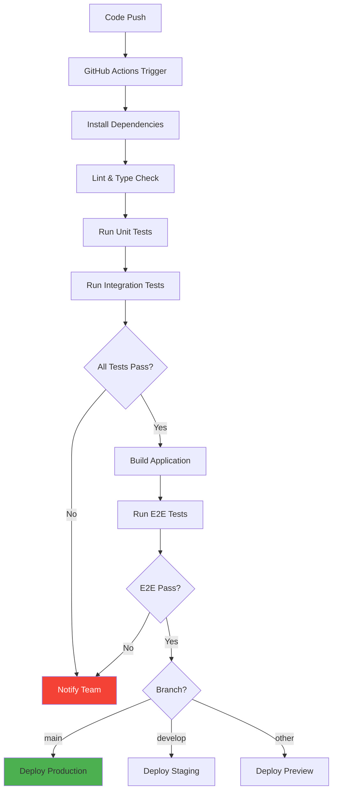
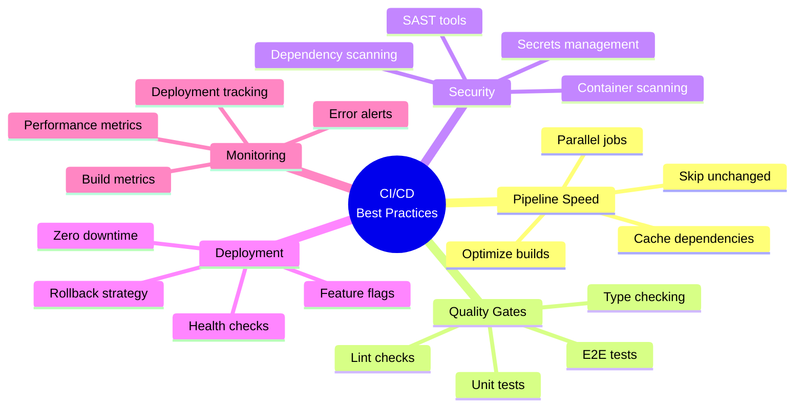

# Day 4 (Day 53): CI/CD & DevOps 🚀

**Duration:** 3-4 hours | **Difficulty:** ⭐⭐⭐ Hard

---

## 📖 Learning Objectives

- Setup CI/CD pipelines
- Automate testing
- Deploy with GitHub Actions
- Environment management
- Continuous deployment

---

## 🔄 CI/CD Pipeline



---

## 🛠️ GitHub Actions Setup

### **Basic Workflow**

```yaml
# .github/workflows/ci.yml
name: CI/CD Pipeline

on:
  push:
    branches: [main, develop]
  pull_request:
    branches: [main, develop]

env:
  NODE_VERSION: '18.x'

jobs:
  lint:
    name: Lint & Type Check
    runs-on: ubuntu-latest
    
    steps:
      - uses: actions/checkout@v3
      
      - name: Setup Node.js
        uses: actions/setup-node@v3
        with:
          node-version: ${{ env.NODE_VERSION }}
          cache: 'npm'
      
      - name: Install dependencies
        run: npm ci
      
      - name: Run ESLint
        run: npm run lint
      
      - name: TypeScript Check
        run: npm run type-check

  test:
    name: Run Tests
    runs-on: ubuntu-latest
    needs: lint
    
    steps:
      - uses: actions/checkout@v3
      
      - name: Setup Node.js
        uses: actions/setup-node@v3
        with:
          node-version: ${{ env.NODE_VERSION }}
          cache: 'npm'
      
      - name: Install dependencies
        run: npm ci
      
      - name: Run unit tests
        run: npm run test:unit
      
      - name: Run integration tests
        run: npm run test:integration
      
      - name: Upload coverage
        uses: codecov/codecov-action@v3
        with:
          file: ./coverage/coverage-final.json

  e2e:
    name: E2E Tests
    runs-on: ubuntu-latest
    needs: test
    
    steps:
      - uses: actions/checkout@v3
      
      - name: Setup Node.js
        uses: actions/setup-node@v3
        with:
          node-version: ${{ env.NODE_VERSION }}
          cache: 'npm'
      
      - name: Install dependencies
        run: npm ci
      
      - name: Install Playwright
        run: npx playwright install --with-deps
      
      - name: Build application
        run: npm run build
      
      - name: Run E2E tests
        run: npm run test:e2e
      
      - name: Upload test results
        if: always()
        uses: actions/upload-artifact@v3
        with:
          name: playwright-report
          path: playwright-report/

  build:
    name: Build Application
    runs-on: ubuntu-latest
    needs: [lint, test]
    
    steps:
      - uses: actions/checkout@v3
      
      - name: Setup Node.js
        uses: actions/setup-node@v3
        with:
          node-version: ${{ env.NODE_VERSION }}
          cache: 'npm'
      
      - name: Install dependencies
        run: npm ci
      
      - name: Build
        run: npm run build
        env:
          NEXT_PUBLIC_API_URL: ${{ secrets.API_URL }}
      
      - name: Upload build artifacts
        uses: actions/upload-artifact@v3
        with:
          name: build
          path: .next/

  deploy-preview:
    name: Deploy Preview
    runs-on: ubuntu-latest
    needs: build
    if: github.event_name == 'pull_request'
    
    steps:
      - uses: actions/checkout@v3
      
      - name: Deploy to Vercel Preview
        uses: amondnet/vercel-action@v25
        with:
          vercel-token: ${{ secrets.VERCEL_TOKEN }}
          vercel-org-id: ${{ secrets.VERCEL_ORG_ID }}
          vercel-project-id: ${{ secrets.VERCEL_PROJECT_ID }}
          scope: ${{ secrets.VERCEL_ORG_ID }}

  deploy-staging:
    name: Deploy to Staging
    runs-on: ubuntu-latest
    needs: [build, e2e]
    if: github.ref == 'refs/heads/develop'
    environment:
      name: staging
      url: https://staging.example.com
    
    steps:
      - uses: actions/checkout@v3
      
      - name: Deploy to Vercel Staging
        uses: amondnet/vercel-action@v25
        with:
          vercel-token: ${{ secrets.VERCEL_TOKEN }}
          vercel-org-id: ${{ secrets.VERCEL_ORG_ID }}
          vercel-project-id: ${{ secrets.VERCEL_PROJECT_ID }}
          vercel-args: '--prod'
          alias-domains: staging.example.com

  deploy-production:
    name: Deploy to Production
    runs-on: ubuntu-latest
    needs: [build, e2e]
    if: github.ref == 'refs/heads/main'
    environment:
      name: production
      url: https://example.com
    
    steps:
      - uses: actions/checkout@v3
      
      - name: Deploy to Vercel Production
        uses: amondnet/vercel-action@v25
        with:
          vercel-token: ${{ secrets.VERCEL_TOKEN }}
          vercel-org-id: ${{ secrets.VERCEL_ORG_ID }}
          vercel-project-id: ${{ secrets.VERCEL_PROJECT_ID }}
          vercel-args: '--prod'
          alias-domains: example.com
      
      - name: Notify team
        uses: 8398a7/action-slack@v3
        with:
          status: ${{ job.status }}
          webhook_url: ${{ secrets.SLACK_WEBHOOK }}
```

---

## 🔐 Environment Management

### **Environment Variables**

```bash
# .env.local (not committed)
DATABASE_URL="postgresql://..."
JWT_SECRET="..."
ENCRYPTION_KEY="..."
STRIPE_SECRET_KEY="..."

# .env.production (in Vercel/deployment platform)
DATABASE_URL="postgresql://production..."
JWT_SECRET="production-secret"
STRIPE_SECRET_KEY="sk_live_..."
```

### **Type-safe Environment Variables**

```typescript
// lib/env.ts
import { z } from 'zod'

const envSchema = z.object({
  // Database
  DATABASE_URL: z.string().url(),
  
  // Authentication
  JWT_SECRET: z.string().min(32),
  NEXTAUTH_URL: z.string().url(),
  NEXTAUTH_SECRET: z.string().min(32),
  
  // API Keys
  STRIPE_SECRET_KEY: z.string().startsWith('sk_'),
  STRIPE_PUBLISHABLE_KEY: z.string().startsWith('pk_'),
  
  // Public
  NEXT_PUBLIC_API_URL: z.string().url(),
  NEXT_PUBLIC_APP_URL: z.string().url(),
  
  // Optional
  SENTRY_DSN: z.string().url().optional(),
  ANALYZE: z.enum(['true', 'false']).optional(),
})

export const env = envSchema.parse(process.env)

// Usage: env.DATABASE_URL (type-safe!)
```

---

## 🧪 Automated Testing in CI

### **Test Scripts**

```json
// package.json
{
  "scripts": {
    "test": "vitest",
    "test:unit": "vitest run --coverage",
    "test:integration": "vitest run --config vitest.integration.config.ts",
    "test:e2e": "playwright test",
    "test:e2e:ui": "playwright test --ui",
    "test:ci": "npm run test:unit && npm run test:integration && npm run test:e2e"
  }
}
```

### **Test Configuration for CI**

```typescript
// vitest.config.ts
import { defineConfig } from 'vitest/config'

export default defineConfig({
  test: {
    coverage: {
      provider: 'v8',
      reporter: ['text', 'json', 'html'],
      exclude: [
        'node_modules/',
        'test/',
        '**/*.config.ts',
        '**/*.d.ts',
      ],
      thresholds: {
        lines: 80,
        functions: 80,
        branches: 80,
        statements: 80
      }
    },
    // CI-specific settings
    pool: 'threads',
    poolOptions: {
      threads: {
        singleThread: process.env.CI === 'true'
      }
    }
  }
})
```

---

## 📦 Docker Integration

### **Dockerfile**

```dockerfile
# Dockerfile
FROM node:18-alpine AS base

# Dependencies
FROM base AS deps
WORKDIR /app
COPY package*.json ./
RUN npm ci

# Builder
FROM base AS builder
WORKDIR /app
COPY --from=deps /app/node_modules ./node_modules
COPY . .

ENV NEXT_TELEMETRY_DISABLED 1

RUN npm run build

# Runner
FROM base AS runner
WORKDIR /app

ENV NODE_ENV production
ENV NEXT_TELEMETRY_DISABLED 1

RUN addgroup --system --gid 1001 nodejs
RUN adduser --system --uid 1001 nextjs

COPY --from=builder /app/public ./public
COPY --from=builder --chown=nextjs:nodejs /app/.next/standalone ./
COPY --from=builder --chown=nextjs:nodejs /app/.next/static ./.next/static

USER nextjs

EXPOSE 3000

ENV PORT 3000
ENV HOSTNAME "0.0.0.0"

CMD ["node", "server.js"]
```

### **Docker Compose**

```yaml
# docker-compose.yml
version: '3.8'

services:
  app:
    build:
      context: .
      dockerfile: Dockerfile
    ports:
      - "3000:3000"
    environment:
      - DATABASE_URL=postgresql://postgres:password@db:5432/myapp
      - JWT_SECRET=${JWT_SECRET}
    depends_on:
      - db
    networks:
      - app-network

  db:
    image: postgres:15-alpine
    environment:
      - POSTGRES_USER=postgres
      - POSTGRES_PASSWORD=password
      - POSTGRES_DB=myapp
    volumes:
      - postgres-data:/var/lib/postgresql/data
    networks:
      - app-network

volumes:
  postgres-data:

networks:
  app-network:
    driver: bridge
```

---

## 🔄 Database Migrations in CI

```yaml
# .github/workflows/deploy.yml
deploy-production:
  # ... other steps
  
  steps:
    - name: Run database migrations
      run: npx prisma migrate deploy
      env:
        DATABASE_URL: ${{ secrets.DATABASE_URL }}
    
    - name: Deploy application
      # ... deployment steps
```

---

## 📊 Monitoring & Alerts

### **Health Check Endpoint**

```typescript
// app/api/health/route.ts
import { NextResponse } from 'next/server'
import { db } from '@/lib/db'

export async function GET() {
  try {
    // Check database connection
    await db.$queryRaw`SELECT 1`
    
    // Check external services
    const services = {
      database: 'healthy',
      redis: await checkRedis(),
      stripe: await checkStripe(),
    }
    
    return NextResponse.json({
      status: 'healthy',
      timestamp: new Date().toISOString(),
      services,
      version: process.env.npm_package_version
    })
  } catch (error) {
    return NextResponse.json(
      {
        status: 'unhealthy',
        error: error.message
      },
      { status: 503 }
    )
  }
}
```

### **Uptime Monitoring**

```yaml
# .github/workflows/monitor.yml
name: Health Check

on:
  schedule:
    - cron: '*/5 * * * *' # Every 5 minutes

jobs:
  health-check:
    runs-on: ubuntu-latest
    steps:
      - name: Check Production Health
        run: |
          response=$(curl -s -o /dev/null -w "%{http_code}" https://example.com/api/health)
          if [ $response -ne 200 ]; then
            echo "Health check failed with status $response"
            exit 1
          fi
      
      - name: Notify on failure
        if: failure()
        uses: 8398a7/action-slack@v3
        with:
          status: failure
          text: 'Production health check failed!'
          webhook_url: ${{ secrets.SLACK_WEBHOOK }}
```

---

## ✅ CI/CD Best Practices



---

## ✅ Practice Exercise

Setup CI/CD:
1. GitHub Actions workflow
2. Automated testing pipeline
3. Environment management
4. Docker configuration
5. Health check endpoint
6. Deployment automation
7. Monitoring & alerts

---

**Tomorrow:** Scaling & Infrastructure! 📈
