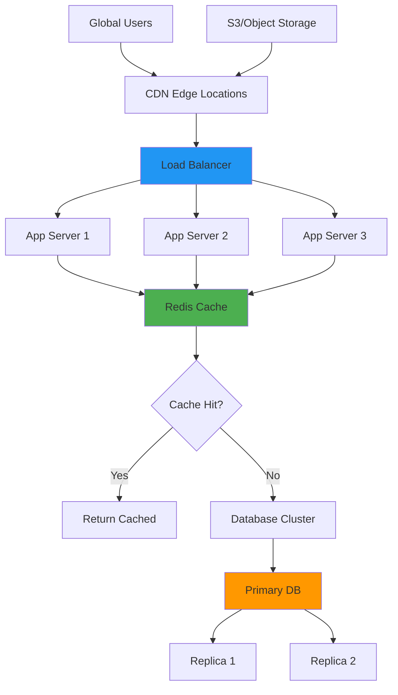
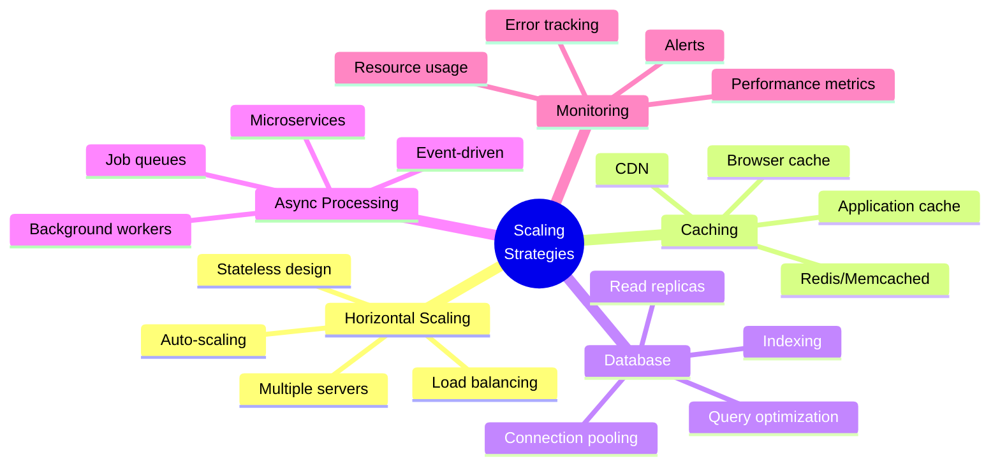

# Day 5 (Day 54): Scaling & Infrastructure 📈

**Duration:** 3-4 hours | **Difficulty:** ⭐⭐⭐ Hard

---

## 📖 Learning Objectives

- Horizontal scaling strategies
- Load balancing
- Caching layers
- CDN integration
- Database optimization

---

## 📊 Scaling Architecture



---

## ⚖️ Load Balancing

### **Next.js with Load Balancer**

```typescript
// Stateless application design
// Each request can go to any server

// ❌ BAD - Using in-memory state
let cache = new Map()

export async function GET() {
  const data = cache.get('key')
  // Problem: cache is per-server instance
}

// ✅ GOOD - Using distributed cache
import { redis } from '@/lib/redis'

export async function GET() {
  const data = await redis.get('key')
  // Works across all server instances
}
```

### **Health Check for Load Balancer**

```typescript
// app/api/healthz/route.ts
import { NextResponse } from 'next/server'

export async function GET() {
  // Quick health check
  return NextResponse.json({
    status: 'ok',
    timestamp: Date.now()
  })
}
```

### **Nginx Load Balancer Configuration**

```nginx
# nginx.conf
upstream nextjs_backend {
    least_conn; # Load balancing method
    
    server app1.example.com:3000 max_fails=3 fail_timeout=30s;
    server app2.example.com:3000 max_fails=3 fail_timeout=30s;
    server app3.example.com:3000 max_fails=3 fail_timeout=30s;
}

server {
    listen 80;
    server_name example.com;
    
    location / {
        proxy_pass http://nextjs_backend;
        proxy_http_version 1.1;
        proxy_set_header Upgrade $http_upgrade;
        proxy_set_header Connection 'upgrade';
        proxy_set_header Host $host;
        proxy_cache_bypass $http_upgrade;
        
        # Timeouts
        proxy_connect_timeout 60s;
        proxy_send_timeout 60s;
        proxy_read_timeout 60s;
    }
    
    # Health check
    location /healthz {
        access_log off;
        proxy_pass http://nextjs_backend/api/healthz;
    }
}
```

---

## 🚀 Redis Caching

### **Redis Setup**

```typescript
// lib/redis.ts
import { Redis } from '@upstash/redis'

export const redis = new Redis({
  url: process.env.REDIS_URL!,
  token: process.env.REDIS_TOKEN!,
})

// Cache helpers
export async function getCached<T>(
  key: string,
  fetcher: () => Promise<T>,
  ttl: number = 3600
): Promise<T> {
  // Try to get from cache
  const cached = await redis.get<T>(key)
  
  if (cached) {
    return cached
  }
  
  // Fetch fresh data
  const data = await fetcher()
  
  // Store in cache
  await redis.setex(key, ttl, JSON.stringify(data))
  
  return data
}

export async function invalidateCache(pattern: string) {
  const keys = await redis.keys(pattern)
  
  if (keys.length > 0) {
    await redis.del(...keys)
  }
}
```

### **Caching Strategies**

```typescript
// app/api/products/route.ts
import { getCached, redis } from '@/lib/redis'

export async function GET(request: Request) {
  const { searchParams } = new URL(request.url)
  const category = searchParams.get('category')
  
  const cacheKey = `products:${category || 'all'}`
  
  const products = await getCached(
    cacheKey,
    async () => {
      return await db.product.findMany({
        where: category ? { category } : undefined
      })
    },
    3600 // 1 hour TTL
  )
  
  return NextResponse.json(products)
}

// Invalidate cache on update
export async function POST(request: Request) {
  const body = await request.json()
  
  const product = await db.product.create({
    data: body
  })
  
  // Invalidate related caches
  await redis.del('products:all')
  await redis.del(`products:${product.category}`)
  
  return NextResponse.json(product)
}
```

### **Cache Patterns**

```typescript
// 1. Cache-aside (Lazy loading)
export async function getUser(id: string) {
  const cached = await redis.get(`user:${id}`)
  if (cached) return cached
  
  const user = await db.user.findUnique({ where: { id } })
  await redis.setex(`user:${id}`, 3600, JSON.stringify(user))
  
  return user
}

// 2. Write-through
export async function updateUser(id: string, data: any) {
  const user = await db.user.update({
    where: { id },
    data
  })
  
  // Update cache immediately
  await redis.setex(`user:${id}`, 3600, JSON.stringify(user))
  
  return user
}

// 3. Write-behind (async)
export async function trackEvent(userId: string, event: string) {
  // Write to cache immediately
  await redis.lpush(`events:${userId}`, JSON.stringify({
    event,
    timestamp: Date.now()
  }))
  
  // Process async (background job)
  await queue.add('processEvent', { userId, event })
}
```

---

## 🌐 CDN Integration

### **Vercel Edge Network (Automatic)**

```typescript
// next.config.js
module.exports = {
  // Assets automatically served from CDN
  assetPrefix: process.env.NODE_ENV === 'production' 
    ? 'https://cdn.example.com' 
    : '',
  
  images: {
    domains: ['cdn.example.com'],
  },
}
```

### **CloudFront with S3**

```typescript
// lib/upload.ts
import { S3Client, PutObjectCommand } from '@aws-sdk/client-s3'

const s3 = new S3Client({
  region: process.env.AWS_REGION!,
  credentials: {
    accessKeyId: process.env.AWS_ACCESS_KEY_ID!,
    secretAccessKey: process.env.AWS_SECRET_ACCESS_KEY!,
  },
})

export async function uploadToS3(
  file: File,
  key: string
): Promise<string> {
  const buffer = Buffer.from(await file.arrayBuffer())
  
  await s3.send(new PutObjectCommand({
    Bucket: process.env.S3_BUCKET!,
    Key: key,
    Body: buffer,
    ContentType: file.type,
    CacheControl: 'public, max-age=31536000, immutable',
  }))
  
  // Return CloudFront URL
  return `https://${process.env.CLOUDFRONT_DOMAIN}/${key}`
}
```

### **CDN Cache Control**

```typescript
// app/api/images/[id]/route.ts
export async function GET(
  request: Request,
  { params }: { params: { id: string } }
) {
  const image = await getImage(params.id)
  
  return new Response(image.buffer, {
    headers: {
      'Content-Type': image.mimeType,
      // CDN caching
      'Cache-Control': 'public, max-age=31536000, immutable',
      'CDN-Cache-Control': 'max-age=31536000',
      // Browser caching
      'Expires': new Date(Date.now() + 365 * 24 * 60 * 60 * 1000).toUTCString(),
    }
  })
}
```

---

## 🗄️ Database Scaling

### **Read Replicas**

```typescript
// lib/db.ts
import { PrismaClient } from '@prisma/client'

// Primary database (writes)
export const dbPrimary = new PrismaClient({
  datasources: {
    db: {
      url: process.env.DATABASE_URL
    }
  }
})

// Read replica (reads)
export const dbReplica = new PrismaClient({
  datasources: {
    db: {
      url: process.env.DATABASE_REPLICA_URL
    }
  }
})

// Helper to choose correct connection
export function getDB(readonly: boolean = false) {
  return readonly ? dbReplica : dbPrimary
}
```

```typescript
// Usage
export async function getProducts() {
  // Use replica for reads
  return await getDB(true).product.findMany()
}

export async function createProduct(data: any) {
  // Use primary for writes
  return await getDB(false).product.create({ data })
}
```

### **Connection Pooling**

```typescript
// lib/db.ts
import { Pool } from 'pg'

const pool = new Pool({
  host: process.env.DB_HOST,
  port: parseInt(process.env.DB_PORT || '5432'),
  database: process.env.DB_NAME,
  user: process.env.DB_USER,
  password: process.env.DB_PASSWORD,
  
  // Pool configuration
  max: 20, // Maximum connections
  idleTimeoutMillis: 30000,
  connectionTimeoutMillis: 2000,
})

export async function query(text: string, params?: any[]) {
  const start = Date.now()
  const result = await pool.query(text, params)
  const duration = Date.now() - start
  
  // Log slow queries
  if (duration > 1000) {
    console.warn('Slow query:', { text, duration })
  }
  
  return result
}
```

### **Query Optimization**

```typescript
// ❌ BAD - N+1 query problem
async function getUsersWithPosts() {
  const users = await db.user.findMany()
  
  for (const user of users) {
    user.posts = await db.post.findMany({
      where: { authorId: user.id }
    })
  }
  
  return users
}

// ✅ GOOD - Single query with include
async function getUsersWithPosts() {
  return await db.user.findMany({
    include: {
      posts: true
    }
  })
}

// ✅ BETTER - With pagination and selection
async function getUsersWithPosts(page: number = 1, limit: number = 10) {
  return await db.user.findMany({
    take: limit,
    skip: (page - 1) * limit,
    select: {
      id: true,
      name: true,
      email: true,
      posts: {
        select: {
          id: true,
          title: true,
          createdAt: true
        },
        take: 5 // Limit posts per user
      }
    }
  })
}
```

---

## 📊 Monitoring & Metrics

### **Performance Metrics**

```typescript
// lib/metrics.ts
import { Counter, Histogram, register } from 'prom-client'

// Request counter
export const requestCounter = new Counter({
  name: 'http_requests_total',
  help: 'Total HTTP requests',
  labelNames: ['method', 'route', 'status']
})

// Response time histogram
export const responseTime = new Histogram({
  name: 'http_request_duration_seconds',
  help: 'HTTP request duration',
  labelNames: ['method', 'route'],
  buckets: [0.1, 0.5, 1, 2, 5]
})

// Database query time
export const dbQueryTime = new Histogram({
  name: 'db_query_duration_seconds',
  help: 'Database query duration',
  labelNames: ['operation'],
  buckets: [0.01, 0.05, 0.1, 0.5, 1]
})

// Export metrics endpoint
export async function getMetrics() {
  return await register.metrics()
}
```

```typescript
// middleware.ts
import { requestCounter, responseTime } from '@/lib/metrics'

export function middleware(request: NextRequest) {
  const start = Date.now()
  const path = request.nextUrl.pathname
  
  // After response
  const response = NextResponse.next()
  
  const duration = (Date.now() - start) / 1000
  
  requestCounter.inc({
    method: request.method,
    route: path,
    status: response.status
  })
  
  responseTime.observe(
    { method: request.method, route: path },
    duration
  )
  
  return response
}
```

---

## ✅ Scaling Best Practices



---

## ✅ Practice Exercise

Implement scaling:
1. Redis caching layer
2. CDN integration
3. Database read replicas
4. Connection pooling
5. Performance monitoring
6. Load balancing config
7. Auto-scaling rules

---

**Tomorrow:** Advanced Patterns! 🎨
