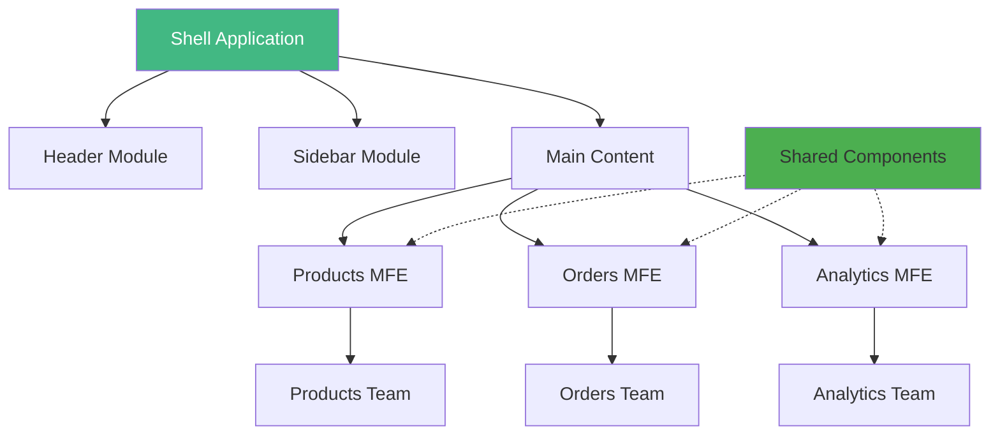
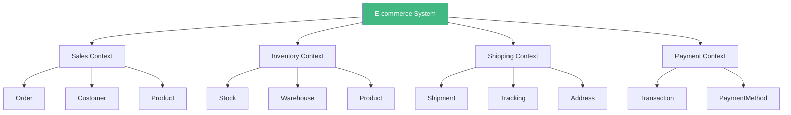
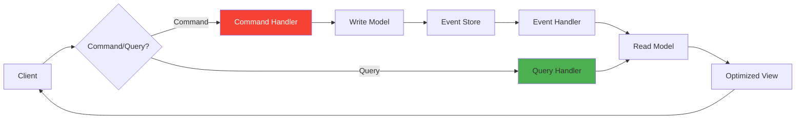
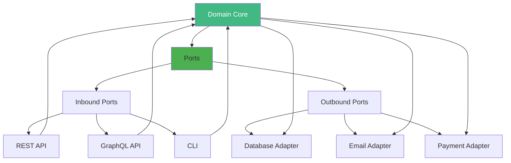
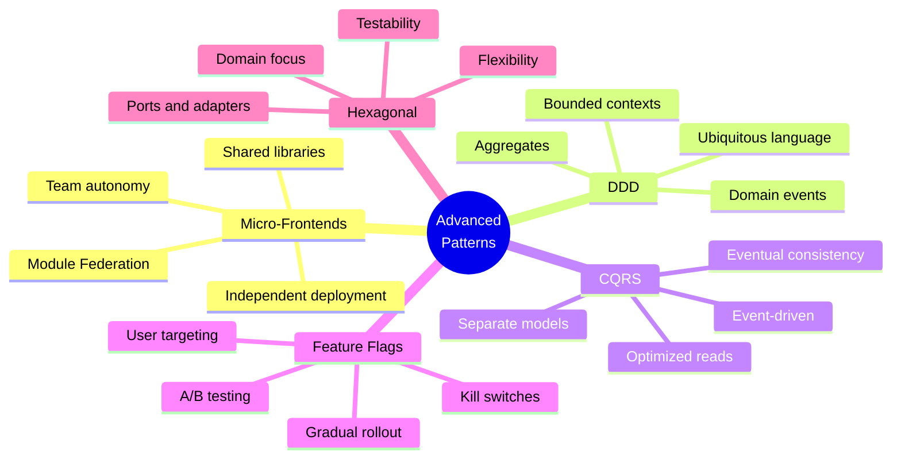

# Day 6 (Day 55): Advanced Patterns 🎨

**Duration:** 3-4 hours | **Difficulty:** ⭐⭐⭐ Hard

---

## 📖 Learning Objectives

- Micro-frontends architecture
- Domain-Driven Design (DDD)
- CQRS pattern
- Event Sourcing
- Feature flags

---

## 🏗️ Micro-Frontends



### **Module Federation Setup**

```typescript
// next.config.js (Shell App)
const { NextFederationPlugin } = require('@module-federation/nextjs-mf')

module.exports = {
  webpack(config, options) {
    config.plugins.push(
      new NextFederationPlugin({
        name: 'shell',
        filename: 'static/chunks/remoteEntry.js',
        remotes: {
          products: `products@http://localhost:3001/_next/static/chunks/remoteEntry.js`,
          orders: `orders@http://localhost:3002/_next/static/chunks/remoteEntry.js`,
        },
        shared: {
          react: { singleton: true, requiredVersion: false },
          'react-dom': { singleton: true, requiredVersion: false },
        },
      })
    )
    
    return config
  },
}
```

```typescript
// components/DynamicModule.tsx
'use client'

import dynamic from 'next/dynamic'

const ProductsList = dynamic(
  () => import('products/ProductsList'),
  {
    loading: () => <div>Loading products...</div>,
    ssr: false
  }
)

export function DynamicProductsModule() {
  return <ProductsList />
}
```

---

## 🎯 Domain-Driven Design (DDD)

### **Bounded Contexts**



### **Aggregate Pattern**

```typescript
// core/domain/aggregates/Order.ts
import { OrderItem } from './OrderItem'
import { OrderStatus } from './OrderStatus'

export class Order {
  private constructor(
    public readonly id: string,
    private _customerId: string,
    private _items: OrderItem[],
    private _status: OrderStatus,
    private _total: number,
    private _createdAt: Date,
    private _updatedAt: Date
  ) {}
  
  // Factory method
  static create(customerId: string, items: OrderItem[]): Order {
    if (items.length === 0) {
      throw new Error('Order must have at least one item')
    }
    
    const total = items.reduce((sum, item) => sum + item.subtotal, 0)
    
    return new Order(
      generateId(),
      customerId,
      items,
      OrderStatus.PENDING,
      total,
      new Date(),
      new Date()
    )
  }
  
  // Domain behaviors
  addItem(item: OrderItem): void {
    if (this._status !== OrderStatus.PENDING) {
      throw new Error('Cannot add items to non-pending order')
    }
    
    this._items.push(item)
    this._total += item.subtotal
    this._updatedAt = new Date()
  }
  
  removeItem(itemId: string): void {
    if (this._status !== OrderStatus.PENDING) {
      throw new Error('Cannot remove items from non-pending order')
    }
    
    const item = this._items.find(i => i.id === itemId)
    if (!item) {
      throw new Error('Item not found in order')
    }
    
    this._items = this._items.filter(i => i.id !== itemId)
    this._total -= item.subtotal
    this._updatedAt = new Date()
  }
  
  confirm(): void {
    if (this._status !== OrderStatus.PENDING) {
      throw new Error('Only pending orders can be confirmed')
    }
    
    if (this._items.length === 0) {
      throw new Error('Cannot confirm empty order')
    }
    
    this._status = OrderStatus.CONFIRMED
    this._updatedAt = new Date()
  }
  
  ship(): void {
    if (this._status !== OrderStatus.CONFIRMED) {
      throw new Error('Only confirmed orders can be shipped')
    }
    
    this._status = OrderStatus.SHIPPED
    this._updatedAt = new Date()
  }
  
  cancel(): void {
    if (this._status === OrderStatus.DELIVERED) {
      throw new Error('Cannot cancel delivered order')
    }
    
    this._status = OrderStatus.CANCELLED
    this._updatedAt = new Date()
  }
  
  // Getters
  get items(): readonly OrderItem[] {
    return Object.freeze([...this._items])
  }
  
  get status(): OrderStatus {
    return this._status
  }
  
  get total(): number {
    return this._total
  }
  
  // Business rules
  canBeModified(): boolean {
    return this._status === OrderStatus.PENDING
  }
  
  isCompleted(): boolean {
    return this._status === OrderStatus.DELIVERED
  }
}
```

---

## 📊 CQRS Pattern



### **Commands & Queries**

```typescript
// commands/CreateOrderCommand.ts
export class CreateOrderCommand {
  constructor(
    public readonly customerId: string,
    public readonly items: OrderItemDTO[],
    public readonly shippingAddress: AddressDTO
  ) {}
}

// handlers/CreateOrderHandler.ts
export class CreateOrderHandler {
  constructor(
    private orderRepository: IOrderRepository,
    private eventBus: IEventBus
  ) {}
  
  async handle(command: CreateOrderCommand): Promise<string> {
    // Validate
    await this.validateCommand(command)
    
    // Create aggregate
    const order = Order.create(
      command.customerId,
      command.items.map(OrderItem.fromDTO)
    )
    
    // Save to write model
    await this.orderRepository.save(order)
    
    // Publish domain events
    await this.eventBus.publish(new OrderCreatedEvent(order))
    
    return order.id
  }
}
```

```typescript
// queries/GetOrderQuery.ts
export class GetOrderQuery {
  constructor(public readonly orderId: string) {}
}

// handlers/GetOrderQueryHandler.ts
export class GetOrderQueryHandler {
  constructor(private readModel: IOrderReadModel) {}
  
  async handle(query: GetOrderQuery): Promise<OrderView> {
    // Query optimized read model
    return await this.readModel.findById(query.orderId)
  }
}
```

---

## 📝 Event Sourcing

```typescript
// domain/events/OrderEvents.ts
export abstract class OrderEvent {
  constructor(
    public readonly orderId: string,
    public readonly occurredAt: Date = new Date()
  ) {}
}

export class OrderCreatedEvent extends OrderEvent {
  constructor(
    orderId: string,
    public readonly customerId: string,
    public readonly items: OrderItemDTO[],
    public readonly total: number
  ) {
    super(orderId)
  }
}

export class OrderConfirmedEvent extends OrderEvent {}

export class OrderShippedEvent extends OrderEvent {
  constructor(
    orderId: string,
    public readonly trackingNumber: string
  ) {
    super(orderId)
  }
}
```

```typescript
// infrastructure/EventStore.ts
export class EventStore {
  async append(streamId: string, events: OrderEvent[]): Promise<void> {
    await db.event.createMany({
      data: events.map(event => ({
        streamId,
        type: event.constructor.name,
        data: JSON.stringify(event),
        version: await this.getNextVersion(streamId),
        occurredAt: event.occurredAt
      }))
    })
  }
  
  async getStream(streamId: string): Promise<OrderEvent[]> {
    const events = await db.event.findMany({
      where: { streamId },
      orderBy: { version: 'asc' }
    })
    
    return events.map(e => this.deserialize(e))
  }
  
  async replay(streamId: string): Promise<Order> {
    const events = await this.getStream(streamId)
    
    // Rebuild aggregate from events
    let order: Order | null = null
    
    for (const event of events) {
      if (event instanceof OrderCreatedEvent) {
        order = Order.create(event.customerId, event.items)
      } else if (event instanceof OrderConfirmedEvent) {
        order?.confirm()
      } else if (event instanceof OrderShippedEvent) {
        order?.ship()
      }
    }
    
    return order!
  }
}
```

---

## 🚩 Feature Flags

```typescript
// lib/feature-flags.ts
import { unstable_flag as flag } from '@vercel/flags/next'

export const showNewCheckout = flag({
  key: 'show-new-checkout',
  async decide() {
    // Can be based on user, environment, percentage, etc.
    const rolloutPercentage = 25 // 25% of users
    return Math.random() * 100 < rolloutPercentage
  }
})

export const enableAdvancedAnalytics = flag({
  key: 'enable-advanced-analytics',
  async decide({ cookies }) {
    const betaUser = cookies.get('beta-user')?.value
    return betaUser === 'true'
  }
})
```

```typescript
// app/checkout/page.tsx
import { showNewCheckout } from '@/lib/feature-flags'

export default async function CheckoutPage() {
  const useNewCheckout = await showNewCheckout()
  
  if (useNewCheckout) {
    return <NewCheckoutFlow />
  }
  
  return <LegacyCheckoutFlow />
}
```

### **Feature Flag Service**

```typescript
// lib/feature-flag-service.ts
interface FeatureFlag {
  key: string
  enabled: boolean
  rolloutPercentage?: number
  users?: string[]
  environments?: string[]
}

export class FeatureFlagService {
  private flags: Map<string, FeatureFlag> = new Map()
  
  constructor() {
    this.loadFlags()
  }
  
  private async loadFlags() {
    // Load from database or config service
    const flags = await db.featureFlag.findMany()
    flags.forEach(flag => this.flags.set(flag.key, flag))
  }
  
  async isEnabled(
    key: string,
    context?: {
      userId?: string
      environment?: string
    }
  ): Promise<boolean> {
    const flag = this.flags.get(key)
    
    if (!flag) {
      return false
    }
    
    if (!flag.enabled) {
      return false
    }
    
    // Check environment
    if (flag.environments && context?.environment) {
      if (!flag.environments.includes(context.environment)) {
        return false
      }
    }
    
    // Check user whitelist
    if (flag.users && context?.userId) {
      if (flag.users.includes(context.userId)) {
        return true
      }
    }
    
    // Check rollout percentage
    if (flag.rolloutPercentage !== undefined) {
      const hash = this.hashUserId(context?.userId || 'anonymous')
      return (hash % 100) < flag.rolloutPercentage
    }
    
    return flag.enabled
  }
  
  private hashUserId(userId: string): number {
    let hash = 0
    for (let i = 0; i < userId.length; i++) {
      hash = ((hash << 5) - hash) + userId.charCodeAt(i)
      hash |= 0
    }
    return Math.abs(hash)
  }
}

export const featureFlags = new FeatureFlagService()
```

---

## 🎯 Hexagonal Architecture



```typescript
// core/ports/IPaymentGateway.ts
export interface IPaymentGateway {
  charge(amount: number, token: string): Promise<PaymentResult>
  refund(transactionId: string): Promise<RefundResult>
}

// infrastructure/adapters/StripePaymentGateway.ts
export class StripePaymentGateway implements IPaymentGateway {
  async charge(amount: number, token: string): Promise<PaymentResult> {
    const stripe = new Stripe(process.env.STRIPE_SECRET_KEY!)
    
    const charge = await stripe.charges.create({
      amount,
      currency: 'usd',
      source: token
    })
    
    return {
      success: charge.status === 'succeeded',
      transactionId: charge.id
    }
  }
  
  async refund(transactionId: string): Promise<RefundResult> {
    // Implementation
  }
}

// infrastructure/adapters/PayPalPaymentGateway.ts
export class PayPalPaymentGateway implements IPaymentGateway {
  // Different implementation, same interface
}
```

---

## ✅ Advanced Patterns Best Practices



---

## ✅ Practice Exercise

Implement patterns:
1. Micro-frontend architecture
2. DDD aggregate
3. CQRS with separate models
4. Event sourcing
5. Feature flag system
6. Hexagonal architecture
7. Domain events

---

**Tomorrow:** Capstone Project! 🎯
