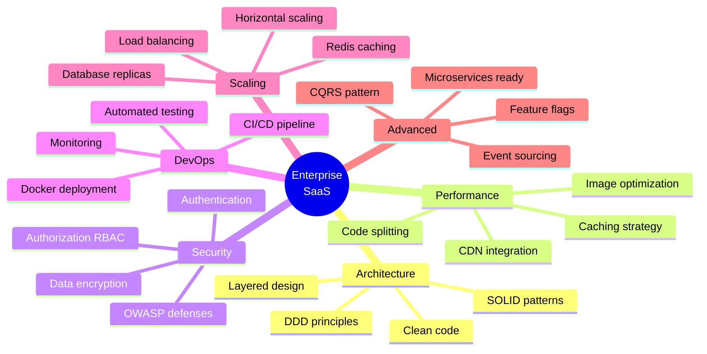
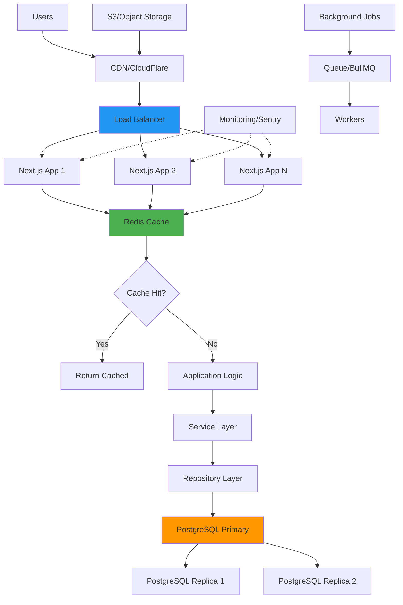

# Day 7 (Day 56): Capstone Project - Enterprise SaaS Platform 🎯

**Duration:** 8-10 hours | **Difficulty:** ⭐⭐⭐ Project

---

## 🎯 Project Overview

Build a **Production-Ready Enterprise SaaS Platform** using all Week 8 concepts!



---

## 📋 Requirements

### **Must Have:**

1. ✅ Layered architecture
2. ✅ Multi-tenant support
3. ✅ Role-based access control (RBAC)
4. ✅ CI/CD pipeline
5. ✅ Comprehensive security
6. ✅ Performance optimization
7. ✅ Monitoring & logging
8. ✅ Scaling infrastructure
9. ✅ Feature flags
10. ✅ Production deployment

---

## 🏗️ System Architecture



---

## 📊 Database Schema

```prisma
// prisma/schema.prisma
generator client {
  provider = "prisma-client-js"
}

datasource db {
  provider = "postgresql"
  url      = env("DATABASE_URL")
}

// Multi-tenancy
model Tenant {
  id          String   @id @default(cuid())
  name        String
  slug        String   @unique
  domain      String?  @unique
  plan        Plan     @default(FREE)
  status      TenantStatus @default(ACTIVE)
  createdAt   DateTime @default(now())
  updatedAt   DateTime @updatedAt
  
  users       User[]
  projects    Project[]
  settings    TenantSettings?
  
  @@index([slug])
  @@index([domain])
}

enum Plan {
  FREE
  STARTER
  PROFESSIONAL
  ENTERPRISE
}

enum TenantStatus {
  ACTIVE
  SUSPENDED
  CANCELLED
}

model TenantSettings {
  id                String  @id @default(cuid())
  tenantId          String  @unique
  tenant            Tenant  @relation(fields: [tenantId], references: [id], onDelete: Cascade)
  
  maxUsers          Int     @default(5)
  maxProjects       Int     @default(10)
  maxStorageGB      Int     @default(5)
  
  features          Json    // Feature flags
  customization     Json    // Branding, theme
}

// Users & Auth
model User {
  id              String   @id @default(cuid())
  email           String   @unique
  name            String
  password        String
  avatar          String?
  role            Role     @default(USER)
  tenantId        String
  status          UserStatus @default(ACTIVE)
  lastLoginAt     DateTime?
  createdAt       DateTime @default(now())
  updatedAt       DateTime @updatedAt
  
  tenant          Tenant   @relation(fields: [tenantId], references: [id], onDelete: Cascade)
  projects        ProjectMember[]
  tasks           Task[]
  comments        Comment[]
  activities      Activity[]
  sessions        Session[]
  
  @@index([tenantId])
  @@index([email])
}

enum Role {
  SUPER_ADMIN
  ADMIN
  MANAGER
  USER
  GUEST
}

enum UserStatus {
  ACTIVE
  INACTIVE
  SUSPENDED
}

model Session {
  id           String   @id @default(cuid())
  userId       String
  token        String   @unique
  ipAddress    String?
  userAgent    String?
  expiresAt    DateTime
  createdAt    DateTime @default(now())
  
  user         User     @relation(fields: [userId], references: [id], onDelete: Cascade)
  
  @@index([userId])
  @@index([token])
}

// Projects
model Project {
  id          String   @id @default(cuid())
  name        String
  description String?
  status      ProjectStatus @default(ACTIVE)
  tenantId    String
  createdAt   DateTime @default(now())
  updatedAt   DateTime @updatedAt
  
  tenant      Tenant   @relation(fields: [tenantId], references: [id], onDelete: Cascade)
  members     ProjectMember[]
  tasks       Task[]
  
  @@index([tenantId])
}

enum ProjectStatus {
  ACTIVE
  ARCHIVED
  COMPLETED
}

model ProjectMember {
  id          String   @id @default(cuid())
  projectId   String
  userId      String
  role        ProjectRole @default(MEMBER)
  joinedAt    DateTime @default(now())
  
  project     Project  @relation(fields: [projectId], references: [id], onDelete: Cascade)
  user        User     @relation(fields: [userId], references: [id], onDelete: Cascade)
  
  @@unique([projectId, userId])
  @@index([projectId])
  @@index([userId])
}

enum ProjectRole {
  OWNER
  ADMIN
  MEMBER
  VIEWER
}

// Tasks
model Task {
  id          String   @id @default(cuid())
  title       String
  description String?
  status      TaskStatus @default(TODO)
  priority    Priority @default(MEDIUM)
  projectId   String
  assigneeId  String?
  dueDate     DateTime?
  createdAt   DateTime @default(now())
  updatedAt   DateTime @updatedAt
  
  project     Project  @relation(fields: [projectId], references: [id], onDelete: Cascade)
  assignee    User?    @relation(fields: [assigneeId], references: [id])
  comments    Comment[]
  
  @@index([projectId])
  @@index([assigneeId])
  @@index([status])
}

enum TaskStatus {
  TODO
  IN_PROGRESS
  IN_REVIEW
  DONE
  CANCELLED
}

enum Priority {
  LOW
  MEDIUM
  HIGH
  URGENT
}

model Comment {
  id          String   @id @default(cuid())
  content     String
  taskId      String
  userId      String
  createdAt   DateTime @default(now())
  updatedAt   DateTime @updatedAt
  
  task        Task     @relation(fields: [taskId], references: [id], onDelete: Cascade)
  user        User     @relation(fields: [userId], references: [id], onDelete: Cascade)
  
  @@index([taskId])
  @@index([userId])
}

// Activity Log
model Activity {
  id          String   @id @default(cuid())
  userId      String
  action      String
  resource    String
  resourceId  String
  metadata    Json?
  ipAddress   String?
  userAgent   String?
  createdAt   DateTime @default(now())
  
  user        User     @relation(fields: [userId], references: [id], onDelete: Cascade)
  
  @@index([userId])
  @@index([resource, resourceId])
  @@index([createdAt])
}

// Feature Flags
model FeatureFlag {
  id                  String   @id @default(cuid())
  key                 String   @unique
  name                String
  description         String?
  enabled             Boolean  @default(false)
  rolloutPercentage   Int?
  tenantIds           String[] // Whitelist
  userIds             String[] // Whitelist
  environments        String[] // e.g., ["production", "staging"]
  createdAt           DateTime @default(now())
  updatedAt           DateTime @updatedAt
  
  @@index([key])
}
```

---

## 🏗️ Project Structure

```
enterprise-saas/
├── src/
│   ├── app/                      # Next.js App Router
│   │   ├── (auth)/
│   │   │   ├── login/
│   │   │   ├── register/
│   │   │   └── forgot-password/
│   │   ├── (dashboard)/
│   │   │   ├── layout.tsx
│   │   │   ├── page.tsx
│   │   │   ├── projects/
│   │   │   ├── tasks/
│   │   │   ├── team/
│   │   │   └── settings/
│   │   ├── api/
│   │   │   ├── auth/
│   │   │   ├── projects/
│   │   │   ├── tasks/
│   │   │   ├── users/
│   │   │   └── webhooks/
│   │   └── admin/
│   ├── core/                     # Business Logic
│   │   ├── domain/
│   │   │   ├── entities/
│   │   │   ├── value-objects/
│   │   │   └── events/
│   │   ├── use-cases/
│   │   │   ├── auth/
│   │   │   ├── projects/
│   │   │   └── tasks/
│   │   └── ports/
│   │       ├── repositories/
│   │       └── services/
│   ├── infrastructure/           # External Concerns
│   │   ├── database/
│   │   │   ├── prisma/
│   │   │   └── repositories/
│   │   ├── cache/
│   │   │   └── redis.ts
│   │   ├── storage/
│   │   │   └── s3.ts
│   │   ├── email/
│   │   │   └── sendgrid.ts
│   │   └── queue/
│   │       └── bullmq.ts
│   ├── features/                 # Feature Modules
│   │   ├── auth/
│   │   ├── projects/
│   │   ├── tasks/
│   │   └── admin/
│   ├── shared/                   # Shared Code
│   │   ├── components/
│   │   ├── hooks/
│   │   ├── lib/
│   │   ├── types/
│   │   └── utils/
│   └── config/
├── tests/
│   ├── unit/
│   ├── integration/
│   └── e2e/
├── .github/
│   └── workflows/
│       ├── ci.yml
│       ├── deploy-staging.yml
│       └── deploy-production.yml
├── docker/
│   ├── Dockerfile
│   ├── docker-compose.yml
│   └── nginx.conf
├── docs/
│   ├── architecture/
│   ├── api/
│   └── deployment/
└── scripts/
    ├── seed.ts
    └── migrate.ts
```

---

## 🎨 Key Features Implementation

### **1. Multi-Tenancy**

```typescript
// lib/tenant.ts
import { cookies } from 'next/headers'
import { db } from '@/lib/db'

export async function getCurrentTenant(): Promise<Tenant | null> {
  const session = await getSession()
  
  if (!session?.userId) {
    return null
  }
  
  const user = await db.user.findUnique({
    where: { id: session.userId },
    include: { tenant: true }
  })
  
  return user?.tenant || null
}

export async function requireTenant(): Promise<Tenant> {
  const tenant = await getCurrentTenant()
  
  if (!tenant) {
    throw new Error('No tenant found')
  }
  
  return tenant
}

// Tenant-scoped queries
export function getTenantDB(tenantId: string) {
  return {
    async findMany<T>(model: string, args?: any) {
      return await db[model].findMany({
        ...args,
        where: {
          ...args?.where,
          tenantId
        }
      })
    }
    // ... other methods
  }
}
```

### **2. RBAC System**

```typescript
// lib/rbac.ts
export enum Permission {
  // Projects
  PROJECT_CREATE = 'project:create',
  PROJECT_READ = 'project:read',
  PROJECT_UPDATE = 'project:update',
  PROJECT_DELETE = 'project:delete',
  
  // Tasks
  TASK_CREATE = 'task:create',
  TASK_READ = 'task:read',
  TASK_UPDATE = 'task:update',
  TASK_DELETE = 'task:delete',
  
  // Users
  USER_INVITE = 'user:invite',
  USER_MANAGE = 'user:manage',
  
  // Admin
  ADMIN_ACCESS = 'admin:access',
}

const rolePermissions: Record<Role, Permission[]> = {
  [Role.SUPER_ADMIN]: Object.values(Permission),
  [Role.ADMIN]: [
    Permission.PROJECT_CREATE,
    Permission.PROJECT_READ,
    Permission.PROJECT_UPDATE,
    Permission.TASK_CREATE,
    Permission.TASK_READ,
    Permission.TASK_UPDATE,
    Permission.TASK_DELETE,
    Permission.USER_INVITE,
  ],
  [Role.MANAGER]: [
    Permission.PROJECT_READ,
    Permission.PROJECT_UPDATE,
    Permission.TASK_CREATE,
    Permission.TASK_READ,
    Permission.TASK_UPDATE,
    Permission.TASK_DELETE,
  ],
  [Role.USER]: [
    Permission.PROJECT_READ,
    Permission.TASK_READ,
    Permission.TASK_UPDATE,
  ],
  [Role.GUEST]: [
    Permission.PROJECT_READ,
    Permission.TASK_READ,
  ],
}

export function hasPermission(role: Role, permission: Permission): boolean {
  return rolePermissions[role].includes(permission)
}

export function requirePermission(permission: Permission) {
  return async function (userId: string) {
    const user = await db.user.findUnique({
      where: { id: userId },
      select: { role: true }
    })
    
    if (!user || !hasPermission(user.role as Role, permission)) {
      throw new Error('Unauthorized')
    }
  }
}
```

### **3. Feature Flags**

```typescript
// lib/feature-flags.ts
export class FeatureFlagService {
  async isEnabled(
    key: string,
    context: {
      tenantId?: string
      userId?: string
      environment?: string
    }
  ): Promise<boolean> {
    const flag = await db.featureFlag.findUnique({
      where: { key }
    })
    
    if (!flag || !flag.enabled) {
      return false
    }
    
    // Check environment
    if (flag.environments.length > 0) {
      if (!flag.environments.includes(context.environment || 'production')) {
        return false
      }
    }
    
    // Check tenant whitelist
    if (flag.tenantIds.length > 0 && context.tenantId) {
      return flag.tenantIds.includes(context.tenantId)
    }
    
    // Check user whitelist
    if (flag.userIds.length > 0 && context.userId) {
      return flag.userIds.includes(context.userId)
    }
    
    // Check rollout percentage
    if (flag.rolloutPercentage !== null) {
      const hash = this.hash(context.tenantId || context.userId || 'anonymous')
      return (hash % 100) < flag.rolloutPercentage
    }
    
    return true
  }
  
  private hash(str: string): number {
    let hash = 0
    for (let i = 0; i < str.length; i++) {
      hash = ((hash << 5) - hash) + str.charCodeAt(i)
      hash |= 0
    }
    return Math.abs(hash)
  }
}

export const featureFlags = new FeatureFlagService()
```

---

## 🧪 Testing Strategy

### **Unit Tests**

```typescript
// tests/unit/use-cases/CreateProject.test.ts
import { describe, it, expect, beforeEach } from 'vitest'
import { CreateProjectUseCase } from '@/core/use-cases/projects/CreateProject'
import { MockProjectRepository } from '@/tests/mocks/repositories'

describe('CreateProjectUseCase', () => {
  let useCase: CreateProjectUseCase
  let repository: MockProjectRepository
  
  beforeEach(() => {
    repository = new MockProjectRepository()
    useCase = new CreateProjectUseCase(repository)
  })
  
  it('creates project with valid data', async () => {
    const project = await useCase.execute({
      name: 'Test Project',
      description: 'Test',
      tenantId: 'tenant-1'
    })
    
    expect(project.name).toBe('Test Project')
    expect(repository.projects).toHaveLength(1)
  })
  
  it('throws error for invalid name', async () => {
    await expect(
      useCase.execute({
        name: '',
        tenantId: 'tenant-1'
      })
    ).rejects.toThrow('Name is required')
  })
})
```

### **Integration Tests**

```typescript
// tests/integration/api/projects.test.ts
import { describe, it, expect } from 'vitest'
import { testClient } from '@/tests/helpers/client'

describe('Projects API', () => {
  it('creates project', async () => {
    const response = await testClient
      .post('/api/projects')
      .send({
        name: 'Test Project',
        description: 'Test'
      })
      .expect(201)
    
    expect(response.body.project).toHaveProperty('id')
    expect(response.body.project.name).toBe('Test Project')
  })
  
  it('requires authentication', async () => {
    await testClient
      .post('/api/projects')
      .send({ name: 'Test' })
      .expect(401)
  })
})
```

### **E2E Tests**

```typescript
// tests/e2e/project-flow.spec.ts
import { test, expect } from '@playwright/test'

test.describe('Project Management', () => {
  test('complete project workflow', async ({ page }) => {
    // Login
    await page.goto('/login')
    await page.fill('[name="email"]', 'admin@example.com')
    await page.fill('[name="password"]', 'password')
    await page.click('[type="submit"]')
    
    // Create project
    await page.goto('/projects')
    await page.click('text=New Project')
    await page.fill('[name="name"]', 'E2E Test Project')
    await page.fill('[name="description"]', 'Test description')
    await page.click('text=Create')
    
    // Verify creation
    await expect(page).toHaveURL(/\/projects\/\w+/)
    await expect(page.locator('h1')).toContainText('E2E Test Project')
    
    // Create task
    await page.click('text=New Task')
    await page.fill('[name="title"]', 'Test Task')
    await page.click('text=Create Task')
    
    // Verify task
    await expect(page.locator('text=Test Task')).toBeVisible()
  })
})
```

---

## 🚀 Deployment

### **CI/CD Pipeline**

See Day 4 for complete GitHub Actions workflow.

### **Environment Variables**

```bash
# .env.production
DATABASE_URL="postgresql://..."
DATABASE_REPLICA_URL="postgresql://..."
REDIS_URL="redis://..."
JWT_SECRET="..."
ENCRYPTION_KEY="..."
S3_BUCKET="..."
CLOUDFRONT_DOMAIN="..."
SENDGRID_API_KEY="..."
SENTRY_DSN="..."
```

---

## ✅ Implementation Checklist

**Architecture:**

- [ ] Layered architecture implemented
- [ ] Domain models with business logic
- [ ] Repository pattern
- [ ] Dependency injection

**Multi-Tenancy:**

- [ ] Tenant isolation
- [ ] Tenant-scoped queries
- [ ] Plan-based limits
- [ ] Custom domains support

**Security:**

- [ ] Authentication (JWT)
- [ ] Authorization (RBAC)
- [ ] Input validation
- [ ] CSRF protection
- [ ] Rate limiting
- [ ] Encryption for sensitive data

**Performance:**

- [ ] Code splitting
- [ ] Image optimization
- [ ] Redis caching
- [ ] CDN integration
- [ ] Database indexing

**DevOps:**

- [ ] CI/CD pipeline
- [ ] Automated testing (90%+ coverage)
- [ ] Docker configuration
- [ ] Health checks
- [ ] Monitoring & alerts

**Scaling:**

- [ ] Load balancer ready
- [ ] Stateless application
- [ ] Database replicas
- [ ] Horizontal scaling support

**Advanced:**

- [ ] Feature flags
- [ ] Activity logging
- [ ] Background jobs
- [ ] Webhook system

---

## 🎯 Bonus Features

1. **Real-time Updates** with WebSockets
2. **Advanced Analytics** dashboard
3. **API Documentation** with Swagger
4. **Mobile App** with React Native
5. **AI Integration** for task suggestions
6. **Two-Factor Authentication** (2FA)
7. **SSO Integration** (Google, GitHub)

---

**Congratulations on completing Week 8!** 🎉

**You've mastered:**

- Advanced architecture patterns
- Performance optimization
- Security best practices
- CI/CD & DevOps
- Scaling strategies
- Enterprise patterns
- Production deployment

**You're now ready to build enterprise-grade applications!** 🚀
