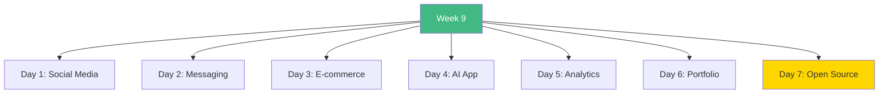

# Week 9: Advanced Real-World Projects - Index 📑

**Your complete Week 9 project guide**

---

## 🗂️ Week Structure

---

## 📅 Daily Breakdown

### **Day 1 (Day 57): Social Media Platform** ⭐⭐⭐⭐
- 📖 [`day1/README.md`](day1/README.md)
- Full-stack social media
- Authentication & OAuth
- Posts, likes, comments
- Follow system

**Build:** Twitter/Instagram clone with NextAuth

---

### **Day 2 (Day 58): Real-Time Messaging** ⭐⭐⭐⭐
- 📖 [`day2/README.md`](day2/README.md)
- WebSocket integration
- Real-time chat
- Typing indicators
- User presence

**Build:** WhatsApp/Slack clone with Socket.io

---

### **Day 3 (Day 59): E-commerce with Stripe** ⭐⭐⭐⭐
- 📖 [`day3/README.md`](day3/README.md)
- Product catalog
- Shopping cart
- Stripe payments
- Order management

**Build:** Full e-commerce platform with real payments

---

### **Day 4 (Day 60): AI-Powered Application** ⭐⭐⭐⭐
- 📖 [`day4/README.md`](day4/README.md)
- OpenAI integration
- Document upload
- RAG system
- Vector search

**Build:** ChatGPT clone with document Q&A

---

### **Day 5 (Day 61): Analytics Dashboard** ⭐⭐⭐
- 📖 [`day5/README.md`](day5/README.md)
- Data visualization
- Real-time metrics
- Report generation
- PDF/CSV export

**Build:** Google Analytics style dashboard

---

### **Day 6 (Day 62): Developer Portfolio** ⭐⭐⭐
- 📖 [`day6/README.md`](day6/README.md)
- Personal website
- Project showcase
- MDX blog
- Contact form

**Build:** Your professional portfolio site

---

### **Day 7 (Day 63): Open Source Contribution** ⭐⭐⭐⭐
- 📖 [`day7/README.md`](day7/README.md)
- Find projects
- Understand codebases
- Make contributions
- Submit PRs

**Goal:** Real open source contribution

---

## 🎯 Learning Checklist

**Social Media (Day 1):**
- [ ] NextAuth setup
- [ ] Posts CRUD
- [ ] Like/comment system
- [ ] Follow functionality

**Messaging (Day 2):**
- [ ] Socket.io setup
- [ ] Real-time chat
- [ ] Typing indicators
- [ ] Message history

**E-commerce (Day 3):**
- [ ] Stripe integration
- [ ] Shopping cart
- [ ] Checkout flow
- [ ] Order management

**AI App (Day 4):**
- [ ] OpenAI API
- [ ] Document processing
- [ ] Vector embeddings
- [ ] RAG implementation

**Analytics (Day 5):**
- [ ] Charts with Recharts
- [ ] Real-time data
- [ ] Report generation
- [ ] Export functionality

**Portfolio (Day 6):**
- [ ] Hero section
- [ ] Projects showcase
- [ ] MDX blog
- [ ] SEO optimization

**Open Source (Day 7):**
- [ ] Find project
- [ ] Understand codebase
- [ ] Make contribution
- [ ] PR merged

---

## 💻 Code Statistics

**Week 9 Totals:**
- 📖 **10 README files** (7 days + summaries)
- 💻 **100+ code examples**
- 📊 **60+ Mermaid diagrams**
- 🎯 **7 complete applications**
- 🚀 **7 live deployments**

---

## 🚀 Quick Navigation

| Day | Focus | Tech Stack | Deployment |
|-----|-------|------------|------------|
| 1 | Social Media | NextAuth, Prisma | Vercel |
| 2 | Messaging | Socket.io, Redis | Vercel |
| 3 | E-commerce | Stripe, Webhooks | Vercel |
| 4 | AI App | OpenAI, Vectors | Vercel |
| 5 | Analytics | Recharts, PDF | Vercel |
| 6 | Portfolio | MDX, SEO | Vercel |
| 7 | Open Source | Git, GitHub | - |

---

## 💡 Key Takeaways

> **"These projects are portfolio-ready."**

> **"Real payments, real-time, real AI."**

> **"Production-quality code, production deployments."**

> **"Open source contribution = real-world experience."**

---

**Continue to:** [`WEEK9_SUMMARY.md`](WEEK9_SUMMARY.md)

**Previous Week:** [`../week8/README.md`](../week8/README.md)

**You're building your portfolio!** 🎨
