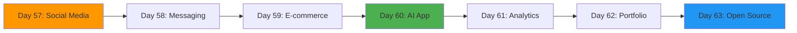
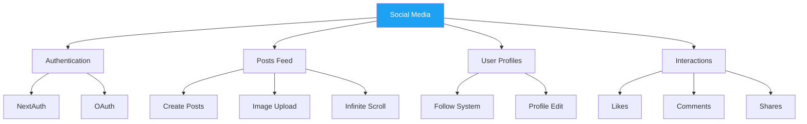
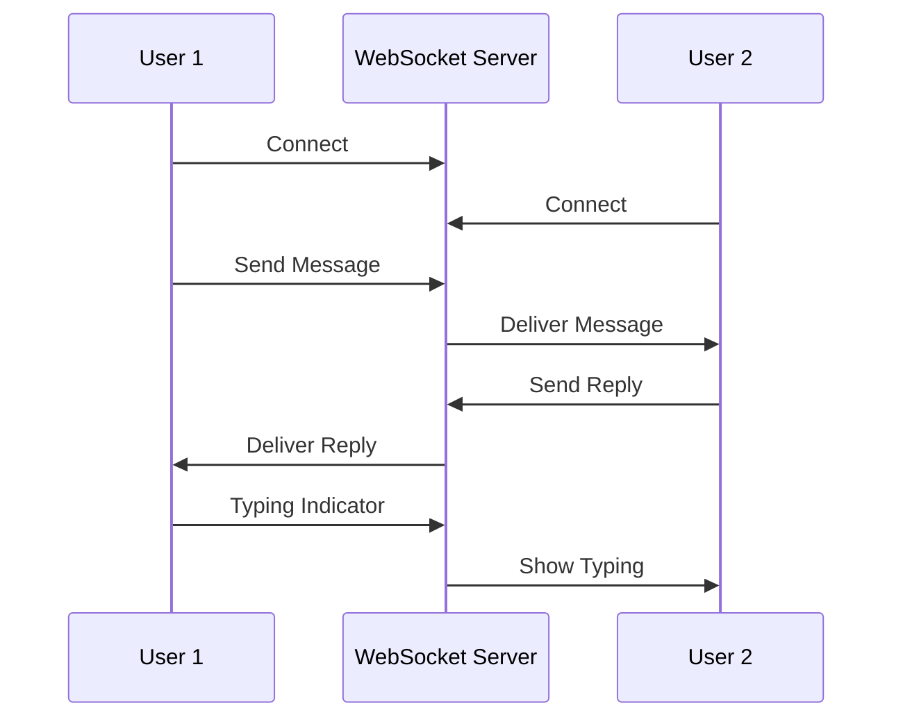
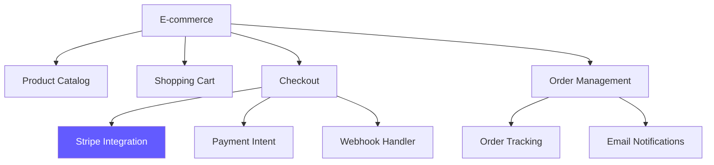
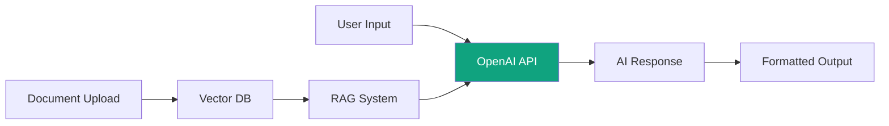
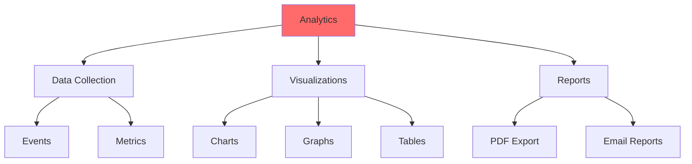
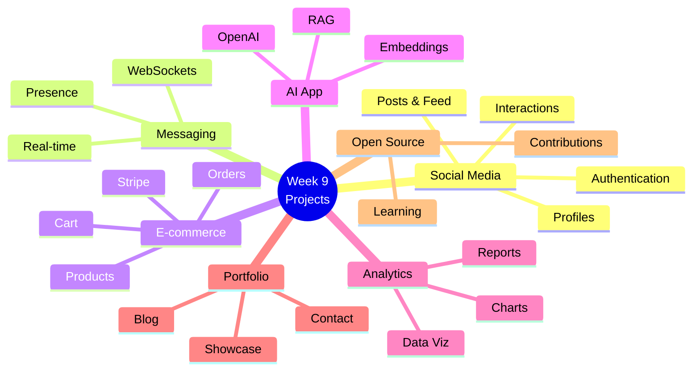

# Week 9: Advanced Real-World Projects 🚀

**Focus:** Building production-ready Next.js applications

---

## 🎯 Week Goal

Build 7 advanced real-world projects applying all concepts from Weeks 1-8.

---

## 📊 Weekly Flow

---

## 📚 Daily Projects

| Day | Project | Focus | Difficulty |
|-----|---------|-------|------------|
| **Day 57** | Social Media Platform | Full-stack, Auth, Posts | ⭐⭐⭐⭐ |
| **Day 58** | Real-Time Messaging | WebSockets, Chat | ⭐⭐⭐⭐ |
| **Day 59** | E-commerce + Stripe | Payments, Orders | ⭐⭐⭐⭐ |
| **Day 60** | AI-Powered App | OpenAI, RAG | ⭐⭐⭐⭐ |
| **Day 61** | Analytics Dashboard | Data Viz, Reports | ⭐⭐⭐ |
| **Day 62** | Developer Portfolio | Showcase, Blog | ⭐⭐⭐ |
| **Day 63** | Open Source | Contribute, Learn | ⭐⭐⭐⭐ |

---

### **Day 57: Social Media Platform**

**Build:** Full-stack social media with posts, likes, comments, follows

### **Day 58: Real-Time Messaging App**

**Build:** Real-time chat with WebSockets, presence, typing indicators

### **Day 59: E-commerce with Stripe**

**Build:** Full e-commerce with real Stripe payments

### **Day 60: AI-Powered Application**

**Build:** AI app with OpenAI, embeddings, RAG pattern

### **Day 61: Analytics Dashboard**

**Build:** Analytics dashboard with charts, reports, data viz

### **Day 62: Developer Portfolio**

**Build:** Personal portfolio with blog, projects, contact form

### **Day 63: Open Source Contribution**

**Focus:** Contribute to open source, learn from codebases

---

## 🏗️ Week Architecture

---

## ✅ Week Checklist

**Day 57: Social Media**
- [ ] Authentication system
- [ ] Posts creation
- [ ] Likes & comments
- [ ] Follow system

**Day 58: Messaging**
- [ ] Real-time chat
- [ ] WebSocket integration
- [ ] Typing indicators
- [ ] Message history

**Day 59: E-commerce**
- [ ] Product catalog
- [ ] Stripe checkout
- [ ] Order management
- [ ] Payment webhooks

**Day 60: AI App**
- [ ] OpenAI integration
- [ ] Document upload
- [ ] RAG system
- [ ] AI responses

**Day 61: Analytics**
- [ ] Data visualization
- [ ] Interactive charts
- [ ] Report generation
- [ ] Export functionality

**Day 62: Portfolio**
- [ ] Project showcase
- [ ] Blog system
- [ ] Contact form
- [ ] SEO optimization

**Day 63: Open Source**
- [ ] Find project
- [ ] Understand codebase
- [ ] Make contribution
- [ ] Submit PR

---

## 🎨 Tech Stack

- **Framework:** Next.js 14 (App Router)
- **Language:** TypeScript
- **Database:** PostgreSQL + Prisma
- **Auth:** NextAuth.js
- **Styling:** Tailwind CSS + Shadcn UI
- **Real-time:** Socket.io / Pusher
- **Payments:** Stripe
- **AI:** OpenAI API
- **Charts:** Recharts / Chart.js
- **Storage:** S3 / Cloudinary
- **Deployment:** Vercel

---

## 📦 Week Deliverables

1. **7 GitHub Repositories** with production code
2. **7 Live Demos** deployed
3. **Comprehensive READMEs**
4. **Open source contribution**
5. **Portfolio updated**

---

## 🎯 Learning Outcomes

By end of Week 9:
- ✅ Built 7 production applications
- ✅ Integrated real payments
- ✅ Implemented real-time features
- ✅ Used AI APIs
- ✅ Created analytics systems
- ✅ Contributed to open source
- ✅ Portfolio-ready projects

---

**Start Day 57!** 🚀
