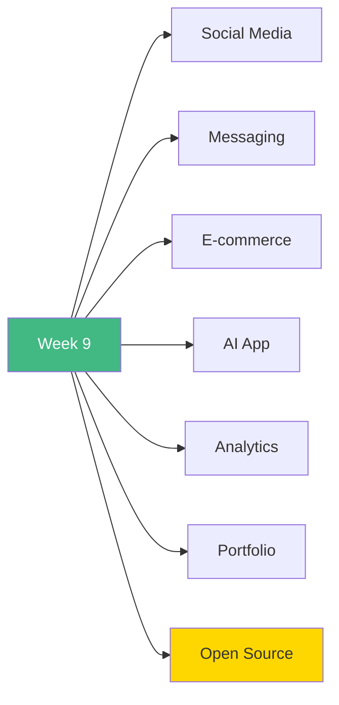

# 🚀 Week 9: Start Here

**Welcome to Week 9 - Advanced Real-World Projects!**

---

## 📚 What You'll Build This Week

Build 7 production-ready applications using all skills from Weeks 1-8!

---

## 📅 7-Day Plan

| Day | Project | Focus | Hours |
|-----|---------|-------|-------|
| **Day 1** | Social Media Platform | Auth, Posts, Follows | 8-10h |
| **Day 2** | Real-Time Messaging | WebSockets, Chat | 8-10h |
| **Day 3** | E-commerce + Stripe | Payments, Orders | 8-10h |
| **Day 4** | AI-Powered App | OpenAI, RAG | 8-10h |
| **Day 5** | Analytics Dashboard | Charts, Reports | 6-8h |
| **Day 6** | Developer Portfolio | Showcase, Blog | 6-8h |
| **Day 7** | Open Source | Contribute, Learn | 6-8h |

**Total:** 48-66 hours

---

## 🎯 Learning Path

### **Start Here:**
1. Review [`INDEX.md`](INDEX.md) for overview
2. Begin with [`day1/README.md`](day1/README.md)
3. Build each project completely
4. Deploy all projects live

---

## 🎓 Learning Outcomes

By the end of Week 9, you will have:

✅ Built 7 portfolio-worthy projects  
✅ Integrated real Stripe payments  
✅ Implemented WebSocket real-time features  
✅ Used OpenAI API with RAG  
✅ Created data visualization dashboards  
✅ Built a personal portfolio  
✅ Contributed to open source  

---

## 🚦 Prerequisites

- ✅ Week 8 completed (Architecture & Production)
- ✅ All Next.js concepts mastered
- ✅ Database & Prisma knowledge
- ✅ Authentication (NextAuth)
- ✅ API integration experience
- ✅ Deployment experience

---

## 💡 Pro Tips

> 💡 **Tip 1:** Each project builds on previous knowledge
>
> 💡 **Tip 2:** Focus on completing features, not perfection
>
> 💡 **Tip 3:** Deploy each project to build your portfolio
>
> 💡 **Tip 4:** Document your learning journey
>
> 💡 **Tip 5:** These projects are portfolio-ready!

---

## ✅ Success Checklist

- [ ] Social media platform deployed
- [ ] Messaging app with real-time chat
- [ ] E-commerce with Stripe working
- [ ] AI app with document upload
- [ ] Analytics dashboard live
- [ ] Portfolio published
- [ ] Open source contribution made

---

## 🎉 Ready to Begin?

**Start your journey:** [`day1/README.md`](day1/README.md)

**Or review the plan:** [`INDEX.md`](INDEX.md)

---

**Let's build amazing projects!** 🚀
