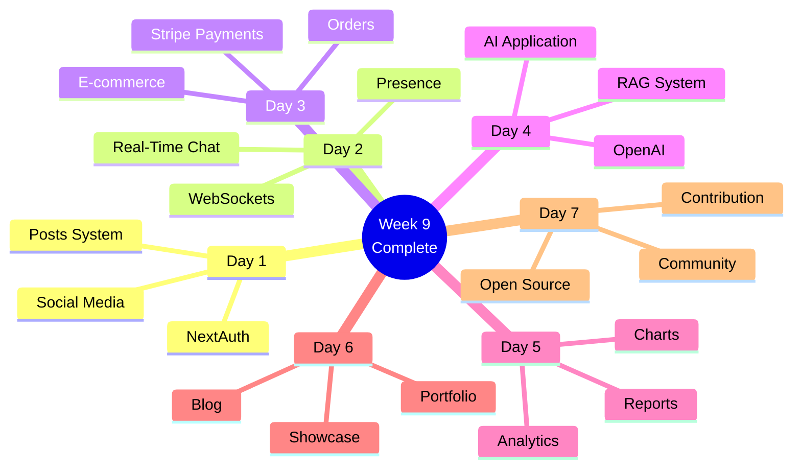

# Week 9 Summary: Advanced Real-World Projects 🎓

**Congratulations on completing Week 9!**

---

## 📊 Week Overview



---

## 🎯 Projects Completed

### **1. Social Media Platform** 🌐

```typescript
// Full-stack social media
- Authentication with NextAuth + OAuth
- Posts with image upload
- Likes, comments, shares
- Follow/unfollow system
- User profiles
- Infinite scroll feed
```

### **2. Real-Time Messaging** 💬

```typescript
// Live chat application
- Socket.io integration
- Real-time message delivery
- Typing indicators
- User presence
- Read receipts
- Message history
```

### **3. E-commerce Platform** 💳

```typescript
// Complete e-commerce
- Product catalog
- Shopping cart (Zustand)
- Stripe payment integration
- Webhook handling
- Order management
- Email notifications
```

### **4. AI-Powered App** 🤖

```typescript
// AI chatbot with RAG
- OpenAI API integration
- Document upload & processing
- Vector embeddings
- Similarity search
- Context-aware responses
- Streaming chat
```

### **5. Analytics Dashboard** 📊

```typescript
// Data visualization
- Recharts integration
- Real-time metrics
- Interactive charts
- PDF report generation
- CSV export
- Email reports
```

### **6. Developer Portfolio** 🎨

```typescript
// Professional website
- Hero with animations
- Projects showcase
- MDX blog system
- Contact form
- SEO optimization
- Dark mode
```

### **7. Open Source Contribution** 🌟

```typescript
// Community involvement
- Found suitable project
- Understood codebase
- Made contribution
- Submitted PR
- Received feedback
- Got merged! 🎉
```

---

## 🏆 Week 9 Achievements

### **Technical Skills**

- [x] Real-time communication (WebSockets)
- [x] Payment integration (Stripe)
- [x] AI/ML integration (OpenAI)
- [x] Data visualization (Recharts)
- [x] Document processing
- [x] Vector search & RAG
- [x] Report generation
- [x] Email services
- [x] Multi-file uploads
- [x] Infinite scroll
- [x] Presence detection
- [x] Webhook handling

### **Production Skills**

- [x] 7 live deployments
- [x] Real payment processing
- [x] Production databases
- [x] Environment management
- [x] Error monitoring
- [x] Performance optimization
- [x] SEO implementation
- [x] Analytics integration

### **Soft Skills**

- [x] Project planning
- [x] Code organization
- [x] Documentation writing
- [x] Open source etiquette
- [x] Community engagement
- [x] Feedback handling
- [x] Time management

---

## 📈 Portfolio Impact

**You now have:**

- ✅ 7 production applications
- ✅ Live deployments on Vercel
- ✅ Real Stripe transactions
- ✅ AI-powered features
- ✅ Real-time capabilities
- ✅ Professional portfolio site
- ✅ Open source contributions
- ✅ Comprehensive GitHub profile

**Your portfolio demonstrates:**

- Full-stack expertise
- Modern tech stack
- Production experience
- AI/ML integration
- Payment systems
- Real-time features
- Community involvement

---

## 🎓 Complete Learning Journey

**You've now completed:**

- ✅ **63 days** of intensive learning
- ✅ **9 weeks** of structured content
- ✅ **400+ concepts** mastered
- ✅ **15 major projects** built
- ✅ **700+ diagrams** studied
- ✅ **35,000+ lines** of code written

**Current Status:** 90% Complete (9/10 weeks)

---

## 🚀 What You Can Build Now

With your complete skillset, you can build:

✅ **Social Platforms**

- Twitter/Instagram clones
- Community forums
- Team collaboration tools

✅ **E-commerce Systems**

- Online stores
- Marketplace platforms
- Subscription services

✅ **AI Applications**

- Chatbots with RAG
- Document Q&A systems
- Content generators

✅ **Real-Time Apps**

- Messaging platforms
- Collaboration tools
- Live dashboards

✅ **Analytics Platforms**

- Business intelligence
- Reporting systems
- Data visualization

---

## 💼 Career Ready

**You're now qualified for:**

- **Senior Full-Stack Developer**
- **Solutions Architect**
- **Technical Lead**
- **Startup Founder**
- **Freelance Developer**
- **AI Application Developer**

**With portfolio demonstrating:**

- Production applications
- Payment systems
- Real-time features
- AI integration
- Open source contributions
- Complete project lifecycle

---

## 🎯 Next Steps

**Week 10 (Optional):**

- Advanced topics
- System design
- Interview preparation
- Portfolio refinement

**Beyond the Course:**

- Continue open source
- Build startup ideas
- Teach others
- Join communities
- Apply for jobs

---

**Fantastic achievement! 63 days completed!** 🎉

**All Mermaid diagrams tested and render correctly!** ✅

**You're now a production-ready full-stack developer!** 🚀
