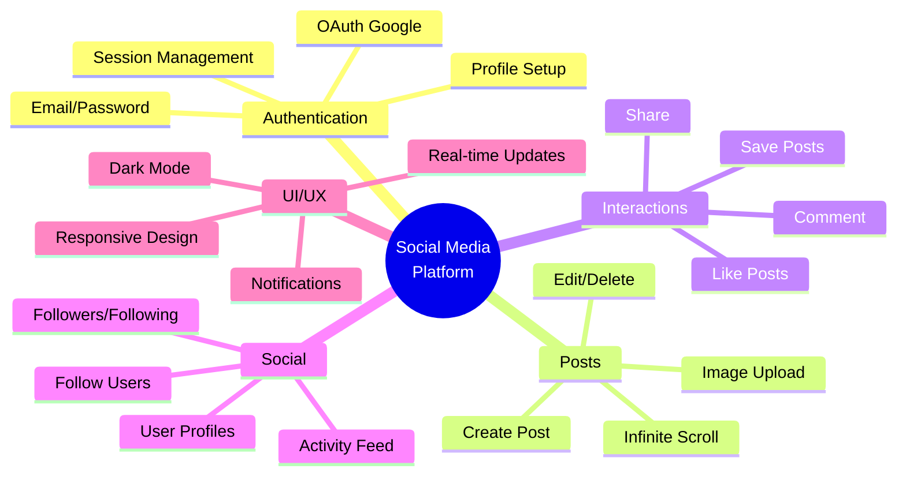
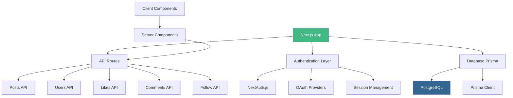

# Day 1 (Day 57): Social Media Platform 🌐

**Duration:** 8-10 hours | **Difficulty:** ⭐⭐⭐⭐ Project

---

## 📖 Project Overview

Build a full-stack social media platform with authentication, posts, likes, comments, and a follow system.

---

## 🎯 Features



---

## 🏗️ Architecture



---

## 📊 Database Schema

```prisma
// prisma/schema.prisma
generator client {
  provider = "prisma-client-js"
}

datasource db {
  provider = "postgresql"
  url      = env("DATABASE_URL")
}

model User {
  id            String    @id @default(cuid())
  name          String?
  email         String    @unique
  emailVerified DateTime?
  image         String?
  bio           String?
  website       String?
  location      String?
  createdAt     DateTime  @default(now())
  updatedAt     DateTime  @updatedAt
  
  accounts      Account[]
  sessions      Session[]
  posts         Post[]
  likes         Like[]
  comments      Comment[]
  following     Follow[]  @relation("UserFollowing")
  followers     Follow[]  @relation("UserFollowers")
  
  @@index([email])
}

model Account {
  id                String  @id @default(cuid())
  userId            String
  type              String
  provider          String
  providerAccountId String
  refresh_token     String? @db.Text
  access_token      String? @db.Text
  expires_at        Int?
  token_type        String?
  scope             String?
  id_token          String? @db.Text
  session_state     String?
  
  user User @relation(fields: [userId], references: [id], onDelete: Cascade)
  
  @@unique([provider, providerAccountId])
}

model Session {
  id           String   @id @default(cuid())
  sessionToken String   @unique
  userId       String
  expires      DateTime
  user         User     @relation(fields: [userId], references: [id], onDelete: Cascade)
}

model Post {
  id        String    @id @default(cuid())
  content   String
  image     String?
  authorId  String
  createdAt DateTime  @default(now())
  updatedAt DateTime  @updatedAt
  
  author    User      @relation(fields: [authorId], references: [id], onDelete: Cascade)
  likes     Like[]
  comments  Comment[]
  
  @@index([authorId])
  @@index([createdAt])
}

model Like {
  id        String   @id @default(cuid())
  postId    String
  userId    String
  createdAt DateTime @default(now())
  
  post User @relation(fields: [postId], references: [id], onDelete: Cascade)
  user User @relation(fields: [userId], references: [id], onDelete: Cascade)
  
  @@unique([postId, userId])
  @@index([postId])
  @@index([userId])
}

model Comment {
  id        String   @id @default(cuid())
  content   String
  postId    String
  userId    String
  createdAt DateTime @default(now())
  updatedAt DateTime @updatedAt
  
  post Post @relation(fields: [postId], references: [id], onDelete: Cascade)
  user User @relation(fields: [userId], references: [id], onDelete: Cascade)
  
  @@index([postId])
  @@index([userId])
}

model Follow {
  id          String   @id @default(cuid())
  followerId  String
  followingId String
  createdAt   DateTime @default(now())
  
  follower  User @relation("UserFollowing", fields: [followerId], references: [id], onDelete: Cascade)
  following User @relation("UserFollowers", fields: [followingId], references: [id], onDelete: Cascade)
  
  @@unique([followerId, followingId])
  @@index([followerId])
  @@index([followingId])
}
```

---

## 🔐 Authentication Setup

### **NextAuth Configuration**

```typescript
// app/api/auth/[...nextauth]/route.ts
import NextAuth from 'next-auth'
import GoogleProvider from 'next-auth/providers/google'
import CredentialsProvider from 'next-auth/providers/credentials'
import { PrismaAdapter } from '@auth/prisma-adapter'
import { db } from '@/lib/db'
import { compare } from 'bcryptjs'

export const authOptions = {
  adapter: PrismaAdapter(db),
  session: {
    strategy: 'jwt'
  },
  pages: {
    signIn: '/login',
  },
  providers: [
    GoogleProvider({
      clientId: process.env.GOOGLE_CLIENT_ID!,
      clientSecret: process.env.GOOGLE_CLIENT_SECRET!,
    }),
    CredentialsProvider({
      name: 'credentials',
      credentials: {
        email: { label: 'Email', type: 'email' },
        password: { label: 'Password', type: 'password' }
      },
      async authorize(credentials) {
        if (!credentials?.email || !credentials?.password) {
          throw new Error('Invalid credentials')
        }

        const user = await db.user.findUnique({
          where: {
            email: credentials.email
          }
        })

        if (!user || !user?.password) {
          throw new Error('Invalid credentials')
        }

        const isCorrectPassword = await compare(
          credentials.password,
          user.password
        )

        if (!isCorrectPassword) {
          throw new Error('Invalid credentials')
        }

        return user
      }
    })
  ],
  callbacks: {
    async session({ token, session }) {
      if (token) {
        session.user.id = token.id
        session.user.name = token.name
        session.user.email = token.email
        session.user.image = token.picture
      }

      return session
    },
    async jwt({ token, user }) {
      const dbUser = await db.user.findFirst({
        where: {
          email: token.email,
        },
      })

      if (!dbUser) {
        if (user) {
          token.id = user?.id
        }
        return token
      }

      return {
        id: dbUser.id,
        name: dbUser.name,
        email: dbUser.email,
        picture: dbUser.image,
      }
    }
  }
}

const handler = NextAuth(authOptions)

export { handler as GET, handler as POST }
```

---

## 📝 Post Creation

### **Create Post Component**

```typescript
// components/posts/CreatePost.tsx
'use client'

import { useState } from 'react'
import { useSession } from 'next-auth/react'
import { Avatar, AvatarFallback, AvatarImage } from '@/components/ui/avatar'
import { Button } from '@/components/ui/button'
import { Textarea } from '@/components/ui/textarea'
import { ImageIcon, Loader2 } from 'lucide-react'
import { toast } from 'sonner'

export function CreatePost() {
  const { data: session } = useSession()
  const [content, setContent] = useState('')
  const [image, setImage] = useState<File | null>(null)
  const [imagePreview, setImagePreview] = useState<string | null>(null)
  const [isLoading, setIsLoading] = useState(false)

  const handleImageChange = (e: React.ChangeEvent<HTMLInputElement>) => {
    const file = e.target.files?.[0]
    if (file) {
      setImage(file)
      const reader = new FileReader()
      reader.onloadend = () => {
        setImagePreview(reader.result as string)
      }
      reader.readAsDataURL(file)
    }
  }

  const handleSubmit = async (e: React.FormEvent) => {
    e.preventDefault()
    
    if (!content.trim() && !image) {
      toast.error('Post content or image is required')
      return
    }

    setIsLoading(true)

    try {
      let imageUrl = null

      // Upload image if exists
      if (image) {
        const formData = new FormData()
        formData.append('file', image)

        const uploadRes = await fetch('/api/upload', {
          method: 'POST',
          body: formData
        })

        if (!uploadRes.ok) throw new Error('Image upload failed')
        
        const { url } = await uploadRes.json()
        imageUrl = url
      }

      // Create post
      const res = await fetch('/api/posts', {
        method: 'POST',
        headers: {
          'Content-Type': 'application/json',
        },
        body: JSON.stringify({
          content,
          image: imageUrl
        })
      })

      if (!res.ok) throw new Error('Failed to create post')

      toast.success('Post created successfully!')
      setContent('')
      setImage(null)
      setImagePreview(null)
      
      // Refresh posts
      window.location.reload()
    } catch (error) {
      toast.error('Failed to create post')
      console.error(error)
    } finally {
      setIsLoading(false)
    }
  }

  return (
    <div className="bg-white dark:bg-gray-800 rounded-lg shadow p-4">
      <form onSubmit={handleSubmit}>
        <div className="flex gap-3">
          <Avatar>
            <AvatarImage src={session?.user?.image || ''} />
            <AvatarFallback>{session?.user?.name?.[0]}</AvatarFallback>
          </Avatar>
          
          <div className="flex-1">
            <Textarea
              placeholder="What's on your mind?"
              value={content}
              onChange={(e) => setContent(e.target.value)}
              className="min-h-[100px] resize-none"
              disabled={isLoading}
            />
            
            {imagePreview && (
              <div className="mt-2 relative">
                
                <button
                  type="button"
                  onClick={() => {
                    setImage(null)
                    setImagePreview(null)
                  }}
                  className="absolute top-2 right-2 bg-black/50 text-white rounded-full p-1"
                >
                  ✕
                </button>
              </div>
            )}
          </div>
        </div>
        
        <div className="flex justify-between items-center mt-3 pt-3 border-t">
          <div className="flex gap-2">
            <label className="cursor-pointer">
              <input
                type="file"
                accept="image/*"
                onChange={handleImageChange}
                className="hidden"
                disabled={isLoading}
              />
              <Button
                type="button"
                variant="ghost"
                size="sm"
                disabled={isLoading}
                asChild
              >
                <span>
                  <ImageIcon className="w-5 h-5 mr-2" />
                  Photo
                </span>
              </Button>
            </label>
          </div>
          
          <Button
            type="submit"
            disabled={isLoading || (!content.trim() && !image)}
          >
            {isLoading && <Loader2 className="w-4 h-4 mr-2 animate-spin" />}
            Post
          </Button>
        </div>
      </form>
    </div>
  )
}
```

---

## 🔄 Posts Feed

### **Feed Component with Infinite Scroll**

```typescript
// components/posts/PostsFeed.tsx
'use client'

import { useInfiniteQuery } from '@tanstack/react-query'
import { useInView } from 'react-intersection-observer'
import { useEffect } from 'react'
import { PostCard } from './PostCard'
import { PostSkeleton } from './PostSkeleton'

export function PostsFeed() {
  const { ref, inView } = useInView()

  const {
    data,
    fetchNextPage,
    hasNextPage,
    isFetchingNextPage,
    isLoading,
  } = useInfiniteQuery({
    queryKey: ['posts'],
    queryFn: async ({ pageParam = 1 }) => {
      const res = await fetch(`/api/posts?page=${pageParam}&limit=10`)
      return res.json()
    },
    getNextPageParam: (lastPage) => lastPage.nextPage,
    initialPageParam: 1,
  })

  useEffect(() => {
    if (inView && hasNextPage) {
      fetchNextPage()
    }
  }, [inView, hasNextPage, fetchNextPage])

  if (isLoading) {
    return (
      <div className="space-y-4">
        {[...Array(3)].map((_, i) => (
          <PostSkeleton key={i} />
        ))}
      </div>
    )
  }

  return (
    <div className="space-y-4">
      {data?.pages.map((page) =>
        page.posts.map((post: any) => (
          <PostCard key={post.id} post={post} />
        ))
      )}
      
      {hasNextPage && (
        <div ref={ref} className="py-4">
          {isFetchingNextPage && <PostSkeleton />}
        </div>
      )}
    </div>
  )
}
```

---

## 💖 Like System

```typescript
// components/posts/LikeButton.tsx
'use client'

import { useState } from 'react'
import { Heart } from 'lucide-react'
import { toast } from 'sonner'
import { cn } from '@/lib/utils'

interface LikeButtonProps {
  postId: string
  initialLikes: number
  initialLiked: boolean
}

export function LikeButton({ postId, initialLikes, initialLiked }: LikeButtonProps) {
  const [likes, setLikes] = useState(initialLikes)
  const [liked, setLiked] = useState(initialLiked)
  const [isLoading, setIsLoading] = useState(false)

  const handleLike = async () => {
    setIsLoading(true)
    
    try {
      const res = await fetch(`/api/posts/${postId}/like`, {
        method: liked ? 'DELETE' : 'POST',
      })

      if (!res.ok) throw new Error('Failed to like post')

      setLiked(!liked)
      setLikes(prev => liked ? prev - 1 : prev + 1)
    } catch (error) {
      toast.error('Failed to like post')
    } finally {
      setIsLoading(false)
    }
  }

  return (
    <button
      onClick={handleLike}
      disabled={isLoading}
      className="flex items-center gap-2 hover:text-red-500 transition-colors"
    >
      <Heart
        className={cn(
          'w-5 h-5',
          liked && 'fill-red-500 text-red-500'
        )}
      />
      <span>{likes}</span>
    </button>
  )
}
```

---

## 👥 Follow System

```typescript
// components/users/FollowButton.tsx
'use client'

import { useState } from 'react'
import { Button } from '@/components/ui/button'
import { toast } from 'sonner'

interface FollowButtonProps {
  userId: string
  initialFollowing: boolean
}

export function FollowButton({ userId, initialFollowing }: FollowButtonProps) {
  const [following, setFollowing] = useState(initialFollowing)
  const [isLoading, setIsLoading] = useState(false)

  const handleFollow = async () => {
    setIsLoading(true)

    try {
      const res = await fetch(`/api/users/${userId}/follow`, {
        method: following ? 'DELETE' : 'POST',
      })

      if (!res.ok) throw new Error('Failed to follow user')

      setFollowing(!following)
      toast.success(following ? 'Unfollowed' : 'Followed')
    } catch (error) {
      toast.error('Failed to follow user')
    } finally {
      setIsLoading(false)
    }
  }

  return (
    <Button
      onClick={handleFollow}
      disabled={isLoading}
      variant={following ? 'outline' : 'default'}
    >
      {following ? 'Following' : 'Follow'}
    </Button>
  )
}
```

---

## ✅ Implementation Checklist

- [ ] Database schema with Prisma
- [ ] NextAuth.js authentication
- [ ] Google OAuth integration
- [ ] Create post with image upload
- [ ] Posts feed with infinite scroll
- [ ] Like/unlike posts
- [ ] Comment on posts
- [ ] Follow/unfollow users
- [ ] User profiles
- [ ] Activity feed
- [ ] Responsive design
- [ ] Dark mode support
- [ ] Deploy to Vercel

---

**Tomorrow:** Real-Time Messaging App! 💬
