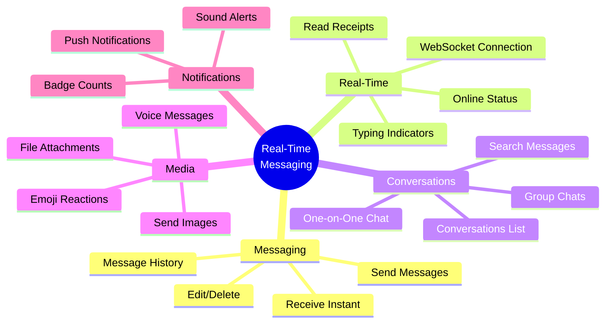
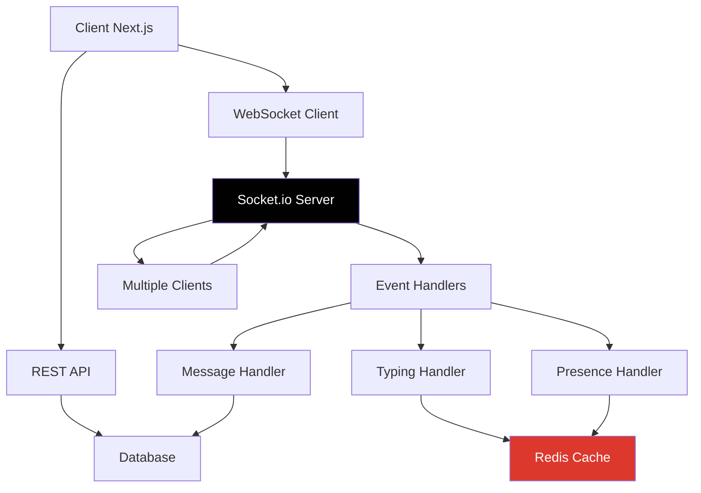

# Day 2 (Day 58): Real-Time Messaging App 💬

**Duration:** 8-10 hours | **Difficulty:** ⭐⭐⭐⭐ Project

---

## 📖 Project Overview

Build a real-time messaging application with WebSockets, typing indicators, and user presence.

---

## 🎯 Features



---

## 🏗️ Architecture



---

## 📊 Database Schema

```prisma
// prisma/schema.prisma
model User {
  id            String   @id @default(cuid())
  name          String
  email         String   @unique
  image         String?
  status        UserStatus @default(OFFLINE)
  lastSeenAt    DateTime?
  createdAt     DateTime @default(now())
  
  conversations ConversationParticipant[]
  messages      Message[]
  
  @@index([email])
}

enum UserStatus {
  ONLINE
  OFFLINE
  AWAY
}

model Conversation {
  id          String   @id @default(cuid())
  name        String?
  isGroup     Boolean  @default(false)
  createdAt   DateTime @default(now())
  updatedAt   DateTime @updatedAt
  
  participants ConversationParticipant[]
  messages     Message[]
  
  @@index([updatedAt])
}

model ConversationParticipant {
  id             String   @id @default(cuid())
  userId         String
  conversationId String
  joinedAt       DateTime @default(now())
  lastReadAt     DateTime?
  
  user         User         @relation(fields: [userId], references: [id], onDelete: Cascade)
  conversation Conversation @relation(fields: [conversationId], references: [id], onDelete: Cascade)
  
  @@unique([userId, conversationId])
  @@index([userId])
  @@index([conversationId])
}

model Message {
  id             String   @id @default(cuid())
  content        String
  type           MessageType @default(TEXT)
  fileUrl        String?
  conversationId String
  senderId       String
  createdAt      DateTime @default(now())
  updatedAt      DateTime @updatedAt
  deletedAt      DateTime?
  
  conversation Conversation @relation(fields: [conversationId], references: [id], onDelete: Cascade)
  sender       User         @relation(fields: [senderId], references: [id], onDelete: Cascade)
  reactions    Reaction[]
  
  @@index([conversationId])
  @@index([senderId])
  @@index([createdAt])
}

enum MessageType {
  TEXT
  IMAGE
  FILE
  VOICE
}

model Reaction {
  id        String   @id @default(cuid())
  emoji     String
  messageId String
  userId    String
  createdAt DateTime @default(now())
  
  message Message @relation(fields: [messageId], references: [id], onDelete: Cascade)
  
  @@unique([messageId, userId, emoji])
}
```

---

## 🔌 WebSocket Setup

### **Socket.io Server**

```typescript
// lib/socket.ts (Custom server)
import { Server as NetServer } from 'http'
import { Server as SocketIOServer } from 'socket.io'
import { NextApiRequest } from 'next'
import { getServerSession } from 'next-auth'
import { authOptions } from '@/app/api/auth/[...nextauth]/route'

export type NextApiResponseServerIO = NextApiResponse & {
  socket: Socket & {
    server: NetServer & {
      io: SocketIOServer
    }
  }
}

export const config = {
  api: {
    bodyParser: false,
  },
}

const ioHandler = (req: NextApiRequest, res: NextApiResponseServerIO) => {
  if (!res.socket.server.io) {
    const path = '/api/socket/io'
    const httpServer: NetServer = res.socket.server as any
    const io = new SocketIOServer(httpServer, {
      path: path,
      addTrailingSlash: false,
    })

    // Middleware for authentication
    io.use(async (socket, next) => {
      const session = await getServerSession(authOptions)
      if (session) {
        socket.data.userId = session.user.id
        next()
      } else {
        next(new Error('Unauthorized'))
      }
    })

    // Connection handler
    io.on('connection', (socket) => {
      console.log(`User connected: ${socket.data.userId}`)

      // Join user's room
      socket.join(socket.data.userId)

      // Handle user online status
      updateUserStatus(socket.data.userId, 'ONLINE')

      // Join conversation rooms
      socket.on('join-conversation', async (conversationId: string) => {
        socket.join(conversationId)
        console.log(`User ${socket.data.userId} joined conversation ${conversationId}`)
      })

      // Handle new message
      socket.on('send-message', async (data) => {
        const { conversationId, content, type } = data

        // Save to database
        const message = await db.message.create({
          data: {
            content,
            type,
            conversationId,
            senderId: socket.data.userId,
          },
          include: {
            sender: {
              select: {
                id: true,
                name: true,
                image: true,
              },
            },
          },
        })

        // Emit to conversation room
        io.to(conversationId).emit('new-message', message)
      })

      // Handle typing indicator
      socket.on('typing-start', (conversationId: string) => {
        socket.to(conversationId).emit('user-typing', {
          userId: socket.data.userId,
          conversationId,
        })
      })

      socket.on('typing-stop', (conversationId: string) => {
        socket.to(conversationId).emit('user-stopped-typing', {
          userId: socket.data.userId,
          conversationId,
        })
      })

      // Handle read receipts
      socket.on('mark-read', async (data) => {
        const { conversationId } = data

        await db.conversationParticipant.updateMany({
          where: {
            userId: socket.data.userId,
            conversationId,
          },
          data: {
            lastReadAt: new Date(),
          },
        })

        socket.to(conversationId).emit('messages-read', {
          userId: socket.data.userId,
          conversationId,
        })
      })

      // Handle disconnect
      socket.on('disconnect', () => {
        console.log(`User disconnected: ${socket.data.userId}`)
        updateUserStatus(socket.data.userId, 'OFFLINE')
      })
    })

    res.socket.server.io = io
  }
  res.end()
}

async function updateUserStatus(userId: string, status: UserStatus) {
  await db.user.update({
    where: { id: userId },
    data: {
      status,
      lastSeenAt: new Date(),
    },
  })
}

export default ioHandler
```

---

## 💬 Chat Interface

### **Message Input Component**

```typescript
// components/chat/MessageInput.tsx
'use client'

import { useState, useRef } from 'react'
import { Send, Image, Smile } from 'lucide-react'
import { Button } from '@/components/ui/button'
import { Textarea } from '@/components/ui/textarea'
import { useSocket } from '@/hooks/useSocket'
import EmojiPicker from 'emoji-picker-react'

interface MessageInputProps {
  conversationId: string
}

export function MessageInput({ conversationId }: MessageInputProps) {
  const [message, setMessage] = useState('')
  const [showEmoji, setShowEmoji] = useState(false)
  const [isTyping, setIsTyping] = useState(false)
  const { socket } = useSocket()
  const typingTimeout = useRef<NodeJS.Timeout>()

  const handleTyping = () => {
    if (!isTyping) {
      setIsTyping(true)
      socket?.emit('typing-start', conversationId)
    }

    // Clear existing timeout
    if (typingTimeout.current) {
      clearTimeout(typingTimeout.current)
    }

    // Set new timeout
    typingTimeout.current = setTimeout(() => {
      setIsTyping(false)
      socket?.emit('typing-stop', conversationId)
    }, 2000)
  }

  const handleSend = () => {
    if (!message.trim() || !socket) return

    socket.emit('send-message', {
      conversationId,
      content: message,
      type: 'TEXT',
    })

    setMessage('')
    setIsTyping(false)
    socket.emit('typing-stop', conversationId)
  }

  const handleKeyPress = (e: React.KeyboardEvent) => {
    if (e.key === 'Enter' && !e.shiftKey) {
      e.preventDefault()
      handleSend()
    }
  }

  return (
    <div className="border-t bg-white p-4">
      <div className="flex gap-2">
        <Button variant="ghost" size="icon">
          <Image className="w-5 h-5" />
        </Button>
        
        <div className="relative flex-1">
          <Textarea
            value={message}
            onChange={(e) => {
              setMessage(e.target.value)
              handleTyping()
            }}
            onKeyPress={handleKeyPress}
            placeholder="Type a message..."
            className="min-h-[44px] max-h-32 resize-none"
          />
        </div>

        <Button
          variant="ghost"
          size="icon"
          onClick={() => setShowEmoji(!showEmoji)}
        >
          <Smile className="w-5 h-5" />
        </Button>

        <Button
          onClick={handleSend}
          disabled={!message.trim()}
        >
          <Send className="w-5 h-5" />
        </Button>
      </div>

      {showEmoji && (
        <div className="absolute bottom-16 right-4">
          <EmojiPicker
            onEmojiClick={(emojiData) => {
              setMessage(prev => prev + emojiData.emoji)
              setShowEmoji(false)
            }}
          />
        </div>
      )}
    </div>
  )
}
```

### **Messages List**

```typescript
// components/chat/MessagesList.tsx
'use client'

import { useEffect, useRef, useState } from 'react'
import { useSocket } from '@/hooks/useSocket'
import { Avatar, AvatarFallback, AvatarImage } from '@/components/ui/avatar'
import { cn } from '@/lib/utils'
import { format } from 'date-fns'

interface Message {
  id: string
  content: string
  createdAt: Date
  sender: {
    id: string
    name: string
    image: string
  }
}

interface MessagesListProps {
  conversationId: string
  initialMessages: Message[]
  currentUserId: string
}

export function MessagesList({
  conversationId,
  initialMessages,
  currentUserId
}: MessagesListProps) {
  const [messages, setMessages] = useState<Message[]>(initialMessages)
  const [typingUsers, setTypingUsers] = useState<Set<string>>(new Set())
  const { socket } = useSocket()
  const messagesEndRef = useRef<HTMLDivElement>(null)

  useEffect(() => {
    if (!socket) return

    socket.on('new-message', (message: Message) => {
      if (message.conversationId === conversationId) {
        setMessages(prev => [...prev, message])
      }
    })

    socket.on('user-typing', ({ userId }) => {
      setTypingUsers(prev => new Set(prev).add(userId))
    })

    socket.on('user-stopped-typing', ({ userId }) => {
      setTypingUsers(prev => {
        const next = new Set(prev)
        next.delete(userId)
        return next
      })
    })

    return () => {
      socket.off('new-message')
      socket.off('user-typing')
      socket.off('user-stopped-typing')
    }
  }, [socket, conversationId])

  useEffect(() => {
    messagesEndRef.current?.scrollIntoView({ behavior: 'smooth' })
  }, [messages])

  return (
    <div className="flex-1 overflow-y-auto p-4 space-y-4">
      {messages.map((message) => {
        const isOwn = message.sender.id === currentUserId

        return (
          <div
            key={message.id}
            className={cn(
              'flex gap-3',
              isOwn && 'flex-row-reverse'
            )}
          >
            <Avatar className="w-8 h-8">
              <AvatarImage src={message.sender.image} />
              <AvatarFallback>{message.sender.name[0]}</AvatarFallback>
            </Avatar>

            <div
              className={cn(
                'max-w-[70%] rounded-lg p-3',
                isOwn
                  ? 'bg-blue-500 text-white'
                  : 'bg-gray-100'
              )}
            >
              {!isOwn && (
                <div className="text-sm font-medium mb-1">
                  {message.sender.name}
                </div>
              )}
              <div className="break-words">{message.content}</div>
              <div
                className={cn(
                  'text-xs mt-1',
                  isOwn ? 'text-blue-100' : 'text-gray-500'
                )}
              >
                {format(new Date(message.createdAt), 'HH:mm')}
              </div>
            </div>
          </div>
        )
      })}

      {typingUsers.size > 0 && (
        <div className="flex gap-2 text-gray-500 text-sm">
          <div className="flex gap-1">
            <span className="animate-bounce">●</span>
            <span className="animate-bounce delay-100">●</span>
            <span className="animate-bounce delay-200">●</span>
          </div>
          Someone is typing...
        </div>
      )}

      <div ref={messagesEndRef} />
    </div>
  )
}
```

---

## 🔔 Presence & Typing Indicators

```typescript
// hooks/useSocket.ts
'use client'

import { useEffect, useState } from 'react'
import { io, Socket } from 'socket.io-client'

export function useSocket() {
  const [socket, setSocket] = useState<Socket | null>(null)

  useEffect(() => {
    const socketInstance = io(process.env.NEXT_PUBLIC_SITE_URL!, {
      path: '/api/socket/io',
      addTrailingSlash: false,
    })

    socketInstance.on('connect', () => {
      console.log('Connected to socket')
    })

    socketInstance.on('disconnect', () => {
      console.log('Disconnected from socket')
    })

    setSocket(socketInstance)

    return () => {
      socketInstance.disconnect()
    }
  }, [])

  return { socket, isConnected: socket?.connected || false }
}
```

---

## ✅ Implementation Checklist

- [ ] Database schema for messaging
- [ ] Socket.io server setup
- [ ] WebSocket client integration
- [ ] Send/receive messages in real-time
- [ ] Typing indicators
- [ ] Online/offline presence
- [ ] Message history with pagination
- [ ] Read receipts
- [ ] Image/file uploads
- [ ] Emoji reactions
- [ ] Conversations list
- [ ] Search functionality
- [ ] Responsive mobile design

---

**Tomorrow:** E-commerce with Stripe Payments! 💳
